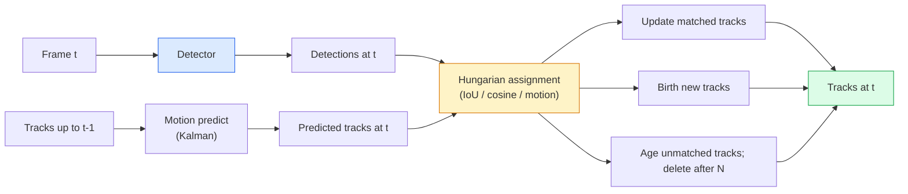

# 多目标跟踪与视频记忆

> 跟踪就是检测加关联。每一帧都进行检测。将当前帧的检测结果按 ID 与上一帧的轨迹进行匹配。

**Type:** Build
**Languages:** Python
**Prerequisites:** 阶段 4 第 06 课(YOLO 检测)、阶段 4 第 08 课(Mask R-CNN)、阶段 4 第 24 课(SAM 3)
**Time:** 约 60 分钟

## 学习目标

- 区分 tracking-by-detection 与基于 query 的跟踪，并说出各算法家族的名称(SORT、DeepSORT、ByteTrack、BoT-SORT、SAM 2 memory tracker、SAM 3.1 Object Multiplex)
- 从零实现 IoU + 匈牙利算法指派，用于经典的 tracking-by-detection
- 解释 SAM 2 的记忆库，以及它为何在处理遮挡方面优于基于 IoU 的关联
- 读懂三个跟踪指标(MOTA、IDF1、HOTA),并针对特定用例选择合适的指标

## 问题

检测器告诉你物体在单帧中的位置。跟踪器告诉你帧 `t` 中的哪个检测结果与帧 `t-1` 中的某个检测结果是同一个物体。没有这一点，你就无法统计越过某条线的物体数量、无法在遮挡中持续跟踪一个球，也无法知道“4 号车已在该车道停留 8 秒”。

跟踪对所有面向视频的产品都至关重要：体育分析、监控、自动驾驶、医学视频分析、野生动物监测、商标计数。核心构建模块是共享的：逐帧检测器、运动模型(Kalman 滤波器或更丰富的模型)、关联步骤(基于 IoU / 余弦相似度 / 学习特征的匈牙利算法)，以及轨迹生命周期(诞生、更新、消亡)。

2026 年出现了两种新模式：**SAM 2 基于记忆的跟踪**(用特征记忆代替运动模型关联)和 **SAM 3.1 Object Multiplex**(为同一概念的多个实例共享记忆)。本课先讲解经典技术栈，再讲解基于记忆的方法。

## 概念

### Tracking-by-detection



你在 2026 年会遇到的每个跟踪器都是这一循环的变体。区别在于：

- **SORT**(2016):Kalman 滤波器 + 基于 IoU 的匈牙利算法。简单、快速，没有外观模型。
- **DeepSORT**(2017):SORT + 每条轨迹的基于 CNN 的外观特征(ReID 嵌入)。能更好地处理交叉情况。
- **ByteTrack**(2021):将低置信度检测作为第二阶段进行关联；不需要外观特征，却是 MOT17 上的顶尖方法。
- **BoT-SORT**(2022):Byte + 相机运动补偿 + ReID。
- **StrongSORT / OC-SORT** —— 带有更好运动和外观建模的 ByteTrack 后继者。

### 一段话讲清 Kalman 滤波器

Kalman 滤波器为每条轨迹维护一个状态 `(x, y, w, h, dx, dy, dw, dh)` 及其协方差。在每一帧，先使用匀速模型**预测**状态，然后用匹配到的检测进行**更新**。当预测不确定性较高时，更新会更信任检测值。这带来了平滑的轨迹，以及短时遮挡(1-5 帧)下延续轨迹的能力。

每个经典跟踪器都在运动预测步骤中使用 Kalman 滤波器。

### 匈牙利算法

给定一个 `M x N` 的代价矩阵(轨迹 x 检测)，找到使总代价最小的一对一指派。代价通常是 `1 - IoU(track_bbox, detection_bbox)` 或外观特征的负余弦相似度。运行时间为 O((M+N)^3);当 M、N 不超过约 1000 时，通过 `scipy.optimize.linear_sum_assignment` 在 Python 中足够快。

### ByteTrack 的关键思想

标准跟踪器会丢弃低置信度检测(< 0.5)。ByteTrack 将它们保留为**第二阶段候选**：在将轨迹与高置信度检测匹配之后，未匹配的轨迹会以稍宽松的 IoU 阈值尝试匹配低置信度检测。这能恢复短时遮挡，并减少人群附近的 ID 切换。

### SAM 2 基于记忆的跟踪

SAM 2 通过为每个实例保留时空特征的**记忆库**来处理视频。给定某一帧上的提示(点击、框、文本)，它将实例编码进记忆。在后续帧中，记忆与新帧的特征进行交叉注意力计算，解码器在新帧中为同一实例生成掩码。

没有 Kalman 滤波器，没有匈牙利指派。关联隐含在记忆注意力操作中。

优点：
- 对大幅遮挡鲁棒(记忆在许多帧间携带实例身份)。
- 与 SAM 3 的文本提示结合时可开放词汇。
- 无需单独的运动模型。

缺点：
- 对多目标跟踪比 ByteTrack 慢。
- 记忆库会增长；限制了上下文窗口。

### SAM 3.1 Object Multiplex

以往的 SAM 2 / SAM 3 跟踪为每个实例维护单独的记忆库。50 个物体就需要 50 个记忆库。Object Multiplex(2026 年 3 月)将它们合并为一个共享记忆，并使用**每实例的 query token**。成本随实例数量呈次线性增长。

Multiplex 是 2026 年人群跟踪的新默认选择：演唱会人群、仓库工人、交通路口。

### 三个必须了解的指标

- **MOTA(多目标跟踪准确率)** —— 1 - (FN + FP + ID 切换) / GT。按错误类型加权；这是一个将检测失败与关联失败混在一起的综合指标。
- **IDF1(ID F1)** —— ID 精确率与召回率的调和平均。专门关注每条真值轨迹随时间保持其 ID 的程度。对 ID 切换敏感的任务，比 MOTA 更好。
- **HOTA(高阶跟踪准确率)** —— 分解为检测准确率(DetA)和关联准确率(AssA)。自 2020 年以来的社区标准；最为全面。

对于监控(谁是谁)：应报告 IDF1。对于体育分析(统计传球)：HOTA。对于一般学术比较：HOTA。

```figure
cv3-track-assoc
```

## 动手构建

### 步骤 1:基于 IoU 的代价矩阵

```python
import numpy as np


def bbox_iou(a, b):
    """
    a, b: (N, 4) arrays of [x1, y1, x2, y2].
    Returns (N_a, N_b) IoU matrix.
    """
    ax1, ay1, ax2, ay2 = a[:, 0], a[:, 1], a[:, 2], a[:, 3]
    bx1, by1, bx2, by2 = b[:, 0], b[:, 1], b[:, 2], b[:, 3]
    inter_x1 = np.maximum(ax1[:, None], bx1[None, :])
    inter_y1 = np.maximum(ay1[:, None], by1[None, :])
    inter_x2 = np.minimum(ax2[:, None], bx2[None, :])
    inter_y2 = np.minimum(ay2[:, None], by2[None, :])
    inter = np.clip(inter_x2 - inter_x1, 0, None) * np.clip(inter_y2 - inter_y1, 0, None)
    area_a = (ax2 - ax1) * (ay2 - ay1)
    area_b = (bx2 - bx1) * (by2 - by1)
    union = area_a[:, None] + area_b[None, :] - inter
    return inter / np.clip(union, 1e-8, None)
```

### 步骤 2:极简 SORT 式跟踪器

为简洁起见省略了固定匀速 Kalman 预测 —— 这里我们只用简单的 IoU 关联；在生产环境中 Kalman 预测必不可少。`sort` Python 包提供了完整版本。

```python
from scipy.optimize import linear_sum_assignment


class Track:
    def __init__(self, tid, bbox, frame):
        self.id = tid
        self.bbox = bbox
        self.last_frame = frame
        self.hits = 1

    def update(self, bbox, frame):
        self.bbox = bbox
        self.last_frame = frame
        self.hits += 1


class SimpleTracker:
    def __init__(self, iou_threshold=0.3, max_age=5):
        self.tracks = []
        self.next_id = 1
        self.iou_threshold = iou_threshold
        self.max_age = max_age

    def step(self, detections, frame):
        if not self.tracks:
            for d in detections:
                self.tracks.append(Track(self.next_id, d, frame))
                self.next_id += 1
            return [(t.id, t.bbox) for t in self.tracks]

        track_boxes = np.array([t.bbox for t in self.tracks])
        det_boxes = np.array(detections) if len(detections) else np.empty((0, 4))

        iou = bbox_iou(track_boxes, det_boxes) if len(det_boxes) else np.zeros((len(track_boxes), 0))
        cost = 1 - iou
        cost[iou < self.iou_threshold] = 1e6

        matched_track = set()
        matched_det = set()
        if cost.size > 0:
            row, col = linear_sum_assignment(cost)
            for r, c in zip(row, col):
                if cost[r, c] < 1.0:
                    self.tracks[r].update(det_boxes[c], frame)
                    matched_track.add(r); matched_det.add(c)

        for i, d in enumerate(det_boxes):
            if i not in matched_det:
                self.tracks.append(Track(self.next_id, d, frame))
                self.next_id += 1

        self.tracks = [t for t in self.tracks if frame - t.last_frame <= self.max_age]
        return [(t.id, t.bbox) for t in self.tracks]
```

60 行代码。接收逐帧检测，返回逐帧轨迹 ID。真实系统还会加入 Kalman 预测、ByteTrack 的第二阶段重匹配，以及外观特征。

### 步骤 3:合成轨迹测试

```python
def synthetic_frames(num_frames=20, num_objects=3, H=240, W=320, seed=0):
    rng = np.random.default_rng(seed)
    starts = rng.uniform(20, 200, size=(num_objects, 2))
    velocities = rng.uniform(-5, 5, size=(num_objects, 2))
    frames = []
    for f in range(num_frames):
        dets = []
        for i in range(num_objects):
            cx, cy = starts[i] + f * velocities[i]
            dets.append([cx - 10, cy - 10, cx + 10, cy + 10])
        frames.append(dets)
    return frames


tracker = SimpleTracker()
for f, dets in enumerate(synthetic_frames()):
    tracks = tracker.step(dets, f)
```

三个沿直线运动的物体应在全部 20 帧中保持各自的 ID。

### 步骤 4:ID 切换指标

```python
def count_id_switches(tracks_per_frame, gt_per_frame):
    """
    tracks_per_frame:  list of list of (track_id, bbox)
    gt_per_frame:      list of list of (gt_id, bbox)
    Returns number of ID switches.
    """
    prev_assignment = {}
    switches = 0
    for tracks, gts in zip(tracks_per_frame, gt_per_frame):
        if not tracks or not gts:
            continue
        t_boxes = np.array([b for _, b in tracks])
        g_boxes = np.array([b for _, b in gts])
        iou = bbox_iou(g_boxes, t_boxes)
        for g_idx, (gt_id, _) in enumerate(gts):
            j = iou[g_idx].argmax()
            if iou[g_idx, j] > 0.5:
                t_id = tracks[j][0]
                if gt_id in prev_assignment and prev_assignment[gt_id] != t_id:
                    switches += 1
                prev_assignment[gt_id] = t_id
    return switches
```

这是一个简化的、与 IDF1 类似的指标：统计真值物体改变其被指派的预测轨迹 ID 的次数。真正的 MOTA / IDF1 / HOTA 工具位于 `py-motmetrics` 和 `TrackEval`。

## 实际应用

2026 年的生产级跟踪器：

- `ultralytics` —— 内置 YOLOv8 + ByteTrack / BoT-SORT。`results = model.track(source, tracker="bytetrack.yaml")`。默认选择。
- `supervision`(Roboflow)—— ByteTrack 封装加标注工具。
- SAM 2 / SAM 3.1 —— 通过 `processor.track()` 进行基于记忆的跟踪。
- 自定义技术栈：检测器(YOLOv8 / RT-DETR)+ `sort-tracker` / `OC-SORT` / `StrongSORT`。

选择建议：

- 30+ fps 下的行人 / 车辆 / 包裹：**ByteTrack with ultralytics**。
- 一类物体的大量实例(人群场景)：**SAM 3.1 Object Multiplex**。
- 严重遮挡但外观可辨识：**DeepSORT / StrongSORT**(ReID 特征)。
- 体育 / 复杂交互：**BoT-SORT** 或学习型跟踪器(MOTRv3)。

## 发布

本课产出：

- `outputs/prompt-tracker-picker.md` —— 根据场景类型、遮挡模式和延迟预算，选择 SORT / ByteTrack / BoT-SORT / SAM 2 / SAM 3.1。
- `outputs/skill-mot-evaluator.md` —— 针对真值轨迹编写完整的 MOTA / IDF1 / HOTA 评估工具。

## 练习

1. **(简单)** 用 3、10、30 个物体运行上面的合成跟踪器。报告每种情况下的 ID 切换次数。找出仅用 IoU 的简单关联开始失效之处。
2. **(中等)** 在关联前加入匀速 Kalman 预测步骤。证明短时(2-3 帧)遮挡不再导致 ID 切换。
3. **(困难)** 将 SAM 2 的基于记忆的跟踪器(通过 `transformers`)集成为可选的跟踪后端。在 30 秒的人群视频上分别运行 SimpleTracker 和 SAM 2,并比较 ID 切换次数，为 5 个显著人物手动标注真值 ID。

## 关键术语

| 术语 | 人们怎么说 | 实际含义 |
|------|----------------|----------------------|
| Tracking-by-detection | “先检测再关联” | 逐帧检测器 + 基于 IoU / 外观的匈牙利指派 |
| Kalman 滤波器 | “运动预测” | 线性动力学 + 协方差，用于平滑轨迹预测和遮挡处理 |
| 匈牙利算法 | “最优指派” | 求解最小代价二分图匹配问题；`scipy.optimize.linear_sum_assignment` |
| ByteTrack | “低置信度二次匹配” | 将未匹配轨迹与低置信度检测重匹配，以恢复短时遮挡 |
| DeepSORT | “SORT + 外观” | 增加 ReID 特征用于跨帧匹配；更利于保持 ID |
| 记忆库 | “SAM 2 技巧” | 跨帧存储的每实例时空特征；交叉注意力取代显式关联 |
| Object Multiplex | “SAM 3.1 共享记忆” | 使用每实例 query 的单一共享记忆，用于快速多目标跟踪 |
| HOTA | “现代跟踪指标” | 分解为检测准确率和关联准确率；社区标准 |

## 延伸阅读

- [SORT (Bewley et al., 2016)](https://arxiv.org/abs/1602.00763) —— 最小化的 tracking-by-detection 论文
- [DeepSORT (Wojke et al., 2017)](https://arxiv.org/abs/1703.07402) —— 加入外观特征
- [ByteTrack (Zhang et al., 2022)](https://arxiv.org/abs/2110.06864) —— 低置信度二次匹配
- [BoT-SORT (Aharon et al., 2022)](https://arxiv.org/abs/2206.14651) —— 相机运动补偿
- [HOTA (Luiten et al., 2020)](https://arxiv.org/abs/2009.07736) —— 分解式跟踪指标
- [SAM 2 视频分割 (Meta, 2024)](https://ai.meta.com/sam2/) —— 基于记忆的跟踪器
- [SAM 3.1 Object Multiplex (Meta, 2026 年 3 月)](https://ai.meta.com/blog/segment-anything-model-3/)