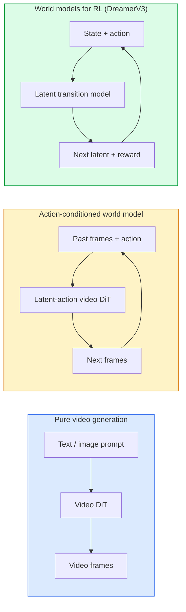

# 世界模型与视频扩散

> 能预测场景接下来几秒的视频模型就是一个世界模拟器。若将该预测以动作为条件，你就得到了一个学习得来的游戏引擎。

**Type:** Learn + Build
**Languages:** Python
**Prerequisites:** Phase 4 Lesson 10 (Diffusion)、Phase 4 Lesson 12 (Video Understanding)、Phase 4 Lesson 23 (DiT + Rectified Flow)
**Time:** 约 75 分钟

## 学习目标

- 解释纯视频生成模型(Sora 2)与动作条件世界模型(Genie 3、DreamerV3)之间的区别
- 描述视频 DiT:时空 patch、3D 位置编码、跨 (T, H, W) token 的联合注意力
- 追踪世界模型如何接入机器人技术：VLM 规划 → 视频模型模拟 → 逆动力学输出动作
- 针对给定用例(创意视频、交互式模拟、自动驾驶合成)在 Sora 2、Genie 3、Runway GWM-1 Worlds、Wan-Video 和 HunyuanVideo 之间做出选择

## 问题所在

2026 年，视频生成与世界建模走向融合。一个能生成连贯一分钟视频的模型，在某种意义上已经学会了世界如何运转：物体恒存性、重力、因果性、风格。如果你将该预测以动作为条件(向左走、打开门)，视频模型就成为一个可学习的模拟器，能够替代游戏引擎、驾驶模拟器或机器人环境。

其中的利害关系非常具体。Genie 3 能从单张图像生成可玩的环境。Runway GWM-1 Worlds 能合成无限可探索的场景。Sora 2 能生成长达一分钟、带同步音频且具有建模物理特性的视频。NVIDIA Cosmos-Drive、Wayve Gaia-2 和 Tesla DrivingWorld 能为自动驾驶车辆训练数据生成逼真的驾驶视频。世界模型范式正在悄然接管机器人领域的 sim-to-real。

本课是 Phase 4 的“宏观图景”课程。它将图像生成、视频理解和智能体推理连接成主流研究正在迈向的架构模式。

## 核心概念

### 世界建模的三大流派



- **Sora 2** 是以提示词为条件的纯视频生成模型。没有动作接口。你无法在 rollout 中途“操控”它。
- **Genie 3**、**GWM-1 Worlds**、**Mirage / Magica** 是动作条件世界模型。它们从观察到的视频推断潜在动作，然后将未来帧预测以动作为条件。具有交互性——你按下按键或移动摄像头，场景便会响应。
- **DreamerV3** 及经典 RL 世界模型家族在潜在空间中进行预测，带有显式的动作条件，并通过奖励信号进行训练。视觉呈现较少；对样本高效的 RL 更为有用。

### 视频 DiT 架构

```
Video latent:          (C, T, H, W)
Patchify (spatial):    grid of P_h x P_w patches per frame
Patchify (temporal):   group P_t frames into a temporal patch
Resulting tokens:      (T / P_t) * (H / P_h) * (W / P_w) tokens
```

位置编码是 3D 的:对每个 (t, h, w) 坐标使用旋转式或可学习的嵌入。注意力可以是：

- **完全联合** — 所有 token 相互关注。N 个 token 的复杂度为 O(N^2)。对于长视频来说代价过高。
- **分解式** — 交替使用时间注意力(相同空间位置，跨时间:`(H*W) * T^2`)和空间注意力(相同时间步，跨空间:`T * (H*W)^2`)。TimeSformer 及大多数视频 DiT 采用此方式。
- **窗口式** — (t, h, w) 中的局部窗口。Video Swin 采用此方式。

2026 年的每个视频扩散模型都使用这三种模式之一，再加上 AdaLN 条件化(Lesson 23)和 rectified flow。

### 以动作为条件：潜在动作模型

Genie 通过判别式地预测一对连续帧之间的动作，来为每帧学习一个**潜在动作**。模型的解码器随后以推断出的潜在动作为条件——而不是显式的键盘按键。在推理时，用户可以指定一个潜在动作(或从全新的先验中采样一个)，模型会生成与该动作一致的下一帧。

Sora 完全跳过了动作接口。其解码器从过去的时空 token 预测下一批时空 token。提示词为起点设定条件；生成中途没有任何东西能操控它。

### 物理合理性

Sora 2 在 2026 年的发布中明确宣传了**物理合理性**：重量、平衡、物体恒存性、因果关系。团队通过人工评定的合理性分数来衡量；与 Sora 1 相比，该模型在掉落物体、角色碰撞以及故意失败(一次失误的跳跃)上有明显改进。

合理性仍然是主要的失败模式。2024-2025 年间，人们吃意大利面或用玻璃杯喝水之类的视频暴露了模型缺乏持久的物体表示。2026 年的模型(Sora 2、Runway Gen-5、HunyuanVideo)减少了这些问题，但并未消除。

### 自动驾驶世界模型

驾驶世界模型以轨迹、边界框或导航地图为条件，生成逼真的道路场景。用例：

- **Cosmos-Drive-Dreams**(NVIDIA)— 生成数分钟的驾驶视频用于 RL 训练。
- **Gaia-2**(Wayve)— 以轨迹为条件的场景合成，用于策略评估。
- **DrivingWorld**(Tesla)— 模拟多样的天气、时段和交通状况。
- **Vista**(ByteDance)— 反应式驾驶场景合成。

它们替代了针对边缘案例的昂贵真实世界数据采集——如夜间行人乱穿马路、结冰的十字路口、少见的车辆类型——这些 otherwise 需要数百万英里的驾驶。

### 机器人技术栈：VLM + 视频模型 + 逆动力学

新兴的三组件机器人循环：

1. **VLM** 解析目标("拿起红色杯子"),规划高层动作序列。
2. **视频生成模型** 模拟执行每个动作会出现什么——预测 N 帧之后的观测。
3. **逆动力学模型** 提取出能产生那些观测的具体电机指令。

这替代了奖励塑形和样本密集的 RL。世界模型负责想象；逆动力学闭合执行回路。Genie Envisioner 是一个实例；许多研究团队正汇聚到这一结构上。

### 评估

- **视觉质量** — FVD (Fréchet Video Distance),用户研究。
- **提示词对齐** — 每帧 CLIPScore,基于 VQA 的评估。
- **物理合理性** — 在基准套件上人工评定(Sora 2 的内部基准，VBench)。
- **可控性**(针对交互式世界模型)— 动作 → 观测一致性；能否回到先前的状态？

### 2026 年的模型格局

| 模型 | 用途 | 参数量 | 输出 | 许可证 |
|-------|-----|------------|--------|---------|
| Sora 2 | 文生视频、音频 | — | 1 分钟 1080p + 音频 | 仅 API |
| Runway Gen-5 | 文/图生视频 | — | 10 秒片段 | API |
| Runway GWM-1 Worlds | 交互式世界 | — | 无限 3D rollout | API |
| Genie 3 | 从图像生成交互式世界 | 11B+ | 可玩帧 | 研究预览 |
| Wan-Video 2.1 | 开源文生视频 | 14B | 高质量片段 | 非商用 |
| HunyuanVideo | 开源文生视频 | 13B | 10 秒片段 | 宽松许可 |
| Cosmos / Cosmos-Drive | 自动驾驶模拟 | 7-14B | 驾驶场景 | NVIDIA 开源 |
| Magica / Mirage 2 | AI 原生游戏引擎 | — | 可修改的世界 | 产品 |

```figure
v4-world-rollout
```

## 动手构建

### 步骤 1：视频的 3D patch 化

```python
import torch
import torch.nn as nn


class VideoPatch3D(nn.Module):
    def __init__(self, in_channels=4, dim=64, patch_t=2, patch_h=2, patch_w=2):
        super().__init__()
        self.proj = nn.Conv3d(
            in_channels, dim,
            kernel_size=(patch_t, patch_h, patch_w),
            stride=(patch_t, patch_h, patch_w),
        )
        self.patch_t = patch_t
        self.patch_h = patch_h
        self.patch_w = patch_w

    def forward(self, x):
        # x: (N, C, T, H, W)
        x = self.proj(x)
        n, c, t, h, w = x.shape
        tokens = x.reshape(n, c, t * h * w).transpose(1, 2)
        return tokens, (t, h, w)
```

步长等于卷积核大小的 3D 卷积充当时空 patch 化器。`(T, H, W) -> (T/2, H/2, W/2)` 的 token 网格。

### 步骤 2：3D 旋转位置编码

旋转位置嵌入 (RoPE) 沿 `t`、`h`、`w` 轴分别应用：

```python
def rope_3d(tokens, t_dim, h_dim, w_dim, grid):
    """
    tokens: (N, T*H*W, D)
    grid: (T, H, W) sizes
    t_dim + h_dim + w_dim == D
    """
    T, H, W = grid
    n, seq, d = tokens.shape
    if t_dim + h_dim + w_dim != d:
        raise ValueError(f"t_dim+h_dim+w_dim ({t_dim}+{h_dim}+{w_dim}) must equal D={d}")
    assert seq == T * H * W
    t_idx = torch.arange(T, device=tokens.device).repeat_interleave(H * W)
    h_idx = torch.arange(H, device=tokens.device).repeat_interleave(W).repeat(T)
    w_idx = torch.arange(W, device=tokens.device).repeat(T * H)
    # Simplified: just scale channels by frequencies. Real RoPE rotates pairs.
    freqs_t = torch.exp(-torch.log(torch.tensor(10000.0)) * torch.arange(t_dim // 2, device=tokens.device) / (t_dim // 2))
    freqs_h = torch.exp(-torch.log(torch.tensor(10000.0)) * torch.arange(h_dim // 2, device=tokens.device) / (h_dim // 2))
    freqs_w = torch.exp(-torch.log(torch.tensor(10000.0)) * torch.arange(w_dim // 2, device=tokens.device) / (w_dim // 2))
    emb_t = torch.cat([torch.sin(t_idx[:, None] * freqs_t), torch.cos(t_idx[:, None] * freqs_t)], dim=-1)
    emb_h = torch.cat([torch.sin(h_idx[:, None] * freqs_h), torch.cos(h_idx[:, None] * freqs_h)], dim=-1)
    emb_w = torch.cat([torch.sin(w_idx[:, None] * freqs_w), torch.cos(w_idx[:, None] * freqs_w)], dim=-1)
    return tokens + torch.cat([emb_t, emb_h, emb_w], dim=-1)
```

简化为加法形式。真正的 RoPE 以不同频率旋转成对通道；位置信息是相同的。

### 步骤 3：分解式注意力块

```python
class DividedAttentionBlock(nn.Module):
    def __init__(self, dim=64, heads=2):
        super().__init__()
        self.time_attn = nn.MultiheadAttention(dim, heads, batch_first=True)
        self.space_attn = nn.MultiheadAttention(dim, heads, batch_first=True)
        self.ln1 = nn.LayerNorm(dim)
        self.ln2 = nn.LayerNorm(dim)
        self.ln3 = nn.LayerNorm(dim)
        self.mlp = nn.Sequential(nn.Linear(dim, 4 * dim), nn.GELU(), nn.Linear(4 * dim, dim))

    def forward(self, x, grid):
        T, H, W = grid
        n, seq, d = x.shape
        # time attention: same (h, w), across t
        xt = x.view(n, T, H * W, d).permute(0, 2, 1, 3).reshape(n * H * W, T, d)
        a, _ = self.time_attn(self.ln1(xt), self.ln1(xt), self.ln1(xt), need_weights=False)
        xt = (xt + a).reshape(n, H * W, T, d).permute(0, 2, 1, 3).reshape(n, seq, d)
        # space attention: same t, across (h, w)
        xs = xt.view(n, T, H * W, d).reshape(n * T, H * W, d)
        a, _ = self.space_attn(self.ln2(xs), self.ln2(xs), self.ln2(xs), need_weights=False)
        xs = (xs + a).reshape(n, T, H * W, d).reshape(n, seq, d)
        xs = xs + self.mlp(self.ln3(xs))
        return xs
```

时间注意力在每个空间位置内跨时间关注；空间注意力在每帧内跨位置关注。两次 O(T^2 + (HW)^2) 运算替代一次 O((THW)^2)。这是 TimeSformer 及每个现代视频 DiT 的核心。

### 步骤 4：组装一个微型视频 DiT

```python
class TinyVideoDiT(nn.Module):
    def __init__(self, in_channels=4, dim=64, depth=2, heads=2):
        super().__init__()
        self.patch = VideoPatch3D(in_channels=in_channels, dim=dim, patch_t=2, patch_h=2, patch_w=2)
        self.blocks = nn.ModuleList([DividedAttentionBlock(dim, heads) for _ in range(depth)])
        self.out = nn.Linear(dim, in_channels * 2 * 2 * 2)

    def forward(self, x):
        tokens, grid = self.patch(x)
        for blk in self.blocks:
            tokens = blk(tokens, grid)
        return self.out(tokens), grid
```

这不是一个可用的视频生成器；而是一个结构演示，验证每个组件的形状都正确。

### 步骤 5：检查形状

```python
vid = torch.randn(1, 4, 8, 16, 16)  # (N, C, T, H, W)
model = TinyVideoDiT()
out, grid = model(vid)
print(f"input  {tuple(vid.shape)}")
print(f"tokens grid {grid}")
print(f"output {tuple(out.shape)}")
```

patch 化之后预期为 `grid = (4, 8, 8)` 和 `out = (1, 256, 32)`;然后头部将输出投影为每个 token 的时空 patch,准备被逆 patch 化回视频。

## 实际使用

2026 年的生产访问模式：

- **Sora 2 API**(OpenAI)— 文生视频，同步音频。定价较高。
- **Runway Gen-5 / GWM-1**(Runway)— 图生视频，交互式世界。
- **Wan-Video 2.1 / HunyuanVideo** — 开源自托管。
- **Cosmos / Cosmos-Drive**(NVIDIA)— 驾驶模拟开放权重。
- **Genie 3** — 研究预览，需申请访问权限。

构建交互式世界模型演示：从 Wan-Video 起步以保证质量，再叠加一个潜在动作适配器以实现交互性。自动驾驶模拟：Cosmos-Drive 是 2026 年的开放参考。

机器人领域，实际部署中的技术栈：

1. 语言目标 -> VLM (Qwen3-VL) -> 高层规划。
2. 规划 -> 潜在动作视频模型 -> 想象的 rollout。
3. Rollout -> 逆动力学模型 -> 低层动作。
4. 动作执行 -> 观测反馈到步骤 1。

## 交付成果

本课产出：

- `outputs/prompt-video-model-picker.md` — 根据任务、许可证和延迟在 Sora 2 / Runway / Wan / HunyuanVideo / Cosmos 之间做出选择。
- `outputs/skill-physical-plausibility-checks.md` — 定义自动化检查(物体恒存性、重力、连续性)的技能，在交付前对任何生成的视频运行。

## 练习

1. **(简单)** 计算一段 5 秒 360p 视频、patch-t=2、patch-h=8、patch-w=8 时的 token 数量。推理该规模下注意力的内存需求。
2. **(中等)** 将上面的分解式注意力块换成完全联合注意力块，测量形状和参数量。解释为什么真实视频模型需要分解式注意力。
3. **(困难)** 构建一个最小化的潜在动作视频模型：取一个 (frame_t, action_t, frame_{t+1}) 三元组数据集(任何简单的 2D 游戏),训练一个以动作嵌入为条件的微型视频 DiT,并展示不同动作产生不同的下一帧。

## 关键术语

| 术语 | 人们的说法 | 实际含义 |
|------|----------------------|----------------------|
| 世界模型 | “学习得来的模拟器” | 给定状态和动作，预测未来观测的模型 |
| 视频 DiT | “时空 Transformer” | 带 3D patch 化和分解式注意力的扩散 Transformer |
| 潜在动作 | “推断出的控制” | 从帧对中推断出的离散或连续动作潜在量；用于以条件控制下一帧生成 |
| 分解式注意力 | “先时间后空间” | 每个块中两次注意力运算——先跨时间再跨空间——以保持 O(N^2) 可控 |
| 物体恒存性 | “事物保持真实” | 视频模型必须学会的场景属性；食物、玻璃器皿上的经典失败模式 |
| FVD | “Fréchet Video Distance” | FID 的视频等价物；主要的视觉质量指标 |
| 逆动力学模型 | “从观测到动作” | 给定 (state, next state),输出连接它们的动作；闭合机器人回路 |
| Cosmos-Drive | “NVIDIA 驾驶模拟” | 用于 RL 和评估的开放权重自动驾驶世界模型 |

## 延伸阅读

- [Sora 技术报告 (OpenAI)](https://openai.com/index/video-generation-models-as-world-simulators/)
- [Genie: Generative Interactive Environments (Bruce et al., 2024)](https://arxiv.org/abs/2402.15391) — 潜在动作世界模型
- [TimeSformer (Bertasius et al., 2021)](https://arxiv.org/abs/2102.05095) — 视频 Transformer 的分解式注意力
- [DreamerV3 (Hafner et al., 2023)](https://arxiv.org/abs/2301.04104) — 面向 RL 的世界模型
- [Cosmos-Drive-Dreams (NVIDIA, 2025)](https://research.nvidia.com/labs/toronto-ai/cosmos-drive-dreams/) — 驾驶世界模型
- [2026 年十大视频生成模型 (DataCamp)](https://www.datacamp.com/blog/top-video-generation-models)
- [从视频生成到世界模型 — 综述仓库](https://github.com/ziqihuangg/Awesome-From-Video-Generation-to-World-Model/)