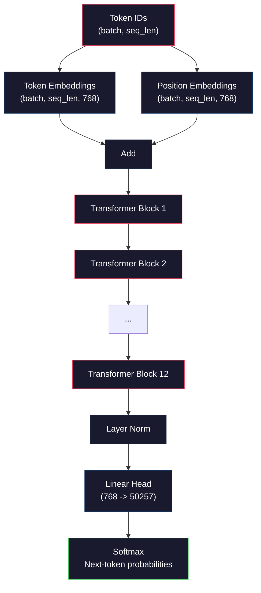
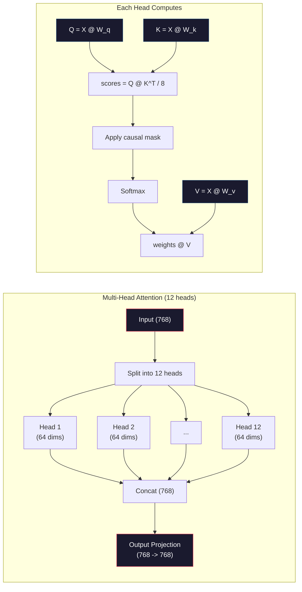
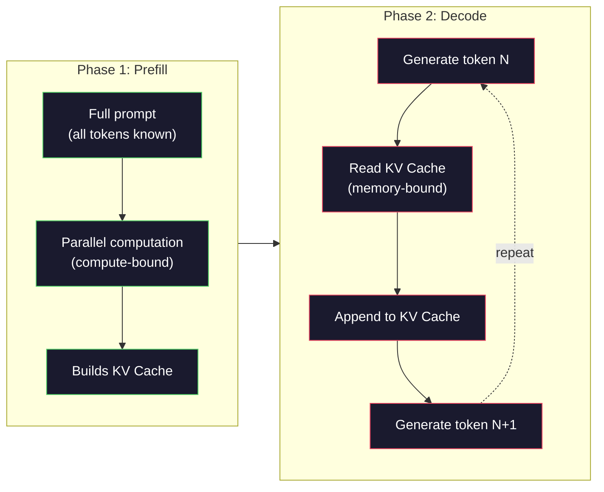

# 预训练一个迷你 GPT(1.24 亿参数)

> GPT-2 Small 拥有 1.24 亿参数。它有 12 个 transformer 层、12 个注意力头和 768 维嵌入。你可以在单张 GPU 上从零开始训练它,只需几个小时。大多数人从不这样做,他们直接使用预训练的检查点。但如果你不亲自训练一次,你就无法真正理解你构建产品所依赖的模型内部到底发生了什么。

**Type:** Build
**Languages:** Python(使用 numpy)
**Prerequisites:** Phase 10, Lessons 01-03(Tokenizers、Building a Tokenizer、Data Pipelines)
**Time:** 约 120 分钟

## 学习目标

- 从零实现完整的 GPT-2 架构(1.24 亿参数):词元嵌入、位置嵌入、transformer 块以及语言模型输出头
- 使用下一个词元预测和交叉熵损失,在文本语料上训练 GPT 模型
- 实现带温度采样和 top-k/top-p 过滤的自回归文本生成
- 监控训练损失曲线,验证模型学到了连贯的语言模式

## 问题所在

你知道 transformer 是什么。你看过那些图。你能背诵"attention is all you need",并能在白板上画出标着"Multi-Head Attention"的方框。

但这一切并不意味着你理解模型生成文本时发生了什么。

GPT-2 Small(带权重绑定)有 124,438,272 个参数。每一个参数都是通过运行训练循环设置的:前向传播、计算损失、反向传播、更新权重。十二个 transformer 块,每个块十二个注意力头,768 维嵌入空间,50,257 个词元的词表。模型每生成一个词元,全部 1.24 亿个参数都会参与一个矩阵乘法链,该链接收一串词元 ID,输出下一个词元的概率分布。

如果你从未亲自构建过它,你面对的就是一个黑盒。你可以调用 API,可以微调。但当出错时——当模型产生幻觉、重复自己、拒绝遵循指令时——你没有任何心智模型去理解*为什么*。

本课从零构建 GPT-2 Small。不用 PyTorch,而用 numpy。每一次矩阵乘法都清晰可见,每一个梯度都由你的代码计算。你将确切地看到 1.24 亿个数字是如何协同工作来预测下一个词的。

## 核心概念

### GPT 架构

GPT 是一个自回归语言模型。"自回归"意味着它一次生成一个词元,每个词元都以之前所有词元为条件。该架构是 transformer 解码器块的堆叠。

以下是从词元 ID 到下一个词元概率的完整计算图:

1. 词元 ID 输入。形状:(batch_size, seq_len)。
2. 词元嵌入查表。每个 ID 映射到一个 768 维向量。形状:(batch_size, seq_len, 768)。
3. 位置嵌入查表。每个位置 (0, 1, 2, ...) 映射到一个 768 维向量。形状相同。
4. 将词元嵌入与位置嵌入相加。
5. 通过 12 个 transformer 块。
6. 最终的层归一化。
7. 线性投影到词表大小。形状:(batch_size, seq_len, vocab_size)。
8. Softmax 得到概率。

这就是整个模型。没有卷积,没有循环。只是嵌入、注意力、前馈网络和层归一化堆叠 12 次。



### Transformer 块

12 个块中的每一个都遵循相同的模式。Pre-norm 架构(GPT-2 使用 pre-norm,而非原始 transformer 的 post-norm):

1. LayerNorm
2. 多头自注意力
3. 残差连接(把输入加回来)
4. LayerNorm
5. 前馈网络(MLP)
6. 残差连接(把输入加回来)

残差连接至关重要。没有它们,反向传播时梯度在到达块 1 之前就会消失。有了它们,梯度可以通过"跳跃"路径从损失直接流向任意层。这就是为什么你可以堆叠 12、32 甚至 96 个块(传闻 GPT-4 使用了 120 个)。

### 注意力:核心机制

自注意力让每个词元都能看到之前的所有词元,并决定对每一个的关注程度。数学如下。

对于每个词元位置,从输入计算三个向量:
- **Query (Q)**:"我在寻找什么?"
- **Key (K)**:"我包含什么?"
- **Value (V)**:"我携带什么信息?"

```
Q = input @ W_q    (768 -> 768)
K = input @ W_k    (768 -> 768)
V = input @ W_v    (768 -> 768)

attention_scores = Q @ K^T / sqrt(d_k)
attention_scores = mask(attention_scores)   # causal mask: -inf for future positions
attention_weights = softmax(attention_scores)
output = attention_weights @ V
```

因果掩码是使 GPT 自回归的关键。位置 5 可以关注位置 0-5,但不能关注 6、7、8 等等。这防止了模型在训练时通过偷看未来的词元来"作弊"。

**多头注意力**将 768 维空间切分为 12 个头,每个头 64 维。每个头学习不同的注意力模式。一个头可能追踪句法关系(主谓一致),另一个可能追踪语义相似性(同义词),还有一个可能追踪位置邻近性(相邻的词)。所有 12 个头的输出被拼接并投影回 768 维。



除以 sqrt(d_k)——即 sqrt(64) = 8——是缩放。没有它,高维向量的点积会变得很大,把 softmax 推入梯度几乎为零的区域。这是原始"Attention Is All You Need"论文的关键洞见之一。

### KV Cache:为什么推理很快

训练时,你一次处理整个序列。推理时,你一次生成一个词元。如果不做优化,生成第 N 个词元需要为之前所有 N-1 个词元重新计算注意力。那是每生成一个词元 O(N^2) 的开销,对长度为 N 的序列总共是 O(N^3)。

KV Cache 解决了这个问题。在为每个词元计算 K 和 V 后,将它们存储起来。生成第 N+1 个词元时,只需为新词元计算 Q,并从缓存中查找之前所有词元的 K 和 V。这将 K 和 V 计算的每词元成本从 O(N) 降到 O(1)。注意力分数计算仍然是 O(N),因为你要关注所有之前的位置,但避免了在输入上冗余的矩阵乘法。

对于有 12 层 12 头的 GPT-2,KV cache 为每个词元存储 2 (K + V) x 12 层 x 12 头 x 64 维 = 18,432 个值。对 1024 个词元的序列,在 FP32 下约为 75MB。对于有 128 层的 Llama 3 405B,单序列的 KV cache 可能超过 10GB。这就是长上下文推理受内存限制的原因。

### Prefill 与 Decode:推理的两个阶段

当你向 LLM 发送提示时,推理发生在两个截然不同的阶段。

**Prefill** 并行处理你的整个提示。所有词元都是已知的,所以模型可以同时计算所有位置的注意力。这个阶段是计算受限的——GPU 以满吞吐量进行矩阵乘法。在 A100 上处理 1000 个词元的提示,prefill 大约需要 20-50ms。

**Decode** 一次生成一个词元。每个新词元都依赖于之前所有词元。这个阶段是内存受限的——瓶颈在于从 GPU 显存中读取模型权重和 KV cache,而不是矩阵运算本身。GPU 的计算核心大部分时间闲置,等待内存读取。对于 GPT-2,每个 decode 步骤所花的时间基本相同,与矩阵乘法所需的 FLOPs 无关,因为内存带宽才是约束。

这个区别对生产系统很重要。Prefill 吞吐量随 GPU 算力扩展(更多 FLOPS = 更快的 prefill)。Decode 吞吐量随内存带宽扩展(更快的内存 = 更快的 decode)。这就是为什么 NVIDIA 的 H100 相比 A100 专注于提升内存带宽——它直接加速词元生成。



### 训练循环

训练 LLM 就是下一个词元预测。给定词元 [0, 1, 2, ..., N-1],预测词元 [1, 2, 3, ..., N]。损失函数是模型预测的概率分布与真实下一个词元之间的交叉熵。

一个训练步骤:

1. **前向传播**:将批次通过全部 12 个块,得到每个位置的 logits(softmax 前的分数)。
2. **计算损失**:logits 与目标词元(输入右移一位)之间的交叉熵。
3. **反向传播**:使用反向传播计算全部 1.24 亿参数的梯度。
4. **优化器步骤**:更新权重。GPT-2 使用 Adam,配合学习率预热和余弦衰减。

学习率调度比你想象的更重要。GPT-2 在前 2,000 步从 0 预热到峰值学习率,然后按余弦曲线衰减。以高学习率起步会导致模型发散,而一直保持高学习率会导致训练后期振荡。所有主流 LLM 都使用这种先预热后衰减的模式。

### GPT-2 Small:数字一览

| 组件 | 形状 | 参数量 |
|-----------|-------|------------|
| 词元嵌入 | (50257, 768) | 38,597,376 |
| 位置嵌入 | (1024, 768) | 786,432 |
| 每块注意力 (W_q, W_k, W_v, W_out) | 4 x (768, 768) | 2,359,296 |
| 每块 FFN (up + down) | (768, 3072) + (3072, 768) | 4,718,592 |
| 每块 LayerNorm (2x) | 2 x 768 x 2 | 3,072 |
| 最终 LayerNorm | 768 x 2 | 1,536 |
| **每块合计** | | **7,080,960** |
| **总计(12 块)** | | **85,054,464 + 39,383,808 = 124,438,272** |

输出投影(logits 头)与词元嵌入矩阵共享权重。这称为权重绑定——它减少了 3800 万个参数,并通过强制模型对输入和输出使用同一表示空间来提升性能。

## 动手构建

### 步骤 1:嵌入层

词元嵌入将 50,257 个可能的词元中的每一个映射到 768 维向量。位置嵌入补充每个词元在序列中位置的信息。两者相加。

```python
import numpy as np

class Embedding:
    def __init__(self, vocab_size, embed_dim, max_seq_len):
        self.token_embed = np.random.randn(vocab_size, embed_dim) * 0.02
        self.pos_embed = np.random.randn(max_seq_len, embed_dim) * 0.02

    def forward(self, token_ids):
        seq_len = token_ids.shape[-1]
        tok_emb = self.token_embed[token_ids]
        pos_emb = self.pos_embed[:seq_len]
        return tok_emb + pos_emb
```

初始化时使用的 0.02 标准差来自 GPT-2 论文。标准差太大,初始前向传播会产生极端值,使训练不稳定;太小,则初始输出对所有输入几乎相同,早期的梯度信号毫无用处。

### 步骤 2:带因果掩码的自注意力

先实现单头注意力。因果掩码在 softmax 之前把未来位置设为负无穷,确保每个位置只能关注自身及之前的位置。

```python
def attention(Q, K, V, mask=None):
    d_k = Q.shape[-1]
    scores = Q @ K.transpose(0, -1, -2 if Q.ndim == 4 else 1) / np.sqrt(d_k)
    if mask is not None:
        scores = scores + mask
    weights = np.exp(scores - scores.max(axis=-1, keepdims=True))
    weights = weights / weights.sum(axis=-1, keepdims=True)
    return weights @ V
```

softmax 实现在取指数之前先减去最大值。否则 exp(大数) 会溢出为无穷。这是一个数值稳定性技巧,不改变输出,因为对任意常数 c,softmax(x - c) = softmax(x)。

### 步骤 3:多头注意力

将 768 维输入切分为 12 个头,每个头 64 维。每个头独立计算注意力。拼接结果并投影回 768 维。

```python
class MultiHeadAttention:
    def __init__(self, embed_dim, num_heads):
        self.num_heads = num_heads
        self.head_dim = embed_dim // num_heads
        self.W_q = np.random.randn(embed_dim, embed_dim) * 0.02
        self.W_k = np.random.randn(embed_dim, embed_dim) * 0.02
        self.W_v = np.random.randn(embed_dim, embed_dim) * 0.02
        self.W_out = np.random.randn(embed_dim, embed_dim) * 0.02

    def forward(self, x, mask=None):
        batch, seq_len, d = x.shape
        Q = (x @ self.W_q).reshape(batch, seq_len, self.num_heads, self.head_dim).transpose(0, 2, 1, 3)
        K = (x @ self.W_k).reshape(batch, seq_len, self.num_heads, self.head_dim).transpose(0, 2, 1, 3)
        V = (x @ self.W_v).reshape(batch, seq_len, self.num_heads, self.head_dim).transpose(0, 2, 1, 3)

        scores = Q @ K.transpose(0, 1, 3, 2) / np.sqrt(self.head_dim)
        if mask is not None:
            scores = scores + mask
        weights = np.exp(scores - scores.max(axis=-1, keepdims=True))
        weights = weights / weights.sum(axis=-1, keepdims=True)
        attn_out = weights @ V

        attn_out = attn_out.transpose(0, 2, 1, 3).reshape(batch, seq_len, d)
        return attn_out @ self.W_out
```

reshape-转置-reshape 的操作链是多头注意力中最令人困惑的部分。过程如下:(batch, seq_len, 768) 张量先变成 (batch, seq_len, 12, 64),再变成 (batch, 12, seq_len, 64)。现在 12 个头中的每一个都有自己的 (seq_len, 64) 矩阵来运行注意力。注意力计算后,我们反向操作:(batch, 12, seq_len, 64) 变回 (batch, seq_len, 12, 64),再变回 (batch, seq_len, 768)。

### 步骤 4:Transformer 块

一个完整的 transformer 块:LayerNorm、带残差的多头注意力、LayerNorm、带残差的前馈网络。

```python
class LayerNorm:
    def __init__(self, dim, eps=1e-5):
        self.gamma = np.ones(dim)
        self.beta = np.zeros(dim)
        self.eps = eps

    def forward(self, x):
        mean = x.mean(axis=-1, keepdims=True)
        var = x.var(axis=-1, keepdims=True)
        return self.gamma * (x - mean) / np.sqrt(var + self.eps) + self.beta


class FeedForward:
    def __init__(self, embed_dim, ff_dim):
        self.W1 = np.random.randn(embed_dim, ff_dim) * 0.02
        self.b1 = np.zeros(ff_dim)
        self.W2 = np.random.randn(ff_dim, embed_dim) * 0.02
        self.b2 = np.zeros(embed_dim)

    def forward(self, x):
        h = x @ self.W1 + self.b1
        h = np.maximum(0, h)  # GELU approximation: ReLU for simplicity
        return h @ self.W2 + self.b2


class TransformerBlock:
    def __init__(self, embed_dim, num_heads, ff_dim):
        self.ln1 = LayerNorm(embed_dim)
        self.attn = MultiHeadAttention(embed_dim, num_heads)
        self.ln2 = LayerNorm(embed_dim)
        self.ffn = FeedForward(embed_dim, ff_dim)

    def forward(self, x, mask=None):
        x = x + self.attn.forward(self.ln1.forward(x), mask)
        x = x + self.ffn.forward(self.ln2.forward(x))
        return x
```

前馈网络将 768 维输入扩展到 3,072 维(4 倍),应用非线性,再投影回 768。这种扩张-收缩的模式让模型在每个位置拥有更"宽"的内部表示可供利用。GPT-2 使用 GELU 激活函数,但为了简单起见我们这里用 ReLU——对于理解架构而言差别很小。

### 步骤 5:完整的 GPT 模型

堆叠 12 个 transformer 块,前端加上嵌入层,后端加上输出投影。

```python
class MiniGPT:
    def __init__(self, vocab_size=50257, embed_dim=768, num_heads=12,
                 num_layers=12, max_seq_len=1024, ff_dim=3072):
        self.embedding = Embedding(vocab_size, embed_dim, max_seq_len)
        self.blocks = [
            TransformerBlock(embed_dim, num_heads, ff_dim)
            for _ in range(num_layers)
        ]
        self.ln_f = LayerNorm(embed_dim)
        self.vocab_size = vocab_size
        self.embed_dim = embed_dim

    def forward(self, token_ids):
        seq_len = token_ids.shape[-1]
        mask = np.triu(np.full((seq_len, seq_len), -1e9), k=1)

        x = self.embedding.forward(token_ids)
        for block in self.blocks:
            x = block.forward(x, mask)
        x = self.ln_f.forward(x)

        logits = x @ self.embedding.token_embed.T
        return logits

    def count_parameters(self):
        total = 0
        total += self.embedding.token_embed.size
        total += self.embedding.pos_embed.size
        for block in self.blocks:
            total += block.attn.W_q.size + block.attn.W_k.size
            total += block.attn.W_v.size + block.attn.W_out.size
            total += block.ffn.W1.size + block.ffn.b1.size
            total += block.ffn.W2.size + block.ffn.b2.size
            total += block.ln1.gamma.size + block.ln1.beta.size
            total += block.ln2.gamma.size + block.ln2.beta.size
        total += self.ln_f.gamma.size + self.ln_f.beta.size
        return total
```

注意权重绑定:`logits = x @ self.embedding.token_embed.T`。输出投影复用了词元嵌入矩阵(转置)。这不仅仅是省参数的技巧。它意味着模型在理解词元(嵌入)和预测词元(输出)时使用同一个向量空间。

### 步骤 6:训练循环

对 1.24 亿参数进行真正的训练需要 GPU 和 PyTorch。这个训练循环在一个纯 numpy 即可运行的小模型上演示其机制。我们使用一个微型模型(4 层、4 头、128 维)使其可行。

```python
def cross_entropy_loss(logits, targets):
    batch, seq_len, vocab_size = logits.shape
    logits_flat = logits.reshape(-1, vocab_size)
    targets_flat = targets.reshape(-1)

    max_logits = logits_flat.max(axis=-1, keepdims=True)
    log_softmax = logits_flat - max_logits - np.log(
        np.exp(logits_flat - max_logits).sum(axis=-1, keepdims=True)
    )

    loss = -log_softmax[np.arange(len(targets_flat)), targets_flat].mean()
    return loss


def train_mini_gpt(text, vocab_size=256, embed_dim=128, num_heads=4,
                   num_layers=4, seq_len=64, num_steps=200, lr=3e-4):
    tokens = np.array(list(text.encode("utf-8")[:2048]))
    model = MiniGPT(
        vocab_size=vocab_size, embed_dim=embed_dim, num_heads=num_heads,
        num_layers=num_layers, max_seq_len=seq_len, ff_dim=embed_dim * 4
    )

    print(f"Model parameters: {model.count_parameters():,}")
    print(f"Training tokens: {len(tokens):,}")
    print(f"Config: {num_layers} layers, {num_heads} heads, {embed_dim} dims")
    print()

    for step in range(num_steps):
        start_idx = np.random.randint(0, max(1, len(tokens) - seq_len - 1))
        batch_tokens = tokens[start_idx:start_idx + seq_len + 1]

        input_ids = batch_tokens[:-1].reshape(1, -1)
        target_ids = batch_tokens[1:].reshape(1, -1)

        logits = model.forward(input_ids)
        loss = cross_entropy_loss(logits, target_ids)

        if step % 20 == 0:
            print(f"Step {step:4d} | Loss: {loss:.4f}")

    return model
```

损失从接近 ln(vocab_size) 开始——对于 256 个词元的字节级词表,即 ln(256) = 5.55。随机模型对每个词元赋予相同概率。随着训练推进,损失下降,因为模型学会了预测常见模式:"t" 后面的 "th"、句号后面的空格,等等。

在生产环境中,你会使用 Adam 优化器,配合梯度累积、学习率预热和梯度裁剪。前向传播-损失-反向-更新的循环完全相同,只是优化器更精巧。

### 步骤 7:文本生成

生成使用训练好的模型一次预测一个词元。每次预测从输出分布中采样(或贪心地取 argmax)。

```python
def generate(model, prompt_tokens, max_new_tokens=100, temperature=0.8):
    tokens = list(prompt_tokens)
    seq_len = model.embedding.pos_embed.shape[0]

    for _ in range(max_new_tokens):
        context = np.array(tokens[-seq_len:]).reshape(1, -1)
        logits = model.forward(context)
        next_logits = logits[0, -1, :]

        next_logits = next_logits / temperature
        probs = np.exp(next_logits - next_logits.max())
        probs = probs / probs.sum()

        next_token = np.random.choice(len(probs), p=probs)
        tokens.append(next_token)

    return tokens
```

温度控制随机性。温度 1.0 使用原始分布。温度 0.5 使分布更尖锐(更确定——模型更频繁地选择其最偏好的选项)。温度 1.5 使分布更平坦(更随机——低概率词元获得更大机会)。温度 0.0 是贪心解码(总是选择概率最高的词元)。

`tokens[-seq_len:]` 窗口是必要的,因为模型有最大上下文长度(GPT-2 为 1024)。一旦超出,就必须丢弃最旧的词元。这就是人们常说的"上下文窗口"。

```figure
sampling-decoder
```

## 使用它

### 完整训练与生成演示

```python
corpus = """The transformer architecture has revolutionized natural language processing.
Attention mechanisms allow the model to focus on relevant parts of the input.
Self-attention computes relationships between all pairs of positions in a sequence.
Multi-head attention splits the representation into multiple subspaces.
Each attention head can learn different types of relationships.
The feedforward network provides nonlinear transformations at each position.
Residual connections enable gradient flow through deep networks.
Layer normalization stabilizes training by normalizing activations.
Position embeddings give the model information about token ordering.
The causal mask ensures autoregressive generation during training.
Pre-training on large text corpora teaches the model general language understanding.
Fine-tuning adapts the pre-trained model to specific downstream tasks."""

model = train_mini_gpt(corpus, num_steps=200)

prompt = list("The transformer".encode("utf-8"))
output_tokens = generate(model, prompt, max_new_tokens=100, temperature=0.8)
generated_text = bytes(output_tokens).decode("utf-8", errors="replace")
print(f"\nGenerated: {generated_text}")
```

在小语料和小模型上,生成的文本充其量只是半连贯。它会从训练文本中学到一些字节级模式,但无法像拥有 40GB 训练数据和完整 1.24 亿参数架构的 GPT-2 那样泛化。重点不在输出质量。重点在于你可以追踪每一步:嵌入查表、注意力计算、前馈变换、logit 投影、softmax 和采样。每一个操作都清晰可见。

## 上线实践

本课产出 `outputs/prompt-gpt-architecture-analyzer.md`——一个分析任意 GPT 风格模型架构选择的提示。向它提供模型卡或技术报告,它会拆解参数分配、注意力设计和扩展决策。

## 练习

1. 修改模型,使用 24 层和 16 个头代替 12/12。计算参数量。加倍深度与加倍宽度(嵌入维度)相比效果如何?

2. 实现 GELU 激活函数(GELU(x) = x * 0.5 * (1 + erf(x / sqrt(2)))),并替换前馈网络中的 ReLU。分别用每种激活函数训练 500 步,比较最终损失。

3. 为生成函数添加 KV cache。在首次前向传播后为每一层存储 K 和 V 张量,并在后续词元中复用它们。测量加速:分别在有缓存和无缓存的情况下生成 200 个词元,比较墙钟时间。

4. 实现 top-k 采样(只考虑概率最高的 k 个词元)和 top-p 采样(nucleus sampling:考虑累计概率超过 p 的最小词元集合)。在温度 0.8 下比较 top-k=50 与 top-p=0.95 的输出质量。

5. 构建一个训练损失曲线绘图工具。训练模型 1000 步并绘制损失 vs 步数。识别三个阶段:快速初始下降(学习常见字节)、较慢的中间阶段(学习字节模式)和平台期(在小语料上过拟合)。无论训练的是 128 维模型还是 GPT-4,这条曲线的形状都是一样的。

## 关键术语

| 术语 | 人们怎么说 | 实际含义 |
|------|----------------|----------------------|
| 自回归 | "它一次生成一个词" | 每个输出词元都以之前所有词元为条件——模型预测 P(token_n \| token_0, ..., token_{n-1}) |
| 因果掩码 | "它看不到未来" | 一个 -inf 值的上三角矩阵,防止训练时注意力关注未来位置 |
| 多头注意力 | "多个注意力模式" | 将 Q、K、V 切分为并行的头(如 GPT-2 的 12 个头、每个 64 维),使每个头可以学习不同类型的关系 |
| KV Cache | "为提速而做的缓存" | 存储之前词元已计算的 Key 和 Value 张量,避免自回归生成时的冗余计算 |
| Prefill | "处理提示" | 第一个推理阶段,所有提示词元被并行处理——在 GPU FLOPS 上是计算受限的 |
| Decode | "生成词元" | 第二个推理阶段,一次生成一个词元——在 GPU 带宽上是内存受限的 |
| 权重绑定 | "共享嵌入" | 输入词元嵌入和输出投影头使用同一个矩阵——在 GPT-2 中节省 3800 万参数 |
| 残差连接 | "跳跃连接" | 将输入直接加到子层的输出上 (x + sublayer(x))——使深层网络中的梯度流动成为可能 |
| 层归一化 | "归一化激活" | 沿特征维度归一化到均值 0、方差 1,并带有可学习的缩放和偏置参数 |
| 交叉熵损失 | "预测有多错" | -log(分配给正确下一个词元的概率),对所有位置取平均——标准的 LLM 训练目标 |

## 延伸阅读

- [Radford et al., 2019 -- "Language Models are Unsupervised Multitask Learners" (GPT-2)](https://cdn.openai.com/better-language-models/language_models_are_unsupervised_multitask_learners.pdf) —— 提出 1.24 亿到 15 亿参数系列的 GPT-2 论文
- [Vaswani et al., 2017 -- "Attention Is All You Need"](https://arxiv.org/abs/1706.03762) —— 提出缩放点积注意力和多头注意力的原始 transformer 论文
- [Llama 3 Technical Report](https://arxiv.org/abs/2407.21783) —— Meta 如何用 16K GPU 将 GPT 架构扩展到 4050 亿参数
- [Pope et al., 2022 -- "Efficiently Scaling Transformer Inference"](https://arxiv.org/abs/2211.05102) —— 形式化 prefill 与 decode 及 KV cache 分析的论文