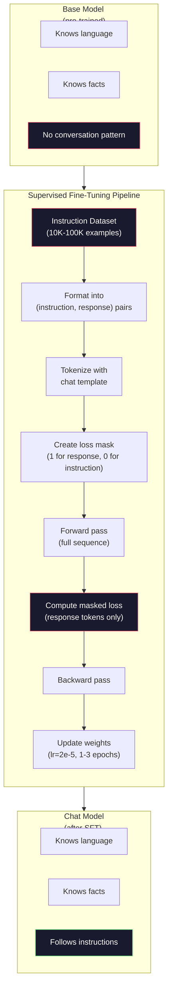

# 指令微调（SFT）

> 基座模型预测下一个 token，仅此而已。它不会遵循指令、回答问题，也不会拒绝有害请求。SFT 是从 token 预测器到有用助手之间的桥梁。你交互过的每一个模型——Claude、GPT、Llama Chat——都经历了这一步。

**Type:** 构建
**Languages:** Python（使用 numpy）
**Prerequisites:** Phase 10, Lesson 04（预训练一个 Mini GPT）
**Time:** 约 90 分钟

## 学习目标

- 实现监督微调（SFT），将基座语言模型转化为遵循指令的助手
- 使用包含 system、user 和 assistant 角色的聊天模板格式化训练数据，并对非 assistant token 掩蔽损失
- 解释为什么 SFT 是必要的：基座模型续写文本而不是回答问题
- 通过在留出指令集上比较基座模型与微调模型的响应来评估 SFT 质量

## 问题所在

你在 Lesson 04 中训练了一个模型。它能根据一个序列预测下一个 token。给它输入 "The transformer architecture"，它可能会续写 "has revolutionized natural language processing."。对于一个下一 token 预测器来说，这已经很了不起了。

现在试试这个：给它输入 "What is the capital of France?"。基座模型不会回答 "Paris."，而是延续这个模式。它可能会输出 "What is the capital of Germany? What is the capital of Spain?"，因为它是从包含问题列表的文档中学习的。或者它可能输出 "is a question that many people ask"，因为这是一个合理的下一 token 延续。模型没有 *回答* 的概念，它只知道 *续写*。

这就是 GPT-3（基座模型，2020 年 6 月发布）与 ChatGPT（指令微调版，2022 年 11 月发布）之间的差距。相同的架构，相同的预训练。区别在于 20,000 到 100,000 个精心制作的（指令，响应）对，教会了模型遵循对话模式。

Stanford Alpaca 证明了你不需要数百万条样本。2023 年 3 月，他们仅用由 GPT-3.5 生成的 52,000 个指令-响应对微调了 Llama 7B。总成本：$600. The result was a chatbot that could follow instructions, answer questions, and hold conversations. Not as good as ChatGPT, but shockingly close for $600，外加几个小时的训练。

Meta 的 Llama 2 Chat 在其初始 SFT 阶段仅使用了约 27,000 个高质量样本。关键洞察：质量比数量更重要。由熟练标注员撰写的 27,000 条样本胜过从互联网上抓取的 100 万条噪声样本。

## 概念

### SFT 究竟做了什么

监督微调延续预训练中同样的训练循环——前向传播、计算损失、反向传播、更新权重——但在不同类型的数据上进行。训练对象不是原始文本，而是结构化的对话：

```json
{
  "system": "You are a helpful assistant.",
  "user": "What is the capital of France?",
  "assistant": "The capital of France is Paris."
}
```

模型已经知道巴黎是法国的首都。这是它在预训练期间从维基百科、教科书和网页中学到的。SFT 不是教模型新的事实，而是教模型一种新的 *行为*：看到问题时，产生答案；看到指令时，产生补全；看到有害请求时，产生拒绝。

可以这样理解：预训练赋予模型知识，SFT 赋予模型礼仪。

### 数据格式

业界有三种主流格式。每种都以不同的分隔符编码相同的信息——谁说了什么。

**Alpaca 格式**（Stanford，2023 年 3 月）：

```json
{
  "instruction": "Summarize the following article in 3 sentences.",
  "input": "The European Central Bank raised interest rates...",
  "output": "The ECB increased rates by 25 basis points..."
}
```

简单且广泛使用。`input` 字段是可选的——许多指令不需要额外上下文。Stanford 以此格式发布了 52,000 条样本，由 GPT-3.5 生成，花费 600 美元。这开启了开源指令微调运动。

**ShareGPT 格式**（社区，2023 年）：

```json
{
  "conversations": [
    {"from": "system", "value": "You are a helpful assistant."},
    {"from": "human", "value": "What causes tides?"},
    {"from": "gpt", "value": "Tides are caused by the gravitational pull of the Moon..."},
    {"from": "human", "value": "How often do they occur?"},
    {"from": "gpt", "value": "Most coastal areas experience two high tides and two low tides per day..."}
  ]
}
```

支持多轮对话。"from" 字段按惯例使用 "human" 和 "gpt"，无论实际模型是什么。Vicuna 是在从用户分享的 ChatGPT 对话记录中抓取的 70,000 条 ShareGPT 对话上训练的。

**ChatML 格式**（OpenAI，被许多开源模型使用）：

```
<|im_start|>system
You are a helpful assistant.<|im_end|>
<|im_start|>user
What is the capital of France?<|im_end|>
<|im_start|>assistant
The capital of France is Paris.<|im_end|>
```

使用特殊 token（`<|im_start|>`、`<|im_end|>`）来界定角色。这些 token 在微调期间被添加到分词器的词表中。Qwen、Yi 以及许多其他模型都使用 ChatML。

这三种格式 accomplishes 同一件事：告诉模型“这是指令，这是响应，学习这个模式。”

### 为什么有效

模型已经通过预训练掌握了语言。它见过数十亿个问题后跟答案、指令后跟补全、以及人与人之间对话的样本。这些模式已经编码在权重之中。

SFT 将这种潜在能力集中起来。SFT 不再需要模型根据上下文判断它是该回答问题还是续写文档，而是显式地在对话模式上训练。经过几千个样本后，模型学会：看到 assistant 角色标记时，产生有用的响应。

这就是为什么 27,000 个样本就够了。你不是在教模型英语，也不是在教它关于世界的事实。你只是在教它一个简单的行为：响应指令。知识本来就在那里。

### 掩蔽损失

这是 SFT 中最重要的技术细节，但大多数教程都跳过了它。

预训练期间，你在每个 token 上计算损失，模型学习预测序列中的每个下一 token。SFT 期间，你只在 *响应* token 上计算损失。指令 token 只是提供上下文，模型不会因“错误预测”它们而受到惩罚。

为什么？因为你不想让模型学会 *生成* 指令，你想让它学会 *响应* 指令。如果在指令 token 上计算损失，你就是在训练模型去预测 "What is the capital of France?"，就好像它是提问者一样。这浪费了梯度信号，还可能让模型对自己的角色产生混淆。

实践中，你会创建一个损失掩码：响应 token 为 1，指令 token 为 0。在取平均之前，将每个 token 的损失乘以这个掩码。

```
Tokens:    [SYS] You are helpful [USER] What is the capital? [ASST] Paris is the capital [EOS]
Loss mask:   0    0    0     0      0     0   0  0     0       1     1    1   1     1      1
```

只有 `[ASST]` 之后的 token 才对损失有贡献。模型在前向传播中看到完整对话（它需要指令才能产生正确的响应），但只根据它对响应预测的好坏来更新权重。

### 训练超参数

SFT 使用的超参数与预训练截然不同。你不是从零开始训练，而是在调整一个已经可用的模型。

| 参数 | 预训练（Llama 2 7B） | SFT（Llama 2 Chat） |
|-----------|---------------------------|---------------------|
| 学习率 | 3e-4（峰值） | 2e-5 |
| 轮数 | 1（单次遍历数据） | 2 |
| 批大小 | 4M token | 64 条样本 |
| 预热步数 | 2,000 | 0-100 |
| 权重衰减 | 0.1 | 0.0-0.1 |
| 数据规模 | 2T token | 27,000 条样本 |

SFT 的学习率低了 15 倍。这一点至关重要。微调期间的高学习率会破坏预训练知识。模型会“忘记”它学到的东西，并对小的微调数据集过拟合。这就是灾难性遗忘。

两个 epoch 意味着模型会看到每条训练样本两次。在小数据集上超过 3 个 epoch 会导致记忆化——模型开始逐字复现训练样本，而不是泛化。

### 灾难性遗忘

微调可能会破坏通用能力。在指令遵循数据上训练太久，模型就会失去写代码、做数学或产生创造性文本的能力。它变得非常擅长其训练数据的特定格式，而在其他所有事情上都很糟糕。

三种缓解方法：

1. **低学习率。** 1e-5 到 5e-5。更小的更新意味着对预训练特征的破坏更少。

2. **短时间训练。** 1-3 个 epoch。在模型过拟合之前停止。

3. **混入预训练数据。** Llama 2 Chat 将一小部分（2-5%）原始预训练数据混入 SFT 数据集。这可以在学习新的指令遵循行为的同时“提醒”模型其通用能力。

### 真实数字

在单张 NVIDIA A100 80GB GPU 上，用 10,000 个高质量指令对微调一个 7B 模型大约需要 1 小时。计算如下：

- 10,000 条样本 x 平均 512 token = 5.12M token
- 2 个 epoch = 共 10.24M token
- A100 对 7B 模型微调的吞吐量：约 3,000 token/秒
- 10.24M / 3,000 = 约 3,400 秒 = 约 57 分钟

对于我们的 mini GPT（4 层，128 维），训练几乎是瞬时的。重点是理解机制，而不是规模。



```figure
loss-masking
```

## 动手构建

### 步骤 1：指令数据集

创建一个合成的指令数据集。在生产环境中，像 Scale AI 和 Anthropic 这样的公司会雇用人工标注员来编写这些数据。我们将以编程方式创建它们，以演示这种格式。

```python
import numpy as np

INSTRUCTION_DATA = [
    {
        "instruction": "What is the capital of France?",
        "response": "The capital of France is Paris."
    },
    {
        "instruction": "Explain gravity in one sentence.",
        "response": "Gravity is the force that attracts objects with mass toward each other."
    },
    {
        "instruction": "Write a haiku about the ocean.",
        "response": "Waves crash on the shore, salt and foam beneath the sun, endless blue expanse."
    },
    {
        "instruction": "What is 15 multiplied by 7?",
        "response": "15 multiplied by 7 is 105."
    },
    {
        "instruction": "Name three programming languages.",
        "response": "Three programming languages are Python, Rust, and TypeScript."
    },
    {
        "instruction": "Summarize photosynthesis.",
        "response": "Photosynthesis converts sunlight, water, and carbon dioxide into glucose and oxygen."
    },
    {
        "instruction": "What year did World War II end?",
        "response": "World War II ended in 1945."
    },
    {
        "instruction": "Define machine learning.",
        "response": "Machine learning is a field where algorithms learn patterns from data to make predictions."
    },
]
```

八条样本很少。Stanford Alpaca 用了 52,000 条。但无论你有 8 条还是 52,000 条，机制都是一样的：分词、掩蔽、只在响应上计算损失。

### 步骤 2：使用聊天模板分词

将指令-响应对转换为带有特殊角色标记的 token 序列。这些标记告诉模型指令在哪里结束、响应从哪里开始。

```python
SPECIAL_TOKENS = {
    "INST_START": 253,
    "INST_END": 254,
    "RESP_START": 255,
}


def tokenize_instruction_pair(instruction, response, vocab_size=256):
    inst_tokens = list(instruction.encode("utf-8"))
    resp_tokens = list(response.encode("utf-8"))

    inst_tokens = [min(t, vocab_size - 4) for t in inst_tokens]
    resp_tokens = [min(t, vocab_size - 4) for t in resp_tokens]

    tokens = (
        [SPECIAL_TOKENS["INST_START"]]
        + inst_tokens
        + [SPECIAL_TOKENS["INST_END"]]
        + [SPECIAL_TOKENS["RESP_START"]]
        + resp_tokens
    )

    return tokens


def create_loss_mask(tokens):
    mask = np.zeros(len(tokens), dtype=np.float32)
    in_response = False

    for i, token in enumerate(tokens):
        if token == SPECIAL_TOKENS["RESP_START"]:
            in_response = True
            continue
        if in_response:
            mask[i] = 1.0

    return mask
```

损失掩码对指令 token 全为 0，对响应 token 全为 1。`RESP_START` token 本身的掩码为 0，因为它是分隔符，不属于响应内容。

### 步骤 3：掩蔽交叉熵损失

标准交叉熵，但乘以损失掩码。只有响应 token 对梯度有贡献。

```python
def masked_cross_entropy_loss(logits, targets, loss_mask):
    batch, seq_len, vocab_size = logits.shape
    logits_flat = logits.reshape(-1, vocab_size)
    targets_flat = targets.reshape(-1)
    mask_flat = loss_mask.reshape(-1)

    max_logits = logits_flat.max(axis=-1, keepdims=True)
    log_softmax = logits_flat - max_logits - np.log(
        np.exp(logits_flat - max_logits).sum(axis=-1, keepdims=True)
    )

    per_token_loss = -log_softmax[np.arange(len(targets_flat)), targets_flat]

    masked_loss = per_token_loss * mask_flat
    num_response_tokens = mask_flat.sum()
    if num_response_tokens == 0:
        return 0.0
    loss = masked_loss.sum() / num_response_tokens

    return loss
```

分母是 `num_response_tokens`，而不是 `seq_len`。如果除以序列总长度，较长的指令会稀释梯度信号。除以响应 token 数量可确保每个响应 token 具有相等的权重，与指令长度无关。

### 步骤 4：SFT 训练循环

复用 Lesson 04 的 MiniGPT。训练循环看起来与预训练几乎相同，但使用了指令格式化和掩蔽损失。

```python
import sys
import os
sys.path.insert(0, os.path.join(os.path.dirname(__file__), "..", "..", "04-pre-training-mini-gpt", "code"))
from main import MiniGPT, LayerNorm, FeedForward, MultiHeadAttention, TransformerBlock, Embedding


def sft_train(model, dataset, num_epochs=2, lr=2e-5, seq_len=64):
    formatted_data = []
    for example in dataset:
        tokens = tokenize_instruction_pair(example["instruction"], example["response"])
        mask = create_loss_mask(tokens)
        formatted_data.append((tokens, mask))

    print(f"SFT Training: {len(formatted_data)} examples, {num_epochs} epochs, lr={lr}")
    print(f"Total tokens: {sum(len(t) for t, _ in formatted_data):,}")
    print()

    losses = []

    for epoch in range(num_epochs):
        epoch_loss = 0.0
        num_batches = 0

        indices = np.random.permutation(len(formatted_data))

        for idx in indices:
            tokens, mask = formatted_data[idx]

            if len(tokens) < 3:
                continue
            if len(tokens) > seq_len:
                tokens = tokens[:seq_len]
                mask = mask[:seq_len]

            input_ids = np.array(tokens[:-1]).reshape(1, -1)
            target_ids = np.array(tokens[1:]).reshape(1, -1)
            loss_mask = np.array(mask[1:]).reshape(1, -1)

            logits = model.forward(input_ids)
            loss = masked_cross_entropy_loss(logits, target_ids, loss_mask)

            batch_size, s_len, v_size = logits.shape
            probs = np.exp(logits - logits.max(axis=-1, keepdims=True))
            probs = probs / probs.sum(axis=-1, keepdims=True)
            dlogits = probs.copy()
            dlogits[np.arange(batch_size)[:, None], np.arange(s_len), target_ids] -= 1.0

            mask_expanded = loss_mask[:, :, np.newaxis]
            num_resp = loss_mask.sum()
            if num_resp > 0:
                dlogits = dlogits * mask_expanded / num_resp

            for block in model.blocks:
                block.ffn.W1 -= lr * np.random.randn(*block.ffn.W1.shape) * 0.01
                block.ffn.W2 -= lr * np.random.randn(*block.ffn.W2.shape) * 0.01
                block.ffn.b1 -= lr * np.random.randn(*block.ffn.b1.shape) * 0.01
                block.ffn.b2 -= lr * np.random.randn(*block.ffn.b2.shape) * 0.01

            epoch_loss += loss
            num_batches += 1
            losses.append(loss)

        avg_loss = epoch_loss / max(num_batches, 1)
        print(f"Epoch {epoch + 1}/{num_epochs} | Avg Loss: {avg_loss:.4f}")

    return model, losses
```

学习率是 2e-5，与 Llama 2 Chat 一致。与预训练使用的 3e-4 相比——小了 15 倍。梯度被掩蔽：指令 token 产生零梯度。只有响应 token 推动权重更新。

### 步骤 5：比较基座模型与 SFT 模型

SFT 的全部意义在于行为改变。让我们通过检查模型对指令格式输入与原始文本续写的响应方式来衡量它。

```python
def generate_response(model, prompt_tokens, max_new_tokens=50, temperature=0.8):
    tokens = list(prompt_tokens)
    seq_len = model.embedding.pos_embed.shape[0]

    for _ in range(max_new_tokens):
        context = np.array(tokens[-seq_len:]).reshape(1, -1)
        logits = model.forward(context)
        next_logits = logits[0, -1, :]

        next_logits = next_logits / max(temperature, 1e-8)
        probs = np.exp(next_logits - next_logits.max())
        probs = probs / probs.sum()
        probs = np.clip(probs, 1e-10, 1.0)
        probs = probs / probs.sum()

        next_token = np.random.choice(len(probs), p=probs)
        tokens.append(int(next_token))

    return tokens


def evaluate_instruction_following(model, instructions):
    print("Evaluating instruction following:")
    print("-" * 50)

    for instruction in instructions:
        tokens = (
            [SPECIAL_TOKENS["INST_START"]]
            + [min(t, 252) for t in list(instruction.encode("utf-8"))]
            + [SPECIAL_TOKENS["INST_END"]]
            + [SPECIAL_TOKENS["RESP_START"]]
        )

        output = generate_response(model, tokens, max_new_tokens=30, temperature=0.6)
        response_start = len(tokens)
        response_tokens = output[response_start:]
        response_bytes = bytes([t for t in response_tokens if t < 128])
        response_text = response_bytes.decode("utf-8", errors="replace")

        print(f"  Q: {instruction}")
        print(f"  A: {response_text[:80]}")
        print()
```

在一个只有 8 条样本的小模型上，响应不会有意义。这是预料之中的。重要的是 *结构*：模型学会在响应标记之后产生输出，而不是继续生成更多指令。

### 步骤 6：测量灾难性遗忘

比较模型在 SFT 前后的下一 token 预测能力。如果 SFT 损害了通用能力，原始文本上的损失会增加。

```python
def measure_forgetting(model, test_text, seq_len=64):
    tokens = np.array(list(test_text.encode("utf-8")[:512]))

    total_loss = 0.0
    num_windows = 0

    for start in range(0, len(tokens) - seq_len - 1, seq_len):
        input_ids = tokens[start:start + seq_len].reshape(1, -1)
        target_ids = tokens[start + 1:start + seq_len + 1].reshape(1, -1)

        logits = model.forward(input_ids)

        batch, s_len, vocab_size = logits.shape
        logits_flat = logits.reshape(-1, vocab_size)
        targets_flat = target_ids.reshape(-1)

        max_logits = logits_flat.max(axis=-1, keepdims=True)
        log_softmax = logits_flat - max_logits - np.log(
            np.exp(logits_flat - max_logits).sum(axis=-1, keepdims=True)
        )

        loss = -log_softmax[np.arange(len(targets_flat)), targets_flat].mean()
        total_loss += loss
        num_windows += 1

    return total_loss / max(num_windows, 1)
```

在真实的微调中，你会在整个训练过程中跟踪这个指标。如果原始文本损失增加超过 10-15%，说明你的 SFT 过于激进。降低学习率或减少轮数。

## 使用它

### 完整 SFT 流水线演示

```python
if __name__ == "__main__":
    np.random.seed(42)

    test_text = """The transformer architecture processes sequences through self-attention.
Each layer applies multi-head attention followed by a feedforward network.
Residual connections and layer normalization stabilize deep networks.
The model learns to predict the next token given all previous tokens."""

    print("=" * 70)
    print("INSTRUCTION TUNING (SFT) DEMO")
    print("=" * 70)
    print()

    model = MiniGPT(
        vocab_size=256, embed_dim=128, num_heads=4,
        num_layers=4, max_seq_len=128, ff_dim=512
    )
    print(f"Model: {model.count_parameters():,} parameters")
    print(f"Config: 4 layers, 4 heads, 128 dims (mini GPT from Lesson 04)")
    print()

    print("PRE-SFT: Measuring base model loss on raw text")
    base_loss = measure_forgetting(model, test_text)
    print(f"  Base model loss: {base_loss:.4f}")
    print()

    print("=" * 70)
    print("SFT TRAINING")
    print("=" * 70)

    model, losses = sft_train(
        model, INSTRUCTION_DATA, num_epochs=3, lr=2e-5, seq_len=128
    )

    print()
    print("POST-SFT: Measuring fine-tuned model loss on raw text")
    sft_loss = measure_forgetting(model, test_text)
    print(f"  SFT model loss: {sft_loss:.4f}")
    print(f"  Change: {((sft_loss - base_loss) / base_loss * 100):+.1f}%")
    if abs(sft_loss - base_loss) / base_loss < 0.15:
        print("  Minimal forgetting (< 15% change)")
    else:
        print("  Significant forgetting detected")
    print()

    print("=" * 70)
    print("INSTRUCTION FOLLOWING EVALUATION")
    print("=" * 70)
    print()

    test_instructions = [
        "What is the capital of France?",
        "Name a programming language.",
        "Define gravity.",
    ]
    evaluate_instruction_following(model, test_instructions)

    print("=" * 70)
    print("DATA FORMAT EXAMPLES")
    print("=" * 70)
    print()

    for i, example in enumerate(INSTRUCTION_DATA[:3]):
        tokens = tokenize_instruction_pair(example["instruction"], example["response"])
        mask = create_loss_mask(tokens)
        resp_count = int(mask.sum())
        total_count = len(tokens)
        print(f"  Example {i + 1}: {total_count} tokens, {resp_count} response tokens ({resp_count/total_count:.0%} of sequence)")
        print(f"    Instruction: {example['instruction']}")
        print(f"    Response: {example['response']}")
        print()

    print("=" * 70)
    print("TRAINING LOSS CURVE")
    print("=" * 70)
    print()

    if losses:
        window = max(1, len(losses) // 5)
        for i in range(0, len(losses), window):
            chunk = losses[i:i + window]
            avg = sum(chunk) / len(chunk)
            print(f"  Steps {i:3d}-{i + len(chunk) - 1:3d}: avg loss = {avg:.4f}")
```

## 交付它

本课生成 `outputs/prompt-sft-data-curator.md`——一个帮助你为 SFT 设计和策划指令数据集的提示词。给定一个目标能力（代码生成、数学、对话），它会产出一个包含格式规范、质量标准和多样性要求的数据收集计划。

## 练习

1. 添加系统提示词支持。修改 `tokenize_instruction_pair`，使其接受一条系统消息并将其置于指令之前。创建 5 条使用不同系统提示词的样本（"You are a poet"、"You are a math tutor"），并验证模型在训练中看到了不同的系统提示词。

2. 实现数据混合。创建一个函数，接收一个 SFT 数据集和一个原始文本语料库，然后生成训练批次，其中 5% 的样本是原始文本（无掩蔽），95% 是指令对（有掩蔽）。运行 3 个 epoch，并将遗忘指标与纯 SFT 训练进行比较。

3. 构建数据质量评分器。对每个指令-响应对，计算：(a) 以 token 计的响应长度，(b) 指令与响应的比率，(c) 词汇多样性（唯一 token 数 / 总 token 数）。过滤掉响应长度 < 10 个 token 或多样性 < 0.3 的样本。展示过滤对最终损失的影响。

4. 实现多轮对话训练。扩展分词以处理 3 轮对话（user-assistant-user-assistant-user-assistant）。损失掩码应覆盖所有三个 assistant 轮次。通过打印一条样本的 token-掩码对齐情况来验证掩码是否正确。

5. 比较学习率。分别用 lr=1e-4、lr=2e-5 和 lr=1e-6 训练同一个模型三次。绘制损失曲线。1e-4 的运行应显示快速的初期下降但较高的最终损失（过拟合）。1e-6 的运行几乎没有变化。2e-5 的运行应该是最佳平衡点。

## 关键术语

| 术语 | 人们怎么说 | 实际含义 |
|------|----------------|----------------------|
| SFT | “在对话上做微调” | 监督微调：在（指令，响应）对上继续训练，且只在响应 token 上计算损失 |
| Instruction tuning | “教模型遵循指令” | 在显式的指令-响应对上训练，使基座模型学习对话模式，而非新知识 |
| Loss masking | “忽略提示词” | 将指令 token 的损失设为零，使梯度只来自响应 token 的预测 |
| ChatML | “Chat Markup Language” | 一种 token 格式，使用 `<\|im_start\|>` 和 `<\|im_end\|>` 分隔符在对话数据中标记说话者角色 |
| Alpaca 格式 | “Stanford 的格式” | 一种包含 instruction/input/output 字段的 JSON 格式，用于 52K 条由 GPT-3.5 生成的样本，成本 600 美元 |
| Catastrophic forgetting | “模型变笨了” | 微调破坏预训练能力，因为梯度更新用任务特定模式覆盖了通用知识 |
| Weight tying | “共享嵌入” | 输入 token 嵌入和输出预测头使用同一个矩阵，节省参数并提升连贯性 |
| Chat template | “你如何格式化提示词” | 为模型组织对话的具体 token 序列（角色标记、分隔符） |

## 延伸阅读

- [Ouyang et al., 2022 -- "Training language models to follow instructions with human feedback" (InstructGPT)](https://arxiv.org/abs/2203.02155) —— 在 OpenAI 引入指令微调 + RLHF 的论文
- [Taori et al., 2023 -- "Stanford Alpaca: An Instruction-following LLaMA Model"](https://github.com/tatsu-lab/stanford_alpaca) —— 600 美元获得 52K 条指令样本，证明 SFT 在小数据集上有效
- [Touvron et al., 2023 -- "Llama 2: Open Foundation and Fine-Tuned Chat Models"](https://arxiv.org/abs/2307.09288) —— Meta 使用 27K 高质量样本的 SFT + RLHF 流水线
- [Chiang et al., 2023 -- "Vicuna: An Open-Source Chatbot Impressing GPT-4"](https://lmsys.org/blog/2023-03-30-vicuna/) —— 在 70K 条 ShareGPT 对话上训练
- [Zhou et al., 2023 -- "LIMA: Less Is More for Alignment"](https://arxiv.org/abs/2305.11206) —— 证明 1,000 条精心策划的样本可以匹敌在远大数据集上的 SFT