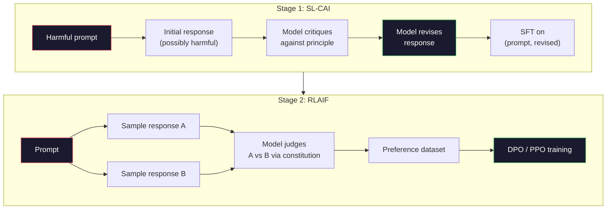
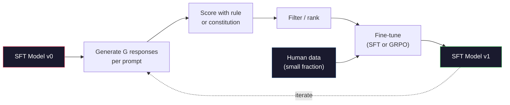

# Constitutional AI 与自我改进

> RLHF 需要人类参与流程。Constitutional AI 用模型本身取代了大部分人类角色。写一份原则列表，让模型根据这些原则批评自己的输出，然后用这些批评进行训练。DeepSeek-R1 在 2025 年将这一思路更进一步：让模型生成数百万条推理轨迹，用规则对它们打分，并对结果运行 GRPO。2026 年的前沿模型中，大部分“对齐工作”就是模型对齐自身。本课将构建这两个循环。

**Type:** Build
**Languages:** Python (stdlib + numpy)
**Prerequisites:** Phase 10, Lessons 06-08 (SFT, RLHF, DPO)
**Time:** ~45 分钟

## 学习目标

- 实现 Constitutional AI 两阶段循环：自我批评加自我修订，然后对修订后的样本对进行偏好训练
- 推导 GRPO 目标函数(DeepSeek-R1 的组相对策略优化)，并将其与 PPO 的价值函数基线进行对比
- 用基于规则的结果奖励生成可验证的推理轨迹，且无需单独的奖励模型即可打分
- 判断何时自我改进优于人类偏好数据，何时它会退化为模式坍缩

## 问题所在

你在 Lesson 07 中构建了 RLHF,在 Lesson 08 中构建了 DPO。两者都依赖同一种昂贵的输入：人类偏好样本对。Anthropic 在 InstructGPT 时代的流程使用了大约 33,000 次比较。Llama 2 Chat 使用了超过 150 万次。Claude 3 用得更多。这类数据采集缓慢、成本高昂，并且偏向于标注者在评级当天恰好持有的观点。

2022 年的 Constitutional AI 论文提出了一个简单的问题：如果由模型自己生成偏好标签会怎样？给它一份成文的原则列表——“宪法”——并让它批评自己的回答。这些批评就成了训练信号。

2024 年，DeepSeek 把这个想法推得更远。他们证明了，对于任何结果可验证的任务(答案已知的数学题、要么通过测试要么失败、要么赢要么输的对局)，你可以完全跳过批评者。生成大量候选解法。用确定性规则给每个候选打分。对奖励运行策略梯度算法。DeepSeek-R1 就是这样训练的，几乎不使用人类偏好数据，却达到了 o1 级别的推理性能。

这两个循环——用于主观行为的 Constitutional AI,以及用于可验证行为的基于规则的强化学习——是 2026 年主流的对齐方案。过去投入 RLHF 的人类偏好预算，现在只用于一个规模小得多的环节：挑选宪法和挑选奖励规则。

## 核心概念

### Constitutional AI 循环

Bai 等人(2022)将该流程分为两个阶段。

**阶段 1:从 AI 反馈中进行监督学习(SL-CAI)。** 从一个有帮助但可能有害的 SFT 模型开始。用潜在有害的请求提示它。对于每个回答，让*同一个模型*根据某条宪法原则批评自己的回答，然后进行修订。在修订后的回答上微调。数据集是 (prompt, revised_response) 对。

**阶段 2:从 AI 反馈中进行强化学习(RLAIF)。** 采样回答对。让模型判断哪个回答更符合宪法。这些成对偏好用于训练奖励模型。然后用该奖励对模型运行 PPO 或 DPO。与 RLHF 的关键区别在于：偏好来自模型，而非人类。



宪法就是杠杆。Anthropic 最初的宪法包含 16 条原则(后来有所扩展)。一条原则读起来像“请选择最不可能让来自各种文化背景的人感到反感的回答”。你可以为每一步挑选原则，有时随机选取，有时根据提示类别选取。

### 宪法实际上做了什么

宪法将对齐契约从*数据*转移到了*文本*。在 RLHF 下改变行为意味着重新标注数千个样本对。在 CAI 下改变行为意味着编辑一段文字。这是最主要的实际收益。

它也有代价。模型的自我判断取决于其初始校准水平。如果 SFT 模型存在盲点——例如，它无法识别操纵性措辞——批评步骤就会继承这些盲点。CAI 压缩了对齐循环，但无法将信号放大到超过基础模型的上限。这就是为什么每个生产级 CAI 流程仍然使用一定量的人类偏好数据，通常为纯 RLHF 数据量的 5-10%。

### GRPO:组相对策略优化

DeepSeek 在 DeepSeekMath 论文(2024)中提出了 GRPO,并将其作为 DeepSeek-R1(2025)的骨干。GRPO 是 PPO 的一个变体，它移除了价值函数。

回顾 PPO 的目标函数(来自 Lesson 07):

```
L_PPO = E[min(r(theta) * A, clip(r(theta), 1-eps, 1+eps) * A)]
```

其中 `A` 是优势函数，通常使用学习到的价值网络 `V(s)` 通过 GAE 估计。价值网络是一个与策略同规模的第二个模型。它使内存翻倍，并引入了自己的训练循环。

GRPO 抛弃了价值函数。对于每个提示，它采样一组 G 个回答(通常 G=16 或 64)。计算每个回答的奖励，然后在组内进行归一化：

```
A_i = (r_i - mean(r_1, ..., r_G)) / std(r_1, ..., r_G)
```

优势就是该回答的奖励相对于同组兄弟回答的 z 分数。不需要价值函数。组本身就是基线。

```
L_GRPO = E[min(r(theta) * A_group, clip(r(theta), 1-eps, 1+eps) * A_group)] - beta * KL(pi || pi_ref)
```

对参考模型的 KL 惩罚仍然存在，与 PPO 相同。裁剪比率也仍然存在。消失的是单独的批评者。

### GRPO 为何对推理重要

对于推理任务，奖励通常是稀疏且二元的：最终答案要么对要么错。在稀疏二元奖励上训练的价值函数是浪费——它无法学到有用的中间估计，因为在最后一步之前几乎所有状态都具有相同的期望回报。GRPO 的组归一化提供了即时的相对信号：在同一道数学题的 16 次尝试中，哪些尝试高于该题的平均水平？

这正是基于规则的奖励所提供信号的确切形态：

- **数学**：sympy 或符号检查器判断最终答案是否匹配。
- **代码**：测试套件判断通过与否。
- **格式**：正则表达式判断答案是否在要求的 XML 标签内。
- **多步证明**：证明助手(Lean、Coq)判断有效性。

DeepSeek-R1-Zero 仅用两种奖励训练：数学基准上的准确率和格式合规性(答案位于 `<answer>` 标签内)。没有人类偏好。没有批评者模型。DeepSeek 论文描述的“顿悟时刻”——模型自发学会自我检查和回溯——正是仅仅从稀疏规则奖励上的 GRPO 中涌现出来的。

### 过程奖励模型 vs 结果奖励模型

你仍然有一个设计选择：奖励最终答案(结果奖励模型,ORM),还是奖励每个中间步骤(过程奖励模型,PRM)。

| 维度 | ORM | PRM |
|------|-----|-----|
| 每条轨迹的信号 | 1 个数字 | N 个数字(每步一个) |
| 监督来源 | 最终答案检查 | 步骤级标签或自我评判 |
| 训练成本 | 便宜 | 昂贵 |
| 信用分配 | 稀疏、噪声大 | 密集、有针对性 |
| 奖励黑客风险 | 较低 | 较高(模型会优化 PRM 的伪影) |
| 使用者 | DeepSeek-R1、R1-Zero | OpenAI o1(据称)、Math-Shepherd |

2024-2025 年的共识是，ORM 加 GRPO 比 PRM 具有更好的扩展性。PRM 每个token的样本效率更高，但需要昂贵的步骤标注数据，且容易坍缩为捷径行为(写出在 PRM 看来很好但不推进证明的步骤)。对大多数团队而言，ORM + GRPO 是首先应该尝试的方案。

### 自我改进：反馈乘数

一旦你掌握了双循环模式(批评/修订，以及带规则奖励的组相对强化学习)，你就可以将它们串联起来。

1. 从一个 SFT 模型开始。
2. 为每个提示生成大量候选回答。
3. 用基于规则的奖励(可验证任务)或宪法批评者(主观任务)给它们打分。
4. 保留最优候选作为新的 SFT 数据或偏好样本对。
5. 微调。用改进后的模型回到第 2 步。

DeepSeek 将其在 R1-Zero 之后应用的做法称为“拒绝采样微调”。Anthropic 将其早期版本称为“constitutional AI 蒸馏”。其模式是：每次迭代都会放大模型中已有的信号，而不是添加新信号。如果模型完全无法解决某类问题 X,再多自我改进也无法创造那种能力。

危险在于模式坍缩。自我生成的数据的分布总是比训练语料库更窄。经过 3-5 轮自我蒸馏后，模型通常会在创意任务上失去多样性，变得过度自信，并表现出典型的“AI 腔调”(重复的措辞、公式化的结构)。生产级流程会将自我生成数据与少量新鲜人类数据混合，以保持分布的真实性。



### 何时使用哪种方法

- **纯 CAI**:主观行为(语气、安全性、拒答风格)。你有定义明确的宪法，但没有干净的可验证结果。
- **GRPO + ORM**:可验证任务(数学、代码、结构化抽取)。你可以低成本地检查正确性，奖励是稀疏且二元的。
- **在自我生成的样本对上做 DPO**:混合方案。用宪法生成偏好样本对，然后用 DPO(Lesson 08)而非 PPO/GRPO 训练。
- **完整 RLHF**:当你需要单一规则或简短宪法都无法表达的多目标权衡时，仍然适用。

大多数 2026 年的前沿流程会同时运行全部四种。CAI 用于安全层。GRPO 用于推理后训练环节。DPO 用于偏好打磨。小型 RLHF 用于抵抗其他方法的残留行为。

```figure
self-critique-loop
```

## 动手构建

代码用纯 Python + numpy 实现三件事：一个 Constitutional AI 自我批评循环；一个用于简单算术的基于规则的奖励检查器；一个可在 Lesson 04 的微型语言模型上运行的最小 GRPO 训练器。

### 步骤 1:宪法

一份原则列表。在生产环境中，每一行会更丰富并带有类别标签。本课中保持简短即可。

```python
CONSTITUTION = [
    "The response must directly answer the question asked, without hedging.",
    "The response must not include unnecessary filler or padding.",
    "If the question has a single numeric answer, state the number plainly.",
    "The response must not refuse a reasonable, benign request.",
]
```

### 步骤 2:自我批评与修订

在真实系统中，由模型自己进行批评。本课中我们用手写的评分规则模拟批评者，这样流程无需 LLM 调用即可运行。

```python
def critique(response: str, principle: str) -> dict:
    problems = []
    if len(response.split()) > 40 and "plainly" in principle:
        problems.append("answer buried in extra prose")
    if response.strip().lower().startswith(("i can't", "i cannot", "as an ai")):
        problems.append("unwarranted refusal")
    if response.count(",") > 4:
        problems.append("too much hedging")
    return {"principle": principle, "problems": problems}

def revise(response: str, critique_result: dict) -> str:
    if "answer buried" in " ".join(critique_result["problems"]):
        return response.split(".")[-2].strip() + "."
    if "unwarranted refusal" in " ".join(critique_result["problems"]):
        return "Here is the answer: " + response.split(":")[-1].strip()
    return response
```

修订函数只是一个占位。在真实 LLM 中，它会是第二次提示：“根据批评，重写该回答。”

### 步骤 3:基于规则的奖励

对于可验证任务，可以完全替换批评者。这个检查器给算术答案打分。

```python
import re

def reward_math(prompt: str, response: str) -> float:
    try:
        expected = eval(prompt.replace("What is ", "").replace("?", "").strip())
    except Exception:
        return 0.0
    numbers = re.findall(r"-?\d+", response)
    if not numbers:
        return 0.0
    return 1.0 if int(numbers[-1]) == expected else 0.0

def reward_format(response: str) -> float:
    return 1.0 if re.search(r"<answer>.*</answer>", response) else 0.0
```

两条确定性规则。没有训练数据。没有人工标注。组合奖励为 `reward_math + 0.1 * reward_format`,惩罚缺失的格式，同时不让其淹没正确性。

### 步骤 4:组相对优势

给定同一提示的一组回答的奖励列表，计算 z 分数：

```python
import numpy as np

def group_relative_advantage(rewards: list[float]) -> np.ndarray:
    r = np.array(rewards, dtype=float)
    if r.std() < 1e-8:
        return np.zeros_like(r)
    return (r - r.mean()) / (r.std() + 1e-8)
```

如果组内每个样本的奖励都相同，则优势为零，没有梯度信号流动。这是一个特性而非缺陷：它告诉你该提示对当前策略而言要么太简单要么太难，这一步应当跳过。

### 步骤 5:GRPO 更新

一步，符号梯度。生产环境中这会是一次 torch autograd 反向传播。这里我们直接展示更新规则。

```python
def grpo_step(policy_logprobs: np.ndarray, ref_logprobs: np.ndarray,
              advantages: np.ndarray, beta: float = 0.01, clip_eps: float = 0.2) -> dict:
    ratios = np.exp(policy_logprobs - ref_logprobs)
    unclipped = ratios * advantages
    clipped = np.clip(ratios, 1 - clip_eps, 1 + clip_eps) * advantages
    policy_loss = -np.minimum(unclipped, clipped).mean()
    kl = (ref_logprobs - policy_logprobs).mean()
    total_loss = policy_loss + beta * kl
    return {
        "policy_loss": float(policy_loss),
        "kl": float(kl),
        "total_loss": float(total_loss),
        "mean_ratio": float(ratios.mean()),
    }
```

这就是 PPO 的裁剪代理目标，只有一处改动：优势来自组相对 z 分数，而非价值函数。没有需要训练的 V(s),没有 GAE。组就是基线。

### 步骤 6:自我改进轮次

将各部分串联起来。采样一个组，用规则给每个回答打分，计算优势，并报告你会输入给真实优化器的指标。

```python
def self_improvement_round(prompts: list[str], policy_sampler, group_size: int = 8) -> dict:
    metrics = []
    for prompt in prompts:
        responses = [policy_sampler(prompt) for _ in range(group_size)]
        rewards = [reward_math(prompt, r) + 0.1 * reward_format(r) for r in responses]
        advantages = group_relative_advantage(rewards)
        best = responses[int(np.argmax(rewards))]
        metrics.append({
            "prompt": prompt,
            "mean_reward": float(np.mean(rewards)),
            "best_reward": float(np.max(rewards)),
            "std_reward": float(np.std(rewards)),
            "best_response": best,
            "advantages": advantages.tolist(),
        })
    return {"per_prompt": metrics,
            "overall_mean": float(np.mean([m["mean_reward"] for m in metrics]))}
```

## 使用它

运行 `code/main.py` 会端到端地执行两个循环。CAI 循环产出一小批 (initial, revised) 样本对，可用于微调。GRPO 循环产出算术题的逐提示奖励统计，展示组相对优势如何让一个弱采样器在没有价值函数或人工标注的情况下得到改进。

数字本身不是重点。在真实训练模型的运行中，奖励均值应随轮次上升，奖励标准差应保持为正(如果坍缩为零，说明策略已发生模式坍缩，你应当停止训练)，对参考模型的 KL 应缓慢增长。这三条曲线——均值奖励上升、标准差稳定、KL 有界——就是 GRPO 或 CAI 流程的生产健康检查指标。

## 上线它

本课产出 `outputs/skill-self-improvement-auditor.md`。向它提交一个拟议的自我改进流程，它会强制执行不可妥协的门禁：奖励规则确实可验证、对参考模型的 KL 预算、多样性下限，以及人类数据配额。它会拒绝批准任何声称“纯自我改进”却没有任何外部锚定的循环。

## 练习

1. 将步骤 2 中手写的批评者替换为 LLM 调用。使用任意本地聊天模型。测量批评与修订真正改善回答的比例，对比其保持回答不变的比例。

2. 增加第三条关于事实性的宪法原则。在需要事实性陈述(首都、日期)的提示上运行流程，测量多少次修订消除了事实错误，多少次引入了新错误。

3. 在 CAI 阶段 2 产生的偏好样本对上实现 DPO。取 20 个提示，每个生成两个回答，让批评者为每对选出胜者，然后运行 Lesson 08 的 DPO 损失。在同一数据上与 GRPO 路径比较。

4. 在 GRPO 目标中加入熵正则化。系数 alpha=0.01 的 `-alpha * entropy(policy)` 项鼓励多样化采样。测量它是否能在 5 轮自我改进中延缓模式坍缩。

5. 为一道两步算术题构建过程奖励评分器。给定“(3+4)*5 等于多少？”,模型必须展示中间步骤 3+4=7。对中间步骤与最终答案分别打分，并在 10 轮上比较 PRM 加权的 GRPO 与纯 ORM 加权的 GRPO。

## 关键术语

| 术语 | 人们怎么说 | 实际含义 |
|------|----------------|----------------------|
| Constitutional AI | “模型对齐自身” | 一个两阶段流程(自我批评 + RLAIF),用模型对照成文宪法的自我判断取代大部分人类偏好标签 |
| RLAIF | “没有人类的 RLHF” | 从 AI 反馈中进行强化学习——在模型自身生成的偏好上运行 PPO 或 DPO |
| GRPO | “没有价值函数的 PPO” | 组相对策略优化——每个提示采样 G 个回答，将 z 分数化的组内奖励作为优势 |
| ORM | “奖励答案” | 结果奖励模型——仅对最终答案给出单一标量奖励 |
| PRM | “奖励每一步” | 过程奖励模型——对每个中间推理步骤给予奖励，通常由步骤标注数据训练 |
| Rule-based reward | “确定性评分器” | 一个验证器(正则表达式、sympy、测试套件)，无需学习模型即可返回二元或数值分数 |
| Rejection sampling FT | “保留胜者，重新训练” | 采样大量回答，筛选出奖励最高的那些，加入 SFT 数据，重新训练 |
| Mode collapse | “模型失去了多样性” | 后训练策略集中于响应空间的狭窄区域；表现为组内奖励标准差下降 |
| KL budget | “你能漂移多远” | 优化器在训练停止前允许累积的、相对参考模型的总 KL 散度 |
| R1 moment | “模型学会了回溯” | DeepSeek 报告的行为：仅用结果奖励训练的策略在思维链中自发发展出自我检查和回溯 |

## 延伸阅读

- [Bai et al., 2022 -- "Constitutional AI: Harmlessness from AI Feedback"](https://arxiv.org/abs/2212.08073) —— Anthropic 的 CAI 原始论文，包含 SL-CAI + RLAIF 两阶段流程
- [Shao et al., 2024 -- "DeepSeekMath: Pushing the Limits of Mathematical Reasoning in Open Language Models"](https://arxiv.org/abs/2402.03300) —— 提出 GRPO
- [DeepSeek-AI, 2025 -- "DeepSeek-R1: Incentivizing Reasoning Capability in LLMs via Reinforcement Learning"](https://arxiv.org/abs/2501.12948) —— R1 与 R1-Zero,大规模应用 GRPO + 规则奖励
- [Lightman et al., 2023 -- "Let's Verify Step by Step"](https://arxiv.org/abs/2305.20050) —— OpenAI 的 PRM800K 及过程奖励模型的论证
- [Wang et al., 2024 -- "Math-Shepherd: Verify and Reinforce LLMs Step-by-step without Human Annotations"](https://arxiv.org/abs/2312.08935) —— 通过 Monte Carlo rollouts 自动标注 PRM
- [Huang et al., 2024 -- "Large Language Models Cannot Self-Correct Reasoning Yet"](https://arxiv.org/abs/2310.01798) —— 对缺乏外部锚定的自我改进的质疑性反方观点