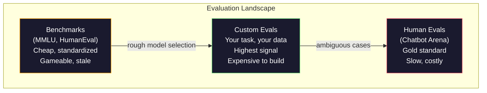
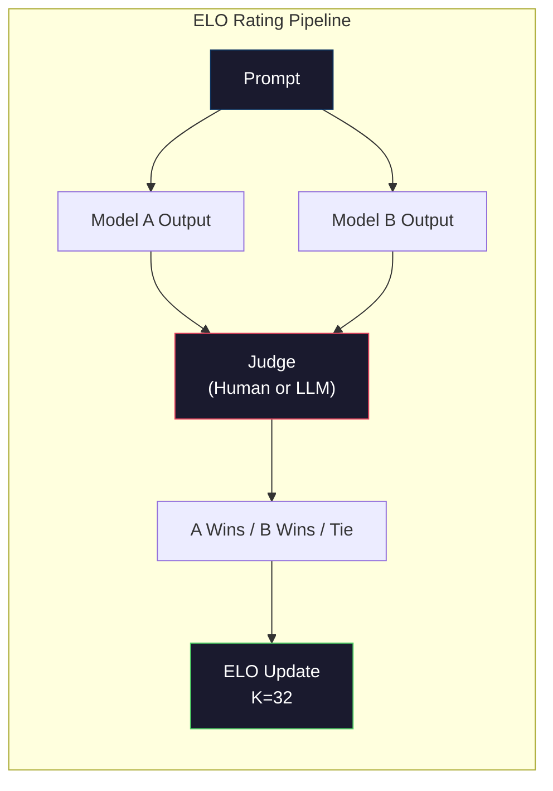

# 评估：基准、评测、LM Harness

> 古德哈特定律：当一个指标成为目标，它就不再是好的指标。每个前沿实验室都在刷基准分数。MMLU 分数不断上升，而模型仍然无法可靠地数出 "strawberry" 中有几个 R。唯一重要的评测是**你自己的**评测——在你的任务上，用你的数据。

**Type:** Build
**Languages:** Python
**Prerequisites:** 第 10 阶段，第 01-05 课（从零构建 LLM）
**Time:** 约 90 分钟

## 学习目标

- 构建一个自定义评估 harness，对语言模型运行多项选择题和开放式基准测试
- 解释为什么标准基准（MMLU、HumanEval）会饱和，且无法区分前沿模型
- 使用合适的指标实现任务特定的评测：exact match、F1、BLEU 和 LLM-as-judge 评分
- 设计针对你的特定用例的自定义评估套件，而不是仅仅依赖公开排行榜

## 问题所在

MMLU 于 2020 年发布，包含 57 个学科的 15,908 道题。不到三年，前沿模型就将其刷爆了。GPT-4 得分 86.4%。Claude 3 Opus 得分 86.8%。Llama 3 405B 得分 88.6%。排行榜压缩到一个 3 个百分点的区间内，其中的差异只是统计噪声，而非真实的能力差距。

与此同时，这些模型却在 10 岁小孩不假思索就能完成的任务上失败。在 MMLU 上得 88.7% 的 Claude 3.5 Sonnet，最初竟数不对 "strawberry" 中的字母——这个任务不需要任何世界知识，也不需要任何推理，只需要逐个字符迭代即可。HumanEval 用 164 道题测试代码生成。模型在上面得分超过 90%，但生成的代码仍然会在任何初级开发者都能发现的边界情况上崩溃。

基准表现与真实世界可靠性之间的差距是 LLM 评估的核心问题。基准只能告诉你模型在基准上的表现，几乎无法说明该模型在你的特定任务上、用你的特定数据、在你的特定失败模式下会有怎样的表现。如果你在构建客服机器人，MMLU 毫不相关。如果你在构建代码助手，HumanEval 只覆盖函数级生成——它对调试、重构或跨文件解释代码一无所言。

你需要自定义评测。不是因为基准没用——它们对粗略的模型选型是有用的——而是因为最终评估必须与你的部署条件完全匹配。

## 核心概念

### 评估全景

评估分为三类，各有不同的成本和信号质量。

**基准**是标准化的测试套件。MMLU、HumanEval、SWE-bench、MATH、ARC、HellaSwag。你对模型运行基准测试，得到一个分数。优点：所有人都用同一套测试，因此可以比较模型。缺点：模型和训练数据对这些基准的污染日益严重。实验室的训练数据中包含基准题目。分数上去了，能力未必。

**自定义评测**是你为自己的特定用例构建的测试套件。你定义输入、期望输出和评分函数。法律文档摘要器在法律文档上评估。SQL 生成器在你的数据库 schema 上评估。创建成本高，但这是唯一能预测生产表现的评估方式。

**人工评估**使用付费标注员，依据有用性、正确性、流畅性和安全性等标准来判断模型输出。这是自动化评分失效的开放式任务的黄金标准。Chatbot Arena 已收集了超过 200 万张针对 100 多个模型的人类偏好投票。缺点：成本（每次判断约 $0.10-$2.00）和速度（数小时到数天）。



### 为什么基准会失效

三种机制导致基准分数不再反映真实能力。

**数据污染。**训练语料从互联网上抓取。基准题目就在互联网上。模型在训练期间看到了答案。这不是传统意义上的作弊——实验室并非有意包含基准数据。但网络规模的抓取几乎不可能排除这些数据。

**应试训练。**实验室针对基准表现优化训练配比。如果训练配比中 5% 是 MMLU 风格的多选题，模型就会学会这种格式和答案分布。MMLU 是四选一的多选题。模型会学到答案分布在 A/B/C/D 之间大致均匀，这即使模型不知道答案也有帮助。

**饱和。**当每个前沿模型在某个基准上都得 85-90% 时，该基准就失去了区分能力。剩余 10-15% 的题目可能模棱两可、标注错误，或需要冷门的领域知识。在 MMLU 上从 87% 提升到 89%，可能只意味着模型多记住了两道冷门题，而不是它变聪明了。

### 困惑度：快速健康检查

困惑度衡量模型对一段 token 序列的“惊讶程度”。形式上，它是平均负对数似然的指数：

```
PPL = exp(-1/N * sum(log P(token_i | context)))
```

困惑度为 10 意味着模型在每个 token 位置上的平均不确定性，相当于在 10 个选项中均匀选择。越低越好。GPT-2 在 WikiText-103 上困惑度约为 30。GPT-3 约为 20。Llama 3 8B 约为 7。

困惑度可用于在同一测试集上比较模型，但它有盲区。模型可以通过擅长预测常见模式来获得低困惑度，同时在罕见但重要的模式上表现很差。它也完全不能说明指令遵循、推理或事实准确性。把它当作健康检查，而非最终结论。

### LLM-as-Judge

用一个强模型来评估弱模型的输出。思路很简单：让 GPT-4o 或 Claude Sonnet 按正确性、有用性和安全性以 1-5 分制评价一个回复。用 GPT-4o-mini 每次判断成本约 $0.01，且与人类判断的相关性出奇地好——在大多数任务上约有 80% 的一致率。

评分提示词比模型本身更重要。模糊的提示词（“给这个回复打分”）会产生噪声很大的分数。带评分量规的结构化提示词（“答案事实正确且引用来源得 5 分，正确但无来源得 4 分，部分正确得 3 分……”）会产生一致、可复现的分数。

失败模式：裁判模型会表现出位置偏差（在两两比较中偏好第一个回复）、冗长偏差（偏好更长的回复）和自我偏好（GPT-4 对 GPT-4 输出的评分高于同等质量的 Claude 输出）。缓解措施：随机化顺序、按长度归一化、使用与被评估模型不同的裁判模型。

### 基于两两比较的 ELO 评分

Chatbot Arena 的做法。将来自不同模型的两个回复展示给同一个提示词。由人类（或 LLM 裁判）选出更好的一个。从数千次这样的比较中，为每个模型计算 ELO 评分——与国际象棋使用的系统相同。

ELO 的优势：相对排名比绝对评分更可靠，能优雅地处理平局，并且比独立对每个输出评分所需的比较次数更少即可收敛。截至 2026 年初，Chatbot Arena 排名显示 GPT-4o、Claude 3.5 Sonnet 和 Gemini 1.5 Pro 在榜首相差不到 20 个 ELO 分。



### 评估框架

**lm-evaluation-harness**（EleutherAI）：标准的开源评估框架。支持 200 多个基准。一条命令即可对任何 Hugging Face 模型运行 MMLU、HellaSwag、ARC 等。Open LLM Leaderboard 使用它。

**RAGAS**：专门针对 RAG 管道的评估框架。衡量忠实度（答案是否与检索到的上下文一致？）、相关性（检索到的上下文是否与问题相关？）和答案正确性。

**promptfoo**：配置驱动的提示词工程评测。在 YAML 中定义测试用例，对多个模型运行，得到通过/失败报告。适用于提示词回归测试——确保提示词的改动不会破坏已有的测试用例。

### 构建自定义评测

这是对生产唯一重要的评估。流程如下：

1. **定义任务。**模型究竟应该做什么？要精确。“回答问题”太模糊。“给定一封客户投诉邮件，提取产品名称、问题类别和情感倾向”才是一个可评估的任务。

2. **创建测试用例。**原型评测至少 50 条，生产环境 200 条以上。每个测试用例是一个 (input, expected_output) 对。包含边界情况：空输入、对抗性输入、歧义输入、其他语言的输入。

3. **定义评分。**结构化输出用 exact match。文本相似度用 BLEU/ROUGE。开放式质量用 LLM-as-judge。抽取任务用 F1。用权重组合多个指标。

4. **自动化。**每条评测一条命令即可运行。没有手动步骤。以一种便于随时间对比的格式存储结果。

5. **随时间追踪。**评测分数孤立来看毫无意义。你需要趋势线。上次提示词改动后分数提高了吗？切换模型后退步了吗？像提示词一样给你的评测做版本管理。

| 评估类型 | 每次判断成本 | 与人类一致率 | 最适合 |
|-----------|------------------|----------------------|----------|
| Exact match | ~$0 | 100%（在适用时） | 结构化输出、分类 |
| BLEU/ROUGE | ~$0 | ~60% | 翻译、摘要 |
| LLM-as-judge | ~$0.01 | ~80% | 开放式生成 |
| 人工评估 | $0.10-$2.00 | N/A（即真实标准） | 模糊、高风险任务 |

```figure
perplexity-loss
```

## 动手构建

### 第 1 步：一个最小评估框架

定义核心抽象。一个 eval case 包含输入、期望输出和可选的 metadata 字典。一个 scorer 接收预测和参考，返回 0 到 1 之间的分数。

```python
import json
from collections import Counter

class EvalCase:
    def __init__(self, input_text, expected, metadata=None):
        self.input_text = input_text
        self.expected = expected
        self.metadata = metadata or {}

class EvalSuite:
    def __init__(self, name, cases, scorers):
        self.name = name
        self.cases = cases
        self.scorers = scorers

    def run(self, model_fn):
        results = []
        for case in self.cases:
            prediction = model_fn(case.input_text)
            scores = {}
            for scorer_name, scorer_fn in self.scorers.items():
                scores[scorer_name] = scorer_fn(prediction, case.expected)
            results.append({
                "input": case.input_text,
                "expected": case.expected,
                "prediction": prediction,
                "scores": scores,
            })
        return results
```

### 第 2 步：评分函数

构建 exact match、token F1 和一个模拟的 LLM-as-judge 评分器。

```python
def exact_match(prediction, expected):
    return 1.0 if prediction.strip().lower() == expected.strip().lower() else 0.0

def token_f1(prediction, expected):
    pred_tokens = set(prediction.lower().split())
    exp_tokens = set(expected.lower().split())
    if not pred_tokens or not exp_tokens:
        return 0.0
    common = pred_tokens & exp_tokens
    precision = len(common) / len(pred_tokens)
    recall = len(common) / len(exp_tokens)
    if precision + recall == 0:
        return 0.0
    return 2 * (precision * recall) / (precision + recall)

def llm_judge_simulated(prediction, expected):
    pred_words = set(prediction.lower().split())
    exp_words = set(expected.lower().split())
    if not exp_words:
        return 0.0
    overlap = len(pred_words & exp_words) / len(exp_words)
    length_penalty = min(1.0, len(prediction) / max(len(expected), 1))
    return round(overlap * 0.7 + length_penalty * 0.3, 3)
```

### 第 3 步：ELO 评分系统

实现带 ELO 更新的两两比较。这正是 Chatbot Arena 用来给模型排名的系统。

```python
class ELOTracker:
    def __init__(self, k=32, initial_rating=1500):
        self.ratings = {}
        self.k = k
        self.initial_rating = initial_rating
        self.history = []

    def _ensure_player(self, name):
        if name not in self.ratings:
            self.ratings[name] = self.initial_rating

    def expected_score(self, rating_a, rating_b):
        return 1 / (1 + 10 ** ((rating_b - rating_a) / 400))

    def record_match(self, player_a, player_b, outcome):
        self._ensure_player(player_a)
        self._ensure_player(player_b)

        ea = self.expected_score(self.ratings[player_a], self.ratings[player_b])
        eb = 1 - ea

        if outcome == "a":
            sa, sb = 1.0, 0.0
        elif outcome == "b":
            sa, sb = 0.0, 1.0
        else:
            sa, sb = 0.5, 0.5

        self.ratings[player_a] += self.k * (sa - ea)
        self.ratings[player_b] += self.k * (sb - eb)

        self.history.append({
            "a": player_a, "b": player_b,
            "outcome": outcome,
            "rating_a": round(self.ratings[player_a], 1),
            "rating_b": round(self.ratings[player_b], 1),
        })

    def leaderboard(self):
        return sorted(self.ratings.items(), key=lambda x: -x[1])
```

### 第 4 步：困惑度计算

使用 token 概率计算困惑度。实践中你会从模型的 logits 得到这些概率。这里我们用一个概率分布来模拟。

```python
import numpy as np

def perplexity(log_probs):
    if not log_probs:
        return float("inf")
    avg_neg_log_prob = -np.mean(log_probs)
    return float(np.exp(avg_neg_log_prob))

def token_log_probs_simulated(text, model_quality=0.8):
    np.random.seed(hash(text) % 2**31)
    tokens = text.split()
    log_probs = []
    for i, token in enumerate(tokens):
        base_prob = model_quality
        if len(token) > 8:
            base_prob *= 0.6
        if i == 0:
            base_prob *= 0.7
        prob = np.clip(base_prob + np.random.normal(0, 0.1), 0.01, 0.99)
        log_probs.append(float(np.log(prob)))
    return log_probs
```

### 第 5 步：汇总结果

计算一次评测运行的汇总统计：均值、中位数、阈值下的通过率，以及各指标的分解。

```python
def summarize_results(results, threshold=0.8):
    all_scores = {}
    for r in results:
        for metric, score in r["scores"].items():
            all_scores.setdefault(metric, []).append(score)

    summary = {}
    for metric, scores in all_scores.items():
        arr = np.array(scores)
        summary[metric] = {
            "mean": round(float(np.mean(arr)), 3),
            "median": round(float(np.median(arr)), 3),
            "std": round(float(np.std(arr)), 3),
            "min": round(float(np.min(arr)), 3),
            "max": round(float(np.max(arr)), 3),
            "pass_rate": round(float(np.mean(arr >= threshold)), 3),
            "n": len(scores),
        }
    return summary

def print_summary(summary, suite_name="Eval"):
    print(f"\n{'=' * 60}")
    print(f"  {suite_name} Summary")
    print(f"{'=' * 60}")
    for metric, stats in summary.items():
        print(f"\n  {metric}:")
        print(f"    Mean:      {stats['mean']:.3f}")
        print(f"    Median:    {stats['median']:.3f}")
        print(f"    Std:       {stats['std']:.3f}")
        print(f"    Range:     [{stats['min']:.3f}, {stats['max']:.3f}]")
        print(f"    Pass rate: {stats['pass_rate']:.1%} (threshold >= 0.8)")
        print(f"    N:         {stats['n']}")
```

### 第 6 步：运行完整管道

将所有部分串联起来。定义一个任务，创建测试用例，模拟两个模型，运行评测，从两两比较中计算 ELO，并打印排行榜。

```python
def demo_model_good(prompt):
    responses = {
        "What is the capital of France?": "Paris",
        "What is 2 + 2?": "4",
        "Who wrote Hamlet?": "William Shakespeare",
        "What language is PyTorch written in?": "Python and C++",
        "What is the boiling point of water?": "100 degrees Celsius",
    }
    return responses.get(prompt, "I don't know")

def demo_model_bad(prompt):
    responses = {
        "What is the capital of France?": "Paris is the capital city of France",
        "What is 2 + 2?": "The answer is four",
        "Who wrote Hamlet?": "Shakespeare",
        "What language is PyTorch written in?": "Python",
        "What is the boiling point of water?": "212 Fahrenheit",
    }
    return responses.get(prompt, "Unknown")

cases = [
    EvalCase("What is the capital of France?", "Paris"),
    EvalCase("What is 2 + 2?", "4"),
    EvalCase("Who wrote Hamlet?", "William Shakespeare"),
    EvalCase("What language is PyTorch written in?", "Python and C++"),
    EvalCase("What is the boiling point of water?", "100 degrees Celsius"),
]

suite = EvalSuite(
    name="General Knowledge",
    cases=cases,
    scorers={
        "exact_match": exact_match,
        "token_f1": token_f1,
        "llm_judge": llm_judge_simulated,
    },
)

results_good = suite.run(demo_model_good)
results_bad = suite.run(demo_model_bad)

print_summary(summarize_results(results_good), "Model A (concise)")
print_summary(summarize_results(results_bad), "Model B (verbose)")
```

“好”模型给出精确答案。“坏”模型给出冗长的改述。Exact match 严厉惩罚冗长模型。Token F1 和 LLM-as-judge 则更宽容。这说明了指标选择的重要性：同一个模型，取决于你的评分方式，看起来可以很棒也可以很糟。

### 第 7 步：ELO 锦标赛

在多个回合中运行模型间的两两比较。

```python
elo = ELOTracker(k=32)

for case in cases:
    pred_a = demo_model_good(case.input_text)
    pred_b = demo_model_bad(case.input_text)

    score_a = token_f1(pred_a, case.expected)
    score_b = token_f1(pred_b, case.expected)

    if score_a > score_b:
        outcome = "a"
    elif score_b > score_a:
        outcome = "b"
    else:
        outcome = "tie"

    elo.record_match("model_a_concise", "model_b_verbose", outcome)

print("\nELO Leaderboard:")
for name, rating in elo.leaderboard():
    print(f"  {name}: {rating:.0f}")
```

### 第 8 步：困惑度比较

比较不同质量水平的“模型”的困惑度。

```python
test_text = "The quick brown fox jumps over the lazy dog in the garden"

for quality, label in [(0.9, "Strong model"), (0.7, "Medium model"), (0.4, "Weak model")]:
    log_probs = token_log_probs_simulated(test_text, model_quality=quality)
    ppl = perplexity(log_probs)
    print(f"  {label} (quality={quality}): perplexity = {ppl:.2f}")
```

## 使用它

### lm-evaluation-harness（EleutherAI）

对任何模型运行基准测试的标准工具。

```python
# pip install lm-eval
# Command line:
# lm_eval --model hf --model_args pretrained=meta-llama/Llama-3.1-8B --tasks mmlu --batch_size 8

# Python API:
# import lm_eval
# results = lm_eval.simple_evaluate(
#     model="hf",
#     model_args="pretrained=meta-llama/Llama-3.1-8B",
#     tasks=["mmlu", "hellaswag", "arc_easy"],
#     batch_size=8,
# )
# print(results["results"])
```

### promptfoo

配置驱动的提示词工程评测。在 YAML 中定义测试，对多个 provider 运行。

```yaml
# promptfoo.yaml
providers:
  - openai:gpt-4o-mini
  - anthropic:claude-3-haiku

prompts:
  - "Answer in one word: {{question}}"

tests:
  - vars:
      question: "What is the capital of France?"
    assert:
      - type: contains
        value: "Paris"
  - vars:
      question: "What is 2 + 2?"
    assert:
      - type: equals
        value: "4"
```

### RAGAS 用于 RAG 评估

```python
# pip install ragas
# from ragas import evaluate
# from ragas.metrics import faithfulness, answer_relevancy, context_precision
#
# result = evaluate(
#     dataset,
#     metrics=[faithfulness, answer_relevancy, context_precision],
# )
# print(result)
```

RAGAS 衡量的是通用评测遗漏的东西：模型的答案是否立足于检索到的上下文，而不仅仅是答案在抽象意义上是否“正确”。

## 交付它

本课产出 `outputs/prompt-eval-designer.md`——一个可复用的提示词，可为任何任务设计自定义评测套件。给它一个任务描述，它就会生成测试用例、评分函数和通过/失败阈值建议。

它还产出 `outputs/skill-llm-evaluation.md`——一个决策框架，根据你的任务类型、预算和延迟要求选择合适的评估策略。

## 练习

1. 添加一个“一致性”评分器：将同一输入送入模型 5 次，衡量输出匹配的频率。在确定性输入上答案不一致，说明提示词脆弱或温度设置过高。

2. 扩展 ELO 追踪器以支持多个裁判函数（exact match、F1、LLM-as-judge）并为它们加权。比较重度加权 exact match 与重度加权 F1 时排行榜如何变化。

3. 为一个特定任务构建评测套件：将邮件分类到 5 个类别。创建 100 个包含多样化示例的测试用例，包括边界情况（可能属于多个类别的邮件、空邮件、其他语言的邮件）。衡量不同“模型”（基于规则的、关键词匹配的、模拟 LLM）的表现。

4. 实现污染检测：给定一组评测题目和训练语料，检查有多大比例的评测题目（或其近似改写）出现在训练数据中。这就是研究者审计基准有效性的方法。

5. 构建一个“模型差异”工具。给定两个模型版本的评测结果，高亮哪些测试用例提升、哪些退步、哪些保持不变。这是代码 diff 在评测上的等价物——对于理解一次改动是帮助还是伤害至关重要。

## 关键术语

| 术语 | 人们怎么说 | 它实际意味着什么 |
|------|----------------|----------------------|
| MMLU | “那个基准” | Massive Multitask Language Understanding——57 个学科的 15,908 道多选题，到 2025 年已被刷爆至 88% 以上 |
| HumanEval | “代码评测” | OpenAI 的 164 道 Python 函数补全题，只测试孤立的函数生成 |
| SWE-bench | “真实编码评测” | 来自 12 个 Python 仓库的 2,294 个 GitHub issue，端到端地衡量 bug 修复能力，包括测试生成 |
| Perplexity | “模型有多困惑” | exp(-avg(log P(token_i given context)))——越低意味着模型给实际 token 分配的概率越高 |
| ELO 评分 | “模型的象棋排名” | 由两两胜负记录计算出的相对技能评分，Chatbot Arena 用它为 100 多个模型排名 |
| LLM-as-judge | “用 AI 给 AI 打分” | 一个强模型按量规给弱模型的输出打分，与人类裁判约 80% 一致，成本约 $0.01/次 |
| 数据污染 | “模型见过考题” | 训练数据包含基准题目，在不提升真实能力的情况下抬高分数 |
| 评测套件 | “一堆测试” | 一个带版本的 (input, expected_output, scorer) 三元组集合，用于衡量特定能力 |
| 通过率 | “它做对的比例” | 得分超过阈值的评测用例占比——比均分更可操作，因为它衡量可靠性 |
| Chatbot Arena | “模型排名网站” | LMSYS 平台，拥有 200 万+人类偏好投票，通过 ELO 评分产出最受信任的 LLM 排行榜 |

## 延伸阅读

- [Hendrycks et al., 2021 -- "Measuring Massive Multitask Language Understanding"](https://arxiv.org/abs/2009.03300)——MMLU 论文，尽管已饱和，仍是引用最多的 LLM 基准
- [Chen et al., 2021 -- "Evaluating Large Language Models Trained on Code"](https://arxiv.org/abs/2107.03374)——OpenAI 的 HumanEval 论文，确立了代码生成评估方法
- [Zheng et al., 2023 -- "Judging LLM-as-a-Judge"](https://arxiv.org/abs/2306.05685)——对使用 LLM 评估 LLM 的系统分析，包括位置偏差和冗长偏差的发现
- [LMSYS Chatbot Arena](https://chat.lmsys.org/)——拥有 200 万+投票的众包模型比较平台，最受信任的真实世界 LLM 排名