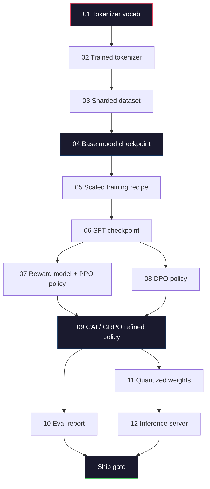
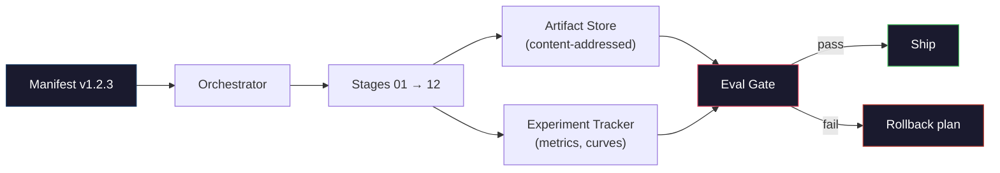

# 构建完整的 LLM 流水线

> 第 01 课到第 12 课的所有内容都只是某条流水线中的一个阶段。本课是脚手架，把这些阶段变成一次端到端运行：分词、预训练、扩展、SFT、对齐、评估、量化、服务。你不会在笔记本电脑上训练一个 70B 模型。你要构建的是一个 2026 年前沿团队用来决定发布什么内容的编排层、清单（manifest）、评估门禁和回滚计划。这是收官之作。

**Type:** Build
**Languages:** Python (stdlib)
**Prerequisites:** 第 10 阶段全部课程 01-12
**Time:** 约 120 分钟

## 学习目标

- 将此前的十一课（分词器、数据、预训练、扩展、SFT、RLHF、DPO、CAI、评估、量化、推理）组合成一份可复现的流水线规范
- 定义阶段之间的工件契约：每个阶段消费什么、产出什么、下一个阶段如何验证输入
- 构建一个编排器，追踪实验、哈希工件，并依据评估阈值把关发布决策
- 设计回滚计划：哪些工件重跑代价低，哪些代价高，一个损坏的检查点会造成什么损失

## 问题所在

之前的课程各自都能跑通。分词器已训练。微型 GPT 已预训练。SFT 数据集已组装。奖励模型已训练。DPO 已运行。评估已度量。量化权重已导出。推理服务器已启动。每一个都是一个 notebook。每一个都有自己的约定、自己的输出路径、自己的种子。

前沿训练运行不是一个 notebook。Llama 3 405B 花费了约 3000 万 H100 小时，历时约 54 天。DeepSeek-V3 用了约 280 万 H800 小时。在这段时间里，一个损坏的检查点、一次数据污染、一次评估回退，就可能让团队损失一周的实际时间和一个月的 GPU 预算。团队存活下来的方式是流水线卫生：每个阶段都有确定性的输入、确定性的输出、一份清单、一个哈希、一道门禁。

这是收官之作。你不会在笔记本电脑上端到端运行这条流水线。你要编写协调各阶段的编排器、描述本次运行的清单、把关发布决策的验证器，以及让第三方从一个文件复现你工作的重放计划。代码很小；纪律性很强。

这个模式从 100M 到 1T 参数都原样适用。同样的四个组件——清单、编排器、评估门禁、工件存储——既能运行 Llama 3，也能运行你的业余 GPT。区别只在于每个阶段配置里数字的大小，而不是流水线的形状。

## 核心概念

### 十二个阶段

第 10 阶段的每一课都是一个阶段。下面是完整的依赖图。



阶段 07 和 08 可以并行运行。其余一切都是硬依赖。阶段 02（分词器）的变更会使所有下游工件失效。阶段 10（评估）的变更只会使发布决策失效。

### 清单（Manifest）

清单是一个文件，它对一次运行的描述足够完整以实现重放。流水线产出的任何内容都不应依赖于清单之外的状态。这些字段枯燥但必不可少。

```
pipeline_version: 1.2.3
seed: 42
git_commit: a1b2c3d4
stages:
  01_tokenizer:
    recipe: bpe_32k
    input_hash: sha256:...
    output_hash: sha256:...
    wall_clock_sec: 3600
    cost_usd: 12
```

阶段 N 的输出哈希就是阶段 N+1 的输入哈希。任何偏差都会使流水线停止。这就是你及早发现数据损坏的方式。这也是地球另一端的队友验证他们的重放产出了与你相同工件的方式。

实践中，团队使用一个小型 YAML 模式，外加一个与上一次成功运行做 diff 的清单检查器。任何超出预期字段（成本、实际耗时）的差异都是危险信号。

### 工件类型化

每个阶段的输出都是一个有类型的工件。不是一个目录大杂烩，不是一个 pickle，而是一个具有已知模式的命名类型。

| 阶段 | 工件类型 | 关键字段 |
|-------|--------------|-----------|
| 01-02 | Tokenizer | vocab.json, merges.txt, config.json, hash |
| 03 | Dataset | shards[], 行数, token 数, 去重统计 |
| 04-05 | Checkpoint | weights.safetensors, config.json, 优化器状态, 步数 |
| 06 | SFT Model | 检查点 + SFT 配方 + 数据配比 |
| 07 | Reward Model | RM 检查点 + 偏好数据哈希 |
| 08-09 | Policy | 检查点 + 参考哈希 + beta + 已消耗的 KL 预算 |
| 10 | Eval Report | 基准分数 + 回退 diff + 评估数据哈希 |
| 11 | Quantized Model | 量化权重 + 校准数据 + 相对 FP16 的精度差 |
| 12 | Server Spec | 端点 + 模型哈希 + 配置 + 可观测性钩子 |

类型化防止了最常见的失败模式：把阶段 08 的输出当作阶段 06 的输入，把 DPO 训练的模型送进 SFT 路径。有类型的工件和有类型的阶段签名让这类错误成为编译期失败，而不是第五天的失败。

### 评估门禁

发布不是“训练完成”。发布是“训练完成且评估门禁通过”。门禁在运行开始之前就已定义。

```
gates:
  mmlu:      >= baseline + 0.5   # no regression
  humaneval: >= baseline + 1.0
  truthfulqa: >= baseline         # no drop
  safety_refusal_rate: <= 0.05
  kl_from_reference: <= 25.0
  cost_total_usd: <= 50000
```

每道门禁都是一个数值阈值。没有“看起来不错”式的门禁。没有主观签字。如果所有门禁都通过，工件被标记为可发布。如果任何门禁失败，运行被挂起，等待具名审查者的显式覆盖，该覆盖本身也会记录在清单中。

两道门禁能捕获大多数灾难。一道*回退*门禁（新模型在核心基准上必须不差于前一个模型）捕获训练 bug。一道 *KL 预算*门禁（对齐后的策略相对其参考模型的漂移不得超过 X）捕获对齐过度。每条生产流水线都有这两道门禁。

### 编排器

一小段代码，读取清单、调度阶段、追踪工件，并在任何契约被违反时停止。这不是 Airflow。这不是 Kubeflow。为了流水线卫生，你需要的是你自己写的、朴实无华的东西。

编排器的职责很窄：

1. 从清单解析出 DAG。
2. 对每个阶段，检查期望的输出是否已存在于正确的哈希处（若存在则跳过）。
3. 运行阶段，捕获 stdout/stderr，记录实际耗时和成本。
4. 将输出哈希与下游阶段期望的输入哈希比对。
5. 失败时，写一份包含确切失败阶段的局部清单并以非零码退出。

这就是 200 行 Python。它看起来就像本课的文件 `code/main.py`。在底层，真正的流水线使用 `torchrun` 或 `ray` 在集群上执行各个阶段，但编排器本身在单机上运行。

### 实验追踪与工件存储

两个外部系统锚定整条流水线。

**实验追踪器（wandb、neptune、mlflow）。**记录损失曲线、评估指标、每个阶段的系统遥测数据。三周后需要对比运行 A 和运行 B 时，你去的就是追踪器。团队几乎总是使用托管追踪器——自己写会浪费本该投入训练的时间。

**工件存储（S3、R2、GCS）。**用于检查点、数据集、分词器、评估报告的不可变对象存储。工件按哈希寻址，而不是按文件名。像 `latest.pt` 这样的文件名是个坑；`ckpt-7b-step-20000-sha256:abc123.safetensors` 才是契约。

编排器同时写入两者。追踪器是给人看图的。工件存储是给下一个阶段查找输入的。

### 成本核算

一次前沿运行有对应的美元数字。预算纪律发生在两个地方。

**运行前估算。**从清单出发，计算期望 FLOPs（预训练为：6 x 参数量 x token 数）、期望 GPU 小时数（FLOPs / 峰值吞吐 / 利用率），以及按当前租用价格计算的美元成本。如果估算超出预算门禁，流水线拒绝启动。

**运行中追踪。**逐阶段的实际耗时和成本记录到清单。每个阶段结束后，检查剩余预算。如果某个阶段超支，下一阶段的门禁将以新的剩余预算评估。你不会等到 VC 打电话时才发现自己没钱了。

Llama 3 公开的主预训练运行成本为 $61M. DeepSeek-V3 reported $5.6M。这个比例主要归功于硬件效率加上混合专家——但具体成本之所以可见，是因为两个团队都按阶段而不是按运行来追踪。

### 可复现性与确定性

这不是一回事。*可复现*意味着相同的清单加相同的代码加相同的基础设施，产出一个下游指标等价的检查点。*确定性*意味着比特级完全相同的输出。

现代 LLM 训练是可复现的但不是确定性的。分布式训练的归约顺序、GPU 核的非确定性（cuBLAS、flash-attn）、以及混合精度舍入，共同导致两次运行之间在 1e-5 量级上不同的浮点数。这对不动的最终指标没有影响。如果你在尝试用比特级 diff 调试，这就是致命的。解决办法是记录每个阶段的输入哈希、输出哈希和头条指标——如果这些匹配，即使权重不是比特级相同，运行也算“已复现”。



### 回滚计划

在运行开始之前，写下每个阶段失败时会发生什么。分三类。

- **重跑代价低**（小时级）：分词器、评估、量化、推理服务器。直接重跑。
- **中等**（天级）：SFT、DPO、CAI。保留基座模型；只重跑对齐阶段。
- **昂贵**（周级和数百万美元）：预训练。这里的回滚计划不是“重跑”。而是“使用最后一个好的检查点，用修订后的数据重跑更便宜的下游阶段”。

因为阶段依赖是有类型且有哈希的，编排器可以自动计算回滚集合：使失败阶段及其所有后代失效。阶段 06（SFT）失败会使 06、07、08、09、10、11、12 失效。阶段 11（量化）失败只使 11 和 12 失效。事先写下这些，避免团队在凌晨 4 点精疲力竭时临场发挥。

### 2026 年观察到的生产配方

大多数前沿团队收敛到了同一个骨架。

- 分词器：128k BPE，带字节回退。在小而均衡的多语言切片上训练。
- 预训练：10-20T token，主要是网页加代码加合成数据。Muon 或 AdamW 优化器。FSDP2 或 DeepSpeed ZeRO-3。梯度检查点。BF16 权重、FP32 主权重。
- SFT：500k-2M 条指令对，人工与合成混合，并与评估集严格去重。
- 对齐：DPO 或 CAI + GRPO。只有当偏好信号对 DPO 来说维度过高时才使用 RLHF。
- 评估：MMLU-Pro、MATH、HumanEval+、GPQA、SWE-Bench Verified、LiveBench，外加一个公众永远看不到的私有留出集。
- 量化：服务用 4-bit GPTQ 或 AWQ，精度差重要的安全评估用 8-bit。
- 服务：vLLM、TensorRT-LLM 或自研。连续批处理。投机解码。KV cache 淘汰。

数字每六个月变一次。骨架不变。

```figure
beam-search
```

## 动手构建

本课的代码是一个编排器和一个清单检查器，不是十二个训练脚本。每个阶段用一个占位符模拟，产出一个形状和哈希都正确的输出工件。端到端运行编排器，可以在你为真实阶段烧 GPU 钱之前证明流水线的管道部分是通的。

完整实现见 `code/main.py`。关键部分：

- `Manifest` dataclass：流水线版本、种子、git commit、阶段、门禁。
- `Stage` dataclass：名称、类型、输入（哈希）、输出（哈希）、实际耗时、成本。
- `Orchestrator.run()`：解析 DAG、调度阶段、验证哈希、更新清单。
- `EvalGate.check()`：读取阈值，与最新评估报告比对，返回通过/失败。
- `ArtifactStore`（内存版桩）：按哈希 put/get，模拟 S3。
- `CostTracker`：逐阶段和累计核算，超出上限时停止。

`main.py` 中的流水线运行十二个占位阶段，产出一份清单，并触发一道失败的评估门禁以展示运行被挂起时的样子。把每个占位符换成对应课程的真实训练脚本，你就得到了真实前沿流水线所使用的骨架。

## 使用它

标准工作流有三条命令。

```
python code/main.py plan    # validate manifest, compute cost estimate, print DAG
python code/main.py run     # execute stages, writing to manifest.out.yaml
python code/main.py gate    # read manifest.out.yaml, apply eval gates, ship-or-hold
```

每次都先运行 `plan`。大多数流水线 bug 在 plan 阶段就会暴露——缺失的门禁阈值、过期的哈希、预算超支。运行 `plan` 是免费的。运行 `run` 是昂贵的。通过在便宜的一侧捕获 bug 来省钱。

`gate` 的输出要么是 `SHIP`，要么是 `HOLD: <reason>`。被挂起的运行不是失败；它是一个决策点。具名审查者要么覆盖（且覆盖被记录在案），要么批准回滚。

## 发布它

本课产出 `outputs/skill-llm-pipeline-reviewer.md`。给它一份拟议的流水线清单，它会检查所有契约：阶段类型化、哈希链、门禁、回滚计划、成本估算。对于缺少评估门禁、KL 预算无上限、或评估与训练数据混用的清单，它会拒绝批准。

## 练习

1. 扩展编排器以支持阶段 07 和 08 的并行执行。使用标准库的 `concurrent.futures` 模块。确认最终清单记录了两个阶段的输出，且阶段 09 的输入哈希是二者的确定性组合。

2. 添加一道“污染检查”门禁。给定评估数据集哈希和训练数据集分片，计算重叠度（精确字符串匹配或 13-gram 匹配）。重叠超过 0.1% 时门禁失败。喂给它一个被污染的训练集，确认门禁挂起了运行。

3. 从第一性原理实现成本估算器。对阶段 04（预训练），估算 FLOPs 为 6 x 参数量 x token 数，假设 H100 上 BF16 为 989 TFLOPs、MFU（模型 FLOPs 利用率）40%、$2.50/GPU 小时。报告在 2T token 上训练 7B 模型的估算值。与已发表的 Llama 2 数字对比。

4. 构建部分回滚。模拟阶段 09（CAI）失败，然后重跑阶段 09 至 12，同时保持 01-08 缓存。编排器应通过哈希检测到缓存的工件并跳过它们。对比完整重跑，测量节省的实际时间。

5. 添加可观测性。为每个阶段发射 OpenTelemetry span，附带参数量、已见 token 数、损失和成本等属性。将 span 输送到本地收集器。重点不是仪表盘；重点是每个阶段的健康状态都可以从一个 trace ID 追溯。

## 关键术语

| 术语 | 人们怎么说 | 实际含义 |
|------|----------------|----------------------|
| Manifest | “配方文件” | 描述流水线版本、种子、逐阶段配置和门禁阈值的 YAML 或 JSON——足以重放一次运行 |
| Content-addressed | “按哈希不按名字” | 工件按其内容的 SHA-256 存储，因此你永远不会混淆版本 A 和版本 B |
| Eval gate | “发布标准” | 基准指标和安全分数上的数值阈值，必须在工件被标记为可发布之前通过 |
| KL budget | “对齐漂移了多远” | 对齐阶段累计 KL(policy \|\| reference) 的上限，作为门禁强制执行 |
| MFU | “GPU 用了多少” | Model FLOPs Utilization——实际达到的 FLOPs 除以理论峰值。70B 规模下 40% 是典型值，7B 下为 55% |
| Rollback plan | “出问题怎么办” | 每个阶段失败时预先写好的动作集合：重跑、回退、用修订后的输入重新训练 |
| Orchestrator | “指挥家” | 读取清单、调度阶段、验证哈希、在任何契约被违反时停止的进程 |
| Artifact store | “带版本管理的权重的 S3” | 不可变的按内容寻址的对象存储——检查点、数据集、评估报告的唯一事实来源 |
| Reproducible | “重放时指标相同” | 比特级权重不同但下游指标等价——这是分布式 LLM 训练的现实目标 |
| Cost gate | “你不能超过 X” | 运行前成本估算加运行中追踪器——如果估算超出预算，流水线拒绝启动 |

## 延伸阅读

- [Dubey et al., 2024 -- "The Llama 3 Herd of Models"](https://arxiv.org/abs/2407.21783) -- 关于一条前沿流水线（包括数据、训练、对齐、评估）最详尽的公开描述
- [DeepSeek-AI, 2024 -- "DeepSeek-V3 Technical Report"](https://arxiv.org/abs/2412.19437) -- 成本约为 Llama 3 级训练十分之一的高效优先流水线
- [Kaplan et al., 2020 -- "Scaling Laws for Neural Language Models"](https://arxiv.org/abs/2001.08361) -- 算力-数据-参数量扩展关系的开山之作
- [Hoffmann et al., 2022 -- "Training Compute-Optimal Large Language Models (Chinchilla)"](https://arxiv.org/abs/2203.15556) -- 对 Kaplan 的修正，重新校准了现代数据预算
- [PyTorch FSDP2 documentation](https://pytorch.org/docs/stable/fsdp.html) -- 在 PyTorch 2.4+ 中取代 FSDP1 的分布式训练原语
- [Weights & Biases LLM Reports](https://wandb.ai/site/llms) -- 开源 LLM 运行的真实清单和实验追踪器输出，可作为可套用的模板