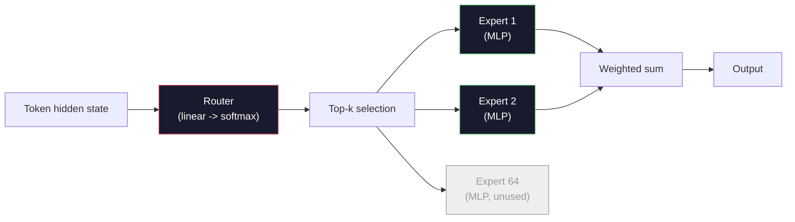

# 开源模型：架构走读

> 你在第 04 课中从零构建了一个 GPT-2 Small。2026 年的前沿开源模型属于同一谱系，只是有五六处具体的改动：用 RMSNorm 替代 LayerNorm，用 SwiGLU 替代 GELU，用 RoPE 替代可学习位置编码，用 GQA 或 MLA 替代完整 MHA，再加上大规模的 Mixture-of-Experts。你已掌握的数学覆盖了其中 95%。本课将 Llama 3、DeepSeek-V3、Mixtral、Qwen 和 Gemma 并排对照阅读，并指出每种架构分道扬镳的确切位置。

**Type:** Learn
**Languages:** Python (stdlib)
**Prerequisites:** Phase 10，第 04、05、12 课（Pre-training、Scaling、Inference）
**Time:** ~45 分钟

## 学习目标

- 阅读 Llama 3、Mistral、Mixtral、Gemma 2、Qwen 2.5 和 DeepSeek-V3 的 config.json，并解释其中每一个字段
- 说出每个模型相对 GPT-2 Small 所做的具体架构改动，并从第一性原理出发论证其合理性
- 仅凭 config 计算任意开源模型的参数量、KV 缓存大小和激活内存
- 在给定延迟、内存和能力约束的部署目标下，选择合适的开源模型

## 问题所在

在第 04 课中，你写了 350 行 numpy，得到一个 GPT-2 形状的模型。Llama 3 405B 拥有一份 200 页的技术报告。你的直觉是它们是完全不同的物种。事实并非如此。那 200 页描述的是同一个对象，加上五六处动机明确的修改，以及大量关于规模化的实现细节。骨架——嵌入、transformer 块、注意力、MLP、归一化、输出头——完全没有变。

本课就是一份 diff。对每个主要开源模型家族，我们精确列出相对 GPT-2 改了什么、为什么改、代价是什么。学完之后，你可以拿到一张新的模型卡，并在脑海中把它翻译回 GPT-2 基线。

实际收益是：当 Meta 发布 Llama 5 或 DeepSeek 发布 V4 时，你不需要新的心智模型。你只需查看 config，看看哪些已知旋钮动了，并了解其下游影响。2026 年的架构是一个有限的工具箱，每个新模型只是选择其中不同的子集。

## 概念

### 不变的核心

所有自回归开源模型共享：

- 词嵌入矩阵（vocab_size x hidden_dim）。
- N 层 decoder 块堆叠：norm、自注意力、残差、norm、MLP、残差。
- 最终的 norm 和线性输出头，投影到 vocab_size（通常与嵌入权重绑定）。
- 因果掩码，下一词元交叉熵损失。

这就是形状。其余都是旋钮。

### 真正会动的六个旋钮

纵观 2024-2026 年的每一款前沿开源模型，同样的六个设计选择被反复采用：

1. **归一化。** LayerNorm -> RMSNorm。
2. **位置编码。** 可学习绝对位置 -> RoPE（及变体：YaRN、NTK）。
3. **激活函数。** GELU -> SwiGLU（或 GeGLU）。
4. **注意力头共享。** MHA -> GQA -> MQA -> MLA。
5. **稠密 vs 稀疏 MLP。** 稠密 -> Mixture-of-Experts。
6. **Pre-norm 位置。** Pre-norm 保留，Post-norm 已消失。

其余一切（学习率调度、数据配比、批大小、上下文长度）都属于训练配置，而非架构。就这六个旋钮。

### 旋钮 1：RMSNorm

LayerNorm 减去均值、除以标准差、缩放并平移。RMSNorm 只保留缩放：

```
RMSNorm(x) = x / sqrt(mean(x^2) + eps) * gamma
```

不减均值。无偏置。每个词元少一次矩阵乘。Zhang 和 Sennrich（2019）论证了它在机器翻译上与 LayerNorm 效果相当，同时速度快 10%。每个现代开源模型都在用它。

代价：无。收益：小幅吞吐量提升，代码更简单。

### 旋钮 2：RoPE

可学习位置嵌入在 GPT-2 中是一张 1024 槽的查找表。上下文 1025 已超出表末。模型无法外推到训练长度之外。

Rotary Position Embedding（RoPE，Su et al. 2021）通过在注意力点积之前成对旋转每个 Q 和 K 向量来注入位置。旋转角度是位置的确定性函数，因此没有任何需要学习的部分，也不存在耗尽的问题。借助缩放技巧（NTK-aware 插值、YaRN），在 8k 上下文上训练的模型可以在推理时扩展到 128k，精度损失不大。

```
q_rotated = rotate(q, angle(pos))
k_rotated = rotate(k, angle(pos))
score = q_rotated . k_rotated
```

每一款 Llama、Mistral、Qwen、DeepSeek 和 Gemma 都使用 RoPE。Gemma 2 采用混合方式（大部分层用 RoPE，其他层用局部滑动窗口注意力）。

### 旋钮 3：SwiGLU

GPT-2 的 MLP 是 `x -> gelu(xW1 + b1) -> (...)W2 + b2`。SwiGLU（Shazeer 2020）用门控乘积替代激活函数：

```
SwiGLU(x) = (xW1) * sigmoid(xW1) * xV
```

两个并行投影代替一个，由 Swish 激活门控。经验上每参数困惑度更强。Llama 2 采用后，所有人都跟进了。MLP 的隐藏层大小通常设置成使总参数量与原稠密 MLP 一致：如果 GPT-2 使用 `ff_dim = 4 * hidden`，则 SwiGLU 使用 `ff_dim = (2/3) * 4 * hidden = 8/3 * hidden`。

### 旋钮 4：注意力头共享

GPT-2 使用 **Multi-Head Attention（MHA）**：每个头拥有自己的 Q、K、V 投影。

**Multi-Query Attention（MQA，Shazeer 2019）**在所有头之间共享一个 K 和一个 V。KV 缓存缩减为原来的 num_heads 分之一，在典型模型上是 12 倍到 32 倍的缩减。精度在困难基准上略有下降。

**Grouped-Query Attention（GQA，Ainslie et al. 2023）**是折中方案：G 组 Q 头共享一个 K 和一个 V。Llama 3 8B 使用 GQA，有 32 个 Q 头和 8 个 KV 头（G=8），因此 KV 缓存相比完整 MHA 缩小 4 倍。

**Multi-Head Latent Attention（MLA，DeepSeek 2024）**将 K 和 V 压缩到共享的低秩潜空间中，再按头投影回去。在保持每头表达能力的同时进一步减少 KV 缓存。DeepSeek-V2 和 V3 依靠它实现长上下文性能。

| 方案 | KV 头 | KV 缓存 | 精度 |
|--------|----------|----------|----------|
| MHA    | num_heads | 完整 | 最好 |
| GQA    | num_groups (G < num_heads) | 缩减为 num_heads / G | 接近 MHA |
| MQA    | 1 | 缩减为 num_heads 分之一 | 小幅下降 |
| MLA    | 潜向量，按头解压 | 小于 MQA | 接近 MHA |

对于任何约 13B 参数以上的模型，GQA 或 MLA 几乎是必需的。大规模下的完整 MHA 是 KV 缓存灾难。

### 旋钮 5：Mixture of Experts

稠密 MLP 对每个词元都激活全部参数。MoE MLP 在每个块中有 K 个专家，以及一个为每个词元挑选 top-k 专家的路由器（通常 top-2）。每个词元只有被选中的专家权重参与前向传播。

```
router_logits = xW_r
indices, weights = top_k(router_logits, k=2)
output = sum_i weights[i] * expert[indices[i]](x)
```

其吸引力在于：你可以拥有 64 个每个 7B 大小的专家（总参数量巨大），而每个词元只运行其中 2 个（每词元计算量相当于稠密 7B 模型）。Mixtral 8x7B 总参数量 47B，但每词元只激活 13B。DeepSeek-V3 总参数量 671B，但每词元只激活 37B。



优点：相同的计算量，更多的参数，更强的容量。缺点：专家内存仍然必须存在于某处（因此服务所需的 VRAM 超过等价稠密模型），路由器的负载均衡很难，而对齐期间路由器的微调本身就是研究课题。

### 旋钮 6：Pre-norm 保留

最初的 transformer 在每个子层之后应用 layer norm。自 GPT-2 以来，每个开源模型都把它放在每个子层*之前*。Pre-norm 在深度上严格更易训练。没什么可争的。

### 逐模型 Diff

下面这张表让这一切具体化。

| 模型 | 年份 | 总参数 | 激活参数 | Norm | 激活函数 | 位置 | 注意力 | MoE | 上下文 |
|-------|------|-------------|---------------|------|-----------|----------|-----------|-----|---------|
| GPT-2 Small | 2019 | 124M | 124M | LayerNorm | GELU | 可学习 | MHA (12 heads) | 否 | 1k |
| Llama 3 8B | 2024 | 8B | 8B | RMSNorm | SwiGLU | RoPE | GQA (32/8) | 否 | 128k |
| Llama 3 70B | 2024 | 70B | 70B | RMSNorm | SwiGLU | RoPE | GQA (64/8) | 否 | 128k |
| Llama 3 405B | 2024 | 405B | 405B | RMSNorm | SwiGLU | RoPE | GQA (128/16) | 否 | 128k |
| Mistral 7B | 2023 | 7.2B | 7.2B | RMSNorm | SwiGLU | RoPE | GQA | 否 | 32k |
| Mixtral 8x7B | 2023 | 47B | 13B | RMSNorm | SwiGLU | RoPE | GQA | 是 (8 experts, top-2) | 32k |
| Gemma 2 9B | 2024 | 9B | 9B | RMSNorm (pre+post) | GeGLU | RoPE + 滑动窗口 | GQA | 否 | 8k |
| Qwen 2.5 72B | 2024 | 72B | 72B | RMSNorm | SwiGLU | RoPE (YaRN) | GQA (64/8) | 否 | 128k |
| DeepSeek V2 236B | 2024 | 236B | 21B | RMSNorm | SwiGLU | RoPE | MLA | 是 (160 experts, top-6) | 128k |
| DeepSeek V3 | 2024 | 671B | 37B | RMSNorm | SwiGLU | RoPE | MLA | 是 (256 experts, top-8) | 128k |

扫一遍各列：RMSNorm 是普遍的。SwiGLU 或其表亲 GeGLU 是普遍的。RoPE 是普遍的。7B 以上 GQA 是普遍的，除非被 MLA 替代。MoE 是顶端的差异化项。

### 读取 config.json

Llama 3 8B 配置：

```
{
  "hidden_size": 4096,
  "intermediate_size": 14336,
  "num_hidden_layers": 32,
  "num_attention_heads": 32,
  "num_key_value_heads": 8,
  "max_position_embeddings": 131072,
  "rope_theta": 500000.0,
  "rms_norm_eps": 1e-5,
  "vocab_size": 128256
}
```

每个字段都对应你已经实现过的东西。

- `hidden_size`：嵌入维度。
- `intermediate_size`：MLP 隐藏层大小（hidden 的 3.5 倍——SwiGLU 的数学）。
- `num_hidden_layers`：堆叠深度。
- `num_attention_heads`：Q 头数。
- `num_key_value_heads`：KV 头数（GQA）。
- `max_position_embeddings`：训练上下文长度。
- `rope_theta`：RoPE 基频。Meta 将其从默认的 10k 扩大到 500k，用于长上下文外推。
- `rms_norm_eps`：数值稳定性。
- `vocab_size`：词元。

仅凭这些，你就能计算总参数量、KV 缓存和峰值激活内存。精确公式见 `code/main.py`。

### 激活内存预算

在几十亿参数以上，激活值主导训练内存。预训练（配合梯度检查点）的经验法则：

```
activation_mem ~ batch_size * seq_len * hidden_size * num_layers * bytes_per_element
```

对于 Llama 3 8B，batch 1、seq 8192、BF16、32 层、hidden 4096：使用检查点时仅激活值就约 8 GB，不使用时约 40 GB。这就是 flash-attention 和 ring-attention 重要的原因——它们重写了注意力计算，使激活值放得下。

### KV 缓存预算

推理时最大上下文下的开销：

```
kv_cache = 2 * num_layers * num_kv_heads * head_dim * max_seq_len * bytes_per_element
```

Llama 3 8B 在 128k 上下文、BF16、head_dim = hidden / num_heads = 128 下：
每条序列 `2 * 32 * 8 * 128 * 131072 * 2 = 17.2 GB`。

8B 权重在 BF16 下是 16 GB。单条 128k 序列的 KV 缓存比权重还大。这正是驱动 GQA、MLA 和 KV 缓存量化研究的内存压力。

### 各模型的胜场

- **单张 80GB GPU，无 MoE**：Llama 3 8B、Mistral 7B、Gemma 2 9B。易于服务，工具链广泛。
- **单节点（8x80GB），大容量**：Llama 3 70B、Qwen 2.5 72B。最高的稠密开源能力。
- **最强开源能力，接受 MoE 复杂性**：DeepSeek V3、Mixtral 8x22B。每激活 FLOP 能力最强。
- **长上下文需求**：Llama 3（RoPE 缩放至 128k）、DeepSeek（MLA 优势）。
- **低延迟服务**：Gemma 2 9B（滑动窗口削减长上下文计算）。

```figure
rmsnorm-vs-layernorm
```

## 构建它

本课的代码是一个计算器。给定任意 config.json，它会按组件打印参数量、最大上下文下的 KV 缓存、SwiGLU MLP 比例，以及关于架构的简短结论（dense / GQA / MLA / MoE）。

```python
config = {
    "hidden_size": 4096, "intermediate_size": 14336,
    "num_hidden_layers": 32, "num_attention_heads": 32,
    "num_key_value_heads": 8, "vocab_size": 128256,
    "max_position_embeddings": 131072,
}
```

脚本逐字段遍历架构，计算嵌入、注意力（含 GQA 缩减）、MLP（含 SwiGLU 扩展）、layernorm 和输出头的参数量。然后在给定的上下文长度下计算 KV 缓存并打印摘要。

实现见 `code/main.py`。

## 使用它

对脚本中自带的 Llama 3 8B、Mistral 7B、Mixtral 8x7B 和 DeepSeek V3 配置运行这个计算器。比较参数分解。注意 MoE 模型的总参数量远超稠密模型，但激活参数量往往更小。注意 DeepSeek V3 的 KV 缓存比 Llama 3 405B 更小，尽管总参数量更多——这就是 MLA 在起作用。

然后插入你本地任意模型的配置，阅读摘要，判断它是否适合你的 GPU。

## 交付它

本课产出 `outputs/skill-open-model-picker.md`。给定部署目标（GPU 类型、VRAM、上下文长度、延迟预算）和任务画像（聊天、代码、推理、长上下文），它推荐一个开源模型、一种来自第 11 课的量化方案和一套来自第 12 课的推理栈，并围绕六个架构旋钮给出明确的推理。

## 练习

1. 从 HuggingFace 读取 Qwen 2.5 72B 的配置。从头计算总参数量。与 HF 报告的数值比较，并找出任何偏差的来源（head dim 取整、KV 共享系数等）。

2. DeepSeek V3 使用 256 个专家、top-8 路由。计算激活专家与总专家的比率，并与 Mixtral 8x7B 的 8 选 top-2 比较。从稀疏（25%）到更稀疏（3%）的转变对每 FLOP 容量意味着什么？

3. 在 FP8 和 BF16 下计算 Llama 3 405B 在 128k 上下文时的 KV 缓存。FP8 是 BF16 数值的一半。在一个 8xH100 节点（每张 80GB = 共 640GB，扣除权重内存）上你可以服务多少条并行序列？

4. Gemma 2 交替使用全注意力和滑动窗口注意力层。写出一半层使用 4096 词元滑动窗口而非完整上下文时 KV 缓存的数学。在 8k 总上下文下这节省了多少内存？

5. 找一款在本课编写之后发布的前沿开源模型。判断它选择了六个旋钮中的哪些，以及是否引入了第七个旋钮。一旦新架构发布，课程就会显得过时——目标是更新你的表格，而不是重建你的心智模型。

## 关键术语

| 术语 | 人们的说法 | 实际含义 |
|------|----------------|----------------------|
| RMSNorm | "去掉均值的 LayerNorm" | 仅按均方根归一化，带可学习缩放——更便宜，效果与 LayerNorm 相当 |
| RoPE | "旋转位置" | 按依赖于位置的角度成对旋转每个 Q 和 K 向量——借助缩放技巧可外推到训练长度之外 |
| SwiGLU | "新一代 MLP 激活函数" | 带 Swish 的门控线性单元：`(xW1) * sigmoid(xW1) * xV`——每个 2024+ 开源模型的标准配置 |
| GQA | "折中注意力" | Grouped-Query Attention：G 组 Q 头共享一个 K 头和一个 V 头——缩小 KV 缓存且没有 MQA 的精度损失 |
| MLA | "DeepSeek 的注意力" | Multi-Head Latent Attention：将 K/V 压缩到共享低秩潜空间，按头解压——大模型中最小的 KV 缓存 |
| MoE | "稀疏专家" | Mixture of Experts：每块 N 个 MLP，路由器每词元选 top-k——总参数巨大，激活参数小 |
| Top-k routing | "每词元选 k 个专家" | 路由器为每个专家计算分数并激活最高的 k 个——典型 k 为 2（Mixtral）到 8（DeepSeek） |
| YaRN | "拉伸 RoPE" | 又一种 RoPE 扩展——推理时插值旋转角度，将上下文从 8k 扩展到 128k+ |
| Sliding-window attention | "不关注所有内容" | 每个词元只关注最近 W 个词元——将注意力开销限制在每词元 O(W)，用于 Gemma 2 和早期 Mistral |
| Active params | "每词元实际运行的部分" | 对 MoE 模型，指每词元参与前向传播的参数量（远小于总参数量）——决定每词元 FLOPs |

## 延伸阅读

- [Dubey et al., 2024 -- "The Llama 3 Herd of Models"](https://arxiv.org/abs/2407.21783) -- 稠密 Llama 3 家族的架构与训练参考
- [DeepSeek-AI, 2024 -- "DeepSeek-V3 Technical Report"](https://arxiv.org/abs/2412.19437) -- MLA 加无辅助损失负载均衡加 671B MoE
- [Jiang et al., 2024 -- "Mixtral of Experts"](https://arxiv.org/abs/2401.04088) -- MoE 开源模型的经典论文
- [Su et al., 2021 -- "RoFormer: Enhanced Transformer with Rotary Position Embedding"](https://arxiv.org/abs/2104.09864) -- RoPE 论文
- [Shazeer, 2020 -- "GLU Variants Improve Transformer"](https://arxiv.org/abs/2002.05202) -- SwiGLU、GeGLU 及其变体
- [Ainslie et al., 2023 -- "GQA: Training Generalized Multi-Query Transformer Models"](https://arxiv.org/abs/2305.13245) -- GQA 论文
- [Gemma 2 Team, 2024 -- "Gemma 2: Improving Open Language Models at a Practical Size"](https://arxiv.org/abs/2408.00118) -- 全注意力+滑动窗口混合、pre+post-norm
- [Qwen Team, 2024 -- "Qwen 2.5 Technical Report"](https://arxiv.org/abs/2412.15115) -- YaRN 上下文扩展与长上下文训练配方