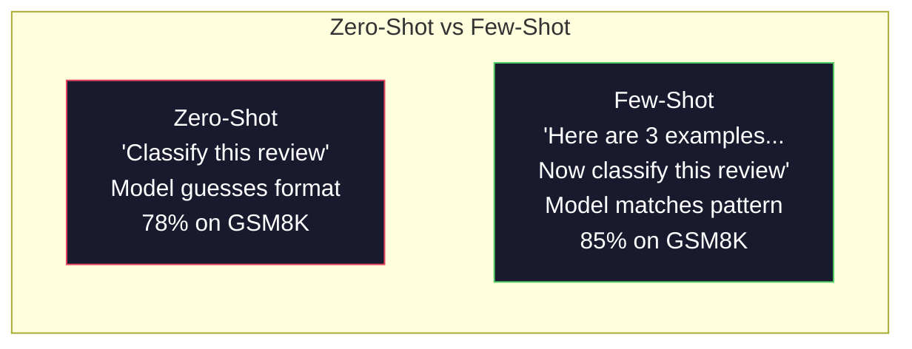
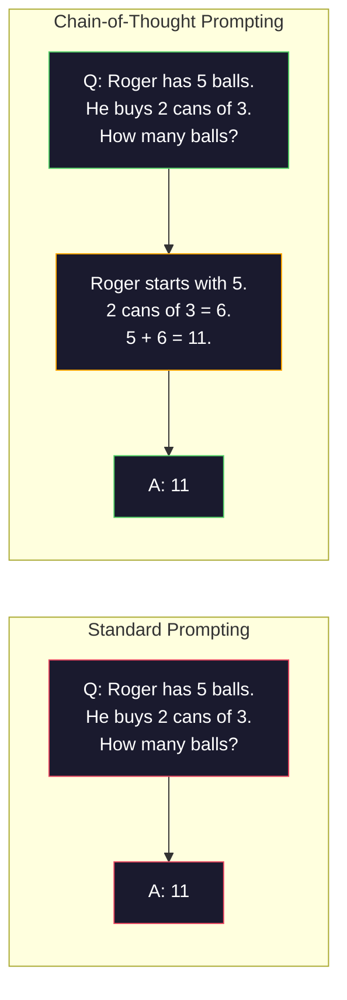
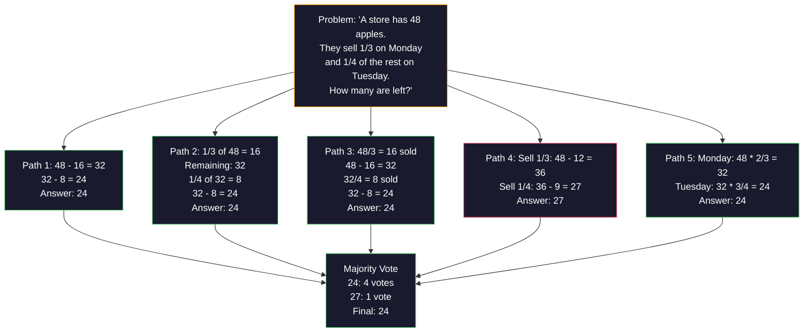
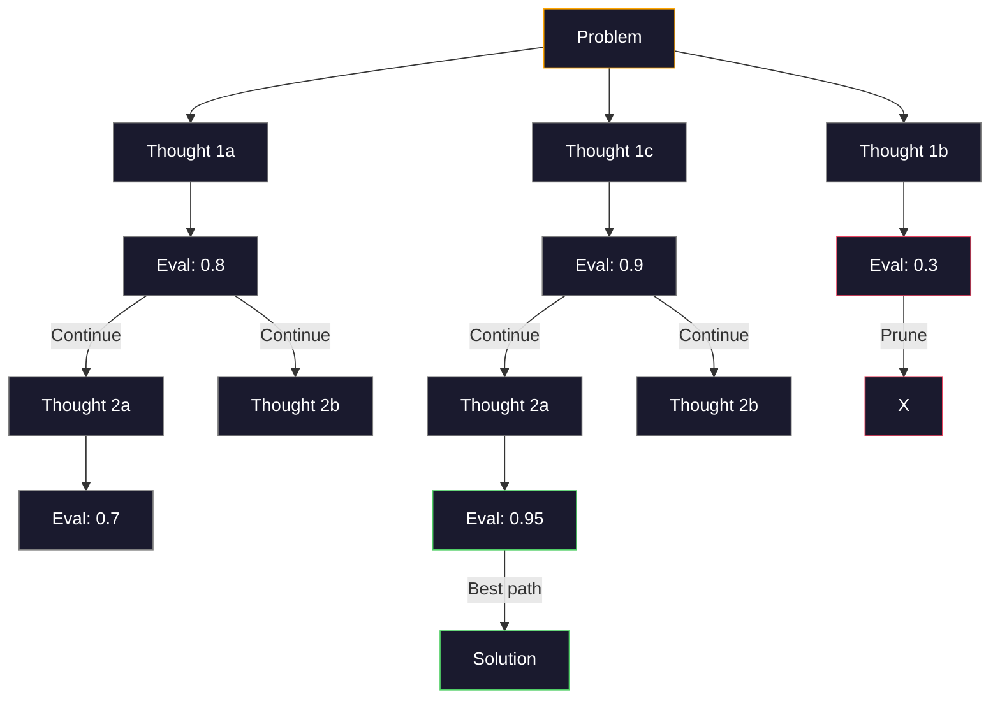
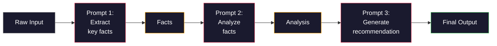

# 少样本、思维链、思维树

> 告诉模型做什么叫提示。向它展示如何思考叫工程。同一个模型、同一个任务、同一份数据上，78% 和 91% 准确率之间的差距，不是来自更好的模型，而是来自更好的推理策略。

**Type:** Build
**Languages:** Python
**Prerequisites:** Lesson 11.01 (Prompt Engineering)
**Time:** ~45 minutes

## 学习目标

- 通过选择并格式化能最大化任务准确率的示例演示，实现少样本提示
- 应用思维链推理，提升数学应用题等多步骤问题的准确率
- 构建一个探索多条推理路径并选出最优路径的思维树提示
- 在标准基准上测量零样本、少样本、思维链之间的准确率提升

## 问题所在

你构建了一个数学辅导应用。你的提示写着：“解这道应用题。”GPT-5 在 GSM8K(标准的小学数学基准)上答对率为 94%。你以为已经到顶了。其实没有——思维链还能再提升 3-4 个百分点。

加上五个词——“让我们一步一步思考”——准确率跃升至 91%。再加几个带完整解答的示例，就能达到 95%。同一个模型。同样的 temperature。同样的 API 成本。唯一的区别是，你给了模型一张草稿纸。

这不是投机取巧。这就是推理的运作方式。人类不会一步登天地解决多步骤问题，transformer 也一样。当你迫使模型生成中间 token 时，这些 token 会成为下一个 token 上下文的一部分。每一步推理都为下一步提供输入。模型是实实在在地“算”出答案的。

但“一步一步思考”只是起点，不是终点。如果你采样五条推理路径并进行多数投票呢？如果让模型探索一棵可能性之树，评估并剪枝呢？如果将推理与工具使用交错进行呢？这些都不是假设。它们是已发表、有实测提升的技术，你将在本课中把它们全部实现。

## 核心概念

### 零样本 vs 少样本：什么时候示例胜过指令

零样本提示只给模型任务，不给其他任何内容。少样本提示先给模型示例。

Wei 等人(2022)在 8 个基准上对此进行了测量。对于情感分类等简单任务，零样本和少样本的表现在彼此 2% 以内。对于多步骤算术和符号推理等复杂任务，少样本将准确率提升了 10-25%。

直观理解：示例是被压缩的指令。与其描述输出格式，不如直接展示；与其解释推理过程，不如直接演示。模型对示例进行模式匹配，比对抽象指令进行解释更可靠。



**少样本占优的场景：** 对格式敏感的任务、分类、结构化抽取、领域专有术语，以及任何需要模型匹配特定模式的任务。

**零样本占优的场景：** 简单的事实性问题、示例会限制创造力的创作类任务，以及找好示例比写好指令更难的任务。

### 示例选择：相似胜过随机

并非所有示例都是平等的。在分类任务上，选择与目标输入相似的示例，比随机选择高出 5-15%(Liu 等人，2022)。三条原则：

1. **语义相似性**：选取在嵌入空间中最接近输入的示例
2. **标签多样性**：让示例覆盖所有输出类别
3. **难度匹配**：匹配目标问题的复杂度

对大多数任务而言，最优示例数量是 3-5 个。低于 3 个，模型没有足够的信号来提取模式；高于 5 个，收益递减，且浪费上下文窗口的 token。对于多标签分类，每个标签使用一个示例。

### 思维链：给模型草稿纸

思维链提示由 Google Brain 的 Wei 等人(2022)提出。思路很简单：不要只让模型给出答案，而是让它先展示推理步骤。



从机制上讲，这为什么有效？transformer 生成的每个 token 都会成为下一个 token 的上下文。没有思维链时，模型必须把所有推理压缩进单次前向传播的隐藏状态中。有了思维链，模型把中间计算外化为 token。每个推理 token 都扩展了有效计算深度。

**GSM8K 基准(小学数学，8.5K 道题)：**

| 模型 | 零样本 | 零样本思维链 | 少样本思维链 |
|-------|-----------|---------------|--------------|
| GPT-4o | 78% | 91% | 95% |
| GPT-5 | 94% | 97% | 98% |
| o4-mini (reasoning) | 97% | — | — |
| Claude Opus 4.7 | 93% | 97% | 98% |
| Gemini 3 Pro | 92% | 96% | 98% |
| Llama 4 70B | 80% | 89% | 94% |
| DeepSeek-V3.1 | 89% | 94% | 96% |

**关于推理模型的说明。** 像 OpenAI 的 o 系列(o3、o4-mini)和 DeepSeek-R1 这样的模型，会在输出答案前于内部运行思维链。对推理模型添加“让我们一步一步思考”是多余的，有时甚至适得其反——它们已经这么做了。

思维链的两种形式：

**零样本思维链**：在提示后附加“让我们一步一步思考”。无需示例。Kojima 等人(2022)证明，仅这一句话就能提升算术、常识和符号推理任务的准确率。

**少样本思维链**：提供包含推理步骤的示例。比零样本思维链更有效，因为模型能看到你所期望的准确推理格式。

**思维链的负面场景**：简单的事实性回忆(“法国的首都是哪里？”)、单步分类，以及速度比准确率更重要的任务。思维链为每次查询增加 50-200 个 token 的推理开销。对于高吞吐、低复杂度的任务，这是浪费成本。

### 自一致性：多次采样，一次投票

Wang 等人(2023)提出了自一致性。其洞见是：单条思维链路径可能包含推理错误。但如果你采样 N 条独立的推理路径(使用 temperature > 0),并对最终答案进行多数投票，错误就会相互抵消。



在最初的 PaLM 540B 实验中，自一致性将 GSM8K 准确率从 56.5%(单条思维链)提升到 74.4%(N=40)。在 GPT-5 上提升很小(97% 到 98%),因为基础准确率已经饱和。该技术在基础思维链准确率为 60-85% 的模型上效果最佳——这是单路径错误频繁但非系统性的甜蜜点。对于推理模型(o 系列、R1),自一致性已被内置的内部采样所涵盖。

权衡：N 次采样意味着 N 倍的 API 成本和延迟。实践中，N=5 就能获得大部分收益。N=3 是有意义投票的最低要求。对于大多数任务，N > 10 收益递减。

### 思维树：分支探索

Yao 等人(2023)提出了思维树。思维链沿一条线性推理路径前进，而思维树探索多个分支，并在继续之前评估哪些分支最有前景。



思维树有三个组件：

1. **思考生成**：产生多个候选的下一步
2. **状态评估**：为每个候选打分(可以用 LLM 本身作为评估器)
3. **搜索算法**：在树中进行 BFS 或 DFS,剪掉低分分支

在 24 点任务(用算术运算将 4 个数字组合成 24)上，使用标准提示的 GPT-4 解出 7.3% 的问题。使用思维链，解出 4.0%(在此任务上思维链实际上有害，因为搜索空间太宽)。使用思维树，解出 74%。

思维树代价高昂。树中每个节点都需要一次 LLM 调用。分支因子为 3、深度为 3 的树最多需要 39 次 LLM 调用。只将其用于搜索空间大但可评估的问题——规划、谜题求解、带约束的创意问题求解。

### ReAct:思考 + 行动

Yao 等人(2022)将推理轨迹与行动相结合。模型在思考(生成推理)与行动(调用工具、搜索、计算)之间交替。

```mermaid
graph LR
    Q["Question:\nWhat is the\npopulation of the\ncountry where\nthe Eiffel Tower\nis located?"]
    T1["Thought: I need to\nfind which country\nhas the Eiffel Tower"]
    A1["Action: search\n'Eiffel Tower location'"]
    O1["Observation:\nParis, France"]
    T2["Thought: Now I need\nFrance's population"]
    A2["Action: search\n'France population 2024'"]
    O2["Observation:\n68.4 million"]
    T3["Thought: I have\nthe answer"]
    F["Answer:\n68.4 million"]

    Q --> T1 --> A1 --> O1 --> T2 --> A2 --> O2 --> T3 --> F

    style Q fill:#1a1a2e,stroke:#ffa500,color:#fff
    style T1 fill:#1a1a2e,stroke:#51cf66,color:#fff
    style A1 fill:#1a1a2e,stroke:#e94560,color:#fff
    style O1 fill:#1a1a2e,stroke:#808080,color:#fff
    style T2 fill:#1a1a2e,stroke:#51cf66,color:#fff
    style A2 fill:#1a1a2e,stroke:#e94560,color:#fff
    style O2 fill:#1a1a2e,stroke:#808080,color:#fff
    style T3 fill:#1a1a2e,stroke:#51cf66,color:#fff
    style F fill:#1a1a2e,stroke:#51cf66,color:#fff
```



在知识密集型任务上，ReAct 优于纯思维链，因为它能将推理建立在真实数据之上。在 HotpotQA(多跳问答)上，ReAct 配合 GPT-4 达到 35.1% 的精确匹配，而纯思维链为 29.4%。真正的威力在于推理错误能被观察结果纠正——模型可以在执行中途更新自己的计划。

ReAct 是现代 AI 智能体的基石。每个智能体框架(LangChain、CrewAI、AutoGen)都实现了某种“思考-行动-观察”循环的变体。你将在第 14 阶段构建完整的智能体。本课只涵盖提示模式。

### 结构化提示：XML 标签、分隔符、标题

当提示变复杂时，结构可以防止模型混淆各个部分。三种方法：

**XML 标签**(对 Claude 效果最佳，其他地方也可靠)：
```
<context>
You are reviewing a pull request.
The codebase uses TypeScript and React.
</context>

<task>
Review the following diff for bugs, security issues, and style violations.
</task>

<diff>
{diff_content}
</diff>

<output_format>
List each issue with: file, line, severity (critical/warning/info), description.
</output_format>
```

**Markdown 标题**(通用)：
```
## Role
Senior security engineer at a fintech company.

## Task
Analyze this API endpoint for vulnerabilities.

## Input
{api_code}

## Rules
- Focus on OWASP Top 10
- Rate each finding: critical, high, medium, low
- Include remediation steps
```

**分隔符**(极简但有效)：
```
---INPUT---
{user_text}
---END INPUT---

---INSTRUCTIONS---
Summarize the above in 3 bullet points.
---END INSTRUCTIONS---
```

### 提示链：顺序分解

有些任务对单个提示而言过于复杂。提示链将其分解为若干步骤，前一个提示的输出成为下一个提示的输入。



链式方法胜过单提示的三个原因：

1. **每一步更简单**：模型处理一个专注的任务，而不是同时应对所有事
2. **中间输出可检查**：你可以在步骤之间进行验证和纠正
3. **不同步骤可以使用不同模型**：抽取用便宜模型，推理用昂贵模型

### 性能对比

| 技术 | 最适合 | GSM8K 准确率 (GPT-5) | API 调用次数 | Token 开销 | 复杂度 |
|-----------|----------|------------------------|-----------|----------------|------------|
| 零样本 | 简单任务 | 94% | 1 | 无 | 微不足道 |
| 少样本 | 格式匹配 | 96% | 1 | 200-500 tokens | 低 |
| 零样本思维链 | 快速推理提升 | 97% | 1 | 50-200 tokens | 微不足道 |
| 少样本思维链 | 单次调用最高准确率 | 98% | 1 | 300-600 tokens | 低 |
| 自一致性 (N=5) | 高风险推理 | 98.5% | 5 | 5 倍 token 成本 | 中 |
| 推理模型 (o4-mini) | 思维链的即插即用替代品 | 97% | 1 | 隐藏(内部 2-10 倍) | 微不足道 |
| 思维树 | 搜索/规划问题 | 不适用(24 点上 74%) | 10-40+ | 10-40 倍 token 成本 | 高 |
| ReAct | 知识增强推理 | 不适用(HotpotQA 上 35.1%) | 3-10+ | 不定 | 高 |
| 提示链 | 复杂多步骤任务 | 96%(流水线) | 2-5 | 2-5 倍 token 成本 | 中 |

选择合适的技术取决于三个因素：准确率要求、延迟预算和成本容忍度。对于大多数生产系统，少样本思维链加上 3 样本自一致性作为兜底，就能覆盖 90% 的用例。

```figure
few-shot-curve
```

## 动手构建

我们将构建一个数学问题求解器，把少样本提示、思维链推理和自一致性投票整合到单个流水线中。然后为难题添加思维树。

完整实现见 `code/advanced_prompting.py`。以下是关键组件。

### 步骤 1:少样本示例库

第一个组件管理少样本示例，并为给定问题挑选最相关的示例。

```python
GSM8K_EXAMPLES = [
    {
        "question": "Janet's ducks lay 16 eggs per day. She eats three for breakfast every morning and bakes muffins for her friends every day with four. She sells every egg at the farmers' market for $2. How much does she make every day at the farmers' market?",
        "reasoning": "Janet's ducks lay 16 eggs per day. She eats 3 and bakes 4, using 3 + 4 = 7 eggs. So she has 16 - 7 = 9 eggs left. She sells each for $2, so she makes 9 * 2 = $18 per day.",
        "answer": "18"
    },
    ...
]
```

每个示例包含三个部分：问题、推理链和最终答案。推理链正是把普通少样本示例转化为思维链少样本示例的关键。

### 步骤 2:思维链提示构建器

提示构建器将系统消息、带推理链的少样本示例和目标问题组装成单个提示。

```python
def build_cot_prompt(question, examples, num_examples=3):
    system = (
        "You are a math problem solver. "
        "For each problem, show your step-by-step reasoning, "
        "then give the final numerical answer on the last line "
        "in the format: 'The answer is [number]'."
    )

    example_text = ""
    for ex in examples[:num_examples]:
        example_text += f"Q: {ex['question']}\n"
        example_text += f"A: {ex['reasoning']} The answer is {ex['answer']}.\n\n"

    user = f"{example_text}Q: {question}\nA:"
    return system, user
```

格式约束(“答案是 [数字]”)至关重要。没有它，自一致性就无法跨样本抽取和比较答案。

### 步骤 3:自一致性投票

采样 N 条推理路径，取多数答案。

```python
def self_consistency_solve(question, examples, client, model, n_samples=5):
    system, user = build_cot_prompt(question, examples)

    answers = []
    reasonings = []
    for _ in range(n_samples):
        response = client.chat.completions.create(
            model=model,
            messages=[
                {"role": "system", "content": system},
                {"role": "user", "content": user}
            ],
            temperature=0.7
        )
        text = response.choices[0].message.content
        reasonings.append(text)
        answer = extract_answer(text)
        if answer is not None:
            answers.append(answer)

    vote_counts = Counter(answers)
    best_answer = vote_counts.most_common(1)[0][0] if vote_counts else None
    confidence = vote_counts[best_answer] / len(answers) if best_answer else 0

    return best_answer, confidence, reasonings, vote_counts
```

Temperature 0.7 很重要。在 temperature 0.0 下，所有 N 个样本都会完全相同，失去意义。你需要足够的随机性以产生多样的推理路径，但又不能大到让模型输出胡言乱语。

### 步骤 4:思维树求解器

对于线性推理失败的问题，思维树探索多种方法，并评估哪个方向最有前景。

```python
def tree_of_thought_solve(question, client, model, breadth=3, depth=3):
    thoughts = generate_initial_thoughts(question, client, model, breadth)
    scored = [(t, evaluate_thought(t, question, client, model)) for t in thoughts]
    scored.sort(key=lambda x: x[1], reverse=True)

    for current_depth in range(1, depth):
        next_thoughts = []
        for thought, score in scored[:2]:
            extensions = extend_thought(thought, question, client, model, breadth)
            for ext in extensions:
                ext_score = evaluate_thought(ext, question, client, model)
                next_thoughts.append((ext, ext_score))
        scored = sorted(next_thoughts, key=lambda x: x[1], reverse=True)

    best_thought = scored[0][0] if scored else ""
    return extract_answer(best_thought), best_thought
```

评估器本身就是一次 LLM 调用。你问模型：“以 0.0 到 1.0 为尺度，这条推理路径对解题有多大前景？”这正是思维树的核心洞见——模型评估自己的部分解。

### 步骤 5:完整流水线

流水线通过升级策略组合所有技术。

```python
def solve_with_escalation(question, examples, client, model):
    single_answer, _ = few_shot_cot_solve(question, examples, client, model)

    sc_answer, confidence, _, _ = self_consistency_solve(
        question, examples, client, model, n_samples=5
    )

    if confidence >= 0.8 and single_answer == sc_answer:
        return sc_answer, "self_consistency", confidence

    tot_answer, _ = tree_of_thought_solve(question, client, model)
    return tot_answer, "tree_of_thought", None
```

升级逻辑：先尝试成本较低的单条思维链。单次确定性推理没有投票比例，因此用结果是否一致来检查质量：温度为 0 的答案必须与多次采样路径中的多数答案相同。如果两者不一致，或者自一致性的置信度低于 0.8（5 个样本中少于 4 个一致），就升级到思维树。这在成本和准确率之间取得平衡：多数问题能以较低成本解决，难题则获得更多计算资源。

## 实际使用

### 模板驱动的少样本提示

LangChain 提供内置的提示模板和输出解析支持，可以简化少样本和思维链模式：

```python
from langchain_core.prompts import FewShotPromptTemplate, PromptTemplate
from langchain_openai import ChatOpenAI

example_prompt = PromptTemplate(
    input_variables=["question", "reasoning", "answer"],
    template="Q: {question}\nA: {reasoning} The answer is {answer}."
)

few_shot_prompt = FewShotPromptTemplate(
    examples=examples,
    example_prompt=example_prompt,
    suffix="Q: {input}\nA: Let's think step by step.",
    input_variables=["input"]
)

llm = ChatOpenAI(model="gpt-4o", temperature=0.7)
chain = few_shot_prompt | llm
result = chain.invoke({"input": "If a train travels 120 km in 2 hours..."})
```

LangChain 还有 `ExampleSelector` 类用于语义相似度选择：

```python
from langchain_core.example_selectors import SemanticSimilarityExampleSelector
from langchain_openai import OpenAIEmbeddings

selector = SemanticSimilarityExampleSelector.from_examples(
    examples,
    OpenAIEmbeddings(),
    k=3
)
```

### 编译式提示

DSPy 将提示策略视为可优化的模块。你无需手工制作思维链提示，只需定义签名，让 DSPy 优化提示：

```python
import dspy

dspy.configure(lm=dspy.LM("openai/gpt-4o", temperature=0.7))

class MathSolver(dspy.Module):
    def __init__(self):
        self.solve = dspy.ChainOfThought("question -> answer")

    def forward(self, question):
        return self.solve(question=question)

solver = MathSolver()
result = solver(question="Janet's ducks lay 16 eggs per day...")
```

DSPy 的 `ChainOfThought` 会自动添加推理轨迹。`dspy.majority` 实现了自一致性：

```python
result = dspy.majority(
    [solver(question=q) for _ in range(5)],
    field="answer"
)
```

### 对比：从零构建 vs 框架

| 特性 | 从零构建(本课) | LangChain | DSPy |
|---------|--------------------------|-----------|------|
| 对提示格式的控制 | 完全 | 基于模板 | 自动 |
| 自一致性 | 手动投票 | 手动 | 内置 (`dspy.majority`) |
| 示例选择 | 自定义逻辑 | `ExampleSelector` | `dspy.BootstrapFewShot` |
| 思维树 | 自定义树搜索 | 社区 chains | 非内置 |
| 提示优化 | 手动迭代 | 手动 | 自动编译 |
| 最适合 | 学习、自定义流水线 | 标准工作流 | 研究、优化 |

## 上线交付

本课产出两个交付物。

**1. 推理链提示** (`outputs/prompt-reasoning-chain.md`):一个可用于生产的少样本思维链提示模板，带自一致性。接入你的示例和问题领域即可使用。

**2. 思维链模式选择技能** (`outputs/skill-cot-patterns.md`):一个决策框架，用于根据任务类型、准确率要求和成本约束选择合适的推理技术。

## 练习

1. **测量差距**：选取 10 道 GSM8K 题。分别用零样本、少样本、零样本思维链和少样本思维链求解。记录各自的准确率。哪种技术在你的模型上提升最大？

2. **示例选择实验**：对同样的 10 道题，比较随机选择示例与人工挑选相似示例。测量准确率差异。从哪个点开始，示例质量比示例数量更重要？

3. **自一致性成本曲线**：在 20 道 GSM8K 题上，以 N=1、3、5、7、10 运行自一致性。绘制准确率与成本(总 token 数)的关系图。曲线的拐点在哪里？

4. **构建 ReAct 循环**：为流水线扩展一个计算器工具。当模型生成数学表达式时，用 Python 的 `eval()`(在沙箱中)执行它，并把结果反馈回去。测量基于工具的推理是否优于纯思维链。

5. **创意任务的思维树**：将思维树求解器改编用于一个创意写作任务：“写一个既好笑又悲伤的六词故事。”用 LLM 作为评估器。分支探索是否比单次生成产出更好的创意作品？

## 关键术语

| 术语 | 人们的说法 | 实际含义 |
|------|----------------|----------------------|
| 少样本提示 | “给它一些示例” | 在提示中包含输入-输出演示，以锚定模型的输出格式和行为 |
| 思维链 | “让它一步步思考” | 引出中间推理 token,在产出最终答案前扩展模型的有效计算 |
| 自一致性 | “多跑几次” | 在 temperature > 0 下采样 N 条多样的推理路径，并以多数投票选出最常见的最终答案 |
| 思维树 | “让它探索选项” | 在推理分支上进行结构化搜索，对每个部分解进行评估，只扩展有前景的路径 |
| ReAct | “思考 + 工具使用” | 在“思考-行动-观察”循环中，将推理轨迹与外部行动(搜索、计算、API 调用)交错进行 |
| 提示链 | “拆成几步” | 将复杂任务分解为顺序执行的提示，每个输出作为下一个输入 |
| 零样本思维链 | “只要加上‘一步一步思考’” | 在提示后附加一个推理触发短语，不使用任何示例，依赖模型潜在的推理能力 |

## 延伸阅读

- [Chain-of-Thought Prompting Elicits Reasoning in Large Language Models](https://arxiv.org/abs/2201.11903) -- Wei 等人，2022。Google Brain 的思维链原始论文。核心结果见第 2-3 节。
- [Self-Consistency Improves Chain of Thought Reasoning in Language Models](https://arxiv.org/abs/2203.11171) -- Wang 等人，2023。自一致性论文。表 1 包含你需要的所有数据。
- [Tree of Thoughts: Deliberate Problem Solving with Large Language Models](https://arxiv.org/abs/2305.10601) -- Yao 等人，2023。思维树论文。第 4 节的 24 点结果是最大亮点。
- [ReAct: Synergizing Reasoning and Acting in Language Models](https://arxiv.org/abs/2210.03629) -- Yao 等人，2022。现代 AI 智能体的基石。第 3 节解释“思考-行动-观察”循环。
- [Large Language Models are Zero-Shot Reasoners](https://arxiv.org/abs/2205.11916) -- Kojima 等人，2022。“让我们一步一步思考”论文。方法如此简单却出奇地有效。
- [DSPy: Compiling Declarative Language Model Calls into Self-Improving Pipelines](https://arxiv.org/abs/2310.03714) -- Khattab 等人，2023。将提示视为编译问题。如果你想超越手动提示工程，值得一读。
- [OpenAI — Reasoning models guide](https://platform.openai.com/docs/guides/reasoning) -- 厂商指南，说明思维链何时成为内部按 token 计费的“推理”模式，而非提示层面的技巧。
- [Lightman 等人， "Let's Verify Step by Step" (2023)](https://arxiv.org/abs/2305.20050) -- 过程奖励模型(PRM),对推理链的每一步进行评分；这是超越仅结果奖励的推理监督信号。
- [Snell 等人， "Scaling LLM Test-Time Compute Optimally" (2024)](https://arxiv.org/abs/2408.03314) -- 对思维链长度、自一致性采样和 MCTS 的系统研究；当准确率比延迟更重要时，“一步一步思考”的进阶方向。