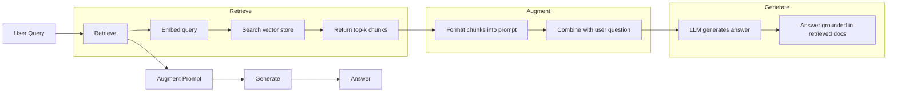
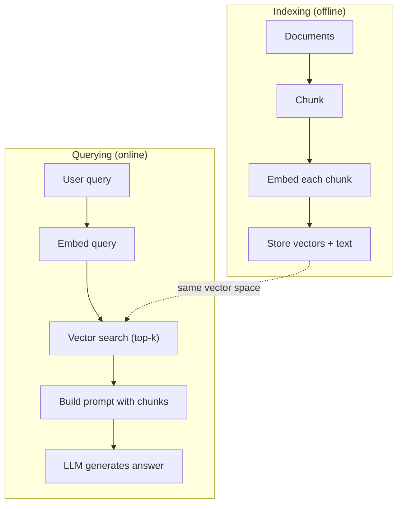

# RAG（检索增强生成）

> 你的 LLM 了解其训练截止日期之前的所有知识，但对贵公司的文档、你的代码库或上周的会议记录一无所知。RAG 通过检索相关文档并将其填充到提示词中来解决这个问题。这是生产环境 AI 中部署最广泛的模式。如果这门课你只做一个项目，那就做一个 RAG 流水线。

**Type:** Build
**Languages:** Python
**Prerequisites:** Phase 10 (从零构建 LLM)、Phase 11 第 01-05 课
**Time:** ~90 分钟
**Related:** Phase 5 · 23 (面向 RAG 的分块策略) 涵盖六种分块算法及各自适用的场景。Phase 5 · 22 (嵌入模型深度解析) 用于选择嵌入器。Phase 11 · 07 (进阶 RAG) 涵盖混合搜索、重排序和查询转换。

## 学习目标

- 构建一个完整的 RAG 流水线：文档加载、分块、嵌入、向量存储、检索和生成
- 使用向量数据库（ChromaDB、FAISS 或 Pinecone）配合合理的索引实现语义搜索
- 解释为什么在知识密集型应用中 RAG 优于微调（成本、时效性、可归因性）
- 使用检索指标（精确率、召回率）和生成指标（忠实度、相关性）评估 RAG 质量

## 问题所在

你为公司构建了一个聊天机器人。一位客户问："企业版计划的退款政策是什么？"LLM 给出了关于典型 SaaS 退款政策的泛泛回答。而实际的政策藏在一份 200 页的内部 wiki 中，其中写明企业客户享有 60 天窗口期并按比例退款。LLM 从未见过这份文档。它不可能知道训练数据中没有的内容。

微调是一种解决方案。拿到 LLM，在内部文档上训练它，然后部署更新后的模型。这可行，但存在严重问题。微调的计算成本高达数千美元。一旦文档发生变化，模型就会过时。你无法得知模型的答案来源于哪个文档。而且如果公司下个月收购了另一条产品线，你就得再次微调。

RAG 是另一种解决方案。模型本身保持不变。当问题到来时，在文档库中搜索相关段落，把它们粘贴到问题之前的提示词中，让模型基于这些段落作为上下文进行回答。文档库可以在几分钟内更新。你可以确切地看到检索到了哪些文档。模型本身从不改变。这就是 RAG 在生产环境中占主导地位的原因：更便宜、更新鲜、更可审计，并且适用于任何 LLM。

## 核心概念

### RAG 模式

整个模式只需四个步骤：



查询 -> 检索 -> 增强提示词 -> 生成。每个 RAG 系统都遵循这一模式。生产级 RAG 系统之间的差异在于每个步骤的细节：如何分块、如何嵌入、如何搜索，以及如何构建提示词。

### 为什么 RAG 胜过微调

| 关注点 | 微调 | RAG |
|---------|------------|-----|
| 成本 | $1,000-$100,000+ 每次训练 | $0.01-$0.10 每次查询（嵌入 + LLM） |
| 时效性 | 重新训练前一直过时 | 通过重新索引文档在几分钟内更新 |
| 可审计性 | 无法追溯答案来源 | 可以展示确切的检索段落 |
| 幻觉 | 依然会随意产生幻觉 | 基于检索到的文档 |
| 数据隐私 | 训练数据固化在权重中 | 文档保留在你的向量存储中 |

微调永久性地改变模型的权重。RAG 临时性地改变模型的上下文。对大多数应用而言，你需要的正是临时性上下文。

微调胜出的唯一场景：当你需要模型采用特定的风格、语气或推理模式，而这些仅靠提示词无法实现时。至于事实性知识检索，RAG 每次都赢。

### 嵌入模型

嵌入模型将文本转换为稠密向量。相似的文本在这个高维空间中产生彼此接近的向量。"How do I reset my password?" 和 "I need to change my password" 尽管几乎没有共同的词，却会产生几乎相同的向量。"The cat sat on the mat" 则产生一个截然不同的向量。

常见嵌入模型（2026 年阵容——完整分析见 Phase 5 · 22）：

| 模型 | 维度 | 提供方 | 备注 |
|-------|-----------|----------|-------|
| text-embedding-3-small | 1536 (Matryoshka) | OpenAI | 大多数用例中的最佳性价比 |
| text-embedding-3-large | 3072 (Matryoshka) | OpenAI | 更高精度，可截断至 256/512/1024 |
| Gemini Embedding 2 | 3072 (Matryoshka) | Google | MTEB 检索榜首；8K 上下文 |
| voyage-4 | 1024/2048 (Matryoshka) | Voyage AI | 领域变体（代码、金融、法律） |
| Cohere embed-v4 | 1024 (Matryoshka) | Cohere | 强多语言支持，128K 上下文 |
| BGE-M3 | 1024 (dense + sparse + ColBERT) | BAAI（开放权重） | 一个模型提供三种视图 |
| Qwen3-Embedding | 4096 (Matryoshka) | Alibaba（开放权重） | 开放权重检索最高分 |
| all-MiniLM-L6-v2 | 384 | 开放权重 (Sentence Transformers) | 原型基线 |

在本课中，我们使用 TF-IDF 构建自己的简单嵌入。不是因为生产系统使用 TF-IDF，而是因为它能让概念变得具体：文本输入，向量输出，相似文本产生相似向量。

### 向量相似度

给定两个向量，如何度量相似度？三种选择：

**余弦相似度**：两个向量之间夹角的余弦值。范围从 -1（相反）到 1（相同）。忽略模长，只关注方向。这是 RAG 的默认选择。

```
cosine_sim(a, b) = dot(a, b) / (||a|| * ||b||)
```

**点积**：原始内积。较大的向量得到较高的分数。当模长携带信息时有用（较长的文档可能更相关）。

```
dot(a, b) = sum(a_i * b_i)
```

**L2（欧几里得）距离**：向量空间中的直线距离。距离越小 = 越相似。对模长差异敏感。

```
L2(a, b) = sqrt(sum((a_i - b_i)^2))
```

余弦相似度是标准做法。它通过模长归一化，因此能优雅地处理不同长度的文档。当有人说"向量搜索"时，他们几乎总是指余弦相似度。

### 分块策略

文档太长，无法作为单个向量进行嵌入。一份 50 页的 PDF 可能产生很糟糕的嵌入，因为它包含数十个主题。因此，你需要将文档切分为块，并对每个块分别嵌入。

**固定大小分块**：每 N 个 token 切分一次。简单且可预测。一个 512 token、重叠 50 token 的分块方案意味着块 1 是 token 0-511，块 2 是 token 462-973，依此类推。重叠确保你不会在不巧的边界处切断句子。

**语义分块**：在自然边界处切分。段落、章节或 markdown 标题。每个块都是语义连贯的单元。实现更复杂，但检索效果更好。

**递归分块**：先尝试在最大的边界处切分（章节标题）。如果某个章节仍然太大，就在段落边界处切分。如果某个段落仍然太大，就在句子边界处切分。这是 LangChain RecursiveCharacterTextSplitter 的做法，在实践中效果很好。

块大小的重要性超出人们的想象：

- 太小（64-128 token）：每个块缺乏上下文。"It increased 15% last quarter" 在不知道 "it" 指什么的情况下毫无意义。
- 太大（2048+ token）：每个块涵盖多个主题，稀释了相关性。当你搜索营收数据时，得到的块可能 10% 关于营收、90% 关于人员编制。
- 最佳区间（256-512 token）：上下文足以自包含，同时足够聚焦以保持相关性。

大多数生产级 RAG 系统使用 256-512 token 的块并带 50 token 重叠。Anthropic 的 RAG 指南推荐此范围。

### 向量数据库

有了嵌入之后，你需要一个地方来存储和搜索它们。可选方案：

| 数据库 | 类型 | 最适合 |
|----------|------|----------|
| FAISS | 库（进程内） | 原型开发、中小型数据集 |
| Chroma | 轻量级数据库 | 本地开发、小型部署 |
| Pinecone | 托管服务 | 无运维负担的生产环境 |
| Weaviate | 开源数据库 | 自托管生产环境 |
| pgvector | Postgres 扩展 | 已在使用 Postgres 的情况 |
| Qdrant | 开源数据库 | 高性能自托管 |

在本课中，我们构建一个简单的内存向量存储。它将向量存储在列表中，并进行暴力余弦相似度搜索。这等同于使用扁平索引的 FAISS。在变慢之前大约可以扩展到 100,000 个向量。生产系统使用近似最近邻（ANN）算法（如 HNSW）在毫秒级内搜索数百万个向量。

### 完整流水线



索引阶段对每份文档运行一次（或当文档更新时）。查询阶段在每次用户请求时运行。在生产环境中，索引可能需要在数小时内处理数百万份文档。查询则必须在一秒内响应。

### 实际数字

大多数生产级 RAG 系统使用这些参数：

- **k = 5 到 10** 每次查询检索的块数
- **块大小 = 256 到 512 token** 并带 50 token 重叠
- **上下文预算**：每次查询 2,500-5,000 token 的检索内容
- **总提示词**：~8,000-16,000 token（系统提示词 + 检索块 + 对话历史 + 用户查询）
- **嵌入维度**：384-3072，取决于模型
- **索引吞吐量**：使用 API 嵌入时每秒 100-1,000 份文档
- **查询延迟**：检索 50-200ms，生成 500-3000ms

```figure
rag-chunking
```

## 动手构建

### 第 1 步：文档分块

```python
def chunk_text(text, chunk_size=200, overlap=50):
    words = text.split()
    chunks = []
    start = 0
    while start < len(words):
        end = start + chunk_size
        chunk = " ".join(words[start:end])
        chunks.append(chunk)
        start += chunk_size - overlap
    return chunks
```

### 第 2 步：TF-IDF 嵌入

我们构建一个简单的嵌入函数。TF-IDF（词频-逆文档频率）不是神经嵌入，但它以捕捉词重要性的方式将文本转换为向量。文档中的高频词获得较高的 TF。语料库中的稀有词获得较高的 IDF。两者的乘积构成一个向量，其中重要且有区分度的词具有较高数值。

```python
import math
from collections import Counter

def build_vocabulary(documents):
    vocab = set()
    for doc in documents:
        vocab.update(doc.lower().split())
    return sorted(vocab)

def compute_tf(text, vocab):
    words = text.lower().split()
    count = Counter(words)
    total = len(words)
    return [count.get(word, 0) / total for word in vocab]

def compute_idf(documents, vocab):
    n = len(documents)
    idf = []
    for word in vocab:
        doc_count = sum(1 for doc in documents if word in doc.lower().split())
        idf.append(math.log((n + 1) / (doc_count + 1)) + 1)
    return idf

def tfidf_embed(text, vocab, idf):
    tf = compute_tf(text, vocab)
    return [t * i for t, i in zip(tf, idf)]
```

### 第 3 步：余弦相似度搜索

```python
def cosine_similarity(a, b):
    dot = sum(x * y for x, y in zip(a, b))
    norm_a = math.sqrt(sum(x * x for x in a))
    norm_b = math.sqrt(sum(x * x for x in b))
    if norm_a == 0 or norm_b == 0:
        return 0.0
    return dot / (norm_a * norm_b)

def search(query_embedding, stored_embeddings, top_k=5):
    scores = []
    for i, emb in enumerate(stored_embeddings):
        sim = cosine_similarity(query_embedding, emb)
        scores.append((i, sim))
    scores.sort(key=lambda x: x[1], reverse=True)
    return scores[:top_k]
```

### 第 4 步：提示词构建

这就是 RAG 中"增强"发生的地方。取回检索到的块，将它们格式化到提示词中，并要求 LLM 基于所提供的上下文进行回答。

```python
def build_rag_prompt(query, retrieved_chunks):
    context = "\n\n---\n\n".join(
        f"[Source {i+1}]\n{chunk}"
        for i, chunk in enumerate(retrieved_chunks)
    )
    return f"""Answer the question based ONLY on the following context.
If the context doesn't contain enough information, say "I don't have enough information to answer that."

Context:
{context}

Question: {query}

Answer:"""
```

### 第 5 步：完整的 RAG 流水线

```python
class RAGPipeline:
    def __init__(self):
        self.chunks = []
        self.embeddings = []
        self.vocab = []
        self.idf = []

    def index(self, documents):
        all_chunks = []
        for doc in documents:
            all_chunks.extend(chunk_text(doc))
        self.chunks = all_chunks
        self.vocab = build_vocabulary(all_chunks)
        self.idf = compute_idf(all_chunks, self.vocab)
        self.embeddings = [
            tfidf_embed(chunk, self.vocab, self.idf)
            for chunk in all_chunks
        ]

    def query(self, question, top_k=5):
        query_emb = tfidf_embed(question, self.vocab, self.idf)
        results = search(query_emb, self.embeddings, top_k)
        retrieved = [(self.chunks[i], score) for i, score in results]
        prompt = build_rag_prompt(
            question, [chunk for chunk, _ in retrieved]
        )
        return prompt, retrieved
```

### 第 6 步：生成（模拟）

在生产环境中，这一步是调用 LLM API。在本课中，我们通过从检索到的上下文中提取最相关的句子来模拟生成。

```python
def simple_generate(prompt, retrieved_chunks):
    query_words = set(prompt.lower().split("question:")[-1].split())
    best_sentence = ""
    best_score = 0
    for chunk in retrieved_chunks:
        for sentence in chunk.split("."):
            sentence = sentence.strip()
            if not sentence:
                continue
            words = set(sentence.lower().split())
            overlap = len(query_words & words)
            if overlap > best_score:
                best_score = overlap
                best_sentence = sentence
    return best_sentence if best_sentence else "I don't have enough information."
```

## 使用它

使用真实的嵌入模型和 LLM 时，代码几乎没有变化：

```python
from openai import OpenAI

client = OpenAI()

def embed(text):
    response = client.embeddings.create(
        model="text-embedding-3-small",
        input=text
    )
    return response.data[0].embedding

def generate(prompt):
    response = client.chat.completions.create(
        model="gpt-4o-mini",
        messages=[{"role": "user", "content": prompt}],
        temperature=0
    )
    return response.choices[0].message.content
```

或者使用 Anthropic：

```python
import anthropic

client = anthropic.Anthropic()

def generate(prompt):
    response = client.messages.create(
        model="claude-sonnet-5",
        max_tokens=1024,
        messages=[{"role": "user", "content": prompt}]
    )
    return response.content[0].text
```

流水线是相同的。替换嵌入函数，替换生成函数。检索逻辑、分块、提示词构建——无论你使用哪种模型，全部保持一致。

对于大规模向量存储，用真正的向量数据库替换暴力搜索：

```python
import chromadb

client = chromadb.Client()
collection = client.create_collection("my_docs")

collection.add(
    documents=chunks,
    ids=[f"chunk_{i}" for i in range(len(chunks))]
)

results = collection.query(
    query_texts=["What is the refund policy?"],
    n_results=5
)
```

Chroma 在内部处理嵌入（默认使用 all-MiniLM-L6-v2），并将向量存储在本地数据库中。同样的模式，不同的管道。

## 上线交付

本课产出：
- `outputs/prompt-rag-architect.md` -- 用于为特定用例设计 RAG 系统的提示词
- `outputs/skill-rag-pipeline.md` -- 教导智能体如何构建和调试 RAG 流水线的技能

## 练习

1. 用简单的词袋方法替换 TF-IDF 嵌入（二值：词出现为 1，否则为 0）。在示例文档上比较检索质量。TF-IDF 应该更优，因为它对稀有词赋予更高的权重。

2. 尝试不同的块大小：在同一文档集上分别使用 50、100、200 和 500 个词。对每种大小，运行相同的 5 个查询，并统计有多少查询在前 3 个结果中返回了相关块。找到检索质量达到峰值的最佳大小。

3. 为每个块添加元数据（源文档名称、块位置）。修改提示词模板以包含来源归因，使 LLM 引用其来源。

4. 实现一个简单的评估：给定 10 组问答对，将每个问题送入 RAG 流水线，并衡量检索到的块中包含答案的比例。这就是 k 处的检索召回率。

5. 构建一个具备对话感知能力的 RAG 流水线：维护最近 3 轮对话的历史，并将其与检索到的块一起放入提示词。在询问价格后，用"企业版呢？"之类的后续问题进行测试。

## 关键术语

| 术语 | 人们的说法 | 实际含义 |
|------|----------------|----------------------|
| RAG | "能读你文档的 AI" | 检索相关文档，将其粘贴到提示词中，并生成基于这些文档的回答 |
| Embedding | "把文本转成数字" | 文本的稠密向量表示，其中相似的含义产生相似的向量 |
| Vector database | "AI 的搜索引擎" | 一种为存储向量并按相似度查找最近邻而优化的数据存储 |
| Chunking | "把文档切成片段" | 将文档切分为更小的段（通常为 256-512 token），使每段可以被独立嵌入和检索 |
| Cosine similarity | "两个向量有多相似" | 两个向量之间夹角的余弦值；1 = 方向相同，0 = 正交，-1 = 相反 |
| Top-k retrieval | "取最好的 k 个匹配" | 从向量存储中返回与查询最相似的 k 个块 |
| Context window | "LLM 能看到多少文本" | LLM 在单次请求中可处理的最大 token 数；检索到的块必须能容纳在其中 |
| Augmented generation | "基于给定上下文回答" | 使用检索到的文档作为上下文来生成回复，而非仅依赖训练得到的知识 |
| TF-IDF | "词重要性打分" | 词频乘以逆文档频率；按词在语料库中的区分度对词加权 |
| Indexing | "为搜索准备文档" | 对文档进行分块、嵌入和存储的离线过程，以便在查询时进行搜索 |

## 延伸阅读

- Lewis et al., "Retrieval-Augmented Generation for Knowledge-Intensive NLP Tasks" (2020) -- Facebook AI Research 提出的 RAG 原始论文，正式确立了先检索后生成的模式
- Anthropic 的 RAG 文档 (docs.anthropic.com) -- 关于块大小、提示词构建和评估的实用指南
- Pinecone Learning Center, "What is RAG?" -- 以清晰的图解方式解释 RAG 流水线及生产环境考量
- Sentence-BERT: Reimers & Gurevych (2019) -- all-MiniLM 嵌入模型背后的论文，展示了如何训练用于语义相似度的双编码器
- [Karpukhin et al., "Dense Passage Retrieval for Open-Domain Question Answering" (EMNLP 2020)](https://arxiv.org/abs/2004.04906) -- DPR 论文，证明了稠密双编码器检索在开放域问答上胜过 BM25，并确立了现代 RAG 检索器的模式。
- [LlamaIndex High-Level Concepts](https://docs.llamaindex.ai/en/stable/getting_started/concepts.html) -- 构建 RAG 流水线时需要了解的核心概念：数据加载器、节点解析器、索引、检索器、响应合成器。
- [LangChain RAG tutorial](https://python.langchain.com/docs/tutorials/rag/) -- 另一种风格的编排器；以可运行链（chain-of-runnables）的视角看待同样的先检索后生成模式。