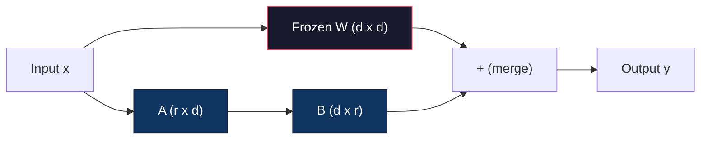
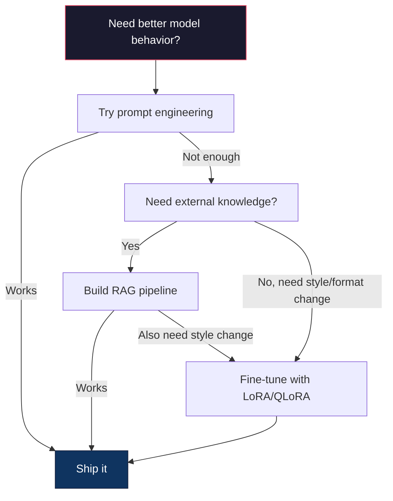

# 使用 LoRA 与 QLoRA 进行微调

> 全量微调一个 7B 模型需要 56GB 显存。你没有那么多显存，大多数公司也没有。LoRA 让你用 6GB 显存微调同一个模型，只需训练不到 1% 的参数。这并非折中——在大多数任务上它能达到与全量微调相当的质量。整个开源微调生态都建立在这个技巧之上。

**Type:** Build
**Languages:** Python
**Prerequisites:** 第 10 阶段，第 06 课（指令微调 / SFT）
**Time:** 约 75 分钟
**Related:** 第 10 阶段从零实现 SFT/DPO 循环。本课将这些接入 2026 年的 PEFT 工具包(PEFT、TRL、Unsloth、Axolotl、LLaMA-Factory)。

## 学习目标

- 通过向预训练模型的注意力层注入低秩适配器矩阵(A 和 B)来实现 LoRA
- 计算 LoRA 相对全量微调的参数节省：秩为 r、维度为 d_model 时，训练 2*r*d 个参数而非 d^2
- 使用 QLoRA(4-bit 量化的基础模型 + LoRA 适配器)微调模型，使其能装进消费级 GPU 显存
- 将 LoRA 权重合并回基础模型以便部署，并比较使用与不使用适配器时的推理速度

## 问题所在

你有一个基础模型。Llama 3 8B。你希望它以你公司的口吻回答客服工单。SFT 是答案。但 SFT 有成本问题。

全量微调会更新模型中的每一个参数。Llama 3 8B 有 80 亿个参数。在 fp16 下，每个参数占 2 字节。仅加载权重就需要 16GB。训练时，你还需要梯度(16GB)、Adam 的优化器状态(动量 + 方差共 32GB)以及激活值。总计：单个 8B 模型大约需要 56GB 显存。

一块 A100 80GB 勉强能装下。两块 A100 每次实验花费 $3-4/hour on cloud providers. Training for 3 epochs on 50,000 examples takes 6-10 hours. That's $30-40。跑 10 次实验调好超参数，还没部署就已经花了 $400。

放大到 Llama 3 70B,数字就离谱了。仅权重就要 140GB。你需要一个集群。每次实验 $100 以上。

还有更深一层的问题。全量微调会修改模型中的每一个权重。如果你在客服数据上微调，可能会损害模型的通用能力。这叫做灾难性遗忘。模型在你的任务上变好，在其他所有事情上变差。

你需要一种方法：训练更少的参数、占用更少的内存、并且不破坏模型已有的知识。

## 概念

### LoRA:低秩适应

Edward Hu 及其微软的同事于 2021 年 6 月发表了 LoRA。这篇论文的洞察是：微调期间的权重更新具有低内在秩。你不需要更新 4096x4096 权重矩阵中的全部 1670 万个参数。更新中的有用信息可以被一个秩为 16 或 32 的矩阵捕获。

数学如下。标准线性层计算：

```
y = Wx
```

其中 W 是一个 d_out x d_in 矩阵。对于 4096x4096 的注意力投影，即 16,777,216 个参数。

LoRA 冻结 W 并添加一个低秩分解：

```
y = Wx + BAx
```

其中 B 是 (d_out x r),A 是 (r x d_in)。秩 r 远小于 d——通常为 8、16 或 32。

对于 4096x4096 层上的 r=16:
- 原始参数：4096 x 4096 = 16,777,216
- LoRA 参数： (4096 x 16) + (16 x 4096) = 65,536 + 65,536 = 131,072
- 缩减比例： 131,072 / 16,777,216 = 0.78%

你只训练 0.78% 的参数，却获得 95-100% 的质量。



A 用随机高斯初始化。B 初始化为零。这意味着 LoRA 的贡献从零开始——模型从其原始行为开始训练，并逐渐学习适应。

### 缩放因子：Alpha

LoRA 引入了一个缩放因子 alpha,控制低秩更新对输出的影响程度：

```
y = Wx + (alpha / r) * BAx
```

当 alpha = r 时，缩放为 1 倍。当 alpha = 2r(常见的默认值)时，缩放为 2 倍。这个超参数独立于基础学习率，控制 LoRA 路径的学习速率。

实践建议：
- alpha = 2 * rank 是社区常见约定(原论文大多数实验使用 alpha = rank)
- alpha = rank 给出 1 倍缩放，保守但稳定
- 更高的 alpha 意味着每步更大的更新，可以加速收敛，也可能导致不稳定

### 在哪里应用 LoRA

一个 Transformer 有很多线性层。你不需要给所有层都加上 LoRA。原论文测试了不同的组合：

| 目标层 | 可训练参数 (7B) | 质量 |
|--------------|----------------------|---------|
| 仅 q_proj | 4.7M | 良好 |
| q_proj + v_proj | 9.4M | 更好 |
| q_proj + k_proj + v_proj + o_proj | 18.9M | 注意力部分最佳 |
| 所有线性层(注意力 + MLP) | 37.7M | 边际收益，2 倍参数 |

大多数任务的最佳平衡点：q_proj + v_proj。这针对自注意力中的 query 和 value 投影，它们控制模型关注什么以及提取什么信息。添加 MLP 层对代码生成等复杂任务有帮助，但会使参数数量翻倍，在较简单任务上收益递减。

### 秩的选择

秩 r 控制适应的表达能力：

| 秩 | 可训练参数(每层) | 最适合 |
|------|---------------------------|----------|
| 4 | 32,768 | 简单分类、情感分析 |
| 8 | 65,536 | 单领域问答、摘要 |
| 16 | 131,072 | 多领域任务、指令遵循 |
| 32 | 262,144 | 复杂推理、代码生成 |
| 64 | 524,288 | 大多数任务收益递减 |
| 128 | 1,048,576 | 很少有充分理由使用 |

Hu 等人表明，对简单任务 r=4 已经能捕获大部分适应。实践中 r=8 和 r=16 是最常见的选择。超过 r=64 很少能提升质量，反而开始丧失 LoRA 的内存优势。

### QLoRA:4-bit 量化 + LoRA

Tim Dettmers 及其华盛顿大学的同事于 2023 年 5 月发表了 QLoRA。思路：将冻结的基础模型量化为 4-bit 精度，然后在其上附加 fp16 的 LoRA 适配器。

这极大地改变了内存方程：

| 方法 | 权重内存 (7B) | 训练内存 (7B) | 所需 GPU |
|--------|-------------------|---------------------|-------------|
| 全量微调 (fp16) | 14GB | ~56GB | 1x A100 80GB |
| LoRA (fp16 基础) | 14GB | ~18GB | 1x A100 40GB |
| QLoRA (4-bit 基础) | 3.5GB | ~6GB | 1x RTX 3090 24GB |

QLoRA 有三项技术贡献：

**NF4(Normal Float 4-bit)**:一种专为神经网络权重设计的新数据类型。神经网络权重近似服从正态分布。NF4 将其 16 个量化级别置于标准正态分布的分位数上。这对正态分布数据是信息论最优的。它比均匀 4-bit 量化(INT4)或标准 Float4 损失更少信息。

**双重量化**：量化常数本身也占用内存。每 64 个权重块需要一个 fp32 缩放因子(4 字节)。对于 7B 模型，额外占用 0.4GB。双重量化将这些常数量化到 fp8,把开销降到 0.1GB。虽小但积少成多。

**分页优化器**：训练期间，优化器状态(Adam 的动量和方差)在长序列下可能超出 GPU 内存。分页优化器使用 NVIDIA 的统一内存在 GPU 内存耗尽时自动将优化器状态分页到 CPU RAM,需要时再分页回来。这以一些吞吐量为代价防止 OOM 崩溃。

### 质量问题

减少参数或量化基础模型会损害质量吗？多篇论文的结果：

| 方法 | MMLU (5-shot) | MT-Bench | HumanEval |
|--------|--------------|----------|-----------|
| 全量微调 (Llama 2 7B) | 48.3 | 6.72 | 14.6 |
| LoRA r=16 | 47.9 | 6.68 | 14.0 |
| QLoRA r=16 (NF4) | 47.5 | 6.61 | 13.4 |
| QLoRA r=64 (NF4) | 48.1 | 6.70 | 14.2 |

r=16 的 LoRA 在大多数基准上与全量微调相差不到 1%。r=16 的 QLoRA 再损失不到一个百分点。r=64 的 QLoRA 基本上与全量微调持平，而内存减少 90%。

### 现实成本

在 50,000 个样本上微调 Llama 3 8B(3 个 epoch):

| 方法 | GPU | 时间 | 成本 |
|--------|-----|------|------|
| 全量微调 | 2x A100 80GB | 8 小时 | ~$32 |
| LoRA r=16 | 1x A100 40GB | 4 小时 | ~$8 |
| QLoRA r=16 | 1x RTX 4090 24GB | 6 小时 | ~$5 |
| QLoRA r=16 (Unsloth) | 1x RTX 4090 24GB | 2.5 小时 | ~$2 |
| QLoRA r=16 | 1x T4 16GB | 12 小时 | ~$4 |

在单块消费级 GPU 上跑 QLoRA 的成本低于一顿午餐。这就是开源权重微调社区在 2023 年爆发的原因，也是以下每个训练框架在 2026 年默认内置 QLoRA 的原因。

### 2026 年的 PEFT 技术栈

| 框架 | 它是什么 | 何时选择 |
|-----------|-----------|-----------|
| **Hugging Face PEFT** | 标准的 LoRA/QLoRA/DoRA/IA3 库 | 你想要底层控制，且训练循环已建在 `transformers.Trainer` 上 |
| **TRL** | HF 的基于反馈强化的训练器(SFT、DPO、GRPO、PPO、ORPO) | 你在 SFT 之后需要 DPO/GRPO;构建于 PEFT 之上 |
| **Unsloth** | 用 Triton 内核重写的前向/反向传播 | 你想要 2-5 倍加速 + 一半显存占用且无精度损失；支持 Llama/Mistral/Qwen 系列 |
| **Axolotl** | 基于 PEFT + TRL + DeepSpeed + Unsloth 的 YAML 配置封装 | 你想要可复现、版本化的训练运行 |
| **LLaMA-Factory** | PEFT + TRL 之上的 GUI/CLI/API | 你想要零代码微调；支持 100+ 模型家族 |
| **torchtune** | 原生 PyTorch 方案，不依赖 `transformers` | 你想要最小依赖，且你的组织已标准化使用 PyTorch |

经验法则：研究用途或一次性实验 → PEFT。可重复的生产流水线 → Axolotl 并启用 Unsloth 内核。快速抛弃式原型 → LLaMA-Factory。

### 合并适配器

训练完成后，你有两样东西：冻结的基础模型和一个小的 LoRA 适配器(通常 10-100MB)。你可以：

1. **保持分离**：加载基础模型，再加载适配器。为不同任务切换适配器。这就是从一个基础模型服务多个微调变体的方式。

2. **永久合并**：计算 W' = W + (alpha/r) * BA,并将结果保存为新模型。合并后的模型与原模型大小相同。无推理开销。无需管理适配器。

对于服务多个任务(客服适配器、代码适配器、翻译适配器)，保持分离。对于部署单个专用模型，合并。

组合多个适配器的高级合并技术：

- **TIES-Merging**(Yadav 等，2023):修剪小幅值参数，解决符号冲突，然后合并。减少适配器之间的干扰。
- **DARE**(Yu 等，2023):合并前随机丢弃适配器参数并重新缩放剩余部分。在组合能力方面出奇有效。
- **任务算术**：简单地加减适配器权重。将“代码”适配器与“数学”适配器相加，往往能得到两者都擅长的模型。

### 何时不该微调

微调是第三选项，不是第一选项。

**第一：提示工程。** 写更好的系统提示。添加 few-shot 示例。使用思维链。这零成本且只需几分钟。如果提示能达到 80% 的效果，你可能不需要微调。

**第二：RAG。** 如果模型需要了解你的特定数据(文档、知识库、产品目录)，检索比把它固化进权重更便宜、更易维护。见第 06 课。

**第三：微调。** 当你需要模型采用提示无法实现的特定风格、格式或推理模式时使用。当你需要一致的结构化输出时。当你需要将大模型蒸馏为小模型时。当延迟很重要、你负担不起 few-shot 提示带来的额外 token 时。



```figure
lora-params
```

## 动手实现

我们用纯 PyTorch 从零实现 LoRA。不用库。没有魔法。你将构建 LoRA 层，注入模型，训练它，然后把权重合并回去。

### 第 1 步：LoRA 层

```python
import torch
import torch.nn as nn
import math

class LoRALayer(nn.Module):
    def __init__(self, in_features, out_features, rank=8, alpha=16):
        super().__init__()
        self.rank = rank
        self.alpha = alpha
        self.scaling = alpha / rank

        self.A = nn.Parameter(torch.randn(in_features, rank) * (1 / math.sqrt(rank)))
        self.B = nn.Parameter(torch.zeros(rank, out_features))

    def forward(self, x):
        return (x @ self.A @ self.B) * self.scaling
```

A 用缩放后的随机值初始化。B 初始化为零。乘积 BA 从零开始，因此模型以原始行为起步。

### 第 2 步：LoRA 包装的线性层

```python
class LinearWithLoRA(nn.Module):
    def __init__(self, linear, rank=8, alpha=16):
        super().__init__()
        self.linear = linear
        self.lora = LoRALayer(
            linear.in_features, linear.out_features, rank, alpha
        )

        for param in self.linear.parameters():
            param.requires_grad = False

    def forward(self, x):
        return self.linear(x) + self.lora(x)
```

原始线性层被冻结。只有 LoRA 参数(A 和 B)可训练。

### 第 3 步：将 LoRA 注入模型

```python
def inject_lora(model, target_modules, rank=8, alpha=16):
    for param in model.parameters():
        param.requires_grad = False

    lora_layers = {}
    for name, module in model.named_modules():
        if isinstance(module, nn.Linear):
            if any(t in name for t in target_modules):
                parent_name = ".".join(name.split(".")[:-1])
                child_name = name.split(".")[-1]
                parent = dict(model.named_modules())[parent_name]
                lora_linear = LinearWithLoRA(module, rank, alpha)
                setattr(parent, child_name, lora_linear)
                lora_layers[name] = lora_linear
    return lora_layers
```

首先，冻结模型中的每个参数。然后遍历模型树，找到匹配目标名称的线性层，并替换为 LoRA 包装版本。LoRA 的 A 和 B 矩阵是整个模型中仅有的可训练参数。

### 第 4 步：统计参数

```python
def count_parameters(model):
    total = sum(p.numel() for p in model.parameters())
    trainable = sum(p.numel() for p in model.parameters() if p.requires_grad)
    frozen = total - trainable
    return {
        "total": total,
        "trainable": trainable,
        "frozen": frozen,
        "trainable_pct": 100 * trainable / total if total > 0 else 0
    }
```

### 第 5 步：合并权重

```python
def merge_lora_weights(model):
    for name, module in model.named_modules():
        if isinstance(module, LinearWithLoRA):
            with torch.no_grad():
                merged = (
                    module.lora.A @ module.lora.B
                ) * module.lora.scaling
                module.linear.weight.data += merged.T
            parent_name = ".".join(name.split(".")[:-1])
            child_name = name.split(".")[-1]
            if parent_name:
                parent = dict(model.named_modules())[parent_name]
            else:
                parent = model
            setattr(parent, child_name, module.linear)
```

合并后，LoRA 层消失。模型与原模型大小相同，适应已固化在权重中。无推理开销。

### 第 6 步：模拟 QLoRA 量化

```python
def quantize_to_nf4(tensor, block_size=64):
    blocks = tensor.reshape(-1, block_size)
    scales = blocks.abs().max(dim=1, keepdim=True).values / 7.0
    scales = torch.clamp(scales, min=1e-8)
    quantized = torch.round(blocks / scales).clamp(-8, 7).to(torch.int8)
    return quantized, scales

def dequantize_from_nf4(quantized, scales, original_shape):
    dequantized = quantized.float() * scales
    return dequantized.reshape(original_shape)
```

这通过将权重映射到每 64 个一组的块内的 16 个离散级别来模拟 4-bit 量化。生产环境的 QLoRA 使用 bitsandbytes 库在 GPU 上实现真正的 NF4。

### 第 7 步：训练循环

```python
def train_lora(model, data, epochs=5, lr=1e-3, batch_size=4):
    optimizer = torch.optim.AdamW(
        [p for p in model.parameters() if p.requires_grad], lr=lr
    )
    criterion = nn.MSELoss()

    losses = []
    for epoch in range(epochs):
        epoch_loss = 0.0
        n_batches = 0
        indices = torch.randperm(len(data["inputs"]))

        for i in range(0, len(indices), batch_size):
            batch_idx = indices[i:i + batch_size]
            x = data["inputs"][batch_idx]
            y = data["targets"][batch_idx]

            output = model(x)
            loss = criterion(output, y)

            optimizer.zero_grad()
            loss.backward()
            optimizer.step()

            epoch_loss += loss.item()
            n_batches += 1

        avg_loss = epoch_loss / n_batches
        losses.append(avg_loss)

    return losses
```

### 第 8 步：完整演示

```python
def demo():
    torch.manual_seed(42)
    d_model = 256
    n_classes = 10

    model = nn.Sequential(
        nn.Linear(d_model, 512),
        nn.ReLU(),
        nn.Linear(512, 512),
        nn.ReLU(),
        nn.Linear(512, n_classes),
    )

    n_samples = 500
    x = torch.randn(n_samples, d_model)
    y = torch.randint(0, n_classes, (n_samples,))
    y_onehot = torch.zeros(n_samples, n_classes).scatter_(1, y.unsqueeze(1), 1.0)

    data = {"inputs": x, "targets": y_onehot}

    params_before = count_parameters(model)

    lora_layers = inject_lora(
        model, target_modules=["0", "2"], rank=8, alpha=16
    )

    params_after = count_parameters(model)

    losses = train_lora(model, data, epochs=20, lr=1e-3)

    merge_lora_weights(model)
    params_merged = count_parameters(model)

    return {
        "params_before": params_before,
        "params_after": params_after,
        "params_merged": params_merged,
        "losses": losses,
    }
```

演示创建一个小模型，向两层注入 LoRA,训练它，然后把权重合并回去。参数统计从全量可训练降到 LoRA 训练期间的约 1% 可训练，合并后恢复到原始架构。

## 使用它

借助 Hugging Face 生态，在真实模型上使用 LoRA 只需约 20 行代码：

```python
from transformers import AutoModelForCausalLM, AutoTokenizer
from peft import LoraConfig, get_peft_model, TaskType

model = AutoModelForCausalLM.from_pretrained("meta-llama/Llama-3.1-8B")
tokenizer = AutoTokenizer.from_pretrained("meta-llama/Llama-3.1-8B")

lora_config = LoraConfig(
    task_type=TaskType.CAUSAL_LM,
    r=16,
    lora_alpha=32,
    lora_dropout=0.05,
    target_modules=["q_proj", "v_proj"],
)

model = get_peft_model(model, lora_config)
model.print_trainable_parameters()
```

对于 QLoRA,加上 bitsandbytes 量化：

```python
from transformers import BitsAndBytesConfig

bnb_config = BitsAndBytesConfig(
    load_in_4bit=True,
    bnb_4bit_quant_type="nf4",
    bnb_4bit_compute_dtype=torch.bfloat16,
    bnb_4bit_use_double_quant=True,
)

model = AutoModelForCausalLM.from_pretrained(
    "meta-llama/Llama-3.1-8B",
    quantization_config=bnb_config,
    device_map="auto",
)

model = get_peft_model(model, lora_config)
```

就是这样。同样的训练循环。同样的数据流水线。基础模型现在以 4-bit 存放，LoRA 适配器以 fp16 训练，整个流程装进 6GB。

使用 Hugging Face Trainer 训练：

```python
from transformers import TrainingArguments, Trainer
from datasets import load_dataset

dataset = load_dataset("tatsu-lab/alpaca", split="train[:5000]")

training_args = TrainingArguments(
    output_dir="./lora-llama",
    num_train_epochs=3,
    per_device_train_batch_size=4,
    gradient_accumulation_steps=4,
    learning_rate=2e-4,
    fp16=True,
    logging_steps=10,
    save_strategy="epoch",
    optim="paged_adamw_8bit",
)

trainer = Trainer(
    model=model,
    args=training_args,
    train_dataset=dataset,
)

trainer.train()

model.save_pretrained("./lora-adapter")
```

保存的适配器为 10-100MB。基础模型保持不变。你可以在 Hugging Face Hub 上分享适配器，而无需重新分发完整模型。

## 上线它

本课产出：
- `outputs/prompt-lora-advisor.md` —— 一个帮助你针对具体任务决定 LoRA 秩、目标模块和超参数的提示
- `outputs/skill-fine-tuning-guide.md` —— 一个教 agent 何时以及如何微调的决策树的技能

## 练习

1. **秩消融实验。** 用秩 2、4、8、16、32、64 运行演示。绘制最终损失与秩的关系曲线。找出收益递减点——即秩翻倍不再使损失减半的位置。对于 256 维特征的简单分类任务，这个点应在 r=8-16 左右。

2. **目标模块比较。** 修改 inject_lora,分别只针对层 "0"、只针对层 "2"、只针对层 "4",以及三层全部。每个变体训练 20 个 epoch。比较收敛速度和最终损失。这对应实际中选择 q_proj、v_proj 还是所有线性层的决策。

3. **量化误差分析。** 取训练后模型在 quantize_to_nf4 / dequantize_from_nf4 前后的权重矩阵。计算均方误差、最大绝对误差以及原始权重与重建权重之间的相关性。尝试 block_size 为 32、64、128、256 的值。

4. **多适配器服务。** 在数据的不同子集上(偶数索引 vs 奇数索引)训练两个 LoRA 适配器。保存两个适配器。只加载一次基础模型，然后切换适配器，验证每个适配器对相同输入产生不同输出。这就是生产系统从一个基础模型服务多个微调模型的方式。

5. **合并与未合并推理。** 比较 merge_lora_weights 前后 LoRA 模型在相同 100 个输入上的输出。验证输出一致(在 1e-5 的浮点容差内)。然后对两者进行推理速度基准测试——合并后的应略快，因为它是一次矩阵乘法而非两次。

## 关键术语

| 术语 | 人们怎么说 | 实际含义 |
|------|----------------|----------------------|
| LoRA | “高效微调” | 低秩适应：冻结基础权重，训练两个小矩阵 A 和 B,其乘积近似完整的权重更新 |
| QLoRA | “在笔记本上微调” | 量化 LoRA:以 4-bit NF4 加载基础模型，在其上以 fp16 训练 LoRA 适配器，使 7B 微调可在 6GB 显存中完成 |
| 秩 (r) | “模型能学多少” | A 和 B 矩阵的内维度；权衡表达能力与参数数量 |
| Alpha | “LoRA 学习率” | 应用于 LoRA 输出的缩放因子；alpha/r 缩放适应对最终输出的贡献 |
| NF4 | “4-bit 量化” | Normal Float 4:一种 4-bit 数据类型，量化级别位于正态分布的分位数上，对神经网络权重最优 |
| 适配器 | “训练出来的小部分” | 以单独文件保存的 LoRA A 和 B 矩阵(10-100MB),可加载到基础模型的任何副本之上 |
| 目标模块 | “对哪些层做 LoRA” | 注入 LoRA 适配器的特定线性层(q_proj、v_proj 等) |
| 合并 | “固化进去” | 计算 W + (alpha/r) * BA 并替换原始权重，消除推理时的适配器开销 |
| 分页优化器 | “训练时不 OOM” | 当 GPU 内存耗尽时，将优化器状态(Adam 动量、方差)卸载到 CPU |
| 灾难性遗忘 | “微调把其他能力搞坏了” | 更新所有权重导致模型失去之前学到的能力 |

## 延伸阅读

- Hu 等， "LoRA: Low-Rank Adaptation of Large Language Models" (2021) —— 提出低秩分解方法的原论文，在 GPT-3 175B 上测试，秩低至 4
- Dettmers 等， "QLoRA: Efficient Finetuning of Quantized Language Models" (2023) —— 提出 NF4、双重量化和分页优化器，使 65B 模型可在单块 48GB GPU 上微调
- PEFT 库文档 (huggingface.co/docs/peft) —— Hugging Face 生态中 LoRA、QLoRA 及其他参数高效方法的标准库
- Yadav 等， "TIES-Merging: Resolving Interference When Merging Models" (2023) —— 在不降低质量的前提下组合多个 LoRA 适配器的技术
- [Rafailov 等， "Direct Preference Optimization: Your Language Model is Secretly a Reward Model" (NeurIPS 2023)](https://arxiv.org/abs/2305.18290) —— DPO 推导；SFT 之后进行偏好调优的阶段，无需奖励模型。
- [TRL 文档](https://huggingface.co/docs/trl/) —— `SFTTrainer`、`DPOTrainer`、`KTOTrainer` 及其与 PEFT/bitsandbytes/Unsloth 集成接口的官方参考。
- [Unsloth 文档](https://docs.unsloth.ai/) —— 将微调吞吐量翻倍、内存减半的融合内核；TRL 之下的性能层。
- [Axolotl 文档](https://axolotl-ai-cloud.github.io/axolotl/) —— YAML 配置的多 GPU SFT/DPO/QLoRA 训练器；替代手写脚本的 config-as-code 方案。