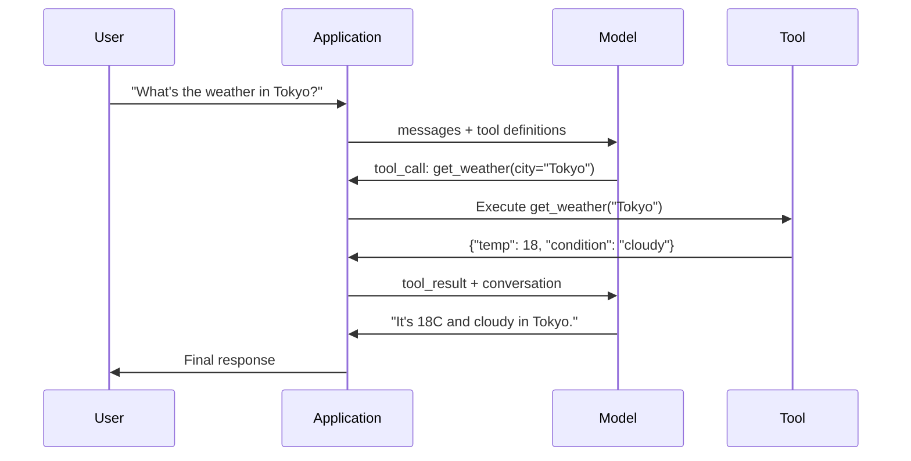

# 函数调用与工具使用

> LLM 不能做任何事情。它们只能生成文本。这就是其全部能力。它们无法查询天气、无法查询数据库、无法发送邮件、无法运行代码、也无法读取文件。你见过的每一个"AI agent"都是一个 LLM 在生成 JSON，说明要调用哪个函数——然后由你的代码真正去调用它。模型是大脑。工具是双手。函数调用是连接两者的神经系统。

**Type:** Build
**Languages:** Python
**Prerequisites:** Phase 11 Lesson 03 (Structured Outputs)
**Time:** ~75 minutes
**Related:** Phase 11 · 14 (Model Context Protocol) — 当一个工具需要跨宿主共享时，从内联函数调用升级到 MCP 服务器。本课涵盖内联方式；MCP 涵盖协议方式。

## 学习目标

- 实现函数调用循环：定义工具 schema、解析模型的工具调用 JSON、执行函数并返回结果
- 设计具有清晰描述和类型化参数的工具 schema，使模型能够可靠地调用
- 构建一个多轮 agent 循环，将多次函数调用串联起来以回答复杂查询
- 处理函数调用的边界情况：并行工具调用、错误传播，以及防止无限工具循环

## 问题

你构建了一个聊天机器人。用户问：“东京现在天气怎么样？”

模型回答：“我无法访问实时天气数据，但根据季节，东京现在大概是 15 摄氏度左右……”

那是一个披着免责声明的幻觉。模型不知道天气。它永远也不会知道。天气每小时都在变化，而模型的训练数据是几个月前的。

正确的答案需要调用 OpenWeatherMap API、获取当前温度并返回真实数值。模型无法调用 API。你的代码可以。缺失的一环是：一个结构化协议，让模型能够说“我需要用这些参数调用天气 API”，并让你的代码执行它、把结果反馈回去。

这就是函数调用。模型输出结构化的 JSON，描述要调用哪个函数以及用什么参数。你的应用执行该函数。结果回到对话中。模型利用结果生成最终答案。

没有函数调用，LLM 只是百科全书。有了它，它们才能成为 agent。

## 概念

### 函数调用循环

每一次工具使用交互都遵循同样的 5 步循环。



第 1 步：用户发送消息。第 2 步：模型收到消息以及工具定义（描述可用函数的 JSON Schema）。第 3 步：模型不返回文本，而是输出一个工具调用——一个包含函数名和参数的结构化 JSON 对象。第 4 步：你的代码执行该函数并捕获结果。第 5 步：结果返回给模型，此时模型拥有真实数据来生成最终答案。

模型从不执行任何东西。它只决定调用什么以及用什么参数。你的代码才是执行者。

### 工具定义：JSON Schema 契约

每个工具由一个 JSON Schema 定义，它告诉模型该函数做什么、接受哪些参数、以及这些参数必须是什么类型。

```json
{
  "type": "function",
  "function": {
    "name": "get_weather",
    "description": "Get current weather for a city. Returns temperature in Celsius and conditions.",
    "parameters": {
      "type": "object",
      "properties": {
        "city": {
          "type": "string",
          "description": "City name, e.g. 'Tokyo' or 'San Francisco'"
        },
        "units": {
          "type": "string",
          "enum": ["celsius", "fahrenheit"],
          "description": "Temperature units"
        }
      },
      "required": ["city"]
    }
  }
}
```

`description` 字段至关重要。模型通过阅读它们来决定何时以及如何使用该工具。像"gets weather"这样模糊的描述，产生的工具选择效果会比"Get current weather for a city. Returns temperature in Celsius and conditions."差得多。描述就是用于工具选择的提示词。

### 各提供商对比

所有主要提供商都支持函数调用，但 API 表面各不相同。

| 提供商 | API 参数 | 工具调用格式 | 并行调用 | 强制调用 |
|----------|--------------|-----------------|---------------|----------------|
| OpenAI (GPT-5, o4) | `tools` | `tool_calls[].function` | 是（每轮多个） | `tool_choice="required"` |
| Anthropic (Claude 4.6/4.7) | `tools` | `content[].type="tool_use"` | 是（多个内容块） | `tool_choice={"type":"any"}` |
| Google (Gemini 3) | `function_declarations` | `functionCall` | 是 | `function_calling_config` |
| 开放权重模型 (Llama 4, Qwen3, DeepSeek-V3) | Llama 4 原生支持 `tools`；其他使用 Hermes 或 ChatML | 混合 | 取决于模型 | 基于提示词，或支持时使用 `tool_choice` |

到 2026 年，三大闭源提供商已经收敛到几乎完全相同的基于 JSON Schema 的格式。Llama 4 自带一个与 OpenAI 形状一致的原生 `tools` 字段。开放权重的微调模型仍然各不相同——Hermes 格式（NousResearch）在第三方微调中最常见。对于跨宿主共享的工具，优先选择 MCP（Phase 11 · 14）而非内联函数调用——服务器对所有人都相同。

### 工具选择：auto、required、specific

你可以控制模型何时使用工具。

**Auto**（默认）：模型自行决定是调用工具还是直接回答。"What's 2+2?"——直接回答。"What's the weather?"——调用工具。

**Required**：模型必须至少调用一个工具。当你确定用户意图需要工具时使用此模式。防止模型猜测而不是查询真实数据。

**Specific function**：强制模型调用某个特定函数。`tool_choice={"type":"function", "function": {"name": "get_weather"}}` 保证天气工具被调用，无论查询是什么。用于路由场景——当上游逻辑已经确定了需要哪个工具时。

### 并行函数调用

GPT-4o 和 Claude 可以在单轮中调用多个函数。用户问：“东京和纽约的天气怎么样？”模型同时输出两个工具调用：

```json
[
  {"name": "get_weather", "arguments": {"city": "Tokyo"}},
  {"name": "get_weather", "arguments": {"city": "New York"}}
]
```

你的代码执行两者（理想情况下并发执行），返回两个结果，模型再综合成一个响应。这将往返次数从 2 次减少到 1 次。对于每个查询需要 5-10 次工具调用的 agent，并行调用可将延迟降低 60-80%。

### 结构化输出 vs 函数调用

Lesson 03 讲了结构化输出。函数调用使用同样的 JSON Schema 机制，但目的不同。

**结构化输出**：强制模型生成特定形状的数据。输出就是最终产品。例如：从文本中提取产品信息为 `{name, price, in_stock}`。

**函数调用**：模型声明一个执行某个动作的意图。输出是中间步骤。例如：`get_weather(city="Tokyo")`——模型是在请求一个动作，而不是产出最终答案。

需要数据提取时用结构化输出。需要模型与外部系统交互时用函数调用。

### 安全性：不可妥协的规则

函数调用是你可以赋予 LLM 的最危险的能力。是模型在决定执行什么。如果你的工具集包含数据库查询，那么查询语句由模型构造。如果它包含 shell 命令，那么命令由模型编写。

**规则 1：绝不将模型生成的 SQL 直接传给数据库。** 模型会且一定会生成 DROP TABLE、UNION 注入或返回全部行的查询。始终参数化。始终校验。始终使用操作白名单。

**规则 2：对函数使用白名单。** 模型只能调用你明确定义的函数。绝不构建“按名称执行任意函数”的通用工具。如果你有 50 个内部函数，只暴露用户需要的那 5 个。

**规则 3：校验参数。** 模型可能传入像 `"; DROP TABLE users; --"` 这样的城市名。在执行前，对照预期的类型、范围和格式校验每个参数。

**规则 4：净化工具结果。** 如果工具返回敏感数据（API 密钥、PII、内部错误），在发回模型之前进行过滤。模型会在响应中原样包含工具结果。

**规则 5：对工具调用进行速率限制。** 处于循环中的模型可能调用工具数百次。设置上限（每个对话 10-20 次调用是合理的）。打断无限循环。

### 错误处理

工具会失败。API 会超时。数据库会宕机。文件不存在。模型需要知道工具何时失败以及为什么失败。

以结构化工具结果的形式返回错误，而不是异常：

```json
{
  "error": true,
  "message": "City 'Toky' not found. Did you mean 'Tokyo'?",
  "code": "CITY_NOT_FOUND"
}
```

模型读取此信息、调整参数并重试。模型善于从结构化的错误信息中进行自我纠正，却不善于从空响应或笼统的"something went wrong"错误中恢复。

### MCP: Model Context Protocol

MCP 是 Anthropic 推出的工具互操作性开放标准。MCP 不让每个应用各自定义工具，而是提供一个通用协议：工具由 MCP 服务器提供，由 MCP 客户端（如 Claude Code、Cursor 或你的应用）消费。

一个 MCP 服务器可以向任何兼容客户端暴露工具。一个 Postgres MCP 服务器为任何 MCP 兼容的 agent 提供数据库访问。一个 GitHub MCP 服务器为任何 agent 提供仓库访问。工具只定义一次，到处使用。

MCP 之于函数调用，就像 HTTP 之于网络通信。它标准化了传输层，使工具变得可移植。

```figure
mx-tool-call-loop
```

## 动手构建

### 第 1 步：定义工具注册表

构建一个存储工具定义及其实现的注册表。每个工具包含一个 JSON Schema 定义（模型看到的）和一个 Python 函数（你的代码执行的）。

```python
import ast
import json
import math
import time
import hashlib


TOOL_REGISTRY = {}


def register_tool(name, description, parameters, function):
    TOOL_REGISTRY[name] = {
        "definition": {
            "type": "function",
            "function": {
                "name": name,
                "description": description,
                "parameters": parameters,
            },
        },
        "function": function,
    }
```

### 第 2 步：实现 5 个工具

构建一个计算器、天气查询、网页搜索模拟器、文件读取器和代码运行器。

```python
def calculator(expression, precision=2):
    allowed = set("0123456789+-*/.() ")
    if not all(c in allowed for c in expression):
        return {"error": True, "message": f"Invalid characters in expression: {expression}"}
    try:
        result = eval(expression, {"__builtins__": {}}, {"math": math})
        return {"result": round(float(result), precision), "expression": expression}
    except Exception as e:
        return {"error": True, "message": str(e)}


WEATHER_DB = {
    "tokyo": {"temp_c": 18, "condition": "cloudy", "humidity": 72, "wind_kph": 14},
    "new york": {"temp_c": 22, "condition": "sunny", "humidity": 45, "wind_kph": 8},
    "london": {"temp_c": 12, "condition": "rainy", "humidity": 88, "wind_kph": 22},
    "san francisco": {"temp_c": 16, "condition": "foggy", "humidity": 80, "wind_kph": 18},
    "sydney": {"temp_c": 25, "condition": "sunny", "humidity": 55, "wind_kph": 10},
}


def get_weather(city, units="celsius"):
    key = city.lower().strip()
    if key not in WEATHER_DB:
        suggestions = [c for c in WEATHER_DB if c.startswith(key[:3])]
        return {
            "error": True,
            "message": f"City '{city}' not found.",
            "suggestions": suggestions,
            "code": "CITY_NOT_FOUND",
        }
    data = WEATHER_DB[key].copy()
    if units == "fahrenheit":
        data["temp_f"] = round(data["temp_c"] * 9 / 5 + 32, 1)
        del data["temp_c"]
    data["city"] = city
    return data


SEARCH_DB = {
    "python function calling": [
        {"title": "OpenAI Function Calling Guide", "url": "https://platform.openai.com/docs/guides/function-calling", "snippet": "Learn how to connect LLMs to external tools."},
        {"title": "Anthropic Tool Use", "url": "https://docs.anthropic.com/en/docs/tool-use", "snippet": "Claude can interact with external tools and APIs."},
    ],
    "MCP protocol": [
        {"title": "Model Context Protocol", "url": "https://modelcontextprotocol.io", "snippet": "An open standard for connecting AI models to data sources."},
    ],
    "weather API": [
        {"title": "OpenWeatherMap API", "url": "https://openweathermap.org/api", "snippet": "Free weather API with current, forecast, and historical data."},
    ],
}


def web_search(query, max_results=3):
    key = query.lower().strip()
    for db_key, results in SEARCH_DB.items():
        if db_key in key or key in db_key:
            return {"query": query, "results": results[:max_results], "total": len(results)}
    return {"query": query, "results": [], "total": 0}


FILE_SYSTEM = {
    "data/config.json": '{"model": "gpt-4o", "temperature": 0.7, "max_tokens": 4096}',
    "data/users.csv": "name,email,role\nAlice,alice@example.com,admin\nBob,bob@example.com,user",
    "README.md": "# My Project\nA tool-use agent built from scratch.",
}


def read_file(path):
    if ".." in path or path.startswith("/"):
        return {"error": True, "message": "Path traversal not allowed.", "code": "FORBIDDEN"}
    if path not in FILE_SYSTEM:
        available = list(FILE_SYSTEM.keys())
        return {"error": True, "message": f"File '{path}' not found.", "available_files": available, "code": "NOT_FOUND"}
    content = FILE_SYSTEM[path]
    return {"path": path, "content": content, "size_bytes": len(content), "lines": content.count("\n") + 1}


def run_code(code, language="python"):
    if language != "python":
        return {"error": True, "message": f"Language '{language}' not supported. Only 'python' is available."}
    try:
        tree = ast.parse(code)
    except SyntaxError as e:
        return {"error": True, "message": f"SyntaxError: {e}", "code": "SYNTAX_ERROR"}
    unsafe_names = {"exec", "eval", "compile", "__import__", "open", "globals", "locals", "vars", "getattr", "setattr", "delattr"}
    for node in ast.walk(tree):
        if isinstance(node, (ast.Import, ast.ImportFrom)):
            return {"error": True, "message": "Forbidden operation: import is not allowed", "code": "SECURITY_VIOLATION"}
        if isinstance(node, ast.Attribute) and node.attr.startswith("__") and node.attr.endswith("__"):
            return {"error": True, "message": "Forbidden operation: dunder attribute access is not allowed", "code": "SECURITY_VIOLATION"}
        if isinstance(node, ast.Name) and node.id in unsafe_names:
            return {"error": True, "message": f"Forbidden operation: {node.id} is not allowed", "code": "SECURITY_VIOLATION"}
    try:
        local_vars = {}
        exec(code, {"__builtins__": {"print": print, "range": range, "len": len, "str": str, "int": int, "float": float, "list": list, "dict": dict, "sum": sum, "min": min, "max": max, "abs": abs, "round": round, "sorted": sorted, "enumerate": enumerate, "zip": zip, "map": map, "filter": filter, "math": math}}, local_vars)
        result = local_vars.get("result", None)
        return {"success": True, "result": result, "variables": {k: str(v) for k, v in local_vars.items() if not k.startswith("_")}}
    except Exception as e:
        return {"error": True, "message": f"{type(e).__name__}: {e}"}
```

按字符串过滤只是把代码当作文本检查，凡是没有逐字匹配黑名单的写法都可能漏掉。将代码解析为抽象语法树并遍历节点，就可以根据结构拒绝 `import` 语句、双下划线属性访问（例如通过 `__class__` 和 `__globals__` 触及真实解释器的路径），以及不安全的内置函数名。不过，这只能作为教学用过滤器，不能当作真正的安全边界。进程内的检查器与被执行代码共享解释器，执意绕过限制的调用者仍可能找到可访问的对象。生产系统应在独立进程或容器中运行不可信代码，例如降权的子进程、gVisor、Firecracker 或托管代码运行器。这样即使发生逃逸，攻击者进入的也是可丢弃的隔离环境，而不是你的服务。

### 第 3 步：注册所有工具

```python
def register_all_tools():
    register_tool(
        "calculator", "Evaluate a mathematical expression. Supports +, -, *, /, parentheses, and decimals. Returns the numeric result.",
        {"type": "object", "properties": {"expression": {"type": "string", "description": "Math expression, e.g. '(10 + 5) * 3'"}, "precision": {"type": "integer", "description": "Decimal places in result", "default": 2}}, "required": ["expression"]},
        calculator,
    )
    register_tool(
        "get_weather", "Get current weather for a city. Returns temperature, condition, humidity, and wind speed.",
        {"type": "object", "properties": {"city": {"type": "string", "description": "City name, e.g. 'Tokyo' or 'San Francisco'"}, "units": {"type": "string", "enum": ["celsius", "fahrenheit"], "description": "Temperature units, defaults to celsius"}}, "required": ["city"]},
        get_weather,
    )
    register_tool(
        "web_search", "Search the web for information. Returns a list of results with title, URL, and snippet.",
        {"type": "object", "properties": {"query": {"type": "string", "description": "Search query"}, "max_results": {"type": "integer", "description": "Maximum results to return", "default": 3}}, "required": ["query"]},
        web_search,
    )
    register_tool(
        "read_file", "Read the contents of a file. Returns the file content, size, and line count.",
        {"type": "object", "properties": {"path": {"type": "string", "description": "Relative file path, e.g. 'data/config.json'"}}, "required": ["path"]},
        read_file,
    )
    register_tool(
        "run_code", "Run a small Python snippet behind a static-analysis guard and a restricted interpreter. This is a teaching filter, not real isolation. Set a 'result' variable to return output.",
        {"type": "object", "properties": {"code": {"type": "string", "description": "Python code to execute"}, "language": {"type": "string", "enum": ["python"], "description": "Programming language"}}, "required": ["code"]},
        run_code,
    )
```

### 第 4 步：构建函数调用循环

这是核心引擎。它模拟模型决定调用哪个工具、执行该工具，并将结果反馈回去。

```python
def simulate_model_decision(user_message, tools, conversation_history):
    msg = user_message.lower()

    if any(word in msg for word in ["weather", "temperature", "forecast"]):
        cities = []
        for city in WEATHER_DB:
            if city in msg:
                cities.append(city)
        if not cities:
            for word in msg.split():
                if word.capitalize() in [c.title() for c in WEATHER_DB]:
                    cities.append(word)
        if not cities:
            cities = ["tokyo"]
        calls = []
        for city in cities:
            calls.append({"name": "get_weather", "arguments": {"city": city.title()}})
        return calls

    if any(word in msg for word in ["calculate", "compute", "math", "what is", "how much"]):
        for token in msg.split():
            if any(c in token for c in "+-*/"):
                return [{"name": "calculator", "arguments": {"expression": token}}]
        if "+" in msg or "-" in msg or "*" in msg or "/" in msg:
            expr = "".join(c for c in msg if c in "0123456789+-*/.() ")
            if expr.strip():
                return [{"name": "calculator", "arguments": {"expression": expr.strip()}}]
        return [{"name": "calculator", "arguments": {"expression": "0"}}]

    if any(word in msg for word in ["search", "find", "look up", "google"]):
        query = msg.replace("search for", "").replace("look up", "").replace("find", "").strip()
        return [{"name": "web_search", "arguments": {"query": query}}]

    if any(word in msg for word in ["read", "file", "open", "cat", "show"]):
        for path in FILE_SYSTEM:
            if path.split("/")[-1].split(".")[0] in msg:
                return [{"name": "read_file", "arguments": {"path": path}}]
        return [{"name": "read_file", "arguments": {"path": "README.md"}}]

    if any(word in msg for word in ["run", "execute", "code", "python"]):
        return [{"name": "run_code", "arguments": {"code": "result = 'Hello from the sandbox!'", "language": "python"}}]

    return []


def execute_tool_call(tool_call):
    name = tool_call["name"]
    args = tool_call["arguments"]

    if name not in TOOL_REGISTRY:
        return {"error": True, "message": f"Unknown tool: {name}", "code": "UNKNOWN_TOOL"}

    tool = TOOL_REGISTRY[name]
    func = tool["function"]
    start = time.time()

    try:
        result = func(**args)
    except TypeError as e:
        result = {"error": True, "message": f"Invalid arguments: {e}"}

    elapsed_ms = round((time.time() - start) * 1000, 2)
    return {"tool": name, "result": result, "execution_time_ms": elapsed_ms}


def run_function_calling_loop(user_message, max_iterations=5):
    conversation = [{"role": "user", "content": user_message}]
    tool_definitions = [t["definition"] for t in TOOL_REGISTRY.values()]
    all_tool_results = []

    for iteration in range(max_iterations):
        tool_calls = simulate_model_decision(user_message, tool_definitions, conversation)

        if not tool_calls:
            break

        results = []
        for call in tool_calls:
            result = execute_tool_call(call)
            results.append(result)

        conversation.append({"role": "assistant", "content": None, "tool_calls": tool_calls})

        for result in results:
            conversation.append({"role": "tool", "content": json.dumps(result["result"]), "tool_name": result["tool"]})

        all_tool_results.extend(results)
        break

    return {"conversation": conversation, "tool_results": all_tool_results, "iterations": iteration + 1 if tool_calls else 0}
```

### 第 5 步：参数校验

构建一个校验器，在执行前根据 JSON Schema 检查工具调用参数。

```python
def validate_tool_arguments(tool_name, arguments):
    if tool_name not in TOOL_REGISTRY:
        return [f"Unknown tool: {tool_name}"]

    schema = TOOL_REGISTRY[tool_name]["definition"]["function"]["parameters"]
    errors = []

    if not isinstance(arguments, dict):
        return [f"Arguments must be an object, got {type(arguments).__name__}"]

    for required_field in schema.get("required", []):
        if required_field not in arguments:
            errors.append(f"Missing required argument: {required_field}")

    properties = schema.get("properties", {})
    for arg_name, arg_value in arguments.items():
        if arg_name not in properties:
            errors.append(f"Unknown argument: {arg_name}")
            continue

        prop_schema = properties[arg_name]
        expected_type = prop_schema.get("type")

        type_checks = {"string": str, "integer": int, "number": (int, float), "boolean": bool, "array": list, "object": dict}
        if expected_type in type_checks:
            if not isinstance(arg_value, type_checks[expected_type]):
                errors.append(f"Argument '{arg_name}': expected {expected_type}, got {type(arg_value).__name__}")

        if "enum" in prop_schema and arg_value not in prop_schema["enum"]:
            errors.append(f"Argument '{arg_name}': '{arg_value}' not in {prop_schema['enum']}")

    return errors
```

### 第 6 步：运行演示

```python
def run_demo():
    register_all_tools()

    print("=" * 60)
    print("  Function Calling & Tool Use Demo")
    print("=" * 60)

    print("\n--- Registered Tools ---")
    for name, tool in TOOL_REGISTRY.items():
        desc = tool["definition"]["function"]["description"][:60]
        params = list(tool["definition"]["function"]["parameters"].get("properties", {}).keys())
        print(f"  {name}: {desc}...")
        print(f"    params: {params}")

    print(f"\n--- Argument Validation ---")
    validation_tests = [
        ("get_weather", {"city": "Tokyo"}, "Valid call"),
        ("get_weather", {}, "Missing required arg"),
        ("get_weather", {"city": "Tokyo", "units": "kelvin"}, "Invalid enum value"),
        ("calculator", {"expression": 123}, "Wrong type (int for string)"),
        ("unknown_tool", {"x": 1}, "Unknown tool"),
    ]
    for tool_name, args, label in validation_tests:
        errors = validate_tool_arguments(tool_name, args)
        status = "VALID" if not errors else f"ERRORS: {errors}"
        print(f"  {label}: {status}")

    print(f"\n--- Tool Execution ---")
    direct_tests = [
        {"name": "calculator", "arguments": {"expression": "(10 + 5) * 3 / 2"}},
        {"name": "get_weather", "arguments": {"city": "Tokyo"}},
        {"name": "get_weather", "arguments": {"city": "Mars"}},
        {"name": "web_search", "arguments": {"query": "python function calling"}},
        {"name": "read_file", "arguments": {"path": "data/config.json"}},
        {"name": "read_file", "arguments": {"path": "../etc/passwd"}},
        {"name": "run_code", "arguments": {"code": "result = sum(range(1, 101))"}},
        {"name": "run_code", "arguments": {"code": "import os; os.system('rm -rf /')"}},
    ]
    for call in direct_tests:
        result = execute_tool_call(call)
        print(f"\n  {call['name']}({json.dumps(call['arguments'])})")
        print(f"    -> {json.dumps(result['result'], indent=None)[:100]}")
        print(f"    time: {result['execution_time_ms']}ms")

    print(f"\n--- Full Function Calling Loop ---")
    test_queries = [
        "What's the weather in Tokyo?",
        "Calculate (100 + 250) * 0.15",
        "Search for MCP protocol",
        "Read the config file",
        "Run some Python code",
        "Tell me a joke",
    ]
    for query in test_queries:
        print(f"\n  User: {query}")
        result = run_function_calling_loop(query)
        if result["tool_results"]:
            for tr in result["tool_results"]:
                print(f"    Tool: {tr['tool']} ({tr['execution_time_ms']}ms)")
                print(f"    Result: {json.dumps(tr['result'], indent=None)[:90]}")
        else:
            print(f"    [No tool called -- direct response]")
        print(f"    Iterations: {result['iterations']}")

    print(f"\n--- Parallel Tool Calls ---")
    multi_city_query = "What's the weather in tokyo and london?"
    print(f"  User: {multi_city_query}")
    result = run_function_calling_loop(multi_city_query)
    print(f"  Tool calls made: {len(result['tool_results'])}")
    for tr in result["tool_results"]:
        city = tr["result"].get("city", "unknown")
        temp = tr["result"].get("temp_c", "N/A")
        print(f"    {city}: {temp}C, {tr['result'].get('condition', 'N/A')}")

    print(f"\n--- Security Checks ---")
    security_tests = [
        ("read_file", {"path": "../../etc/passwd"}),
        ("run_code", {"code": "import subprocess; subprocess.run(['ls'])"}),
        ("calculator", {"expression": "__import__('os').system('ls')"}),
    ]
    for tool_name, args in security_tests:
        result = execute_tool_call({"name": tool_name, "arguments": args})
        blocked = result["result"].get("error", False)
        print(f"  {tool_name}({list(args.values())[0][:40]}): {'BLOCKED' if blocked else 'ALLOWED'}")
```

## 实际使用

### OpenAI 函数调用

```python
# from openai import OpenAI
#
# client = OpenAI()
#
# tools = [{
#     "type": "function",
#     "function": {
#         "name": "get_weather",
#         "description": "Get current weather for a city",
#         "parameters": {
#             "type": "object",
#             "properties": {
#                 "city": {"type": "string"},
#                 "units": {"type": "string", "enum": ["celsius", "fahrenheit"]}
#             },
#             "required": ["city"]
#         }
#     }
# }]
#
# response = client.chat.completions.create(
#     model="gpt-4o",
#     messages=[{"role": "user", "content": "Weather in Tokyo?"}],
#     tools=tools,
#     tool_choice="auto",
# )
#
# tool_call = response.choices[0].message.tool_calls[0]
# args = json.loads(tool_call.function.arguments)
# result = get_weather(**args)
#
# final = client.chat.completions.create(
#     model="gpt-4o",
#     messages=[
#         {"role": "user", "content": "Weather in Tokyo?"},
#         response.choices[0].message,
#         {"role": "tool", "tool_call_id": tool_call.id, "content": json.dumps(result)},
#     ],
# )
# print(final.choices[0].message.content)
```

OpenAI 将工具调用作为 `response.choices[0].message.tool_calls` 返回。每个调用都有一个 `id`，你在返回结果时必须包含它。模型用这个 ID 将结果与调用匹配。GPT-4o 可以在单个响应中返回多个工具调用——遍历并执行所有调用。

### Anthropic 工具使用

```python
# import anthropic
#
# client = anthropic.Anthropic()
#
# response = client.messages.create(
#     model="claude-sonnet-5",
#     max_tokens=1024,
#     tools=[{
#         "name": "get_weather",
#         "description": "Get current weather for a city",
#         "input_schema": {
#             "type": "object",
#             "properties": {
#                 "city": {"type": "string"},
#                 "units": {"type": "string", "enum": ["celsius", "fahrenheit"]}
#             },
#             "required": ["city"]
#         }
#     }],
#     messages=[{"role": "user", "content": "Weather in Tokyo?"}],
# )
#
# tool_block = next(b for b in response.content if b.type == "tool_use")
# result = get_weather(**tool_block.input)
#
# final = client.messages.create(
#     model="claude-sonnet-5",
#     max_tokens=1024,
#     tools=[...],
#     messages=[
#         {"role": "user", "content": "Weather in Tokyo?"},
#         {"role": "assistant", "content": response.content},
#         {"role": "user", "content": [{"type": "tool_result", "tool_use_id": tool_block.id, "content": json.dumps(result)}]},
#     ],
# )
```

Anthropic 将工具调用作为带有 `type: "tool_use"` 的内容块返回。工具结果放在带有 `type: "tool_result"` 的用户消息中。注意关键区别：Anthropic 使用 `input_schema` 定义工具参数，而 OpenAI 使用 `parameters`。

### MCP 集成

```python
# MCP servers expose tools over a standardized protocol.
# Any MCP-compatible client can discover and call these tools.
#
# Example: connecting to a Postgres MCP server
#
# from mcp import ClientSession, StdioServerParameters
# from mcp.client.stdio import stdio_client
#
# server_params = StdioServerParameters(
#     command="npx",
#     args=["-y", "@modelcontextprotocol/server-postgres", "postgresql://localhost/mydb"],
# )
#
# async with stdio_client(server_params) as (read, write):
#     async with ClientSession(read, write) as session:
#         await session.initialize()
#         tools = await session.list_tools()
#         result = await session.call_tool("query", {"sql": "SELECT count(*) FROM users"})
```

MCP 将工具实现与工具消费解耦。Postgres 服务器懂 SQL。GitHub 服务器懂它的 API。你的 agent 只需发现并调用工具——它不需要为每个集成编写特定于提供商的代码。

## 上线交付

本课产出 `outputs/prompt-tool-designer.md`——一个可复用的提示词模板，用于设计工具定义。给它一份关于你希望工具做什么的描述，它就会生成完整的 JSON Schema 定义，包含描述、类型和约束。

它还产出 `outputs/skill-function-calling-patterns.md`——一个在生产环境中实现函数调用的决策框架，涵盖工具设计、错误处理、安全性和特定于提供商的模式。

## 练习

1. **添加第 6 个工具：数据库查询。** 用内存表实现一个模拟的 SQL 工具。该工具接受表名和过滤条件（而非原始 SQL）。校验表名在白名单中，且过滤运算符仅限于 `=`、`>`、`<`、`>=`、`<=`。将匹配的行以 JSON 返回。

2. **实现带错误反馈的重试。** 当工具调用失败时（例如找不到城市），将错误信息反馈给模型决策函数，让它修正参数。记录每次调用的重试次数。每次工具调用最多重试 3 次。

3. **构建一个多步 agent。** 有些查询需要串联工具调用："Read the config file and tell me what model is configured, then search the web for that model's pricing."实现一个循环，一直运行到模型判断不再需要工具为止，并将累积的结果传入每一步决策。限制为 10 次迭代以防止无限循环。

4. **测量工具选择准确率。** 创建 30 条带有预期工具名的测试查询。在全部 30 条上运行你的决策函数，测量选中正确工具的百分比。找出哪些查询最容易在工具之间造成混淆。

5. **实现工具调用缓存。** 如果同一工具在 60 秒内以相同参数被调用，则返回缓存结果而非重新执行。使用以 `(tool_name, frozenset(args.items()))` 为键的字典。测量一个包含 20 条查询的对话中的缓存命中率。

## 关键术语

| 术语 | 人们怎么说 | 实际含义 |
|------|----------------|----------------------|
| 函数调用 | "Tool use" | 模型输出结构化 JSON，描述要调用的函数及具体参数——由你的代码执行，而非模型 |
| 工具定义 | "Function schema" | 一个 JSON Schema 对象，描述工具的名称、用途、参数和类型——模型据此决定何时以及如何使用该工具 |
| 工具选择 | "Calling mode" | 控制模型必须调用工具（required）、可以调用工具（auto）、还是必须调用特定工具（named） |
| 并行调用 | "Multi-tool" | 模型在单轮中输出多个工具调用，减少往返次数——GPT-4o 和 Claude 都支持此功能 |
| 工具结果 | "Function output" | 执行工具的返回值，作为消息发回模型，使其能在响应中使用真实数据 |
| 参数校验 | "Input checking" | 在执行工具前，验证模型生成的参数是否符合预期的类型、范围和约束 |
| MCP | "Tool protocol" | Model Context Protocol——Anthropic 的开放标准，通过服务器暴露工具，任何兼容客户端都可以发现并调用 |
| Agent 循环 | "ReAct loop" | 模型决定工具、代码执行工具、结果反馈回来的迭代循环，直到模型拥有足够信息作出响应 |
| 工具投毒 | "Prompt injection via tools" | 一种攻击，工具结果中包含操纵模型行为的指令——必须净化所有工具输出 |
| 速率限制 | "Call budget" | 设置每个对话的工具调用次数上限，以防止无限循环和失控的 API 开销 |

## 延伸阅读

- [OpenAI 函数调用指南](https://platform.openai.com/docs/guides/function-calling)——GPT-4o 工具使用的权威参考，包括并行调用、强制调用和结构化参数
- [Anthropic 工具使用指南](https://docs.anthropic.com/en/docs/tool-use)——Claude 的工具使用实现，包含 input_schema、多工具响应和 tool_choice 配置
- [Model Context Protocol 规范](https://modelcontextprotocol.io)——跨 AI 应用的工具互操作性开放标准，采用服务器/客户端架构
- [Schick et al., 2023 — "Toolformer: Language Models Can Teach Themselves to Use Tools"](https://arxiv.org/abs/2302.04761)——训练 LLM 决定何时以及如何调用外部工具的开创性论文
- [Patil et al., 2023 — "Gorilla: Large Language Model Connected with Massive APIs"](https://arxiv.org/abs/2305.15334)——针对 1,645 个 API 微调 LLM 以实现准确的 API 调用，并减少幻觉
- [Berkeley Function Calling Leaderboard](https://gorilla.cs.berkeley.edu/leaderboard.html)——实时基准测试，比较 GPT-4o、Claude、Gemini 和开放模型之间的函数调用准确率
- [Yao et al., "ReAct: Synergizing Reasoning and Acting in Language Models" (ICLR 2023)](https://arxiv.org/abs/2210.03629)——思想-行动-观察（Thought-Action-Observation）循环，它是围绕每次工具调用的外层 agent 循环；本课到此为止，Phase 14 接着展开。
- [Anthropic — Building effective agents (2024 年 12 月)](https://www.anthropic.com/research/building-effective-agents)——从单一的工具使用原语构建的五种可组合模式（提示词串联、路由、并行化、协调者-工作者、评估者-优化者）。