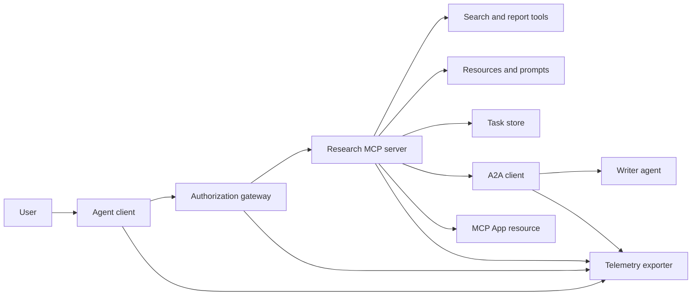
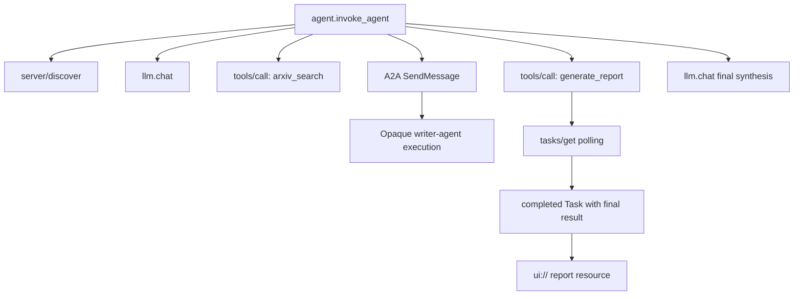
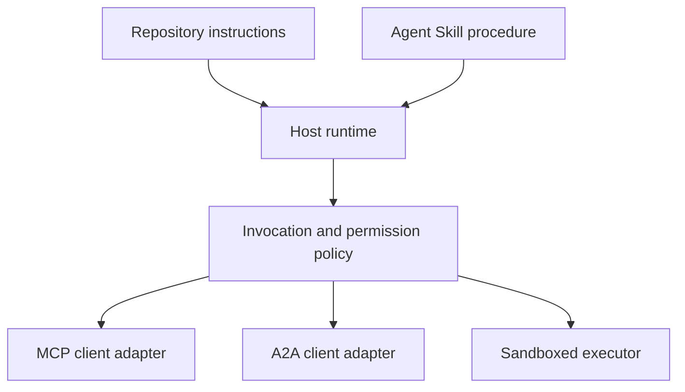

# 毕业项目：无状态工具生态系统

> 生产级 agent 系统是一组边界，而不是一堆功能的堆砌。本毕业项目将一个可读的进程内模拟与真实部署仍需要的协议客户端、授权服务器、沙箱以及遥测导出器区分开来。

**Type:** Build
**Languages:** Python (stdlib, in-process simulation)
**Prerequisites:** 阶段 13 的 01 至 22 课，使用 MCP 修订版 `2026-07-28`
**Time:** ~120 分钟

## 学习目标

- 将工具调用、任务形态的结果、委托工作、UI 资源、授权策略以及追踪记录组合成一个流程。
- 在每个 MCP 请求上携带协议版本、客户端身份和能力，而不是依赖连接会话。
- 使用前先发现服务器，并通过官方 Tasks 扩展驱动长时任务。
- 区分协议形态的模拟与 MCP、A2A、OAuth 或 OpenTelemetry 的实现。
- 将每个模拟的边界映射到生产环境中必须替换它的组件。
- 使 `AGENTS.md`、Agent Skill、运行时适配器、工具和安全策略各自保持正确的角色。
- 说明哪些断言可以从本地输出验证，哪些需要真实集成测试。

## 问题

设计一个研究并生成报告的系统。用户请求查找关于 agent 协议的论文。系统搜索论文目录，委托摘要任务，生成报告，返回一个 UI 资源，并记录整个系统中的路径。

这句话隐藏了若干独立的契约：

- 一个面向模型的工具 schema；
- 一个无状态请求信封和服务器发现契约；
- 一个针对参与者、作用域和工具身份的网关决策；
- 一个长时操作契约；
- 一个委托协议；
- 一个宿主与应用之间的桥接；
- 追踪传播与导出；
- 一个可复用的操作规程。

`code/main.py` 使用普通的 Python 函数和字典使这些边界保持可见。它不会打开传输连接、联系 arXiv、执行 OAuth、调用 A2A 服务器、渲染 MCP App 或导出遥测数据。这使得控制流易于检查，同时不会把模拟伪装成合规服务。

## 概念

### 目标架构



该架构是对公开协议模式的概念性组合。它不是对任何产品私有内部实现的断言。

### 目标追踪



在真实实现中，每一跳都要传播追踪上下文。Span 名称和属性必须遵循所选检测版本支持的 OpenTelemetry 语义约定。仅有共享的追踪标识符并不能证明正确的父子关系、导出或后端摄取。

### 当前协议表面

使用当前协议定义的方法名，而不是从旧草案中记住的名称：

| 边界 | 当前表面 | 毕业项目模拟的内容 |
|---|---|---|
| MCP 发现 | 强制性的 `server/discover` | 一个直接返回版本、能力和服务器身份的函数 |
| MCP 请求上下文 | 每个 `params._meta` 中的版本、能力和客户端身份 | 传递给每个模拟调用的新请求元数据 |
| MCP 工具调用 | `tools/call` | 直接的 Python 函数分发 |
| MCP 任务轮询 | 带 `tasks/get` 的 `io.modelcontextprotocol/tasks` | 一个可用句柄，随后是携带最终结果的已完成任务 |
| A2A 委托 | gRPC 和 JSON-RPC 中的 `SendMessage`；HTTP+JSON 中的 `POST /message:send` | 一个嵌套 span，无远程调用或人为延迟 |
| MCP App 调用服务器工具 | `app.callServerTool({ name, arguments })` | 一个 HTML 字符串，无真实桥接 |
| OAuth 授权 | 授权服务器、受保护资源元数据、受众与作用域验证 | 静态令牌查找和作用域成员检查 |
| OpenTelemetry | SDK、传播器、导出器以及收集器或后端 | 内存中的 span 字典 |

协议名称只是第一层。生产测试必须跨越真实线路检验序列化、认证失败、取消、超时、重试和版本兼容性。

### 无状态 MCP 改变了集成边界

修订版 `2026-07-28` 移除了协议会话以及 `initialize` / `notifications/initialized` 握手。它还移除了 `Mcp-Session-Id`。每个请求都携带以下带命名空间的 `_meta` 字段：

```json
{
  "io.modelcontextprotocol/protocolVersion": "2026-07-28",
  "io.modelcontextprotocol/clientCapabilities": {
    "extensions": {
      "io.modelcontextprotocol/tasks": {}
    }
  },
  "io.modelcontextprotocol/clientInfo": {
    "name": "capstone-client",
    "version": "1.0.0"
  }
}
```

服务器必须实现 `server/discover`。普通结果使用 `resultType: "complete"`；任务句柄使用 `resultType: "task"`。每个结果应在 `_meta.io.modelcontextprotocol/serverInfo` 中标识服务器。

任务扩展包含 `tasks/get`、`tasks/update` 和 `tasks/cancel`。工具可以先返回 `resultType: "task"`；`tasks/get` 本身返回 `resultType: "complete"`，而已完成的 `Task` 包含最终结果。旧的 `tasks/result` 和 `tasks/list` 方法不属于当前扩展。客户端必须在可能收到任务句柄的同一请求中声明 `io.modelcontextprotocol/tasks`。如果不这样做，服务器会返回 `-32021`，其 `requiredCapabilities` 形如缺失的客户端能力对象，包括 `extensions.io.modelcontextprotocol/tasks`。

### 安全态势

预期部署采用纵深防御：

- 在客户端类型要求时使用带 PKCE 的 OAuth 授权；
- 对已签发访问令牌进行资源和受众绑定；
- 网关 RBAC 检查所请求的工具和作用域；
- 上游凭据保存在模型可见上下文之外；
- 一份固定或经审查的工具描述清单；
- 针对不可信输入、敏感数据和后果性行为的双人规则审查；
- 一个执行沙箱，其文件系统、进程、网络、凭据和资源限制在技能之外强制执行。

演示仅实现了静态令牌、作用域检查和描述哈希。它适用于策略流程演示，不适用于安全验证。

### 技能是规程，不是传输

一个 Agent Skill 可以告诉运行时如何执行研究工作流、期望哪些工具契约、保存什么证据以及何时停止。它不能使 MCP 服务器存在、建立 A2A 兼容性、授予作用域或创建沙箱。



当规程引用配套文件时，应交付完整的技能目录。这个较旧毕业项目中的扁平制品是课程蓝图，并不能证明宿主会保留可移植的捆绑包。第 24 至 27 课构建并测试完整的捆绑包生命周期。

### 课程制品元数据是本地适配器

课程目录和安装器识别名为 `skill-*.md` 的扁平文件，但这是仓库约定，而非可移植的 Agent Skills 包契约。它们的最小 frontmatter 解析器只读取顶层键。因此本课将可移植身份字段与课程目录字段保持在同一层级：

```yaml
---
name: ecosystem-blueprint
description: Produce a full Phase 13 ecosystem architecture for a product need.
version: "1.0.0"
phase: "13"
lesson: "23"
tags: [mcp, capstone, ecosystem, architecture, a2a, otel]
---
```

`name` 和 `description` 是可移植身份字段。`version`、`phase`、`lesson` 和 `tags` 是课程专属的目录扩展。课程解析器要求 `tags` 为内联列表，以便 `--tag capstone` 能够匹配它。

可移植的目录型技能可以使用可选的 `metadata` 映射来存放字符串值的扩展数据。这并不意味着 `metadata` 可与本仓库的目录 schema 互换。如果这个扁平文件将 `version` 或 `tags` 嵌套在 `metadata` 之下，最小解析器会跳过这些缩进键，目录会记录空版本，并且标签过滤将无法找到该制品。生产宿主应使用安全的 YAML 解析器并验证自己文档化的 schema。

### 模拟与生产

| 层 | `code/main.py` | 生产替代 | 所需证据 |
|---|---|---|---|
| 发现 | `server_discover()` 加静态 `TOOLS` | `server/discover` 之后进行缓存感知的 `tools/list` | 线路记录、确定性顺序和 schema 验证 |
| 认证 | 以令牌为键的字典 | OAuth 授权与资源服务器验证 | 签发者、受众、作用域、过期与失败测试 |
| 授权 | 作用域成员检查 | 绑定到参与者、工具、目标和租户的网关策略 | 允许与拒绝的审计用例 |
| 搜索 | 静态论文固件 | 搜索 API 或 MCP 服务器 | 来源出处、排序和错误测试 |
| 任务 | 本地句柄加即时 `tasks/get` | 带有 `io.modelcontextprotocol/tasks`、`tasks/get`、`tasks/update`、`tasks/cancel` 和 TTL 的持久化任务存储 | 状态转换、输入、取消和恢复测试 |
| 委托 | 睡眠加嵌套 span | A2A 客户端与远程 Agent Card | 契约、超时、重试和不透明性测试 |
| App | HTML 字符串与 URI | MCP Apps 资源与 `App` 桥接 | CSP、权限、工具调用和浏览器测试 |
| 遥测 | 内存列表 | OTel SDK 与导出器 | 收集器回执与 trace-parent 断言 |
| 沙箱 | 无 | 宿主强制执行的隔离执行器 | 逃逸、出站、机密和资源限制测试 |

这张表就是交接边界。本地全绿的运行只验证模拟本身。

### 阶段 13 地图

| 课程 | 贡献 |
|---|---|
| 01-05 | 工具接口、调用、schema、结构化结果和确定性验证 |
| 06-14 | 无状态 MCP 请求信封、发现、传输、资源、提示、扩展和 Apps |
| 15-18 | 投毒防御、OAuth、网关、注册表和生产认证 |
| 19 | A2A 消息与任务委托 |
| 20 | OpenTelemetry GenAI 追踪设计 |
| 21 | 模型提供商路由 |
| 22 | 可移植技能契约与运行时边界 |

```figure
t3-capstone-chain
```

## 构建它

运行进程内测试工具：

```bash
cd phases/13-tools-and-protocols/23-capstone-tool-ecosystem
python3 code/main.py
```

检查五件事：

1. `server/discover` 声明修订版 `2026-07-28` 和 Tasks 扩展。
2. Alice 可以读取并生成报告，而 Bob 的写作用域调用被拒绝。
3. 编排器一次运行中的每个本地 span 共享同一个追踪标识符并记录父 span 标识符。
4. 报告以任务句柄开始。`tasks/get` 返回一个已完成任务，其最终结果包含文本和 `ui://` 引用。
5. 被委托的写入器保持不透明，因为编排器只记录边界 span。
6. 没有任何输出声称发生了网络连接、OAuth 交换、收集器导出、浏览器渲染或沙箱执行。

脚本运行两次，因此产生两条根追踪。审计条目是进程本地的，并在下一次运行时重置。

## 使用它

一次提升一层：

1. 将 `server_discover()` 和静态工具列表替换为真实的 `server/discover` 和 `tools/list` 调用。在每个请求中发送版本、身份和能力。
2. 用授权服务器和受保护资源验证替换静态令牌。
3. 实现 `io.modelcontextprotocol/tasks` 扩展并测试 `tasks/get`、`tasks/update`、`tasks/cancel`、超时、TTL 和重启恢复。不要添加 `tasks/result` 或 `tasks/list`。
4. 将委托桩替换为解析 Agent Card 并发送消息的 A2A 客户端。
5. 使用官方 SDK 构建 App，并通过 `app.callServerTool` 调用服务器工具。
6. 将 span 导出到测试收集器，并在接收端断言父子关系。
7. 在第 26 课的沙箱契约内运行工具与脚本执行。
8. 将规程打包为完整的目录捆绑包，并通过第 27 课的发布门禁。

每次提升都需要一个跨越新边界的集成测试。当线路变为真实时，不要删除底层的策略测试。

## 交付它

本课产出 `outputs/skill-ecosystem-blueprint.md`，一个旧式单文件课程制品。它要求一页架构说明，涵盖原语、安全、委托、遥测、打包以及最困难的运营风险。其顶层目录字段由仓库的真实目录和安装器解析器检验。

因为它不是目录捆绑包，所以无法携带引用、脚本、资源或评测固件。在本课程之外发布可复用技能时，请使用第 22 课和第 24 至 27 课的包格式。

## 练习

1. 运行 `code/main.py`。将输出所证明的事实与仍需集成证据的生产断言区分开来。
2. 添加第二个静态后端，并为两个同名工具定义冲突规则。然后将两个列表都替换为真实的 `tools/list` 调用。
3. 将写入器桩替换为 A2A 测试服务器。记录 Agent Card、消息请求、超时路径和返回的制品。
4. 添加一个能在进程重启后存活的任务存储。证明客户端可以用 `tasks/get` 恢复、遵守 `pollIntervalMs`，并在不使用 `tasks/result` 的情况下读取已完成任务的最终结果。
5. 构建一个最小 MCP App，并在具有严格 CSP 和显式权限的浏览器中验证 `app.callServerTool`。
6. 通过 OTel SDK 将模拟的 span 导出到本地收集器。断言回执、追踪标识符、父子关系和错误状态。
7. 为仓库级维护规则编写 `AGENTS.md`，并为可复用的研究规程编写单独的技能捆绑包。解释为什么这两个文件都不授予工具权限。

## 关键术语

| 术语 | 人们的说法 | 实际含义 |
|---|---|---|
| 毕业项目 | “所有东西都接好了” | 一种分阶段集成，其模拟与真实边界保持明确 |
| 协议形态的模拟 | “它基本上就是 MCP” | 本地数据和调用看起来像某协议，但并未实现其线路契约 |
| Tasks 扩展 | “长工具调用” | 一个可选的 `io.modelcontextprotocol/tasks` 生命周期，具有持久身份、轮询、客户端输入、最终结果和取消语义 |
| 不透明性边界 | “另一个 agent 会处理” | 调用方只能看到声明的接口和制品，而非私有推理或内部状态 |
| 运行时适配器 | “技能集成” | 将可移植规程映射到发现、调用、工具、策略和上下文的宿主代码 |
| 集成证据 | “它通过了” | 一份记录、制品或接收端观察结果，证明真实边界已被跨越 |

## 延伸阅读

- [MCP specification 2026-07-28](https://modelcontextprotocol.io/specification/2026-07-28)：无状态请求、发现、工具、授权和传输行为。
- [MCP 2026-07-28 key changes](https://modelcontextprotocol.io/specification/2026-07-28/changelog)：会话移除、每请求元数据、MRTR、扩展和弃用。
- [MCP Tasks extension](https://tasks.extensions.modelcontextprotocol.io/specification/draft/tasks)：`tasks/get`、`tasks/update`、`tasks/cancel` 以及由终态任务携带的最终结果。
- [MCP Apps SDK](https://github.com/modelcontextprotocol/ext-apps/blob/main/docs/overview.md)：`App` 和 `app.callServerTool`。
- [A2A protocol](https://a2a-protocol.org/latest/)：Agent Card、消息投递、任务、制品和传输绑定。
- [OpenTelemetry GenAI semantic conventions](https://opentelemetry.io/docs/specs/semconv/gen-ai/)：追踪与属性约定。
- [Agent Skills specification](https://agentskills.io/specification)：规程层使用的可移植包契约。