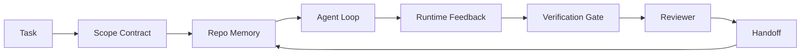

# Agent 工作台工程：为什么能力强的模型仍然会失败

> 一个能力强的模型并不足够。可靠的 agent 需要一个工作台：指令、状态、范围、反馈、验证、评审和交接。把这些剥掉，即使是最前沿的模型产出的工作也无法安全交付。

**Type:** Learn + Build
**Languages:** Python (stdlib)
**Prerequisites:** Phase 14 · 01 (Agent Loop), Phase 14 · 26 (Failure Modes)
**Time:** ~45 minutes

## 学习目标

- 区分模型能力与执行可靠性。
- 说出决定 agent 能否交付的七个工作台面。
- 在一个小型仓库任务上，对比仅用 prompt 的运行与工作台引导的运行。
- 产出一份失败模式报告，将每个缺失的面映射到它导致的症状。

## 问题所在

你把一个前沿模型放进一个真实的仓库，让它添加输入验证。它打开四个文件，写下看似合理的代码，宣告成功，然后停止。你运行测试。两个失败。它还改动了一个与验证毫无关系的第三个文件。没有任何记录说明 agent 做了什么假设、它先尝试了什么、还有什么没做。

模型对 Python 的理解没有错，错在对这项工作的理解。它不知道什么算完成、它被允许在哪里写代码、哪些测试是权威的、下一个会话应该如何接续。

这不是模型 bug，而是工作台 bug。agent 周围的环境缺少那些把一次性生成变成可靠、可恢复的工程实践的部分。

## 概念

工作台是包裹模型、支撑任务执行的操作环境。它有七个面：

| 面 | 承载的内容 | 缺失时的失败 |
|---------|-----------------|----------------------|
| 指令 | 启动规则、禁止操作、完成定义 | Agent 猜测交付意味着什么 |
| 状态 | 当前任务、已改动文件、阻塞项、下一步行动 | 每个会话都从零开始 |
| 范围 | 允许的文件、禁止的文件、验收标准 | 改动泄漏到无关代码 |
| 反馈 | 被捕获进循环的真实命令输出 | Agent 在 400 上宣告成功 |
| 验证 | 测试、lint、冒烟运行、范围检查 | "看起来不错" 进入 main 分支 |
| 评审 | 以不同角色进行的第二次检查 | 构建者给自己的作业打分 |
| 交接 | 改了什么、为什么、还剩什么 | 下一个会话重新发现一切 |

工作台独立于模型。你可以更换模型而保留这些面。你无法更换这些面而保留可靠性。



循环闭合在状态文件上，而不是聊天历史上。聊天是易失的。仓库才是记录系统。

### 工作台 versus prompt 工程

Prompting 告诉模型这一轮你想要什么。工作台告诉模型如何跨轮次、跨会话地开展工作。大多数 agent 失败故事都是穿着 prompt 工程外衣的工作台失败。

### 工作台 versus 框架

框架给你一个运行时(LangGraph、AutoGen、Agents SDK)。工作台给 agent 一个在该运行时内部的工作场所。两者都需要。本迷你课程关注的是第二个。

### 从原语推理，而不是从厂商分类法推理

现在关于 "harness 工程" 的文章很多。Addy Osmani、OpenAI、Anthropic、LangChain、Martin Fowler、MongoDB、HumanLayer、Augment Code、Thoughtworks、walkinglabs awesome 列表，以及源源不断的 Medium 和 Hacker News 帖子都在讨论它。它们对 harness 的边界、范围和术语各有分歧。我们不需要选边站。七个面是一个 UX 层；每个工作台之下都是同一套支撑任何可靠后端的分布式系统原语。

暂时把 agent 标签拿掉。一次 agent 运行是跨越时间、进程和机器的计算。要让它可靠，你需要与任何生产系统相同的原语。

| 原语 | 它是什么 | 对 agent 承载什么 |
|-----------|------------|------------------------------|
| 函数 | 有类型的处理程序。尽可能纯粹。拥有自己的输入和输出。 | 一次工具调用、一次规则检查、一个验证步骤、一次模型调用 |
| 工作进程 | 拥有一个或多个函数及生命周期的长驻进程 | 构建者、评审者、验证者、一个 MCP 服务器 |
| 触发器 | 调用函数的事件源 | Agent 循环节拍、HTTP 请求、队列消息、cron、文件变更、hook |
| 运行时 | 决定什么在哪里运行、使用什么超时和资源的边界 | Claude Code 的进程、LangGraph 的运行时、一个 worker 容器 |
| HTTP / RPC | 调用者与 worker 之间的线路 | 工具调用协议、MCP 请求、模型 API |
| 队列 | 触发器与 worker 之间的持久缓冲；背压、重试、幂等性 | 任务看板、反馈日志、评审收件箱 |
| 会话持久化 | 在崩溃、重启、模型更换后存续的状态 | `agent_state.json`、检查点、KV 存储、仓库本身 |
| 授权策略 | 谁可以用什么范围调用什么函数 | 允许/禁止的文件、审批边界、MCP 能力列表 |

现在把七个工作台面映射到这些原语上。

- **指令** — 策略 + 函数元数据。规则是检查(函数)。路由器(`AGENTS.md`)是附加到运行时启动的策略。
- **状态** — 会话持久化。运行时在每一步都读取的键控存储。文件、KV 或数据库；持久化语义很重要，存储后端不重要。
- **范围** — 每个任务的授权策略。允许/禁止的 glob 是一个 ACL。需要审批的是一个权限格。
- **反馈** — 写入队列的调用日志。每一次 shell 调用都是一条记录，持久、可重放。
- **验证** — 一个函数。对输入是确定性的。在任务关闭时触发。失败即关闭(fail closed)。
- **评审** — 一个独立的工作进程，对构建者产物有只读权限，对评审报告有只写权限。
- **交接** — 由会话结束触发器发出的持久记录。下一个会话的启动触发器读取它。

Agent 循环本身就是一个消费事件(用户消息、工具结果、计时器节拍)、调用函数(模型，然后是模型选择的工具)、写入记录(状态、反馈)并发出触发器(验证、评审、交接)的工作进程。没有什么神秘的；与作业处理器相同的形状。

### 流行模式，翻译为原语

每个流行的 harness 模式都归结为八种原语。翻译表。

| 厂商或社区模式 | 它实际上是什么 |
|------------------------------|--------------------|
| Ralph Loop(Claude Code、Codex、agentic_harness 书)—— 当 agent 试图提前停止时，将原始意图重新注入一个新的上下文窗口 | 一个触发器，用干净的上下文将任务重新入队；会话持久化将目标向前传递 |
| Plan / Execute / Verify(PEV) | 三个 worker,每个角色一个，通过状态和阶段间的队列进行通信 |
| Harness-计算分离(OpenAI Agents SDK,2026年4月)—— 将控制平面与执行平面分离 | 重述控制平面 / 数据平面。比 agent 标签早几十年 |
| Open Agent Passport(OAP,2026年3月)—— 在执行前针对声明式策略签名并审计每一次工具调用 | 由前置动作 worker 强制执行的授权策略，带有签名审计队列 |
| Guides 与 Sensors(Birgitta Böckeler / Thoughtworks)—— 前馈规则 + 反馈可观测性 | 授权策略 + 验证函数 + 可观测性追踪 |
| 渐进压缩，5 阶段(Claude Code 逆向工程，2026年4月) | 一个状态管理 worker,以类 cron 方式在会话持久化上运行，使其保持在预算内 |
| Hooks / 中间件(LangChain、Claude Code)—— 拦截模型和工具调用 | 包裹在运行时调用路径周围的触发器 + 函数 |
| 以 Markdown 形式呈现、具有渐进披露的 Skills(Anthropic、Flue) | 一个函数注册表，其函数元数据按需加载到上下文中 |
| 沙箱 agent(Codex、Sandcastle、Vercel Sandbox) | 计算平面：具有隔离文件系统、网络和生命周期的运行时 |
| MCP 服务器 | 通过稳定 RPC 暴露函数的 worker,以能力列表作为授权 |

表中的每一条都是 agent 社区抵达了一个在分布式系统中已有名称的原语，并给它起了个新名字。作为营销标签很有用；作为工程词汇没有用。

### 凭据实际说了什么

Harness-over-model 的主张现在有了数字支撑。值得了解，因为它们也是对"只需等待更聪明模型"唯一诚实的反驳。

- Terminal Bench 2.0 —— 相同的模型，harness 的改变使一个编码 agent 从前 30 名之外跃升至第五名(LangChain,《Anatomy of an Agent Harness》)。
- Vercel —— 删除了其 agent 80% 的工具；成功率从 80% 跃升至 100%(MongoDB)。
- Harvey —— 法律 agent 仅通过 harness 优化就使准确率翻了一倍多(MongoDB)。
- 88% 的企业 AI agent 项目未能进入生产环境。失败集中在运行时，而不是推理上(preprints.org,《Harness Engineering for Language Agents》,2026年3月)。
- 一项 2025 年针对三个流行开源框架的基准研究报告了约 50% 的任务完成率；长上下文 WebAgent 在长上下文条件下从 40-50% 崩溃至不到 10%，主要由于无限循环和目标丢失(2026 年初的文章中被广泛报道)。

结论不是"harness 永远获胜"。模型确实会随时间吸收 harness 技巧。结论是：今天，承重工程在模型周围，而不是在模型内部，承载这些负荷的原语正是每个生产系统一直需要的。

### 厂商文章在哪里止步不前

这一部分你不需要客气。

- LangChain 的《Anatomy of an Agent Harness》列举了十一个组件——prompts、tools、hooks、sandboxes、orchestration、memory、skills、subagents，以及一个运行时"哑循环"。它没有命名队列、作为部署单元的 worker、触发器语义、作为独立关注点的会话持久化，或授权策略。它把 harness 视为你配置的对象，而不是你部署的系统。
- Addy Osmani 的《Agent Harness Engineering》确立了 `Agent = Model + Harness` 的框架和棘轮模式，但没有说明 harness 是由什么构成的。它读起来像一种立场，而不是一份规范。
- Anthropic 和 OpenAI 在这些面上走得最深，但仍停留在自己的运行时内。2026 年 4 月 Agents SDK 中的 "harness-compute separation" 公告是第一个明确支持控制平面 / 数据平面分离的厂商文章。那是一个原语思想，不是新思想。
- agentic_harness 书将 harness 视为配置对象(Jaymin West 的《Agentic Engineering》，第 6 章)，其中最有力的句子是 "harness 是 agentic 系统中的主要安全边界"。那只是授权策略的重述。
- Hacker News 帖子不断到达同一个地方。2026 年 4 月的帖子《The agent harness belongs outside the sandbox》认为 harness 应该"更像一个位于一切之外的 hypervisor，根据上下文和用户授权访问"。这同样是将授权策略作为独立平面。

你不需要不同意这些文章中的任何一篇就能注意到这个缺口。他们写的是一个已经存在的系统的 UX 描述。我们在写这个系统。当系统被正确构建时，七个面从原语中自然产生。当它被错误构建时，任何数量的 `AGENTS.md` 润色都无法修复缺失的队列。

所以当你在别处听到 "harness 工程" 时，把它翻译成原语。Prompts 和规则是策略和函数。脚手架是运行时。护栏是授权 + 验证。Hooks 是触发器。Memory 是会话持久化。Ralph Loop 是重新入队。Subagents 是 worker。沙箱是计算平面。词汇改变了；工程没有。工作台是面向 agent 的 UX；harness——以能经受住下一次厂商重新包装的含义——是函数、worker、触发器、运行时、队列、持久化和策略被正确地连接在一起。

```figure
wb-seven-surfaces
```

## 构建它

`code/main.py` 将一个小型仓库任务运行两次。第一次仅用 prompt，第二次接入七个面。相同的模型，相同的任务。脚本统计失败运行中缺失了哪些面，并打印一份失败模式报告。

仓库任务故意很小：向一个单文件 FastAPI 风格的处理程序添加输入验证，并编写一个通过的测试。

运行它：

```
python3 code/main.py
```

输出：两次运行的并排日志、一份总结仅 prompt 运行的 `failure_modes.json`，以及工作台运行的一行结论。

该 agent 是一个基于规则的微型桩；重点是那些面，而不是模型。在本迷你课程的其余部分，你将把每个面重建为真实、可复用的制品。

## 使用它

野外已有三处存在工作台面，即使没人这样称呼它们：

- **Claude Code、Codex、Cursor。** `AGENTS.md` 和 `CLAUDE.md` 是指令面。斜杠命令是范围。Hooks 是验证。
- **LangGraph、OpenAI Agents SDK。** 检查点和会话存储是状态面。Handoffs 是交接面。
- **真实仓库上的 CI。** 测试、lint 和类型检查是验证。PR 模板是交接。CODEOWNERS 是评审。

工作台工程是使这些面显式且可复用的学科，而不是让每个团队重新发现它们。

## 交付它

`outputs/skill-workbench-audit.md` 是一个可移植的 skill，审计现有仓库的七个工作台面，并报告哪些缺失、哪些部分、哪些健康。把它放在任何 agent 设置旁边；它会告诉你先修复什么。

## 练习

1. 选择一个你已经在其中运行 agent 的仓库。将七个面从 0(缺失)到 2(健康)打分。你最弱的面是什么？
2. 扩展 `main.py`，使仅 prompt 运行也产生一个虚假的"成功"声明。验证验证门本来会捕获它。
3. 为你自己的产品添加第八个面。论证它为什么不会坍缩到现有七个面中的一个。
4. 用一个幻觉出额外文件写入的不同桩 agent 重新运行脚本。哪个面最先捕获它？
5. 将 Phase 14 · 26 中的五种行业反复出现的失败模式映射到七个面上。每个面旨在吸收哪种模式？

## 关键术语

| 术语 | 人们怎么说 | 它实际意味着什么 |
|------|----------------|------------------------|
| 工作台 | "设置" | 模型周围使工作可靠的工程化面 |
| 面 | "一份文档"或"一个脚本" | agent 每轮读取或写入的、命名的、机器可读的输入 |
| 记录系统 | "笔记" | 聊天历史消失后 agent 视为真相的文件 |
| 完成定义 | "验收" | agent 无法伪造的、基于文件的客观检查清单 |
| 工作台审计 | "仓库就绪检查" | 在工作开始前对七个面进行的一次检查，标记缺失的部分 |

## 延伸阅读

把这些作为数据点来读，而不是权威。每一篇都是一个部分分类法。在决定是否采用之前，把每个概念翻译回原语(函数、worker、触发器、运行时、HTTP/RPC、队列、持久化、策略)。

厂商框架：

- [Addy Osmani, Agent Harness Engineering](https://addyosmani.com/blog/agent-harness-engineering/) — `Agent = Model + Harness` 和棘轮模式；基础设施内容较少
- [LangChain, The Anatomy of an Agent Harness](https://blog.langchain.com/the-anatomy-of-an-agent-harness/) — 十一个组件：prompts、tools、hooks、orchestration、sandboxes、memory、skills、subagents、runtime；省略了队列、部署、授权
- [OpenAI, Harness engineering: leveraging Codex in an agent-first world](https://openai.com/index/harness-engineering/) — Codex 团队对其运行时周围面的看法
- [OpenAI, Unrolling the Codex agent loop](https://openai.com/index/unrolling-the-codex-agent-loop/) — agent 循环被简化为函数调用上的 `while`
- [Anthropic, Effective harnesses for long-running agents](https://www.anthropic.com/engineering/effective-harnesses-for-long-running-agents) — 特定运行时内的长程面
- [Anthropic, Harness design for long-running application development](https://www.anthropic.com/engineering/harness-design-long-running-apps) — 应用设计笔记
- [LangChain Deep Agents harness capabilities](https://docs.langchain.com/oss/python/deepagents/harness) — 运行时配置面

具有可用细节的从业者文章：

- [Martin Fowler / Birgitta Böckeler, Harness engineering for coding agent users](https://martinfowler.com/articles/harness-engineering.html) — guides(前馈)+ sensors(反馈)；最清晰的控制论框架
- [HumanLayer, Skill Issue: Harness Engineering for Coding Agents](https://www.humanlayer.dev/blog/skill-issue-harness-engineering-for-coding-agents) — "这不是模型问题，而是配置问题"
- [MongoDB, The Agent Harness: Why the LLM Is the Smallest Part of Your Agent System](https://www.mongodb.com/company/blog/technical/agent-harness-why-llm-is-smallest-part-of-your-agent-system) — 凭据：Vercel 从 80% 到 100%、Harvey 准确率翻倍、Terminal Bench 从前 30 到前 5
- [Augment Code, Harness Engineering for AI Coding Agents](https://www.augmentcode.com/guides/harness-engineering-ai-coding-agents) — 约束优先的逐步讲解
- [Sequoia podcast, Harrison Chase on Context Engineering Long-Horizon Agents](https://sequoiacap.com/podcast/context-engineering-our-way-to-long-horizon-agents-langchains-harrison-chase/) — 运行时关注优于模型关注

书籍、论文和参考实现：

- [Jaymin West, Agentic Engineering — Chapter 6: Harnesses](https://www.jayminwest.com/agentic-engineering-book/6-harnesses) — 书籍篇幅的处理，将 harness 视为主要安全边界
- [preprints.org, Harness Engineering for Language Agents (March 2026)](https://www.preprints.org/manuscript/202603.1756) — 作为控制 / 代理 / 运行时的学术框架
- [walkinglabs/awesome-harness-engineering](https://github.com/walkinglabs/awesome-harness-engineering) — 涵盖上下文、评估、可观测性、编排的精选阅读列表
- [ai-boost/awesome-harness-engineering](https://github.com/ai-boost/awesome-harness-engineering) — 另一个精选列表(tools、evals、memory、MCP、permissions)
- [andrewgarst/agentic_harness](https://github.com/andrewgarst/agentic_harness) — 具有基于 Redis 的内存和评估套件的生产就绪参考实现
- [HKUDS/OpenHarness](https://github.com/HKUDS/OpenHarness) — 带有内置个人 agent 的开放 agent harness

值得阅读 Hacker News 帖子是为了了解分歧，而不是共识：

- [HN: Effective harnesses for long-running agents](https://news.ycombinator.com/item?id=46081704)
- [HN: Improving 15 LLMs at Coding in One Afternoon. Only the Harness Changed](https://news.ycombinator.com/item?id=46988596)
- [HN: The agent harness belongs outside the sandbox](https://news.ycombinator.com/item?id=47990675) — 论证授权作为独立平面

本课程内的交叉引用：

- Phase 14 · 23 — OpenTelemetry GenAI 约定：sensors 文献所指向的可观测性层
- Phase 14 · 26 — 七个面旨在吸收的失败模式目录
- Phase 14 · 27 — 位于授权策略原语处的 Prompt 注入防御
- Phase 14 · 29 — 生产运行时(queue、event、cron)：本课中的原语在部署中的所在