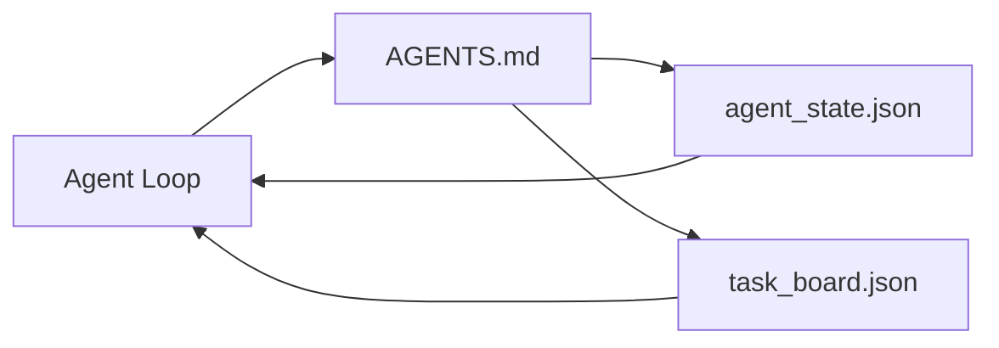

# 最小智能体工作台

> 最小的有用工作台只需三个文件:一个根指令路由文件、一个状态文件和一个任务看板。其他一切都叠加在其上。如果一个仓库承载不了这三个文件,任何模型都救不了它。

**Type:** Build
**Languages:** Python (标准库)
**Prerequisites:** 第 14 阶段 · 31(为什么强大的模型仍然会失败)
**Time:** 约 45 分钟

## 学习目标

- 定义构成最小可行工作台的三个文件。
- 解释为什么简短的根路由文件优于冗长的单一 `AGENTS.md`。
- 构建一个智能体在每一轮都能读取、并在结束时写入的状态文件。
- 构建一个无需聊天历史也能跨多个会话存续的任务看板。

## 问题

大多数团队编写一个 3000 行的 `AGENTS.md` 就宣布工作台完成。模型加载它,忽略无法概括的部分,然后在它一直失败的地方继续失败。

你需要相反的做法。一个微小的根文件,只在相关时才把智能体引导到更深入的文件。持久的状态,智能体在行动前读取、行动后写入。一个任务看板,说明什么在进行、什么被阻塞、接下来是什么。

三个文件。每个都有职责。每个都足够机器可读,以便日后演化为真正的系统。

## 概念



### AGENTS.md 是路由器,不是手册

好的 `AGENTS.md` 应当简短。它把智能体指向:

- 状态文件(你在哪里)。
- 任务看板(还剩什么)。
- 更深入的规则(位于 `docs/agent-rules.md` 下)。
- 验证命令(如何确认它有效)。

任何更长的内容放入更深的文档,只在需要时加载。冗长的手册会被忽略。简短的路由会被遵循。

### agent_state.json 是事实记录系统

状态承载:活动任务 id、被修改的文件、做出的假设、阻塞项和下一步动作。智能体在每一轮都读取它。下一个会话读取它,而不是回放聊天。

状态保存在文件中,因为聊天历史不可靠。会话会死掉。对话会被裁剪。文件不会。

### task_board.json 是队列

任务看板承载每个带有状态 `todo | in_progress | done | blocked` 的任务。它是状态为空时智能体从中提取任务的队列,也是你想了解智能体是否在正轨上时读取的队列。

看板上的任务包含 id、目标、负责人(`builder`、`reviewer` 或 `human`)和验收标准。看板有意保持小巧:当它超过一屏时,你面对的是规划问题,而不是看板问题。

### 三个文件是下限,不是上限

后续课程会添加范围契约、反馈运行器、验证门、审查清单和交接包。这里的三个文件是它们全部的前提。

```figure
wb-three-files
```

## 构建它

`code/main.py` 将最小工作台写入一个空仓库,并演示一个完整的智能体回合:

1. 读取 `agent_state.json`。
2. 如果状态为空,从 `task_board.json` 中提取下一个任务。
3. 修改范围内的单个文件。
4. 写回更新后的状态。

运行它:

```
python3 code/main.py
```

脚本在自身旁边创建 `workdir/`,铺设三个文件,运行一个回合,并打印 diff。重新运行它,看看第二个回合如何从第一个回合停止的地方继续。

## 使用它

在生产级智能体产品中,同样的三个文件以不同的名称出现:

- **Claude Code:** `AGENTS.md` 或 `CLAUDE.md` 作为路由器,`.claude/state.json` 风格的存储作为状态,hooks 作为看板。
- **Codex / Cursor:** workspace rules 作为路由器,会话内存作为状态,聊天侧边栏中的排队任务作为看板。
- **自定义 Python 智能体:** 就是你刚写的同样的文件。

名称会变。结构不会变。

## 生产环境中的实际模式

当以下三个模式叠加在最小工作台之上时,它才能在与真实 monorepo 的接触中存活下来。它们相互独立;选择你的仓库真正需要的那些。

**嵌套的 `AGENTS.md` 与就近优先原则。** OpenAI 在其主仓库中分发 88 个 `AGENTS.md` 文件,每个子组件一个。Codex、Cursor、Claude Code 和 Copilot 都会从工作文件向仓库根目录遍历,并拼接沿途找到的每个 `AGENTS.md`。子目录文件扩展根文件。Codex 添加了 `AGENTS.override.md` 用于替换而非扩展;该覆盖机制是 Codex 特有的,在跨工具工作中应避免使用。Augment Code 的测量结果是最关键的一条:最好的 `AGENTS.md` 文件带来的质量提升相当于从 Haiku 升级到 Opus;最差的文件比没有任何文件还要糟。

**应当拒绝的反模式,即使它们看似覆盖全面。** 相互冲突的指令会让智能体悄悄从交互模式退化为贪婪模式(ICLR 2026 AMBIG-SWE:解决率从 48.8% 降至 28%);应使用数字优先级,而不是平铺堆叠。不可验证的风格规则(如"遵循 Google Python Style Guide")且没有强制执行命令,会让智能体凭空宣称合规;应将每条风格规则与确切的 lint 命令配对。以风格而非命令开头会埋没验证路径;命令在前,风格在后。为人类而非智能体写作会浪费上下文预算;简洁是一种特性。

**跨工具符号链接。** 一个带符号链接(`ln -s AGENTS.md CLAUDE.md`、`ln -s AGENTS.md .github/copilot-instructions.md`、`ln -s AGENTS.md .cursorrules`)的单一根文件,让每个编码智能体保持同一事实来源。Nx 的 `nx ai-setup` 通过单一配置,在 Claude Code、Cursor、Copilot、Gemini、Codex 和 OpenCode 之间自动完成这一操作。

## 交付它

`outputs/skill-minimal-workbench.md` 为任何新仓库生成三文件工作台:一个针对项目调优的 `AGENTS.md` 路由器,一个包含正确键的 `agent_state.json`,以及一个植入当前待办事项的 `task_board.json`。

## 练习

1. 在 `agent_state.json` 中添加一个 `last_run` 时间戳。如果文件超过 24 小时,除非操作员确认,否则拒绝运行。
2. 在任务看板中添加 `priority` 字段,并修改提取器以始终选择优先级最高的 `todo`。
3. 将 `task_board.json` 迁移到 JSON Lines,使每个任务占一行,diff 在版本控制中保持整洁。
4. 编写一个 `lint_workbench.py`,当 `AGENTS.md` 超过 80 行或引用了不存在的文件时使其失败。
5. 判断三个文件中哪一个的丢失危害最大。为你的判断辩护。

## 关键术语

| 术语 | 人们怎么说 | 实际含义 |
|------|----------------|------------------------|
| 路由器 | `AGENTS.md` | 将智能体指向更深入文档和文件的简短根文件 |
| 状态文件 | "笔记" | 智能体当前所处位置的机器可读记录,每轮写入 |
| 任务看板 | "待办清单" | 带有状态、负责人、验收标准的 JSON 工作队列 |
| 事实记录系统 | "事实来源" | 当聊天记录消失时,工作台视其为权威的文件 |

## 延伸阅读

- [agents.md — 开放规范](https://agents.md/) — 被 Cursor、Codex、Claude Code、Copilot、Gemini、OpenCode 采用
- [Augment Code, A good AGENTS.md is a model upgrade. A bad one is worse than no docs at all](https://www.augmentcode.com/blog/how-to-write-good-agents-dot-md-files) — 实测的质量提升
- [Blake Crosley, AGENTS.md Patterns: What Actually Changes Agent Behavior](https://blakecrosley.com/blog/agents-md-patterns) — 哪些在经验上有效,哪些无效
- [Datadog Frontend, Steering AI Agents in Monorepos with AGENTS.md](https://dev.to/datadog-frontend-dev/steering-ai-agents-in-monorepos-with-agentsmd-13g0) — 嵌套优先级的实践
- [Nx Blog, Teach Your AI Agent How to Work in a Monorepo](https://nx.dev/blog/nx-ai-agent-skills) — 跨六个工具的单一来源生成
- [The Prompt Shelf, AGENTS.md Best Practices: Structure, Scope, and Real Examples](https://thepromptshelf.dev/blog/agents-md-best-practices/) — 经得起审查的章节排序
- [Anthropic, Claude Code subagents](https://code.claude.com/docs/en/sub-agents)
- 第 14 阶段 · 31 — 此最小工作台所吸收的失败模式
- 第 14 阶段 · 34 — 本课预览的持久状态 schema