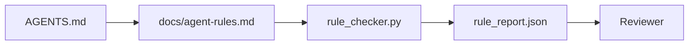

# 将代理指令作为可执行约束

> 以散文形式写成的指令是愿望。以约束形式写成的指令是测试。工作台将每条规则转化为代理在运行时可以检查、评审者在事后可以验证的东西。

**Type:** Build
**Languages:** Python (标准库)
**Prerequisites:** 阶段 14 · 32（最小工作台）
**Time:** 约 50 分钟

## 学习目标

- 将路由散文与操作规则分离。
- 将启动规则、禁止操作、完成定义、不确定性处理和审批边界表达为机器可检查的约束。
- 实现一个规则检查器，根据规则集为一次运行打分。
- 使规则集便于 diff，让评审者能看到变更内容。

## 问题

一份典型的 `AGENTS.md` 读起来像入职文档。它告诉代理要"小心"、"充分测试"、"不确定时提问"。三天后，代理提交了一个没有测试的变更，写入了禁止的目录，而且从不提问，因为它从来不知道边界在哪里。

指令在具有操作性时是有力的，在流于期望时是无力的。解决方法是写出工作台可以解释、评审者可以打分的规则。

## 概念

规则应放在 `docs/agent-rules.md` 中，与简短的根路由器分开。每条规则有一个名称、一个类别和一个检查。



### 覆盖大多数规则的五个类别

| 类别 | 规则回答的问题 | 示例 |
|----------|---------------------------|---------|
| 启动 | 工作开始前什么必须为真？ | "state 文件存在且是最新的" |
| 禁止 | 什么绝不能发生？ | "不得编辑 `scripts/release.sh`" |
| 完成定义 | 什么证明任务已完成？ | "pytest 退出码为 0 且验收行通过" |
| 不确定性 | 代理不确定时怎么做？ | "记录一个疑问条目而不是猜测" |
| 审批 | 什么需要人工审批？ | "任何新依赖、任何生产环境写入" |

一条不符合这五个类别中任何一个的规则通常应该拆成两条。强制拆分。

### 规则是机器可读的

每条规则有一个 slug、一个类别、一行描述，以及一个 `check` 字段，指向 `rule_checker.py` 中的一个函数。添加规则即添加检查；检查器随工作台一起成长。

### 规则便于 diff

规则在单个 markdown 文件中每条一个标题。重命名在 diff 中可见。新规则放在其类别的顶部。过时规则被删除而不是被注释掉，因为工作台是唯一事实来源，而不是记录团队上个季度想法的聊天日志。

### 规则与框架护栏

框架护栏（OpenAI Agents SDK guardrails、LangGraph interrupts）在运行时层面执行规则。本课中的规则集是这些护栏所实现的人类可读、可评审的契约。两者都需要：运行时在一轮对话中捕获违规，规则集证明运行时在做正确的事。

### 渐进式披露：地图，而非百科全书

`AGENTS.md` 不断膨胀的原因是每次事故都会增加一条规则，而没有任何事故会删除一条。一年之后，文件有两千行，代理读完第一屏就用尽了注意力预算，只按照被告知内容的一小部分行事。巨型指令文件失败的原因与四十页的入职文档失败的原因相同：读者浏览一次，再也不会回到真正重要的部分。

解决方法不是更短的文件，而是分层的文件。根路由器保持足够短以便每次会话都能读完，并且只包含指针。深度内容放在代理仅在任务涉及时才加载的主题文件中。给代理一张地图，而不是整部百科全书，让它走到需要的那一页。

```
AGENTS.md                  # router, < 50 lines: what this repo is, where to look, the 5 hard rules
docs/
  agent-rules.md           # the full rule set (this lesson)
  architecture.md          # loaded when the task touches module boundaries
  testing.md               # loaded when the task writes or runs tests
  deploy.md                # loaded only for release work, gated behind an approval rule
feature_list.json          # the backlog (Phase 14 · 36)
```

| 层级 | 位置 | 何时读取 | 大小预算 |
|------|----------|-----------|-------------|
| 路由器 | `AGENTS.md` | 每次会话，始终 | 约 50 行以内 |
| 规则 | `docs/agent-rules.md` | 每次会话，启动时 | 每个类别一屏 |
| 主题文档 | `docs/<topic>.md` | 仅当任务涉及该主题时 | 需要多深就多深 |

两个测试保持分层的诚实性。可达性测试：代理应能从路由器最多两跳内到达任何规则，因此路由器必须通过路径链接每个主题文档，而不是用散文描述它。新鲜度测试：路由器足够短，评审者在每个 PR 上都会重读它，这是防止它悄悄膨胀回它所取代的百科全书的唯一手段。一个不再解析的指针比一条缺失的规则是更糟的失败，因此路由器中的坏链接本身就是一次启动检查违规。

```figure
wb-rule-checkoff
```

## 构建它

`code/main.py` 包含：

- `agent-rules.md` 解析器，将规则加载到 dataclass 中。
- `rule_checker.py` 风格的检查函数，每个 `check` 引用一个。
- 一个违反两条规则的演示代理运行，以及捕获它们的检查过程。

运行它：

```
python3 code/main.py
```

输出：解析后的规则集、运行轨迹、每条规则的通过/失败，以及保存在脚本旁边的 `rule_report.json`。

## 生产环境中的实践模式

三种模式区分了能持续一个季度的规则集和一周内就衰退的规则集。

**写入时标记严重性。** 每条规则携带 `severity`：`block`、`warn` 或 `info`。检查器报告全部三种；运行时仅在 `block` 时拒绝。大多数团队早期高估严重性，然后在截止日期压力下悄悄削弱它；写入时标记迫使提前进行校准。与验证门（阶段 14 · 38）配合使用，它将任何对 `block` 规则的覆盖签入 `overrides.jsonl` 审计日志。

**规则过期作为强制机制。** 每条规则携带一个 `expires_at` 日期（默认为创建后 90 天）。当一条未过期规则连续 60 天零违规时，检查器会发出警告；下一次季度评审要么说明保留它的理由，要么将其弱化为 `info`，要么删除它。Cloudflare 的生产级 AI Code Review 数据（2026 年 4 月，30 天内 5,169 个仓库的 131,246 次评审运行）显示，具有明确过期机制的规则集保持在每仓库 30 条规则以内；没有过期机制的规则集增长到 80+，且大部分从未触发。

**Markdown 作为源文件，JSON 作为缓存。** `agent-rules.md` 是编写的文件；`agent-rules.lock.json` 是检查器在热路径中读取的缓存。锁文件由 pre-commit 钩子重新生成。Markdown 的 diff 可评审；JSON 解析则不出现在每一轮中。与 `package.json` / `package-lock.json` 和 `Cargo.toml` / `Cargo.lock` 相同的形态。

## 使用它

在生产环境中：

- Claude Code、Codex、Cursor 在会话开始时读取规则，并在拒绝操作时引用它们。检查器在 CI 中重新运行它们以捕获静默漂移。
- OpenAI Agents SDK guardrails 将相同的检查注册为输入和输出护栏。Markdown 是文档界面；SDK 是运行时界面。
- LangGraph interrupts 在执行中的节点违反规则时触发。中断处理器读取规则、询问人类，然后恢复。

规则集在这三者之间可移植，因为它只是 markdown 加函数名。

## 交付它

`outputs/skill-rule-set-builder.md` 访谈项目所有者，将其现有的散文指令归类到五个类别中，并生成一个版本化的 `agent-rules.md` 以及检查器存根。

## 练习

1. 如果你的产品确实需要，添加第六个类别。论证它为什么不能归入这五个之一。
2. 扩展检查器，使规则可以携带严重性（`block`、`warn`、`info`），并且报告相应地进行汇总。
3. 将检查器接入 CI：如果一条 block 级规则在最新的代理运行中失败，则使构建失败。
4. 为每条规则添加 "expiry" 字段。90 天内没有检查失败后，该规则可进入评审。
5. 找一份真实的 `AGENTS.md`，将其重写为五类别规则。其中多少行是操作性的？多少是期望性的？

## 关键术语

| 术语 | 人们怎么说 | 实际含义 |
|------|----------------|------------------------|
| 操作性规则 | "一条真正的指令" | 工作台可在运行时检查的规则 |
| 期望性规则 | "小心点" | 没有检查的规则；要么删除，要么升级 |
| 完成定义 | "验收" | 任务已完成的客观的、有文件依据的证明 |
| Block 级严重性 | "硬性规则" | 违规将中止运行；没有操作员介入无法静默 |
| 规则过期 | "过时规则清理" | N 天内没有失败的规则可进入退役评审 |

## 延伸阅读

- [OpenAI Agents SDK guardrails](https://openai.github.io/openai-agents-python/guardrails/)
- [LangGraph interrupts](https://langchain-ai.github.io/langgraph/how-tos/human_in_the_loop/breakpoints/)
- [Anthropic, Building Effective Agents](https://www.anthropic.com/research/building-effective-agents)
- [Rick Hightower, Agent RuleZ: A Deterministic Policy Engine](https://medium.com/@richardhightower/agent-rulez-a-deterministic-policy-engine-for-ai-coding-agents-9489e0561edf) — 生产环境中的 block/warn/info 严重性
- [Cloudflare, Orchestrating AI Code Review at Scale](https://blog.cloudflare.com/ai-code-review/) — 13.1 万次评审运行，规则组合经验
- [microservices.io, GenAI development platform — part 1: guardrails](https://microservices.io/post/architecture/2026/03/09/genai-development-platform-part-1-development-guardrails.html) — 规则与 CI 之间的纵深防御
- [Type-Checked Compliance: Deterministic Guardrails (arXiv 2604.01483)](https://arxiv.org/pdf/2604.01483) — Lean 4 作为规则即检查的上限
- [logi-cmd/agent-guardrails](https://github.com/logi-cmd/agent-guardrails) — 合并门实现：范围、变异测试、违规预算
- 阶段 14 · 32 — 此规则集所嵌入的最小工作台
- 阶段 14 · 38 — 使用规则报告的验证门
- 阶段 14 · 39 — 为规则合规性打分的评审者代理