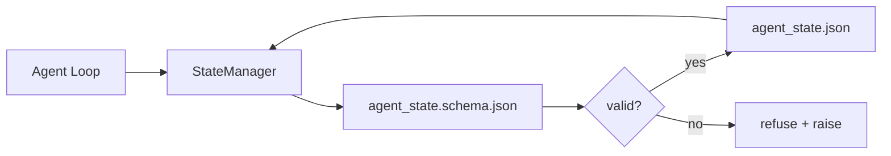

# 仓库记忆与持久化状态

> 聊天历史是易失的，仓库是持久的。工作台将智能体状态存储在版本化的文件中，这样下一次会话、下一个智能体和下一个审查者都从同一个事实来源读取。

**Type:** Build
**Languages:** Python (标准库 + `jsonschema` 可选)
**Prerequisites:** Phase 14 · 32 (Minimal Workbench)
**Time:** 约 60 分钟

## 学习目标

- 定义哪些内容属于仓库记忆，哪些内容属于聊天历史。
- 为 `agent_state.json` 和 `task_board.json` 编写 JSON Schema。
- 构建一个状态管理器，以原子方式加载、校验、修改并持久化状态。
- 利用 schema 在错误写入破坏工作台之前将其拒绝。

## 问题所在

智能体结束了一次会话。聊天窗口关闭。下一次会话开启并询问从哪里开始。模型说"让我检查一下文件"，读取过时的笔记，然后重复完成已经完成的工作。更糟的是，它会重写一个已经完成的文件，因为没有人告诉它文件已经完成了。

工作台的解决方案是仓库记忆：状态保存在仓库中的 JSON 文件里，按 schema 写入，原子地持久化，在代码审查中便于 diff。聊天是瞬态的信息流；仓库是记录系统。

## 核心概念



### 哪些内容属于仓库记忆

| 属于 | 不属于 |
|---------|-----------------|
| 活动任务 id | 原始聊天记录 |
| 本会话触碰过的文件 | Token 级别的推理轨迹 |
| 智能体做出的假设 | "用户似乎很沮丧" |
| 未解决的阻塞项 | 抽样的补全结果 |
| 下一步行动 | 厂商特定的模型 id |

判断标准是持久性：三个月后在一次 CI 重跑中这会有用吗？如果会，放入仓库。如果不会，放入遥测数据。

### Schema 优先的状态

JSON Schema 是契约。没有它，每个智能体都会发明新字段，每个审查者都要学习新的结构，每个 CI 脚本都得为历史版本做特殊处理。有了它，一次错误的写入就是一个被拒绝的写入。

Schema 覆盖：

- 必需的键。
- 允许的 `status` 值。
- 禁止的值（例如数组的 `null`）。
- 模式约束（任务 id 匹配 `T-\d{3,}`）。
- 用于迁移的版本字段。

### 原子写入

状态写入必须能从部分失败中存活：写入临时文件，fsync，再通过重命名覆盖目标文件。状态文件是事实来源；一个写了一半的文件比没有文件更糟。

### 迁移

当 schema 变更时，在 schema 升级的同时发布一个迁移脚本。状态文件带有 `schema_version` 字段；管理器拒绝加载它无法迁移的版本文件。

```figure
wb-state-persist
```

## 动手构建

`code/main.py` 实现：

- `agent_state.schema.json` 和 `task_board.schema.json`。
- 一个仅依赖标准库的校验器（JSON Schema 的子集：required、type、enum、pattern、items）。
- `StateManager.load`、`StateManager.update`、`StateManager.commit`，使用临时的原子写入与重命名。
- 一个演示脚本，修改状态、持久化、重新加载，并验证往返一致性。

运行方式：

```
python3 code/main.py
```

该脚本写入 `workdir/agent_state.json` 和 `workdir/task_board.json`，在两轮中修改它们，并在每一步打印经过校验的状态。

## 生产环境中的实践模式

四种模式将本课的最小实现转变为多智能体 monorepo 能够可靠运行的东西。

**原子临时写入加重命名不是可选项。** 2026 年 3 月 Hive 项目的一个 bug 报告清晰地记录了这种失败模式：`state.json` 通过 `write_text()` 写入，异常被捕获后静默吞掉。部分写入导致会话基于损坏的状态恢复，且毫无信号。修复方法始终是：在与目标相同的目录中 `tempfile.mkstemp`，写入，`fsync`，`os.replace`（在 POSIX 和 Windows 上均为原子重命名）。本课的 `atomic_write` 正是这样做的。

**每个非幂等的工具调用都要有幂等键。** 如果智能体在调用工具之后、在将结果写入检查点之前崩溃，恢复时会重试该工具调用。对读取是安全的；对发送邮件、数据库插入、文件上传是危险的。模式是：在执行之前将每个工具调用 ID 记录到 `pending_calls.jsonl`。重试时，检查该 ID；如果存在，跳过调用并使用缓存的结果。Anthropic 和 LangChain 都在 2026 年的指南中强调了这一点；LangGraph 的 checkpointer 出于同样的原因持久化待处理的写入。

**将大型工件与状态分离。** 不要在 `agent_state.json` 中存储 CSV、长记录或生成的文件。将工件保存为单独的文件（或上传到对象存储），只在状态中保留路径。检查点保持小巧快速；工件则独立增长。

**事件溯源用于审计，快照用于恢复。** 每次修改都向事件日志（`state.events.jsonl`）追加；定期将快照保存到 `state.json`。恢复时先读取快照，然后重放快照时间戳之后的任何事件。这会增加磁盘开销，但可以逐字重放智能体的决策——在调试长周期运行时至关重要。这与 Postgres 内部用于 WAL 的结构相同。

**Schema 迁移，否则拒绝加载。** `schema_version` 整数就是契约。当管理器加载一个版本未知的文件时，它拒绝读取。在 schema 升级的同时发布迁移脚本；`tools/migrate_state.py` 在每次启动时幂等地运行。

## 行业实践

在生产环境中：

- **LangGraph checkpointers。** 同样的思想，不同的存储。checkpointer 将图状态持久化到 SQLite、Postgres 或自定义后端。当 checkpointer 失效、需要手工读取状态时，本课教授的 schema 就是你要用的东西。
- **Letta memory blocks。** 带有结构化 schema 的持久化块（Phase 14 · 08）。同样的纪律应用于长期运行的角色。
- **OpenAI Agents SDK 会话存储。** 可插拔后端，具备 schema 感知。本课中的状态文件就是本地文件后端。

## 发布

`outputs/skill-state-schema.md` 生成项目特定的 JSON Schema 对（状态 + 看板）、一个接入原子写入的 Python `StateManager`，以及一个迁移脚手架，这样下一次 schema 升级不会破坏工作台。

## 练习

1. 添加一个 `last_human_touch` 时间戳。拒绝任何与人工编辑间隔不足五秒的智能体写入。
2. 扩展校验器以支持 `oneOf`，使任务可以是构建任务或审查任务，两者具有不同的必需字段。
3. 添加一个 `schema_version` 字段，并编写从 v1 到 v2 的迁移（将 `blockers` 重命名为 `risks`）。
4. 将存储后端从本地文件迁移到 SQLite。保持 `StateManager` API 不变。
5. 用 50 毫秒的写入竞争让两个智能体同时访问同一个状态文件。会发生什么问题？原子重命名如何帮你解决？

## 关键术语

| 术语 | 人们怎么说 | 实际含义 |
|------|----------------|------------------------|
| 仓库记忆 | "笔记文件" | 状态存储在仓库中被版本控制的文件中，遵循 schema |
| Schema 优先 | "校验输入" | 在写入者之前定义契约，拒绝偏离 |
| 原子写入 | "重命名就行" | 写入临时文件、fsync、重命名，使部分失败无法造成损坏 |
| 迁移 | "Schema 升级" | 将 vN 状态转换为 v(N+1) 状态的脚本 |
| 记录系统 | "事实来源" | 工作台视为权威的工件 |

## 延伸阅读

- [JSON Schema specification](https://json-schema.org/specification.html)
- [LangGraph checkpointers](https://langchain-ai.github.io/langgraph/concepts/persistence/)
- [Letta memory blocks](https://docs.letta.com/concepts/memory)
- [Fast.io, AI Agent State Checkpointing: A Practical Guide](https://fast.io/resources/ai-agent-state-checkpointing/) — schema 优先的检查点机制与幂等性
- [Fast.io, AI Agent Workflow State Persistence: Best Practices 2026](https://fast.io/resources/ai-agent-workflow-state-persistence/) — 并发控制、TTL、事件溯源
- [Hive Issue #6263 — non-atomic state.json writes silently ignored](https://github.com/aden-hive/hive/issues/6263) — 真实项目中的失败模式
- [eunomia, Checkpoint/Restore Systems: Evolution, Techniques, Applications](https://eunomia.dev/blog/2025/05/11/checkpointrestore-systems-evolution-techniques-and-applications-in-ai-agents/) — 操作系统历史中的 CR 原语应用于智能体
- [Indium, 7 State Persistence Strategies for Long-Running AI Agents in 2026](https://www.indium.tech/blog/7-state-persistence-strategies-ai-agents-2026/)
- [Microsoft Agent Framework, Compaction](https://learn.microsoft.com/en-us/agent-framework/agents/conversations/compaction) — 厂商检查点管理器
- Phase 14 · 08 — memory blocks 与睡眠期计算
- Phase 14 · 32 — 本课为其建立 schema 的三文件最小实现
- Phase 14 · 40 — 从同一 schema 读取的交接包