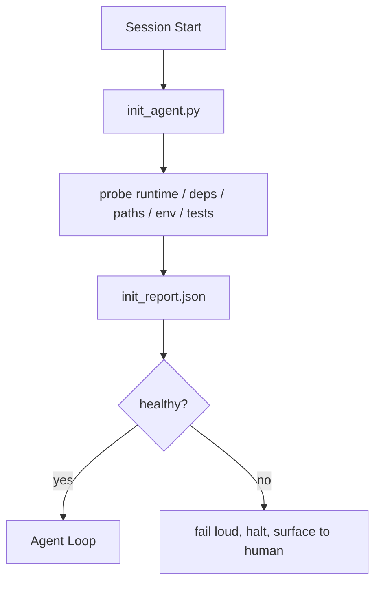

# 智能体的初始化脚本

> 每个冷启动的会话都要交一笔税。智能体反复读同样的文件、重试同样的探测、重新发现同样的路径。初始化脚本只交一次税，并把答案写进状态里。

**Type:** Build
**Languages:** Python (stdlib)
**Prerequisites:** Phase 14 · 32 (Minimal Workbench), Phase 14 · 34 (Repo Memory)
**Time:** ~45 minutes

## 学习目标

- 识别智能体不应在每个会话中重复执行的工作。
- 构建一个确定性的初始化脚本，探测运行时、依赖和仓库健康状况。
- 持久化探测结果，使智能体直接读取而非重复检查。
- 当初始化失败时，大声、快速地失败，并只有一个排查入口。

## 问题所在

打开一个会话。智能体猜测 Python 版本。猜测测试命令。把仓库根目录列了五遍来寻找入口点。尝试导入一个未安装的包。询问用户配置文件在哪里。等它做出真正的编辑时，一万个 token 已经花在了本应一个脚本就能完成的准备工作上。

解决方案是一个初始化脚本，它在智能体做任何事之前运行，并写出一个 `init_report.json` 供智能体在启动时读取。

## 概念



### 初始化脚本探测什么

| 探测项 | 为什么重要 |
|-------|----------------|
| 运行时版本 | Python 或 Node 版本错误意味着悄无声息的版本错误 |
| 依赖可用性 | 缺失的包以后发现的代价是现在捕获的十倍 |
| 测试命令 | 智能体必须知道如何验证；如果命令缺失，工作台就是坏的 |
| 仓库路径 | 硬编码路径会漂移；解析一次并固定下来 |
| 环境变量 | 缺失的 `OPENAI_API_KEY` 是一个失败面，而不是运行时谜题 |
| 状态 + 看板新鲜度 | 崩溃会话留下的过期状态是一个隐患 |
| 最后已知良好的提交 | 会话结束时交接 diff 的锚点 |

### 大声失败、快速失败、在一处失败

探测失败意味着停止并向人暴露问题。没有“智能体会自己想办法”这回事。初始化的全部意义就在于：当工作台坏掉时拒绝启动。

### 幂等性

连续运行两次。第二次运行应当是空操作，只有时间戳会更新。幂等性使你能够把这个脚本接入 CI、钩子或任务前的 slash 命令。

### 初始化与启动规则

规则（Phase 14 · 33）描述的是行动前必须为真的条件。初始化是建立“这些规则可被检查”的脚本。没有初始化的规则会沦为“小心点”。没有规则的初始化则是一个精致的失败。

```figure
wb-init-probes
```

## 动手构建

`code/main.py` 实现了 `init_agent.py`：

- 五个探测项：Python 版本、通过 `importlib.util.find_spec` 列出的依赖、测试命令可解析性、必需的环境变量、状态文件新鲜度。
- 每个探测项返回 `(name, status, detail)`。
- 脚本写入包含全部探测结果的 `init_report.json`，并在任何阻塞级别的探测失败时以非零码退出。

运行它：

```
python3 code/main.py
```

脚本会打印探测结果表格，写入 `init_report.json`，在正常路径下以零码退出，否则以非零码退出并列出失败的探测项。

## 生产环境中的实战模式

以下三种模式把一个有用的初始化脚本与纯粹的仪式区分开来。

**最后已知良好提交锚定。** 将当前提交与上次成功合并时写入的 `LKG` 文件进行对比。如果 diff 超出预算（默认 50 个文件），拒绝启动，并要求人来批准新的基线。这正是 Cloudflare 的 AI Code Review 用来界定审查智能体范围的方法：每次审查会话都锚定同一个最后已知良好的提交，绝不使漂移在会话之间累积。

**带 TTL 的锁文件。** 在第一次成功的探测之后写入一个 `prereqs.lock`。后续运行在 N 小时内（默认 24 小时）信任该锁并跳过开销大的探测。初始化脚本先读锁；如果锁是新鲜的且依赖清单哈希匹配，就直接短路返回。这与 Docker 用于层缓存的模式相同：幂等探测 + 内容哈希 = 跳过。

**热路径上没有网络、没有 LLM、没有意外。** 初始化探测是确定性的管道。一个调用 LLM 来分类失败的探测，或者访问外部服务来检查许可证的探测，不是探测；它是一个工作流。如果某个探测在 dry run 中耗时超过三秒，把它视为工作台坏味道，要么把它移出初始化，要么缓存其结果。

## 实际应用

在生产环境中：

- **Claude Code 钩子。** `pre-task` 钩子调用初始化脚本，若失败则拒绝启动智能体。
- **GitHub Actions。** 一个 `setup-agent` 作业运行初始化脚本；智能体作业依赖它。
- **Docker entrypoint。** 智能体容器在 exec 智能体运行时之前运行初始化脚本；失败时日志会暴露出来。

初始化脚本之所以可移植，是因为它不调用任何特定框架。Bash、Make 或 tasks 文件都可以包装它。

## 发布它

`outputs/skill-init-script.md` 会调研项目，把其准备工作分类为探测项，生成项目专属的 `init_agent.py`，以及一个在任何智能体步骤之前运行它的 CI 工作流。

## 练习

1. 添加一个探测项，将当前提交与最后已知良好的提交进行 diff，若超过 50 个文件被修改则拒绝启动。
2. 让脚本写入一个 `prereqs.lock` 文件，并在锁文件超过七天时拒绝启动。
3. 添加一个 `--fix` 标志，自动安装缺失的开发依赖，但未经批准绝不修改运行时依赖。
4. 把探测项从硬编码函数迁移到 YAML 注册表。论证这一权衡。
5. 为每个探测项添加时间预算。运行超过三秒的探测项是工作台坏味道。

## 关键术语

| 术语 | 人们怎么说 | 实际含义 |
|------|------------------------|
| 探测项 | “一个检查” | 一个返回 `(name, status, detail)` 的确定性函数 |
| 初始化报告 | “准备工作的输出” | 与状态文件放在一起、包含探测结果的 JSON |
| 幂等 | “可以安全重跑” | 连续两次运行产生除时间戳外完全相同的报告 |
| 大声失败 | “不要吞掉错误” | 停止并向人暴露问题；没有静默回退 |
| 准备税 | “引导成本” | 智能体在每个会话中重新发现显而易见之事所花费的 token |

## 延伸阅读

- [Anthropic, Effective harnesses for long-running agents](https://www.anthropic.com/engineering/effective-harnesses-for-long-running-agents)
- [GitHub Actions, composite actions for setup](https://docs.github.com/en/actions/sharing-automations/creating-actions/creating-a-composite-action)
- [microservices.io, GenAI dev platform: guardrails](https://microservices.io/post/architecture/2026/03/09/genai-development-platform-part-1-development-guardrails.html) — 将 pre-commit + CI 检查作为初始化
- [Augment Code, How to Build Your AGENTS.md (2026)](https://www.augmentcode.com/guides/how-to-build-agents-md) — 初始化预期
- [Codex Blog, Codex CLI Context Compaction](https://codex.danielvaughan.com/2026/03/31/codex-cli-context-compaction-architecture/) — 将会话启动视为感知压缩的初始化
- Phase 14 · 33 — 本脚本所启用的规则集
- Phase 14 · 34 — 本脚本所写入种子的状态文件
- Phase 14 · 38 — 本初始化脚本所喂给的验证门
- Phase 14 · 40 — 消费初始化报告中最后已知良好提交的交接