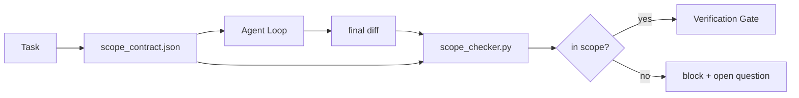

# 范围契约与任务边界

> 模型不知道工作在哪里结束。范围契约是一个针对每个任务的文件，它声明工作从哪里开始、在哪里结束，以及如果超出范围时如何回滚。契约将“留在范围内”从一个愿望变成一项检查。

**Type:** Build
**Languages:** Python (标准库)
**Prerequisites:** Phase 14 · 32 (Minimal Workbench)、Phase 14 · 33 (Rules as Constraints)
**Time:** 约50分钟

## 学习目标

- 编写一份范围契约，任务开始时由 agent 读取，任务结束时由验证器读取。
- 指定允许的文件、禁止的文件、验收标准、回滚计划和审批边界。
- 实现一个范围检查器，将 diff 与契约进行比较并标记违规项。
- 让范围蔓延变得可见、自动化且可审查。

## 问题

Agent 会蔓延。任务是“修复登录 bug”。diff 却触及了登录路由、邮件辅助函数、数据库驱动、README 和发布脚本。每一次触及在当时都有一个看似合理的理由。但合在一起，它们就是一个与所审查内容不同的变更。

范围蔓延是 agent 工作中监控最少的失败模式，因为 agent 会以善意叙述每一步。解决方案不是更严格的提示词，而是一份写在磁盘上的契约，声明承诺了什么，以及一项检查，将结果与承诺进行比较。

## 概念



### 范围契约中包含什么

| 字段 | 用途 |
|-------|---------|
| `task_id` | 链接到看板上的任务 |
| `goal` | 一句审查者可以验证的话 |
| `allowed_files` | agent 可以写入的 glob |
| `forbidden_files` | agent 即使无意也不得触碰的 glob |
| `acceptance_criteria` | 证明完成的测试命令或断言行 |
| `rollback_plan` | 需要中止时操作员可以执行的一段说明 |
| `approvals_required` | 超出范围、需要明确人工签核的操作 |

没有 `forbidden_files` 的契约是不完整的。留白部分是契约的一半。

### 用 glob 而非原始路径

真实的仓库会移动文件。将契约固定到 glob（`app/**/*.py`、`tests/test_signup*.py`）上，这样会话之间的重构就不会使契约失效。

### 回滚是范围的一部分

列出如何回滚会迫使契约作者思考可能出什么问题。一个无法回滚的契约不应该被批准。

### 范围检查就是 diff 检查

Agent 写出 diff。检查器读取 diff、允许的 glob、禁止的 glob，以及已运行的验收命令列表。每个违规都是一个带标签的发现，验证门可以据此拒绝。

### 范围的两个层次：功能列表与任务契约

范围契约约束的是单个任务，而不是整个项目。Agent 可以完美地留在登录修复的契约内，但在下一轮却可能决定项目还需要一个设置页面、一个深色模式开关，以及一次路由器重写。契约从未被询问哪些工作对项目而言在范围内，只被询问了哪些文件对任务而言在范围内。

第二个层次需要它自己的原语：一个 `feature_list.json`，agent 在会话开始时读取。它是以机器可读的有序文件形式呈现的项目待办列表。Agent 恰好选择一个 `status` 为 `todo` 的功能，将其 `id` 写入活动范围契约，并且被禁止在同一会话中开始第二个功能。“一次只做一件事”不再是 agent 可以自行合理化越过的提示词中的一行字，而是它从磁盘上读取的一个值，以及门强制执行的一项检查。

```json
{
  "project": "knowledge-base",
  "active": "import-pdf",
  "features": [
    { "id": "import-pdf",   "status": "in_progress", "goal": "import a PDF into the library",        "done_when": "pytest tests/test_import.py && a sample PDF appears in the library view" },
    { "id": "full-text-search", "status": "todo",     "goal": "search document text and rank hits",   "done_when": "query returns ranked results with snippets" },
    { "id": "cite-answers", "status": "todo",         "goal": "answers carry source citations",        "done_when": "every answer renders at least one clickable citation" }
  ]
}
```

| 字段 | 用途 |
|-------|---------|
| `active` | 当前会话可以触及的唯一功能；为空表示选择一个并设置它 |
| `features[].id` | 稳定的 slug，范围契约的 `task_id` 指向它 |
| `features[].status` | `todo`、`in_progress`、`done`、`blocked`；同一时间只有一个 `in_progress` |
| `features[].goal` | 一句审查者可以验证的话 |
| `features[].done_when` | 将 `in_progress` 翻转为 `done` 的那行验收命令 |

两条规则使这个列表具有承重作用而非装饰作用。第一，“最多一个 `in_progress`”这条不变式本身就是一项启动检查（Phase 14 · 33）：如果列表中出现两个，会话将拒绝启动，直到人工解决。第二，功能列表是一个文件而不是一条聊天消息，因为聊天会滚动出上下文，而文件在会话之间和不同 agent 之间持久存在。交接环节（Phase 14 · 40）将已完成功能的状态写回 `done`，这样下一个会话打开时看到的是一块准确的看板，而不是重新推导还剩什么。

契约与列表按最小特权组合，与下文描述的合并方式相同：任务契约的 `allowed_files` 必须位于活动功能所触及的范围之内，绝不能超出。

```figure
wb-scope-bounce
```

## 动手构建

`code/main.py` 实现了：

- `scope_contract.json` 模式（JSON Schema 的子集，glob 数组）。
- 一个 diff 解析器，将触及文件列表加上已运行命令列表转换为 `RunSummary`。
- 一个 `scope_check`，对照契约返回 `(violations, in_scope, off_scope)`。
- 两个演示运行：一个保持在范围内，一个发生蔓延。检查器用确切的文件和原因标记蔓延。

运行它：

```
python3 code/main.py
```

输出：契约、两次运行、每次运行的判定结果，以及一份保存的 `scope_report.json`。

## 业界生产模式

一位实践者在运行 "specsmaxxing"（在调用 agent 之前先用 YAML 写好范围契约）时报告，三周内钻牛角尖的比例从 52% 降到 21%，而 agent 本身没有改变。起作用的是契约，而不是模型。有三个模式让这一收益持续。

**违规预算，而非二元失败。** `agent-guardrails`（Claude Code、Cursor、Windsurf、Codex 通过 MCP 使用的开源合并门）为每个任务提供一个 `violationBudget`：预算内的轻微范围偏移作为警告呈现；只有超出预算时合并门才拒绝。搭配 `violationSeverity: "error" | "warning"` 使用。预算是“一个能上线的门”与“一个被讨厌它的团队禁用的门”之间的差别。

**按路径家族划分严重性不对称。** 对 `docs/**` 的超出范围写入通常是 `warn`；对 `scripts/**`、`migrations/**`、`config/prod/**` 的超出范围写入始终是 `block`。这种不对称必须写在契约里，而不是运行时里，因为它是项目特定的，并且随任务变化。

**文件预算旁边加上时间与网络预算。** `time_budget_minutes` 字段限制墙上时钟时间；运行时超过该时间将拒绝继续，除非重新审批。`network_egress` 主机名允许列表防止 agent 悄悄调用不属于任务的外部 API。这些同样是范围维度；文件 glob 是必要的，但不充分。

**多契约合并语义（最小特权）。** 当两个范围契约同时适用时（例如项目级契约加任务级契约），合并规则是：对 `allowed_files` 取**交集**（两个契约都必须允许该路径），对 `forbidden_files` 取**并集**（任一契约都可以禁止），`time_budget_minutes` 取最严格的（min），`approvals_required` 累积。`network_egress` 的取值：`None` 表示不强制，`[]` 表示全部拒绝，`[...]` 作为允许列表；合并时，`None` 让位于另一方，两个列表取交集，全部拒绝保持全部拒绝。在契约模式中声明这些，使合并是机械的且可审查的。

## 使用

生产模式：

- **Claude Code 斜杠命令。** `/scope` 命令写出契约并将其固定为会话上下文。子 agent 在行动前读取契约。
- **GitHub PR。** 将契约作为 PR 描述中的 JSON 文件推送，或作为签入的工件。CI 对合并 diff 运行范围检查器。
- **LangGraph 中断。** 范围违规触发中断；处理程序询问人工是契约需要扩大，还是 agent 需要后退。

契约随任务一起流转。任务关闭时，契约归档在 `outputs/scope/closed/` 下。

## 交付

`outputs/skill-scope-contract.md` 为任务描述生成范围契约，并提供一个支持 glob 的检查器，在 CI 中对每个 agent diff 运行。

## 练习

1. 添加一个 `network_egress` 字段，列出允许的外部主机。拒绝触及其他主机的运行。
2. 扩展检查器，使 `docs/**` 软失败、`scripts/**` 硬失败。论证这种不对称。
3. 让契约使用一套静态规则（不使用 LLM）从 `goal` 字段推导出 `allowed_files`。第一个边界情况上会出什么问题？
4. 添加一个 `time_budget_minutes`，一旦超过墙上时钟时间就拒绝继续。
5. 对同一 diff 运行两个契约。当两者都适用时，正确的合并语义是什么？

## 关键术语

| 术语 | 人们怎么说 | 实际含义 |
|------|----------------|------------------------|
| 范围契约 | “任务简报” | 每任务的 JSON，列出允许/禁止的文件、验收标准、回滚方案 |
| 范围蔓延 | “它还改了……” | 同一任务中契约之外的文件被改动 |
| 回滚计划 | “我们可以撤销” | 供操作员中止使用的一段式运行手册 |
| 审批边界 | “需要签核” | 契约中列为需要明确人工批准的操作 |
| Diff 检查 | “路径审计” | 将触及的文件与契约 glob 进行比较 |

## 延伸阅读

- [LangGraph human-in-the-loop interrupts](https://langchain-ai.github.io/langgraph/concepts/human_in_the_loop/)
- [OpenAI Agents SDK tool approval policies](https://platform.openai.com/docs/guides/agents-sdk)
- [logi-cmd/agent-guardrails — merge gates and scope validation](https://github.com/logi-cmd/agent-guardrails) — 违规预算、严重性分级
- [Dev|Journal, Preventing AI Agent Configuration Drift with Agent Contract Testing](https://earezki.com/ai-news/2026-05-05-i-built-a-tiny-ci-tool-to-keep-ai-agent-configs-from-drifting-in-my-repo/) — 无外部依赖的 `--strict` 模式
- [Agentic Coding Is Not a Trap (production logs)](https://dev.to/jtorchia/agentic-coding-is-not-a-trap-i-answered-the-viral-hn-post-with-my-own-production-logs-33d9) — specsmaxxing 实证：52% → 21%
- [OpenCode permission globs](https://opencode.ai/docs/agents/) — 细粒度的按权限范围控制
- [Knostic, AI Coding Agent Security: Threat Models and Protection Strategies](https://www.knostic.ai/blog/ai-coding-agent-security) — 作为最小特权一部分的范围
- [Augment Code, AI Spec Template](https://www.augmentcode.com/guides/ai-spec-template) — 三层边界系统（必须/询问/绝不）
- Phase 14 · 27 — 与范围锁搭配使用的提示词注入防御
- Phase 14 · 33 — 本契约针对每个任务进行特化的规则集
- Phase 14 · 38 — 检查器向其汇报的验证门