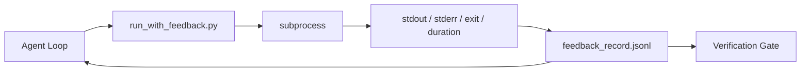

# 运行时反馈循环

> 看不到真实命令输出的智能体只能靠猜测。反馈运行器（feedback runner）将 stdout、stderr、退出码和耗时捕获到结构化记录中，供下一轮读取。这样智能体是对事实做出反应，而不是对它自己预测的事实做出反应。

**类型：** 构建
**语言：** Python（标准库）
**前置条件：** Phase 14 · 32（最小工作台）、Phase 14 · 35（初始化脚本）
**时间：** 约 50 分钟

## 学习目标

- 区分运行时反馈与可观测性遥测。
- 构建一个包装 shell 命令并持久化结构化记录的反馈运行器。
- 确定性地截断大输出，使循环保持在 token 预算之内。
- 当反馈缺失时拒绝推进循环。

## 问题所在

智能体说“现在运行测试。”下一条消息说“所有测试通过。”而实际上没有任何测试运行过。智能体想象了输出，或者它运行了命令却从未读取结果，或者它读了结果却静默地截掉了失败行。

反馈运行器消除了这个缺口。每条命令都经过运行器。每条记录都携带命令、捕获的 stdout 和 stderr、退出码、实际耗时，以及一条单行的智能体备注。智能体在下一轮读取该记录。验证门在任务结束时读取这些记录。

## 概念



### 反馈记录里放什么

| 字段 | 为什么重要 |
|-------|----------------|
| `command` | 精确的 argv，没有 shell 展开的意外 |
| `stdout_tail` | 最后 N 行，确定性截断 |
| `stderr_tail` | 最后 N 行，与 stdout 分开 |
| `exit_code` | 无歧义的成功信号 |
| `duration_ms` | 暴露缓慢的探测和失控的进程 |
| `started_at` | 用于重放的时间戳 |
| `agent_note` | 智能体写下的一行预期说明 |

### 截断必须是确定性的

一份 50 MB 的日志会摧毁整个循环。运行器以 `...truncated N lines...` 标记截断头部和尾部，是确定性的，因此相同输出总是产生相同记录。不做采样；智能体需要看到的部分（最后的错误、最后的总结）都在尾部。

### 反馈与遥测

遥测（Phase 14 · 23，OTel GenAI 约定）是供人类操作员跨时间审查运行使用的。反馈是供本次运行的下一轮使用的。它们共享字段，但存放在不同的文件中，有不同的保留策略。

### 没有反馈就拒绝推进

如果运行器在捕获退出码之前出错，记录会携带 `exit_code: null` 和 `error: <reason>`。智能体循环必须拒绝在 `null` 退出时声称成功。没有退出码，就没有进展。

```figure
wb-feedback-loop
```

## 动手构建

`code/main.py` 实现：

- `run_with_feedback(command, agent_note)`，包装 `subprocess.run`，捕获 stdout/stderr/退出码/耗时，确定性截断，追加到 `feedback_record.jsonl`。
- 一个小型加载器，将 JSONL 流式读入 Python 列表。
- 一个演示，运行三条命令（成功、失败、缓慢）并打印每条命令的最后一条记录。

运行它：

```
python3 code/main.py
```

输出：三条反馈记录追加到 `feedback_record.jsonl`，每条命令的最后一条记录内联打印。在多次运行之间 tail 该文件，观察循环不断累积。

## 生产环境中的实践模式

三种模式足以将运行器加固到可上线程度。

**在写入时脱敏，而不是在读取时。** 任何触及 stdout 或 stderr 的记录都可能泄露机密。运行器在追加 JSONL 之前执行一遍脱敏：剥离匹配 `^Bearer `、`password=`、`api[_-]?key=`、`AKIA[0-9A-Z]{16}`（AWS）、`xox[baprs]-`（Slack）的行。读取时脱敏是个坑；磁盘上的文件才是攻击者能触及的东西。每季度针对生产运行环境中观察到的机密格式审计一次脱敏模式。

**轮换策略，而不是单一文件。** 将 `feedback_record.jsonl` 限制在每文件 1 MB；溢出时轮换到 `.1`、`.2`，丢弃 `.5`。智能体循环只读取当前文件，因此运行时开销是有界的。CI 构件存储保存完整的轮换集合。没有轮换，该文件会成为每次加载器调用的瓶颈。

**用于重试链的父命令 id。** 每条记录都有 `command_id`；重试携带 `parent_command_id` 指向上一次尝试。审查者的"失败尝试"列表（Phase 14 · 40）和验证门的审计都沿着这条链追踪。没有这个链接，重试看起来就像独立成功，审计会隐藏失败历史。

## 使用它

生产模式：

- **Claude Code Bash 工具。** 该工具已经捕获 stdout、stderr、退出码和耗时。本课中的运行器是适用于任何智能体产品的框架无关等价物。
- **LangGraph 节点。** 将任何 shell 节点包装在运行器中，使记录持久化在图状态之外。
- **CI 日志。** 将 JSONL 管道输出到你的 CI 构件存储；审查者可以重放任何命令而无需重新运行会话。

运行器是一个轻量包装，能挺过每一次框架迁移，因为它拥有记录的形状。

## 上线它

`outputs/skill-feedback-runner.md` 生成项目特定的 `run_with_feedback.py`，包含正确的截断预算、连接到工作台的 JSONL 写入器，以及智能体每一轮都读取的加载器。

## 练习

1. 为每条记录添加 `cwd` 字段，使从不同目录运行的相同命令可以区分。
2. 添加 `redaction` 步骤，剥离匹配 `^Bearer ` 或 `password=` 的行。在一条固定的测试记录上测试。
3. 通过轮换到 `.1`、`.2` 文件，将 `feedback_record.jsonl` 总大小限制在 1 MB。为该轮换策略辩护。
4. 添加 `parent_command_id`，使重试链可见：哪条命令产生了下一条命令消费的输入。
5. 将 JSONL 管道输出到一个小型 TUI，高亮最新的非零退出。列出 TUI 要在审查中有用必须展示的八个关键特性。

## 关键术语

| 术语 | 人们怎么说 | 它实际意味着什么 |
|------|----------------|------------------------|
| 反馈记录 | "运行日志" | 包含命令、输出、退出码、耗时的结构化 JSONL 条目 |
| 尾部截断 | "修剪日志" | 确定性的头部+尾部捕获，使记录符合 token 预算 |
| 遇空拒绝 | "数据缺失就阻塞" | 当 `exit_code` 为 null 时循环不得推进 |
| 智能体备注 | "预期标签" | 智能体在读取结果前写下的一行预测 |
| 遥测分离 | "两个日志文件" | 反馈供下一轮使用，遥测供操作员使用 |

## 延伸阅读

- [OpenTelemetry GenAI 语义约定](https://opentelemetry.io/docs/specs/semconv/gen-ai/)
- [Anthropic，长时运行智能体的有效工具链](https://www.anthropic.com/engineering/effective-harnesses-for-long-running-agents)
- [Guardrails AI x MLflow — 确定性安全、PII、质量验证器](https://guardrailsai.com/blog/guardrails-mlflow) — 将脱敏模式用作回归测试
- [Aport.io, Best AI Agent Guardrails 2026: Pre-Action Authorization Compared](https://aport.io/blog/best-ai-agent-guardrails-2026-pre-action-authorization-compared/) — 工具前后捕获
- [Andrii Furmanets, AI Agents in 2026: Practical Architecture for Tools, Memory, Evals, Guardrails](https://andriifurmanets.com/blogs/ai-agents-2026-practical-architecture-tools-memory-evals-guardrails) — 可观测性面
- Phase 14 · 23 — 遥测侧的 OTel GenAI 约定
- Phase 14 · 24 — 智能体可观测性平台（Langfuse、Phoenix、Opik）
- Phase 14 · 33 — 要求在宣布完成之前必须有反馈的规则
- Phase 14 · 38 — 读取 JSONL 的验证门