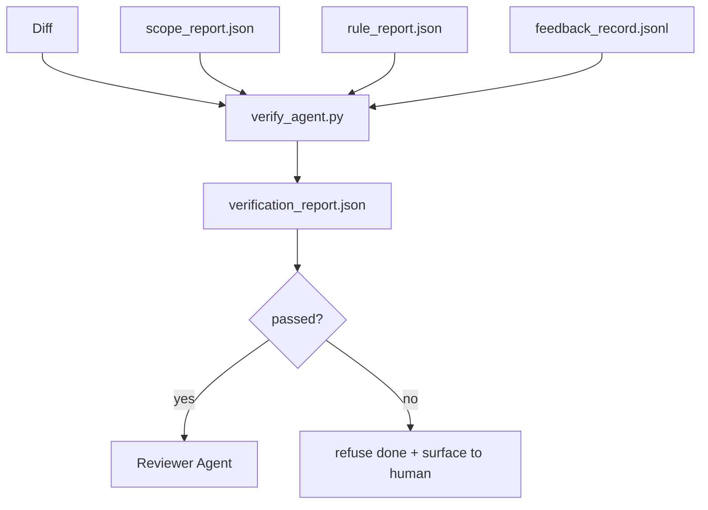

# 验证门

> Agent 不能自行标记其工作已完成。验证门会读取范围契约、反馈日志、规则报告和 diff，并回答一个问题：这个任务是否真的完成了？如果验证门说不，那么无论聊天记录里说了什么，任务都没有完成。

**Type:** Build
**Languages:** Python (stdlib)
**Prerequisites:** Phase 14 · 33 (Rules)、Phase 14 · 36 (Scope)、Phase 14 · 37 (Feedback)
**Time:** 约 55 分钟

## 学习目标

- 将验证门定义为工作台产物之上的确定性函数。
- 将规则报告、范围报告、反馈记录和 diff 合并为单一裁定结果。
- 输出一个 `verification_report.json`，供评审 agent 和 CI 共同读取。
- 任何 block 级别的失败都拒绝推进任务，无一例外。

## 问题所在

Agent 声称成功过于轻率。三种失败形态最为常见：

- "看起来没问题。" 模型阅读了自己的 diff 并自行判定它是正确的。
- "测试通过了。" 说得言之凿凿，却没有测试实际运行过的记录。
- "满足验收标准。" 验收标准被宽松解读到足以等同于"看起来像完成了就行"。

工作台的解决方案是一个单一的验证门，它读取 agent 已经产出的产物并做出裁定。验证门是确定性的。验证门受版本控制。验证门接入 CI。Agent 无法贿赂它。

## 核心概念



### 验证门检查什么

| 检查项 | 来源产物 | 严重级别 |
|-------|-----------------|----------|
| 所有验收命令都已运行 | `feedback_record.jsonl` | block |
| 所有验收命令均以零退出 | `feedback_record.jsonl` | block |
| 范围检查无禁止写入 | `scope_report.json` | block |
| 范围检查无越界写入 | `scope_report.json` | block 或 warn |
| 所有 block 级规则均通过 | `rule_report.json` | block |
| 反馈中没有 `null` 退出码 | `feedback_record.jsonl` | block |
| 被改动的文件匹配 `scope.allowed_files` | both | warn |

一条 `warn` 发现会附加在裁定结果上；一条 `block` 发现会阻止 `passed: true`。

### 确定性，而非概率性

对于相同的产物集合，验证门每次必须产生相同的裁定结果。不用 LLM 裁判。LLM 裁判属于评审一侧（Phase 14 · 39），那里追求的是定性评估，而非状态判定。

### 一份报告，一条路径

验证门在每次任务收尾时输出一份 `verification_report.json`，写入 `outputs/verification/<task_id>.json` 之下。CI 消费同一路径。多个使用不同路径的验证门会分裂事实来源。

### 无例外拒绝

block 级别的发现不能由 agent 覆盖。它们只能由人工覆盖，且必须有记录在案的 `override_reason` 和一个 `overridden_by` 用户 id。覆盖是一次有签名的变更，而不是 agent 的决定。

```figure
wb-gate-sequence
```

## 动手构建

`code/main.py` 实现了：

- 每个输入产物的加载器，全部在本地打桩，使课程自包含。
- 一个 `verify(task_id, artifacts) -> VerdictReport` 纯函数。
- 一个打印器，展示每项检查的结果和最终的通过/失败。
- 一个包含三种任务场景的演示：干净通过、范围蔓延、缺失验收。

运行它：

```
python3 code/main.py
```

输出：三份裁定报告，每份保存在脚本旁边。

## 业界生产模式

四种模式将验证门从"又一个 lint 任务"提升为"最终裁决关口"。

**纵深防御，而非单道门。** pre-commit 钩子 → CI 状态检查 → pre-tool 授权钩子 → 合并前验证门。每一层都是确定性的，因此某一层的失败会被下一层捕获。microservices.io 的 2026 年 3 月手册明确指出：pre-commit 钩子是不可绕过的，因为与模型侧的技能不同，它不依赖于 agent 是否遵循指令。验证门位于 CI / 合并前这一层。

**确定性检查做防御，模型裁判只处理细微判断。** Anthropic 2026 年的 Hybrid Norm 配对：可验证的奖励（单元测试、schema 检查、退出码）回答"代码是否解决了问题？"——LLM 评分表回答"代码是否可读、安全、符合风格？"验证门运行第一类；评审者（Phase 14 · 39）运行第二类。混用两者会破坏信号。

**有签名的覆盖日志，而非 Slack 讨论。** 每次覆盖都会在 `outputs/verification/overrides.jsonl` 中产生一行记录：时间戳、发现代码、原因、签名用户、当前 HEAD 提交。运行时拒绝任何缺少签名的覆盖；审计轨迹由 git 追踪。这就是真正的覆盖策略与覆盖表演之间的分界线。

**覆盖率下限作为一等检查项。** 一份 `coverage_report.json` 输入到一个 `coverage_floor`（默认 80%）检查中。如果实测覆盖率低于下限，或比上一次合并的下限低超过 1 个百分点，验证门即失败。没有这项检查，agent 会悄悄删掉失败的测试，而验证报告却保持绿色。

**`--strict` 模式将 warn 提升为 block。** 对于发布分支、阻塞交付的 PR 或事后故障分诊，`--strict` 会让每一条警告都成为硬性失败。该标志按分支选择性开启；不是全局默认值，因为事事严格会侵蚀日常工作流。

## 使用场景

生产模式：

- **CI 步骤。** 一个 `verify_agent` 作业针对 agent 的最终产物运行验证门。合并保护在没有 `passed: true` 时拒绝合并。
- **交接前钩子。** agent 运行时在生成交接文档之前调用验证门。没有绿色裁定，就没有交接。
- **人工分诊。** 当 agent 声称成功而人工表示怀疑时，运维人员阅读该报告。

验证门是工作台流程中的最终裁决关口。其他所有环节都在它的上游。

## 交付上线

`outputs/skill-verification-gate.md` 将验证门接入具体项目：哪些验收命令输入给它，哪些规则是 block 级别，哪些越界写入被容忍，覆盖审计日志如何存储。

## 练习

1. 添加一项 `coverage_floor` 检查：测试命令必须产出覆盖率不低于 80% 的覆盖率报告。决定由哪个产物承载该下限。
2. 支持一种 `--strict` 模式，将每个 `warn` 提升为 `block`。记录哪些情况下严格模式适合作为默认值。
3. 让验证门在 JSON 之外再产出一份 Markdown 摘要。论证哪些字段应包含在摘要中。
4. 添加一项 `time_since_last_human_touch` 检查：在人工按键后 60 秒内被编辑的任何文件豁免越界标记。
5. 在你产品的真实 agent diff 上运行验证门。多少发现是真实的，多少是噪声？验证门需要在哪里扩展？

## 关键术语

| 术语 | 人们怎么说 | 实际含义 |
|------|----------------|------------------------|
| 验证门 | "拦住东西的那个检查" | 工作台产物之上的确定性函数，产生通过/失败裁定 |
| Block 级严重性 | "硬性失败" | 一种阻止 `passed: true` 且需要签名覆盖的发现 |
| 覆盖日志 | "我们为什么放行" | 带原因和用户 id 的签名条目，由评审审计 |
| 验收命令 | "证据" | 一条 shell 命令，其零退出码即 `done` 的含义 |
| 单一报告路径 | "事实来源" | `outputs/verification/<task_id>.json`，CI 和人工共同消费 |

## 延伸阅读

- [Anthropic, Harness design for long-running application development](https://www.anthropic.com/engineering/harness-design-long-running-apps)
- [OpenAI Agents SDK guardrails](https://openai.github.io/openai-agents-python/guardrails/)
- [microservices.io, GenAI dev platform: guardrails](https://microservices.io/post/architecture/2026/03/09/genai-development-platform-part-1-development-guardrails.html) — pre-commit 与 CI 之间的纵深防御
- [ICMD, The 2026 Playbook for Agentic AI Ops](https://icmd.app/article/the-2026-playbook-for-agentic-ai-ops-guardrails-costs-and-reliability-at-scale-1776661990431) — 审批门阶梯（草稿 → 审批 → 阈值内自动执行）
- [Type-Checked Compliance: Deterministic Guardrails (arXiv 2604.01483)](https://arxiv.org/pdf/2604.01483) — Lean 4 作为确定性门控的上限
- [logi-cmd/agent-guardrails — merge gate spec](https://github.com/logi-cmd/agent-guardrails) — 范围门 + 变异测试门
- [Guardrails AI x MLflow](https://guardrailsai.com/blog/guardrails-mlflow) — 作为 CI 评分器的确定性验证器
- [Akira, Real-Time Guardrails for Agentic Systems](https://www.akira.ai/blog/real-time-guardrails-agentic-systems) — 工具前置/后置门控
- Phase 14 · 27 — 提示注入防御（验证门的对抗配对）
- Phase 14 · 36 — 本验证门所强制执行的范围契约
- Phase 14 · 37 — 本验证门所评分的反馈日志
- Phase 14 · 39 — 验证门向其交接的评审 agent