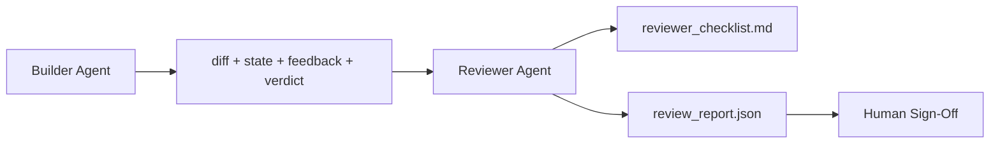

# 审查者代理：将构建者与评分者分离

> 编写代码的代理不能给它自己打分。审查者是一个拥有不同系统提示、不同目标，以及对构建者产出的一切只读访问权限的第二循环。构建者与审查者之间的差距，正是大部分可靠性所在之处。

**Type:** Build
**Languages:** Python (stdlib)
**Prerequisites:** 第 14 阶段 · 38(验证门)
**Time:** 约 55 分钟

## 学习目标

- 说明为什么同一个代理无法可靠地审查自己的工作。
- 构建一个审查者代理循环，该循环消费构建者的产物并输出一份结构化的审查报告。
- 编写一份按具体维度评分(而非凭感觉)的审查者评分细则。
- 将审查者接入工作台，使人工审查步骤从一个真实产物开始。

## 问题

你让代理修复一个 bug。它编辑了四个文件，运行了测试，并报告完成。验证门(第 14 阶段 · 38)确认验收已运行且范围未扩大。门返回 `passed: true`。你合并了代码。两天后你发现，这个修复只解决了 bug 中错误的那一半。

验收是必要的，但并不充分。审查者会提出验收无法提出的问题：这是否解决了正确的问题？它是否在未标记的情况下扩大了范围？它是否记录了本应被质疑的假设？它是否让工作台处于下一个会话可以顺利接手的状态？

## 概念



### 审查者评分细则

五个维度，每个维度评分 0 到 2。

| 维度 | 问题 |
|-----------|----------|
| 问题契合度 | 该变更是否解决了所陈述的任务，而不是一个相近的任务？ |
| 范围纪律 | 编辑是否被限制在契约之内，还是契约被有意扩大？ |
| 假设 | 所有隐藏的假设是否都写在可审查的地方？ |
| 验证质量 | 验收命令是否真正证明了目标，还是只证明了一个较弱的版本？ |
| 交接就绪度 | 下一个会话能否从当前状态顺利接手？ |

总分 10 分。低于 7 分为软失败；低于 5 分为硬失败。

### 审查者是一个独立的角色，而非独立的模型

你可以使用与构建者相同的模型运行审查者。纪律在于角色分离：不同的系统提示、不同的输入、对 diff 没有写权限。姿态的改变就是信号的改变。

### 审查者不能编辑 diff

审查者阅读 diff、状态、反馈和判定结果。它撰写一份报告。它不会修补 diff。如果报告说“修复这个”，下一个构建者回合执行修复；审查者则回到审查工作中。混淆角色会消除这个差距。

### 审查者评分细则与验证门

门(第 14 阶段 · 38)检查确定性事实：验收是否运行、规则是否通过、范围是否守住。审查者做出定性判断：这是否是正确的工作、是否有文档记录、交接是否可用。两者都需要。

```figure
wb-builder-marker
```

## 构建它

`code/main.py` 实现了：

- 一个 `ReviewerInputs` dataclass,捆绑审查者读取的产物。
- 一个评分器，每个维度对应一个函数。每个函数都是确定性的，且在本课中仅为桩级实现；真实实现会调用 LLM。
- 一个 `review_report.json` 写入器，包含五个分数、总分和判定(`pass`、`soft_fail`、`hard_fail`)。
- 两个演示用例：一个干净的变更，以及一个“测试正确但问题错误”的变更。

运行它：

```
python3 code/main.py
```

输出：写入磁盘的两份审查报告，以及一个维度分数的控制台表格。

## 业界生产模式

数据凭证：Cloudflare 于 2026 年 4 月推出的 AI 代码审查系统，在 30 天内跨 5,169 个仓库的 48,095 个合并请求运行了 131,246 次审查。审查完成时间中位数为 3 分 39 秒。最多七个专家审查者(安全、性能、代码质量、文档、发布管理、合规、Engineering Codex)在一个 Review Coordinator 之下并行运行，由该协调器去重发现并评判严重程度。顶级模型专供协调器使用；专家运行在更便宜的层级上。

四个模式使其能大规模运作。

**专家池，而非一个大审查者。** 带有 5 维度评分细则的单个审查者适用于个人仓库。一旦代码库包含安全关键、性能关键和文档相关的界面，就应拆分为更小提示的专家。协调器负责去重；专家从不运行完整评分细则。模型层级分离随之自然形成：便宜专家，昂贵协调器。

**偏差缓解是设计要求，而非优化。** LLM 评审者表现出四种可靠的偏差(Adnan Masood,2026 年 4 月)：位置偏差(GPT-4 在 (A,B) 与 (B,A) 排序上约 40% 不一致)、冗长偏差(对较长输出约 15% 的分数膨胀)、自我偏好(评审者偏好同一模型家族的输出)、权威偏差(评审者高估对知名作者的引用)。缓解措施：评估两种排序并只统计一致的胜出；使用明确奖励简洁性的 1-4 分制；跨模型家族轮换评审者；在评分前去除作者姓名。

**校准集，而非凭感觉。** 一个包含 10-20 个任务、带有已知正确判定结果的历史集合。每次提示变更时都在其上运行审查者。如果与历史记录的一致率低于 80%,评分细则需要在审查者上线前修订。这是每个团队最终都会重新发现的东西；不如一开始就用上。

**与门混合的规范。** 验证门(第 14 阶段 · 38)处理确定性检查(验收是否运行、测试是否通过、范围是否守住)。审查者处理语义检查(这是否是正确的工作、假设是否有记录、交接是否可用)。Anthropic 2026 年的指导明确划分了这一界限：不要要求审查者重做门已经证明的事情。

## 使用它

生产模式：

- **Claude Code 子代理。** 审查者子代理在构建者完成任务后运行。它在 PR 上发布包含评分细则分数的评论。
- **OpenAI Agents SDK 交接。** 构建者在任务完成时交接给审查者。审查者可以带着一份发现清单交回，或交还给人类。
- **双模型配对。** 构建者运行在更快的廉价模型上。审查者运行在更强、上下文更小的模型上，专注于判断。

审查者是工作台在人类无法亲自完成每次审查时培养出的第二双眼睛。

## 发布它

`outputs/skill-reviewer-agent.md` 生成一份针对特定项目的审查者评分细则、一个连接到构建者产物的审查者代理桩，以及与验证门的集成，使人工审查从一份书面报告开始，而不是一张空白页。

## 练习

1. 添加一个针对你的产品领域的第六维度。论证它为何不能被现有五个维度吸收。
2. 用两个不同的系统提示(简洁、详细)运行审查者。哪个产生的报告更可能被人阅读？
3. 为每个维度添加一个 `confidence` 字段。当最低维度的置信度低于 0.6 时，拒绝发布报告。
4. 构建一个校准集：10 个带有已知正确判定结果的历史任务收尾。在其上运行审查者。它在何处与历史记录不一致？
5. 添加一个“请求更多证据”的机制：审查者可以在评分前要求构建者运行特定的测试。怎样的退避策略才不会导致循环？

## 关键术语

| 术语 | 人们怎么说 | 它实际的含义 |
|------|------------------------|
| 审查者评分细则 | “清单” | 五维度 0-2 评分，每个维度有一个书面问题 |
| 软失败 | “需要修改” | 总分低于 7;构建者收到需要处理的发现 |
| 硬失败 | “拒绝” | 总分低于 5 或任一维度为 0;停止并上报给人类 |
| 角色分离 | “不同的提示” | 同一模型可以担任两种角色；纪律在于输入和姿态 |
| 置信度下限 | “不要发布低信号报告” | 当评分细则不确定时，拒绝输出判定 |

## 延伸阅读

- [OpenAI Agents SDK 交接](https://openai.github.io/openai-agents-python/handoffs/)
- [Anthropic Claude Code 子代理](https://code.claude.com/docs/en/sub-agents)
- [Cloudflare,大规模编排 AI 代码审查](https://blog.cloudflare.com/ai-code-review/) — 7 专家 + 协调器架构,131k 次运行 / 30 天
- [Agent-as-a-Judge:用代理评估代理(OpenReview / ICLR)](https://openreview.net/forum?id=DeVm3YUnpj) — DevAI 基准，366 个分层解决方案需求
- [Adnan Masood,基于评分细则的评估与 LLM-as-a-Judge:方法论、偏差、实证验证](https://medium.com/@adnanmasood/rubric-based-evals-llm-as-a-judge-methodologies-and-empirical-validation-in-domain-context-71936b989e80) — 四种偏差及缓解措施
- [MLflow,LLM-as-a-Judge 评估](https://mlflow.org/llm-as-a-judge) — 分离构建者/评估者的生产工具
- [LangChain,如何用人工校正校准 LLM-as-a-Judge](https://www.langchain.com/articles/llm-as-a-judge) — 校准集工作流
- [Evidently AI,LLM-as-a-judge:完整指南](https://www.evidentlyai.com/llm-guide/llm-as-a-judge)
- [Arize,LLM as a Judge — 入门与预构建评估器](https://arize.com/llm-as-a-judge/)
- 第 14 阶段 · 05 — Self-Refine 与 CRITIC(单代理自审查基线)
- 第 14 阶段 · 30 — 评估驱动的代理开发(校准集生成器)
- 第 14 阶段 · 38 — 审查者读取的验证门
- 第 14 阶段 · 40 — 审查者报告所馈送的交接包