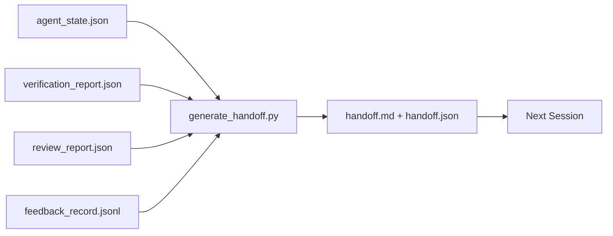

# 多会话交接

> 会话即将结束。工作不会。交接包是这样一个产物：它把“智能体工作了一个小时”变成“下一个会话在第一分钟就进入高效状态”。要有意识地构建它，而不是事后补救。

**Type:** Build
**Languages:** Python（标准库）
**Prerequisites:** Phase 14 · 34（仓库记忆）、Phase 14 · 38（验证）、Phase 14 · 39（审查者）
**Time:** 约 50 分钟

## 学习目标

- 识别每个交接包都需要的七个字段。
- 从工作台产物生成交接包，无需手写文字。
- 将庞大的反馈日志精简为交接包大小的摘要。
- 让下一个会话的第一个动作具有确定性。

## 问题所在

会话结束了。智能体说“很好，我们取得了进展”。下一个会话开启。下一个智能体问“我们上次进行到哪里了？”第一个智能体的回答已经丢失。下一个智能体重新探索、重新运行相同的命令、向人类重新提出相同的问题，并花费三十分钟来恢复上一个会话的最后三十秒。

糟糕交接的代价在任务的整个生命周期中每个会话都要支付一次。解决方案是会话结束时自动生成的数据包：改了什么、为什么改、尝试了什么、什么失败了、还剩什么、下次先做什么。

## 概念



### 每个交接包都包含的七个字段

| 字段 | 回答的问题 |
|-------|---------------------|
| `summary` | 一段话说明完成了什么 |
| `changed_files` | 一目了然的差异 |
| `commands_run` | 实际执行了什么 |
| `failed_attempts` | 尝试了什么以及为什么没有成功 |
| `open_risks` | 下个会话可能踩到什么坑，及其严重程度 |
| `next_action` | 下个会话要采取的第一个具体步骤 |
| `verdict_pointer` | 验证与审查报告的路径 |

`next_action` 字段是承重的那一个。除了 `next_action` 之外什么都有交接包是一份状态报告，而不是交接。

### 交接包是生成的，不是手写的

手写的交接包在艰难的一天就会被跳过。生成器读取工作台产物并输出数据包。智能体的职责是把工作台留在生成器可以总结的状态，而不是亲自写总结。

### 两种形式：人类可读和机器可读

`handoff.md` 是人类阅读的。`handoff.json` 是下一个智能体加载的。两者来自相同的源产物。如果它们不一致，以 JSON 为准。

### 反馈日志精简

完整的 `feedback_record.jsonl` 可能有数百条记录。交接包只携带最后 K 条加上所有非零退出的记录。下一个会话在需要时可以加载完整日志，但数据包保持小巧。

### 留下一个干净的状态

交接包描述工作。干净的状态让工作可恢复。它们不是一回事。如果下一个会话打开时面对的是半应用的差异、一个智能体忘记的临时文件、一个游离分支，以及一运行就报错的测试，那么再完美的 `handoff.md` 也毫无价值。然后下一个智能体会在前十分钟里收拾上一个的烂摊子，而不是开始构建，而且这个代价在任务的整个生命周期中每个会话都在累积。

所以会话不是在功能可用时结束的。而是在工作台处于生成器可以总结、下一个会话可以信任的状态时结束。清理是独立的阶段，在交接之前运行，而且它是一项检查，不是一个习惯，因为习惯正是艰难日子里会被跳过的东西。

| 检查项 | 干净的含义 | 脏乱为何阻塞 |
|-------|-------------|----------------------|
| 工作树 | 每处更改都已提交，或带有说明地显式储藏 | 半应用的差异在下一个智能体看来像是有意的工作 |
| 临时产物 | 不留下 `*.tmp`、临时目录、调试打印或被注释掉的代码块 | 游离文件污染差异和下一个智能体的心智模型 |
| 测试 | 通过，或在 `open_risks` 中注明失败原因的失败 | 静默的红色测试是下一个会话会踩进去的陷阱 |
| 功能看板 | `feature_list.json` 状态反映实际情况（Phase 14 · 36） | 过期的看板把下一个会话引向已经完成的工作 |
| 分支 | 在预期的分支上，没有分离 HEAD，没有孤儿分支 | 错误的分支意味着下一个会话的第一次提交落在错误的位置 |

清理阶段输出一份阻塞问题的 `clean_state.json`；空列表是交接生成器在写入数据包之前断言的前提条件。建立在脏树上的交接包不是交接包，而是被转发的烂摊子。这两个产物成对出现：清理证明工作台可以安全离开，交接包证明下一个会话知道从哪里开始。

```figure
wb-handoff-packet
```

## 动手构建

`code/main.py` 实现了：

- 一个加载器，将状态、判定、审查和反馈汇集到一个 `WorkbenchSnapshot` 中。
- 一个 `generate_handoff(snapshot) -> (markdown, payload)` 函数。
- 一个过滤器，选取最后 K 条反馈记录加上所有非零退出。
- 一次演示运行，在脚本旁边写入 `handoff.md` 和 `handoff.json`。

运行它：

```
python3 code/main.py
```

输出：打印的交接正文，外加磁盘上的两个文件。

## 业界的生产模式

Codex CLI、Claude Code 和 OpenCode 各有不同的压缩方案；结构化交接数据包叠加在三者之上。

**压缩策略各异；数据包模式不变。** Codex CLI 的 POST /v1/responses/compact 是服务端不透明的 AES 加密块（OpenAI 模型的快速路径）；其回退方案是作为 `_summary` 用户角色消息附加的本地“交接摘要”。Claude Code 在上下文达到 95% 时运行五阶段渐进式压缩。OpenCode 采用基于时间戳的消息隐藏加上一个包含 5 个标题的 LLM 摘要。三种不同的机制，同一个需求：把压缩后存活的内容序列化为可移植的产物。数据包就是这个产物。

**新会话交接不是压缩。** 压缩是延长一个会话；交接是干净地关闭一个会话并开始下一个。Hermes Issue #20372 的观点（2026 年 4 月）是对的：当原地压缩开始劣化时，智能体应该写一份精简的交接包，结束会话，并在全新的上下文中恢复。数据包让这种转换变得廉价。错误的做法是一直压缩直到质量崩溃；正确的做法是为及早、干净的交接预留预算。

**每个分支和主题只有一个活跃交接包。** 多智能体协调在过期交接包上的失败比在糟糕的模型输出上更多。始终包含 `branch`、`last_known_good_commit` 和一个 `active | superseded | archived` 的 `status`。过期的交接包被归档；只有活跃的那个驱动下一个会话。这就是“交接即笔记”和“交接即状态”的区别。

**在 50-75% 上下文时收尾，而不是在撞墙时。** 手写模式手册（CLAUDE.md + HANDOVER.md）报告的最佳结果是会话在 50-75% 上下文预算时结束，而不是 95%。数据包生成器在压缩产物污染源状态之前可以干净地运行。上下文完整时写起来很便宜；模型已经开始迷失时写起来就很昂贵。

## 使用它

生产模式：

- **会话结束钩子。** 用户关闭聊天时运行时触发生成器。数据包进入 `outputs/handoff/<session_id>/`。
- **PR 模板。** 生成器的 markdown 也可以作为 PR 正文。审查者无需打开另外五个文件就能阅读。
- **跨智能体交接。** 用一个产品构建（Claude Code），用另一个继续（Codex）。数据包是通用语言。

数据包小巧、规整、生成成本低。节省的成本随每个会话累积。

## 交付它

`outputs/skill-handoff-generator.md` 产出一个针对项目产物路径调优的生成器、一个运行它的会话结束钩子，以及下一个智能体启动时读取的 `handoff.json` 模式。

## 练习

1. 添加一个 `assumptions_to_validate` 字段，列出构建者记录了但审查者未给出高于 1 分的所有假设。
2. 针对失败的运行与通过的运行，用不同的方式精简反馈摘要。为这种不对称性辩护。
3. 加入一个“向人类提问”列表。一个问题进入数据包而非聊天消息的门槛是什么？
4. 让生成器具有幂等性：运行两次产生相同的数据包。要做到这一点，什么必须保持稳定？
5. 添加一个“下个会话前置条件”部分，确切列出下一个会话在行动之前必须加载的产物。

## 关键术语

| 术语 | 人们怎么说 | 实际含义 |
|------|----------------|------------------------|
| 交接包 | “会话摘要” | 包含七个字段的生成产物，同时有 markdown 和 JSON |
| 下一步动作 | “先做什么” | 开启下一个会话的那个具体步骤 |
| 反馈精简 | “日志摘要” | 最后 K 条记录加上所有非零退出 |
| 状态报告 | “我们做了什么” | 缺少 `next_action` 的文档；有用，但不是交接 |
| 判定指针 | “凭据” | 指向验证与审查报告的路径，用于追溯 |

## 延伸阅读

- [Anthropic，长时运行智能体的有效脚手架](https://www.anthropic.com/engineering/effective-harnesses-for-long-running-agents)
- [OpenAI Agents SDK 交接](https://openai.github.io/openai-agents-python/handoffs/)
- [Codex Blog，Codex CLI 上下文压缩：架构、配置、管理长会话](https://codex.danielvaughan.com/2026/03/31/codex-cli-context-compaction-architecture/) — POST /v1/responses/compact 与本地回退
- [Justin3go，卸下沉重记忆：Codex、Claude Code、OpenCode 中的上下文压缩](https://justin3go.com/en/posts/2026/04/09-context-compaction-in-codex-claude-code-and-opencode) — 三家厂商的压缩对比
- [JD Hodges，Claude 交接提示：如何跨会话保持上下文（2026）](https://www.jdhodges.com/blog/ai-session-handoffs-keep-context-across-conversations/) — CLAUDE.md + HANDOVER.md，50-75% 上下文预算
- [Mervin Praison，管理多智能体编程会话中的交接：不丢失连续性的全新上下文](https://mer.vin/2026/04/managing-handoffs-in-multi-agent-coding-sessions-fresh-context-without-losing-continuity/) — 分布式系统视角
- [Hermes Issue #20372 — 当压缩变得有风险时自动进行新会话交接](https://github.com/NousResearch/hermes-agent/issues/20372)
- [Hermes Issue #499 — 上下文压缩质量改进](https://github.com/NousResearch/hermes-agent/issues/499) — Codex CLI 中面向交接的提示
- [Microsoft Agent Framework，压缩](https://learn.microsoft.com/en-us/agent-framework/agents/conversations/compaction)
- [OpenCode，上下文管理与压缩](https://deepwiki.com/sst/opencode/2.4-context-management-and-compaction)
- [LangChain，面向智能体的上下文工程](https://www.langchain.com/blog/context-engineering-for-agents)
- Phase 14 · 34 — 生成器读取的状态文件
- Phase 14 · 38 — 数据包指向的验证判定
- Phase 14 · 39 — 打包进数据包的审查报告