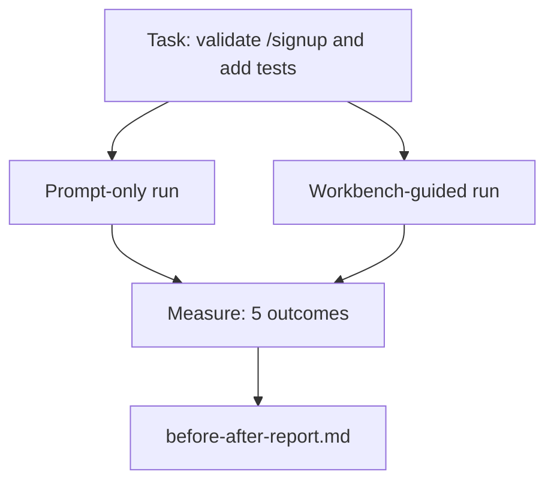

# 真实仓库上的工作台

> 十一课的表面知识如果无法在真实代码库的接触中存活，就毫无价值。本课在一个小型示例应用上将同一任务运行两次：仅提示词与工作台引导。让数据来说话。

**Type:** Build
**Languages:** Python (标准库)
**Prerequisites:** 阶段 14 · 32 至 14 · 40
**Time:** 约 60 分钟

## 学习目标

- 在一个小型应用上综合运用七个工作台表面。
- 运行同一任务两次（仅提示词与工作台引导）并测量五个结果。
- 阅读前后对比报告，判断哪些表面提供了最大的杠杆作用。
- 面对“我的模型已经够好了”的质疑，为工作台辩护。

## 问题所在

在玩具任务上的演示无法说服任何人。工作台的价值在于：一个感觉真实的任务在感觉真实的仓库上落地生产时，失败更少、回滚更少，并产生下一个会话可以使用的交接包。

本课提供了这个感觉真实的仓库，并通过两条流水线运行同一任务。结果是一份可以交给怀疑论者的前后对比报告。

## 概念



### 示例应用

`sample_app/` 中的一个极简 FastAPI 风格处理器：

- `app.py`，带有 `/signup`（尚无验证）。
- `test_app.py`，包含一个正常路径测试。
- `README.md` 和 `scripts/release.sh` 作为禁区诱饵。

### 任务

> 为 `/signup` 添加输入验证：拒绝少于 8 个字符的密码，返回 422 并附带类型化错误包。添加一个证明新行为的测试。

### 两条流水线

仅提示词：

1. 阅读 README。
2. 阅读 `app.py`。
3. 编辑文件。
4. 声称完成。

工作台引导：

1. 运行初始化脚本（第 35 课）。
2. 阅读范围契约（第 36 课）。
3. 阅读状态（第 34 课）。
4. 仅编辑允许的文件。
5. 通过反馈运行器运行验收命令（第 37 课）。
6. 运行验证门（第 38 课）。
7. 运行审查者（第 39 课）。
8. 生成交接包（第 40 课）。

### 测量的五个结果

| 结果 | 为何重要 |
|---------|----------------|
| `tests_actually_run` | 大多数“测试通过”的说法无法验证 |
| `acceptance_met` | 证明目标的测试必须是实际运行的测试 |
| `files_outside_scope` | 范围蔓延是主要的隐性失败 |
| `handoff_quality` | 下一个会话为此付出代价或从中受益 |
| `reviewer_total` | 在验证门之上的定性判断 |

```figure
wb-ab-runs
```

## 动手构建

`code/main.py` 针对同一示例应用夹具编排两条流水线。两条流水线均为脚本化（无 LLM 参与），因此测量是可复现的。脚本将对比结果写入 `before-after-report.md` 和 `comparison.json`。

运行它：

```
python3 code/main.py
```

输出：每个流水线的结果控制台表格、保存在脚本旁边的 Markdown 报告，以及供想要绘图的人使用的 JSON。

## 生产环境中的真实模式

怀疑论者的问题是：“工作台到底有多大帮助？”2026 年的数据比解释更有说服力。

**同一模型在 Terminal Bench 上从 Top-30 跃升至 Top-5。** LangChain 的 *Anatomy of an Agent Harness*（2026 年 4 月）：一个编码智能体仅通过更改 harness，就在 Terminal Bench 2.0 上从 30 名以外跃升至第五名。同一模型。不同的表面。25 个名次的差距。

**Vercel 通过删除工具将成功率从 80% 提升到 100%。** Vercel 报告称，删除其智能体 80% 的工具使成功率从 80% 提升到 100%。更小的工具表面、更清晰的范围、更少的失败方式。负空间获胜。

**Harvey 仅通过 harness 将准确率提升 2 倍。** 法律智能体的准确率通过 harness 优化翻了一倍以上，模型未作任何更改。

**88% 的企业级 AI 智能体项目未能进入生产。** preprints.org 的 *Harness Engineering for Language Agents* 论文（2026 年 3 月）将失败归因于运行时而非推理：过时的状态、脆弱的重试、过度膨胀的上下文、对中间错误恢复能力差。

**长上下文崩溃。** WebAgent 基线 40-50% 的成功率在长上下文条件下降至 10% 以下，主要源于无限循环和目标丢失。Ralph Loop 和交接包的存在正是为了吸收这一点。

**假阴性依然存在。** 单步事实任务、单行 lint、格式化程序运行、模型逐字记住的任何内容——这些任务仅用提示词运行得更快。基准测试应诚实地列举它们，以免工作台被框定为杀鸡用牛刀。

结论不是“harness 永远获胜”。模型确实会随时间吸收 harness 的技巧。结论是：今天，工程负载位于七个表面之中，而数据证明了这一点。

## 应用场景

本课是你在以下情况引用的案例档案：

- 有人问为什么每个 PR 都带有 `agent-rules.md` 和范围契约。
- 一个团队想“只在这个冲刺”放弃验证门。
- 一个新的智能体产品发布，你需要一个可移植的基准来判断它是否真正节省时间。

数据比解释传播得更远。

## 发布上线

`outputs/skill-workbench-benchmark.md` 是一个可移植的评估 harness，它针对项目自身的示例应用，通过两条流水线运行任何智能体产品，并报告五个结果。

## 练习

1. 增加第六个结果：首次有意义编辑的耗时。如何干净地测量它？
2. 在代码库中一个真实的第二天的任务上运行对比。工作台的数据在哪里下滑？
3. 增加一个“假阴性”环节：仅提示词本会更快、工作台开销是真实成本的任务。仍然为保留工作台辩护。
4. 将脚本化的“智能体”替换为真实的 LLM 调用。哪些结果会变得更嘈杂？
5. 为非工程师撰写一页纸的摘要。什么内容能留存下来？

## 关键术语

| 术语 | 人们怎么说 | 实际含义 |
|------|------------------------|
| 示例应用 | “玩具仓库” | 小但足够真实，能锻炼所有七个表面 |
| 流水线 | “工作流” | 智能体遵循的表面读/写的有序序列 |
| 前后对比报告 | “证据” | 交给怀疑论者的产物 |
| 假阴性 | “工作台过度设计” | 仅提示词更快的任务；诚实列举很有用 |
| 工作台基准 | “可靠性得分” | 在你的代码库上运行对比的可移植 harness |

## 延伸阅读

- [LangChain, The Anatomy of an Agent Harness](https://blog.langchain.com/the-anatomy-of-an-agent-harness/) — Terminal Bench Top-30 到 Top-5 的证据
- [MongoDB, The Agent Harness: Why the LLM Is the Smallest Part of Your Agent System](https://www.mongodb.com/company/blog/technical/agent-harness-why-llm-is-smallest-part-of-your-agent-system) — Vercel + Harvey 的数据
- [preprints.org, Harness Engineering for Language Agents](https://www.preprints.org/manuscript/202603.1756) — 88% 企业失败率，运行时根本原因
- [HN: Improving 15 LLMs at Coding in One Afternoon. Only the Harness Changed](https://news.ycombinator.com/item?id=46988596) — 在 15 个模型上复现
- [Cloudflare, Orchestrating AI Code Review at Scale](https://blog.cloudflare.com/ai-code-review/) — 生产环境中 30 天内 13.1 万次审查运行
- [Anthropic, Building Effective Agents](https://www.anthropic.com/research/building-effective-agents)
- 阶段 14 · 32 至 14 · 40 — 本课端到端锻炼的表面
- 阶段 14 · 19 — SWE-bench、GAIA、AgentBench 作为本课补充的宏观基准
- 阶段 14 · 30 — 本 harness 所接入的评估驱动智能体开发