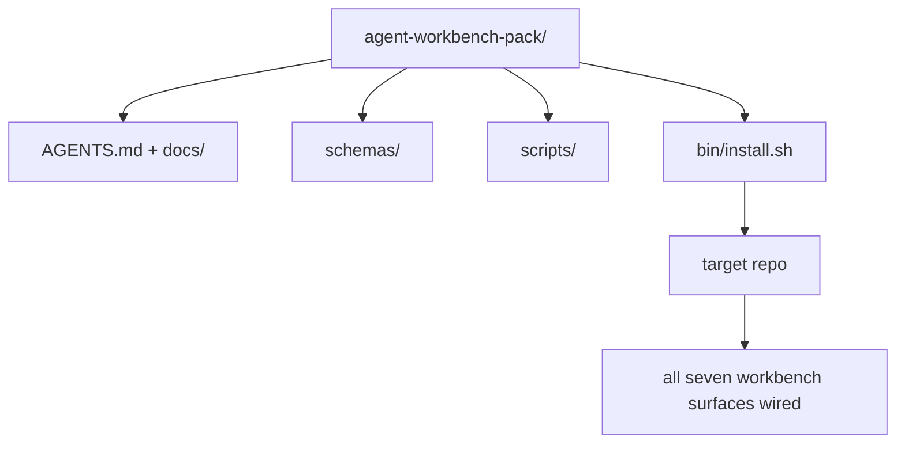

# 毕业项目：交付一个可复用的 Agent 工作台包

> 这个迷你课程结束时，你会得到一个可以放入任何仓库的包。十一节课的表面浓缩成一个目录，你可以 `cp -r`，第二天早上 agent 就能稳定工作。这个毕业项目就是本课程的核心产出物。

**Type:** Build
**Languages:** Python（标准库）
**Prerequisites:** 阶段 14 · 31 到 14 · 41
**Time:** 约 75 分钟

## 学习目标

- 将七个工作台表面打包成一个可直接放入的目录。
- 固定 schema、脚本和模板，使新仓库获得一个已知可用的基线。
- 添加一个幂等地部署该包的单一安装脚本。
- 决定什么留在包内、什么留在包外，并为每项取舍给出理由。

## 问题

一个散落在 Google Doc、聊天记录和三个记得不太清楚的脚本中的工作台，是每个季度都要重建一次的工作台。解决方案是一个带版本的包：一个包含表面、schema、脚本和一键安装器的仓库或目录。

本课结束时，你将在磁盘上交付 `outputs/agent-workbench-pack/`，以及一个可将它放入任何目标仓库的 `bin/install.sh`。

## 概念



### 包的布局

```
outputs/agent-workbench-pack/
├── AGENTS.md
├── docs/
│   ├── agent-rules.md
│   ├── reliability-policy.md
│   ├── handoff-protocol.md
│   └── reviewer-rubric.md
├── schemas/
│   ├── agent_state.schema.json
│   ├── task_board.schema.json
│   └── scope_contract.schema.json
├── scripts/
│   ├── init_agent.py
│   ├── run_with_feedback.py
│   ├── verify_agent.py
│   └── generate_handoff.py
├── bin/
│   └── install.sh
└── README.md
```

### 什么留下，什么排除

留下的：

- 表面 schema。它们是契约。
- 上述四个脚本。它们是运行时。
- 四份文档。它们是规则和评分标准。

排除的：

- 项目特定的任务。任务属于目标仓库的看板，不属于包。
- 厂商 SDK 调用。包是框架无关的。
- 入职指南。包放在团队现有入职材料旁边，而不是嵌在其中。

### 安装器

一个简短的 `bin/install.sh`（或 `bin/install.py`）：

1. 在没有 `--force` 的情况下拒绝覆盖已有的包。
2. 将包复制到目标仓库。
3. 如果存在 `.github/workflows/`，则接入 CI。
4. 打印后续步骤：填写看板、设置验收命令、运行初始化脚本。

### 版本控制

该包带有一个 `VERSION` 文件。需要迁移的 schema 和脚本变更提升主版本号。仅文档变更提升补丁版本号。目标仓库的 `agent_state.json` 记录其初始化时所用的包版本。

```figure
wb-pack-install
```

## 构建它

`code/main.py` 将包组装到本课旁边的 `outputs/agent-workbench-pack/` 中，使用本迷你课程前几节课的 schema 和脚本，以及你已写好的文档作为种子。

运行它：

```
python3 code/main.py
```

该脚本复制并固定各表面、编写 README、打印包的目录树，并以零退出。重复运行是幂等的。

## 实际生产中的模式

只有经受得住 fork、更新和不友好的上游环境，包才有价值。四种模式使之可行。

**`VERSION` 是契约，不是宣传。** 主版本提升需要状态迁移。次版本提升需要重跑检查器。补丁版本提升仅涉及文档。安装器在每次安装时都会将 `.workbench-version` 写入目标仓库；如果目标仓库的锁文件与包的 `VERSION` 不一致，`lint_pack.py` 将拒绝交付。这就是 `npm`、`Cargo` 和 `pyproject.toml` 经受十年变更仍然可用的原因；agent 的出现没有改变这些规则。

**跨工具分发的单一来源。** Nx 交付一个 `nx ai-setup`，从单一配置生成 `AGENTS.md`、`CLAUDE.md`、`.cursor/rules/`、`.github/copilot-instructions.md` 和一个 MCP 服务器。包也应如此；安装器生成符号链接（`ln -s AGENTS.md CLAUDE.md`），使单一事实来源分发到每个编码 agent。为了支持某个工具而 fork 包是一种失败模式。

**遇到非平凡状态就拒绝的 `uninstall.sh`。** 卸载包绝不能删除用户的 `agent_state.json`、`task_board.json` 或 `outputs/`。卸载器会移除 schema、脚本、文档和 `AGENTS.md`（可通过 `--keep-agents-md` 选择退出），并且在状态文件有任何未提交的更改时拒绝继续。状态属于用户；包不拥有它。

**技能即可发布物的 SkillKit 式分发。** 包以 SkillKit 技能的形式交付：`skillkit install agent-workbench-pack` 从单一来源将其部署到 32 个 AI agent。包的仓库是事实来源；SkillKit 是分发渠道。厂商锁定随之瓦解；七个表面保持不变。

## 使用它

包的三种交付方式：

- **作为放入仓库的目录。** `cp -r outputs/agent-workbench-pack /path/to/repo`。
- **作为公开的模板仓库。** Fork 后定制，用 `VERSION` 控制漂移。
- **作为 SkillKit 技能。** 接入你的 agent 产品，一条命令即可部署。

包是菜谱。每次安装是一份出品。

## 交付它

`outputs/skill-workbench-pack.md` 生成一个针对项目调优的包：规则根据团队历史打磨、作用域 glob 匹配仓库、评分标准维度加入一个领域特定条目。

## 练习

1. 决定哪份可选的第五份文档值得提升为规范包的一部分，并说明理由。
2. 用带 `--dry-run` 标志的 Python 重写安装器。对比其易用性与 bash。
3. 添加一个 `bin/uninstall.sh`，安全地移除包，并在状态文件有非平凡历史时拒绝执行。什么算作非平凡？
4. 添加一个 `lint_pack.py`，当包偏离 `VERSION` 时失败。将其接入包自身仓库的 CI。
5. 编写从手工工作台迁移到此包的操作手册。怎样安排操作顺序才能将停机时间降到最低？

## 关键术语

| 术语 | 人们的说法 | 实际含义 |
|------|----------------|------------------------|
| 工作台包 | "入门套件" | 一个包含全部七个表面的带版本目录 |
| 安装器 | "安装脚本" | 幂等地部署包的 `bin/install.sh` |
| 包版本 | "VERSION" | schema/脚本变更提升主版本，仅文档变更提升补丁版本 |
| 直接放入的包 | "cp -r 然后跑" | 包在第一天起无需按仓库定制即可工作 |
| 可 fork 的模板 | "GitHub 模板" | GitHub 的 "Use this template" 可以克隆的公开仓库 |

## 延伸阅读

- 阶段 14 · 31 到 14 · 41 — 本包包含的每一个表面
- [SkillKit](https://github.com/rohitg00/skillkit) — 将此技能安装到 32 个 AI agent
- [Nx 博客，教你的 AI agent 在 monorepo 中工作](https://nx.dev/blog/nx-ai-agent-skills) — 覆盖六种工具的单一来源生成器
- [agents.md — 开放规范](https://agents.md/) — 你包中的路由器必须实现的内容
- [HKUDS/OpenHarness](https://github.com/HKUDS/OpenHarness) — 包等价物的参考实现
- [andrewgarst/agentic_harness](https://github.com/andrewgarst/agentic_harness) — 带 eval 套件的基于 Redis 的参考实现
- [Augment Code，一份好的 AGENTS.md 是一次模型升级](https://www.augmentcode.com/blog/how-to-write-good-agents-dot-md-files) — 包文档的质量标准
- [Anthropic，长时间运行 agent 的有效 harness](https://www.anthropic.com/engineering/effective-harnesses-for-long-running-agents)
- [Anthropic，面向长时间运行应用开发的 harness 设计](https://www.anthropic.com/engineering/harness-design-long-running-apps)
- 阶段 14 · 30 — 使用本包验证门控的 eval 驱动的 agent 开发
- 阶段 14 · 41 — 本包所改进的 before/after 基准