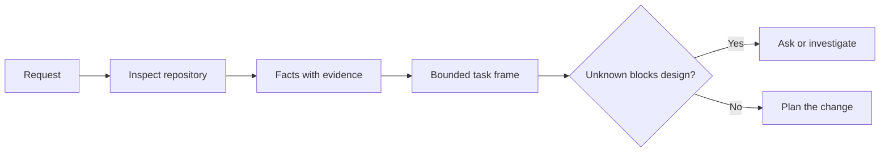

# 在智能体编写代码之前先定义任务框架

> 编码智能体可以快速实现一个清晰的任务，也可以快速实现一个不清晰的任务。速度是一样的，代价却不是。

**Type:** Learn + Build
**Languages:** Python (stdlib)
**Prerequisites:** 第 14 阶段第 31 和 36 课
**Time:** ~60 分钟

## 学习目标

- 在动手修改之前，将需求转化为一个有边界约束的任务框架。
- 将代码库中的事实与假设及未决问题区分开来。
- 定义允许的路径、禁止的路径以及验收证据。
- 判断何时侦察已足够充分，可以开始工作。

## 代价高昂的失败

“添加重复邮箱保护”听起来很具体，其实不然。唯一性约束应该放在 API、领域服务还是数据库中？比较是否区分大小写？哪种错误格式已经是公开契约？是否允许数据库迁移？哪个测试能证明该行为？

一个能力强的智能体会用看似合理的选择来填补这些空白。这正是危险之处，因为实现可能干净、有测试覆盖，却仍然与整个系统不兼容。

因此，编码智能体工作的第一个单元不是修改代码，而是一个有代码库证据支撑的任务框架。

## 任务框架

一个实用的框架包含六个字段：

| 字段 | 问题 |
|---|---|
| 目标 | 哪个可观察行为必须改变？ |
| 代码库事实 | 你在代码、测试、配置或历史中验证了什么？ |
| 允许的路径 | 修改可以落在哪些地方？ |
| 禁止的路径 | 哪些地方必须保持不动？ |
| 验收证据 | 哪些命令或观察结果能证明目标达成？ |
| 未知项 | 哪些决策仍需要证据或人工判断？ |

事实需要凭证。“API 对重复数据返回 409”在你能指出现有测试或处理程序之前，不算事实。文件路径和行号就足够了；当涉及行为时，命令执行结果更好。



## 侦察是搜索约束条件

不要通读整个代码库。搜索约束本次修改的界面：

1. 当前行为及其调用方。
2. 最接近的现有测试。
3. 公开契约或序列化格式。
4. 约束该路径的项目说明。
5. 构建和验证命令。
6. 能揭示本地模式的类似已完成修改。

当每一个计划中的决策要么有证据支撑、要么已明确授权、要么被列为未知项时，即可停止。超过这一点再读下去，往往是在逃避。

## 未知项不是失败

未知项是受控的空白，假设是对该空白不受控的回答。

对每个未知项进行分类：

- **可发现的：** 代码库或运行中的系统可以回答。
- **可决定的：** 任务契约赋予智能体选择权。
- **需人工的：** 该选择会影响产品行为、成本、风险或公开兼容性。
- **延后的：** 该选择超出本切片范围，属于非目标。

智能体应继续处理可发现的和已授权的未知项。在人工未知项上，应在选择被埋入代码之前暂停。

## 在实现之前先定验收

在编写补丁之前先写好证明。证明可以是：

- 一个聚焦的单元或集成测试命令；
- 一个带有指定视口和预期状态的浏览器操作流程；
- 一个线缆级请求和精确的响应契约；
- 一个带阈值的性能测量；
- 一个确认没有无关文件被修改的范围检查。

“测试通过”不是一个证明计划。请指明权威测试及其所支撑的论断。

## 动手实践

本实验创建一个 `TaskFrame`，验证其边界和证据，并写入 `outputs/task-frame.md`。

从本课目录运行：

```bash
python3 code/main.py
python3 -m unittest discover code/tests -v
```

用四种方式破坏示例：移除目标、移除一条事实凭证、让允许路径和禁止路径重叠、移除验收命令。验证器应因不同的原因拒绝每一个框架。

## 在真实代码库中使用

在让智能体编辑代码之前：

1. 将目标写成行为，而不是文件修改。
2. 记录两到三条附带精确证据的事实。
3. 指明最小的允许路径集合。
4. 明确指出负空间。
5. 写出能关闭任务的命令或观察结果。
6. 列出你尚未获得的决策权。

框架应能在一屏内放下。如果不能，该任务可能包含多个可独立验证的修改。

## 练习

1. 从你的某个代码库中选取一个真实缺陷进行框架化，但不提出解决方案。
2. 找出框架中一条实际上是假设的论断，用证据替换它。
3. 添加一个其答案会改变公开契约的人工未知项。
4. 将一个过宽的允许路径拆分为最小的安全集合。
5. 在验收证据中添加一条范围凭证。

## 延伸阅读

- [Nuseibeh and Easterbrook, Requirements Engineering: A Roadmap](https://www.cs.toronto.edu/~sme/papers/2000/ICSE2000.pdf)，关于将实现锚定于真实目标和不断演变的约束。
- [Yang et al., SWE-agent: Agent-Computer Interfaces Enable Automated Software Engineering](https://arxiv.org/abs/2405.15793)，关于编码智能体周围接口会改变其有效性的证据。

## 你将获得

保留 `outputs/task-frame.md`。它是下一课的输入，在下一课中，该框架将成为有证据支撑的执行计划。