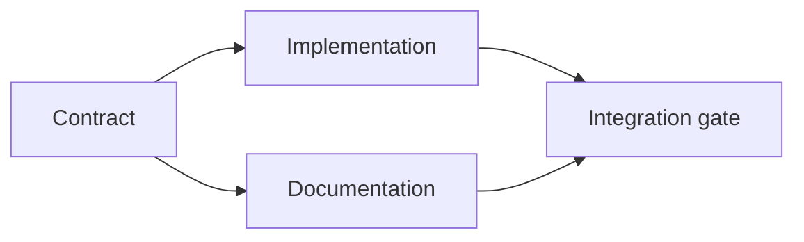

# 构建一个有证据支撑的执行计划

> 计划不是一份更漂亮的待办清单。它是一张依赖图，其中每个变更都有理由，每个终端节点都有证明。

**Type:** Learn + Build
**Languages:** Python (stdlib)
**Prerequisites:** Phase 14 lesson 43
**Time:** ~65 分钟

## 学习目标

- 将任务框架转换为带有证据和证明的工作项。
- 用依赖关系而不是文字顺序来建模排序。
- 在编辑之前检测缺失的事实、未知的依赖关系和循环。
- 区分可以并行运行的步骤和必须等待的步骤。

## 为什么智能体的计划会失败

薄弱的计划只是用将来时复述请求：

1. 更新 API。
2. 添加测试。
3. 更新文档。

清单中没有任何内容说明发现了什么、为什么这些文件是正确的、哪个契约先变更、以及哪些工作可以并发进行。智能体可以执行每一步，却仍然造成返工。

一个强有力的计划对每个工作项做出五项承诺：

| 承诺 | 目的 |
|---|---|
| 标识符 | 用于依赖关系和交接的稳定引用 |
| 变更 | 最小的行为或契约变更 |
| 证据 | 证明该变更合理性的仓库事实 |
| 依赖关系 | 必须先成立的工作 |
| 证明 | 关闭该工作项的确切检查 |

## 先规划契约，再规划其实现

当多个层面依赖同一行为时，先定义该行为。之后测试、实现、文档和集成可以共享同一契约，而不是各自发明四个版本。



该依赖图暴露了安全的并发性。契约固定后，实现和文档可以同时进行。集成则等待两者完成。

## 证据会改变计划

仓库证据不是装饰品。它应当能够改变工作内容：

- 一个已有的辅助函数会取消一个计划中的新抽象。
- 一个兼容性测试会强制增加一个迁移步骤。
- 一个部署约束会把模式变更移到另一个任务中。
- 一个公开的响应类型会改变实现和文档的顺序。

如果证据不能改变计划，那它很可能不是该决策的证据。

## 为中断而设计

编码智能体的会话可能意外结束。一个可恢复的计划，其工作项应足够小，使得另一个会话能够确定：

- 哪个工作项已完成；
- 哪个证明已运行；
- 哪些产物已变更；
- 哪些依赖关系现在已解除阻塞；
- 下一个安全的工作项是什么。

不要把状态只编码在聊天中的勾选框里。把计划存储在工作旁边。

## 计划校验

出现以下情况时，应在执行前拒绝该计划：

- 标识符重复；
- 工作项没有证据；
- 工作项没有证明；
- 依赖关系引用了未知的工作项；
- 图中存在循环；
- 首个不可逆操作发生在相关不确定性被解决之前。

前五项检查是机械性的。最后一项需要判断，并且应当被明确指出。

## 动手构建

`code/main.py` 对工作项建模，校验其凭证，通过拓扑排序计算执行波次，并写入 `outputs/evidence-plan.json`。

运行：

```bash
python3 code/main.py
python3 -m unittest discover code/tests -v
```

该示例产生三个波次。契约定义最先运行。实现和文档同时运行。集成关卡最后运行。

## 与编码智能体一起使用

要求智能体在修改文件之前先产出计划。从三个方面审查该计划：

1. 每个路径和行为断言都有仓库凭证。
2. 每个工作项都有一个明确的完成证明。
3. 依赖图把昂贵或不可逆的工作推迟到其所依赖的不确定性被解决之后。

批准的是计划本身，而不是一个“会小心”的模糊承诺。

## 练习

1. 添加一个需要明确人工批准的迁移工作项。
2. 制造一个循环，并解释其背后隐藏的产品分歧。
3. 拆分一个包含两条证明命令的工作项。
4. 添加一个可以在第二波次运行、且不触碰任何现有分支的工作项。
5. 将计划渲染为 Markdown，同时保持 JSON 作为事实来源。

## 延伸阅读

- [Nuseibeh 和 Easterbrook，《需求工程：路线图》](https://www.cs.toronto.edu/~sme/papers/2000/ICSE2000.pdf)，了解目标、规格、一致性与演化之间的迭代关系。
- [Barry Boehm，《软件开发与增强的螺旋模型》](https://dl.acm.org/doi/10.1145/12944.12948)，了解围绕风险解决而非固定线性顺序来安排开发。

## 你将保留的成果

保留 `outputs/evidence-plan.json`。它将在下一课中成为委派契约。