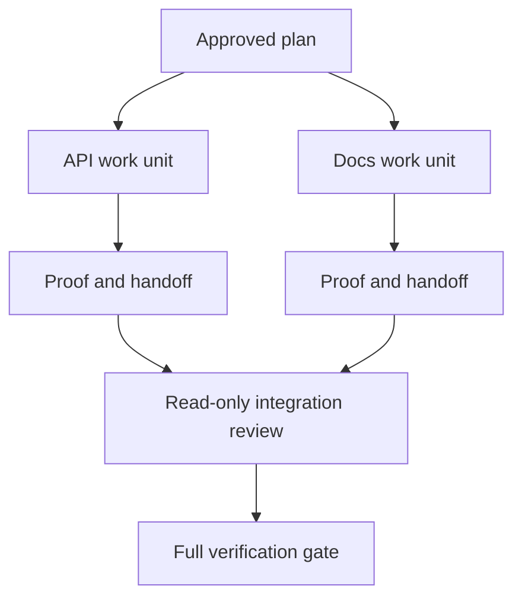

# 以隔离与合并契约委派 Agent 工作

> 并行 agent 只有在工作相互独立时才能节省实际时间。否则它们会把一个清晰的任务变成一个协调问题，只会更快地失败。

**Type:** Learn + Build
**Languages:** Python (stdlib)
**Prerequisites:** 第 14 阶段第 39 和 44 课
**Time:** 约 70 分钟

## 学习目标

- 判断委派是否以真正的独立性为依据。
- 为每个 worker 提供独占的文件所有权和明确的证明。
- 根据依赖关系计算执行波次。
- 设计一个合并契约来安全地组合 agent 的工作。

## 并行性检验

不要因为可用的 agent 更多就进行委派。只有当以下至少一条成立时才委派：

- 两个调查可以独立回答不同的未知问题；
- 两个实现拥有互不重叠的文件和契约；
- 审查者可以在不修改的情况下检查已完成的产物；
- 一个缓慢的外部检查可以在本地工作继续进行的同时运行。

当 agent 需要相同的文件、同一个未决决策或同一个可变环境时，保持工作串行。

## 工作单元即契约

每个被委派的单元需要：

| 字段 | 含义 |
|---|---|
| 目标 | 一个可观察的结果 |
| 所有者 | 一个负责任的 worker |
| 路径 | 独占的写所有权 |
| 依赖 | 开始之前必须完成的单元 |
| 证明 | 返回给集成者的确切证据 |
| 交接 | 已更改的文件、已做出的决策、遗留风险 |

“处理后端”不是一个工作单元。“在 `app/accounts.py` 中实现重复检查，并用聚焦的账户测试来证明”才是。

## 隔离有三个层次

1. **文件系统隔离：** 独立的 worktree 或沙箱防止意外的共享编辑。
2. **所有权隔离：** 契约防止两个 worker 有意编辑同一路径。
3. **状态隔离：** 独立的日志和输出防止一个 worker 覆盖另一个 worker 的证据。

文件系统隔离并不能解决所有权问题。两个干净的 worktree 仍可能产生冲突的设计。合并契约必须在工作开始之前解决共享接口的问题。



## 集成者不重建工作

集成者应当：

1. 确认每次交接符合其被分配的范围；
2. 阅读证明输出，而不仅仅是 worker 的总结；
3. 按依赖顺序组合更改；
4. 运行完整的跨单元门禁；
5. 拒绝隐藏的范围扩张；
6. 将冲突记录为新的决策，而不是无声地修改。

如果集成需要重写 worker 结果的大部分内容，那么最初的分解就是错误的。

## 人类与 Agent 的角色

委派并不能免除人类的判断。人类仍然拥有那些改变公共行为、风险、权限或产生不可逆成本的决策。Agent 可以承担有边界的调查、实现、验证和审查工作。

这就是经过校准的自主性：系统在证据和回滚都充分的地方给予自由，而在后果重大的地方要求检查点。

## 动手构建

实验会检查路径重叠、验证依赖关系、计算安全的执行波次，并写入 `outputs/delegation-plan.json`。

运行：

```bash
python3 code/main.py
python3 -m unittest discover code/tests -v
```

将 docs 单元改为拥有 `app/`。计划应当被阻塞，因为该父路径与 API 单元重叠。

## 练习

1. 将一个真实的更改分解为两个独立的工作单元和一个集成者。
2. 找出一个看起来独立但实际并非如此的并行划分方案。指出共享的决策是什么。
3. 添加一个只读的研究型 worker，其输出是一个事实表。
4. 添加一个合并门禁，对照所有单元契约检查最终更改的文件集合。
5. 为依赖失效的 worker 定义一条取消规则。

## 延伸阅读

- [Reid Smith, The Contract Net Protocol](https://doi.org/10.1109/TC.1980.1675516)，关于分布式任务分配与结果报告的早期形式化论述。
- [Eric Horvitz, Principles of Mixed-Initiative User Interfaces](https://dl.acm.org/doi/10.1145/302979.303030)，用于决定自动化何时应当行动、何时应当把控制权交还给人类。

## 你保留的成果

保留 `outputs/delegation-plan.json`。它记录了为什么这个划分是安全的、谁拥有每条路径，以及集成必须收到什么证明。