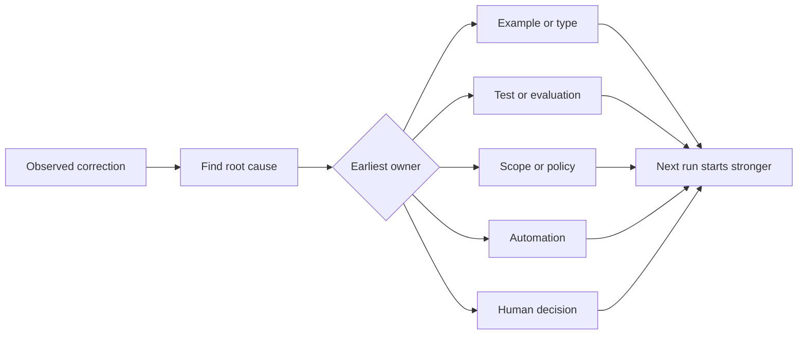

# 将每一次智能体纠错转化为系统改进

> 只存在于聊天中的纠错只能修复一次运行。被提升为测试、边界、示例或工具的纠错能改进之后每一次运行。

**Type:** Learn + Build
**Languages:** Python（标准库）
**Prerequisites:** Phase 14 第 37 至 41 课
**Time:** 约 65 分钟

## 学习目标

- 将智能体纠错转化为持久化的控制措施。
- 将每项控制措施放置在能够防止复现的最早一层。
- 使用稳定的指纹对重复的经验进行去重。
- 淘汰不再防范真实风险的控制措施。

## 纠错即证据

当你告诉智能体“不要编辑那个文件”时，你了解到的是作用域边界不可执行。当你说“这个输出结构不对”时，你了解到的是缺少一个示例或测试。当环境配置再次失败时，你了解到的是环境知识应当写入自动化中。

把纠错视为对工作系统的一个观察结果，而不是提示词编写失败。

## 提升到最早的生效层

按以下顺序使用：

| 反复出现的失败 | 持久化的归宿 |
|---|---|
| 错误结果或回归 | 测试或评估 |
| 越界或不安全操作 | 作用域或权限策略 |
| 反复的环境配置或命令错误 | 自动化或工具 |
| 反复的输出格式错误 | 规范示例加校验器 |
| 含糊的本地约定 | 附带场景检查的指令 |
| 产品方向分歧 | 人工决策记录 |

越早的控制越便宜。防止无效状态的类型强于稍后捕获问题的审查评论。一个聚焦的测试强于一段请求智能体记住的文字。



## 棘轮记录

记录以下内容：

- 症状；
- 根本原因；
- 后果；
- 复现次数；
- 选定的控制措施；
- 该控制措施的验证方式；
- 负责人；
- 复审或淘汰日期。

不要把每一次一次性的偏好都提升为规则。只有当复现频率或后果足以证明永久性复杂度合理时，才提升一条纠错。

## 区分原因与症状

“智能体编辑了 README”是症状。可能的原因包括：

- 任务允许访问仓库根目录；
- 文档被默认认为是安全的；
- 计划把实现和文档捆绑在一起；
- 两个 worker 的职责范围重叠。

每个原因对应不同的控制措施。一条仅仅复述症状的规则在下一次略有不同的情形中就会失效。

## 控制措施也会退化

旧的控制措施可能相互冲突、撑大上下文，并固化一个已不存在的系统。每条被提升的规则都需要一个淘汰检查。在以下情况删除或重写它：

- 底层架构已改变；
- 更强的可执行控制已取代它；
- 在一段有意义的时间窗口内失败未再复现；
- 该控制产生的摩擦大于它所防范的风险。

目标不是最长的指令文件，而是保留来之不易判断的最小系统。

## 动手构建

本实验对纠错进行分类，将其提升为控制措施，对重复项生成指纹，并写入 `outputs/feedback-ratchet.json`。

运行：

```bash
python3 code/main.py
python3 -m unittest discover code/tests -v
```

添加两条措辞不同但原因相同的纠错。改进归一化逻辑，直到它们合并为一条控制措施，同时不让无关的失败被错误合并。

## 练习

1. 从最近一次编程会话中取出五条纠错，分类它们真正的归属。
2. 把一条文字规则替换为可执行的测试。
3. 加入后果权重，使严重问题首次出现时即可立即提升。
4. 在实验输出中加入负责人和淘汰日期。
5. 审查一条现有的智能体指令，只有在证明存在更强的控制后才删除它。

## 延伸阅读

- [Basili, Caldiera, and Rombach, The Goal Question Metric Approach](https://www.cs.toronto.edu/~sme/CSC444F/handouts/GQM-paper.pdf)，关于将目标转化为问题和可操作的度量。
- [Shinn et al., Reflexion](https://arxiv.org/abs/2303.11366)，关于利用反馈轨迹改进后续决策而不改变模型权重。
- [Madaan et al., Self-Refine](https://arxiv.org/abs/2303.17651)，关于任务循环内的迭代反馈与修订。

## 你的收获

保留 `outputs/feedback-ratchet.json`。它是 Agent-Assisted Engineering 路线的持久化终点，也是未来工作台改动的输入。