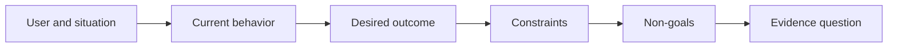

# 在选择输出之前先定义成果

> 快速实现会放大选错问题带来的代价。先塑造成果，让速度指向正确的方向。

**Type:** Learn + Build
**Languages:** Python (标准库)
**Prerequisites:** 无
**Time:** 约 60 分钟

## 学习目标

- 在不点名解决方案的前提下写出成果框架。
- 识别用户、情境、当前行为和期望的改变。
- 明确约束条件和非目标。
- 在方案泄漏固化为需求范围之前发现它。

## 输出不等于成果

“构建一个事故助手”只是点名了一个输出。它没有说明谁需要它、什么会变得更好、什么必须保持安全。

成果框架会说明：

> 当生产告警到达时，值班工程师在两分钟内识别出故障服务和一个安全的下一步操作，同时诊断过程保持只读且可审计。

这句话可以通过软件、操作手册、数据修复或更小的界面改动来满足。它让团队紧扣结果本身，而不是某人最先想象出的那个产物。

## 六要素框架

| 要素 | 问题 |
|---|---|
| 用户 | 谁直接经历这个问题？ |
| 情境 | 它在何时何地发生？ |
| 当前行为 | 今天发生了什么，包括临时应对办法？ |
| 期望成果 | 哪个可观察的状态应当改善？ |
| 约束条件 | 哪些安全、政策、成本或兼容性限制是固定的？ |
| 非目标 | 哪些诱人的相邻工作被排除在外？ |



## 发现方案泄漏

当成果陈述中包含尚未被证据支持的产品形态、界面、模型选择、框架或架构时，就发生了方案泄漏。

- “用户收到每周 AI 摘要”泄漏了摘要形式和频率。
- “用户在批准前理解账户变更”陈述的是结果。
- “部署向量数据库”泄漏了基础设施。
- “审核期间可获取相关政策证据”陈述的是一种能力。

当兼容性确实固定了某项技术时，约束条件可以点名技术。请记录它为何是固定的。

## 约束条件保护成果

约束条件不是实现细节。它们是现实世界目标的一部分：

- 诊断期间不进行生产写入；
- 在事故时间预算内响应；
- 现有审计事件保持权威性；
- 不引入新的运行时依赖；
- 无障碍行为保持不变。

通过违反约束条件达成结果的构建并没有真正达成成果。

## 非目标划定边界

非目标防止一个有用的切片膨胀成一个平台。好的非目标要具体到能够拒绝某项工作：

- 不做自动修复；
- 不做新的告警路由系统；
- 不替代事故指挥官；
- 本切片不做历史分析。

## 动手构建

该实验验证一个 `OutcomeFrame` 并写入 `outputs/outcome-frame.json`。

```bash
python3 code/main.py
python3 -m unittest discover code/tests -v
```

将期望成果替换为“使用事故助手”。验证器应标记出提议的输出泄漏进了成果。

## 练习

1. 将你待办清单中的一个功能请求改写为成果框架。
2. 添加一个会改变剩余可行解决方案范围的约束条件。
3. 添加两个让第一个切片保持小的非目标。
4. 找出最早能够推翻期望成果的观察。
5. 写出三个能够满足同一成果的不同输出。

## 延伸阅读

- [Nuseibeh and Easterbrook, Requirements Engineering: A Roadmap](https://www.cs.toronto.edu/~sme/papers/2000/ICSE2000.pdf)，其中将现实世界目标视为软件工作的锚点。
- [Dardenne, van Lamsweerde, and Fickas, Goal-Directed Requirements Acquisition](https://doi.org/10.1016/0167-6423(93)90021-G)，其中将高层目标细化为约束条件和可操作的需求。

## 你收获了什么

保留 `outputs/outcome-frame.json`。下一课将用它对照人们实际执行的工作流进行检验。