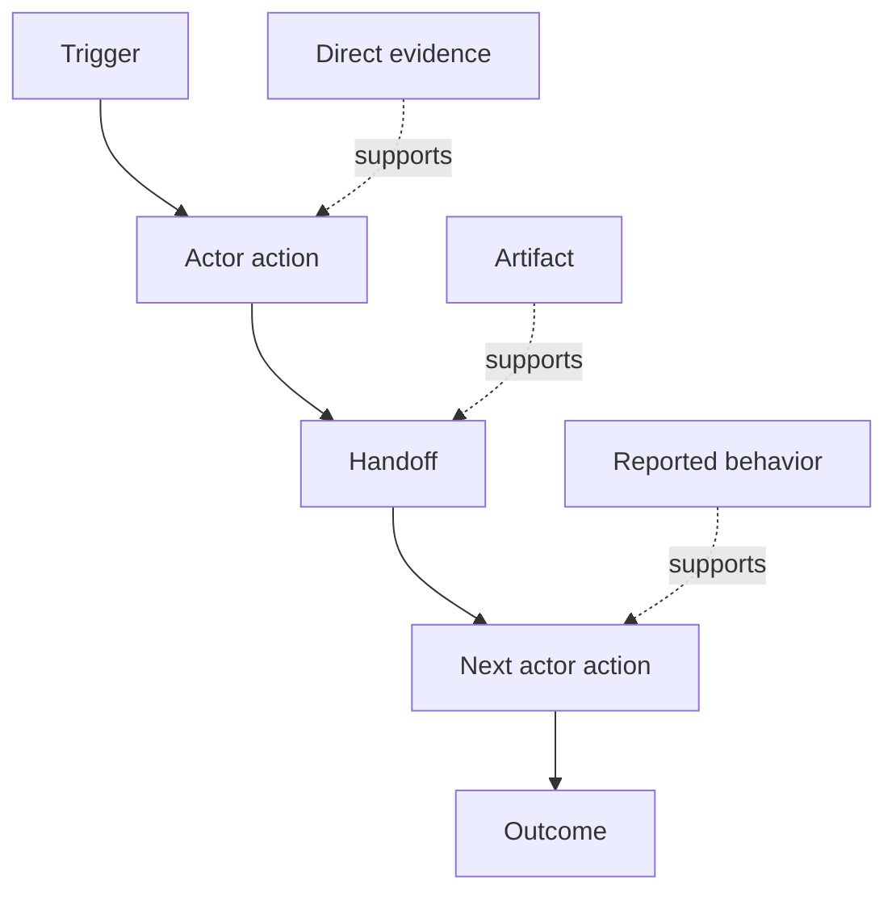

# 发现人们实际执行的工作流

> 需求并不是在会议里等着被收集。它们散落在行动、变通办法、记录和分歧之中。

**Type:** Learn + Build
**Languages:** Python (stdlib)
**Prerequisites:** Phase 14 lesson 47
**Time:** ~70 minutes

## 学习目标

- 将当前工作流建模为有证据支撑的有序行动。
- 区分直接观察与被报告或被推断的行为。
- 定位摩擦、交接、权限和隐藏状态。
- 让不确定的断言保持可见，而不是把它们变成需求。

## 从当前系统开始

不要一开始就问人们想要什么功能。先重构现在实际发生的事情。

对每个步骤，记录：

| 字段 | 示例 |
|---|---|
| Actor | 值班工程师 |
| Trigger | 生产告警到达 |
| Action | 打开告警，然后搜索仪表盘 |
| Input | 告警负载和部署记录 |
| Output | 候选服务及其负责人 |
| Friction | 在三个工具之间切换上下文 |
| Authority | 事件指挥官批准一次写入操作 |
| Evidence | 屏幕录制、事件日志、操作手册 |

工作流比屏幕上看到的更大。它包括等待、复制粘贴、私下沟通、审批、错误恢复，以及人们已经注意不到的步骤。

## 证据有强弱之分

使用一个简单的证据阶梯：

1. **直接行为：** 观察、追踪、录制或系统事件。
2. **产物：** 工单、操作手册、日志、表单或已完成的输出。
3. **被报告的行为：** 某人描述自己所做的事情。
4. **推断：** 团队得出关于大概会发生什么的结论。

四者都可能有用。只有前两者能直接证明当前行为。请标注其余项，以免置信度悄然膨胀。



## 寻找四样东西

- **摩擦：** 重复的工作、延迟、返工或恢复。
- **隐藏状态：** 存放在记忆、聊天或个人笔记中的事实。
- **权限：** 被允许做出关键变更的人或系统。
- **例外情况：** 正常工作流不再正常的情形。

AI 功能常常在交接和例外情况上失败，因为设计的唯一路径就是顺利路径。

## 不要把分歧平均掉

两个用户出于合理的理由可能执行不同的工作流。保留这些变体，直到你弄清它们代表的是：

- 不同的角色；
- 不同的风险等级；
- 旧流程与现行流程；
- 专业水平的差异；
- 真正的政策分歧。

被平均的工作流可能谁都不符合。

## 动手构建

实验程序会存储每个工作流步骤的证据，验证顺序和置信度，计算直接证据占比，并写入 `outputs/workflow-evidence.json`。

```bash
python3 code/main.py
python3 -m unittest discover code/tests -v
```

添加一条部署记录缺失时的例外路径。保持主流程顺序不变，并记录分支从哪里开始。

## 练习

1. 仅从日志重构一个工作流，不访谈任何人。
2. 访谈一位用户，并标记每一条仍缺乏直接证据的断言。
3. 添加一个权限边界和一个故障恢复步骤。
4. 为两个工作流变体建模，且不合并它们。
5. 找出一个提议的功能：它移除了一个可见步骤，却未触及隐藏的工作。

## 延伸阅读

- [Nuseibeh 和 Easterbrook, Requirements Engineering: A Roadmap](https://www.cs.toronto.edu/~sme/papers/2000/ICSE2000.pdf)，尤其是它将需求获取视为解释、建模和验证而非简单捕获的论述。
- [Gotel 和 Finkelstein, An Analysis of the Requirements Traceability Problem](https://doi.org/10.1109/ICRE.1994.292398)，关于维护需求与其来源之间关系的困难。

## 你将保留的成果

保留 `outputs/workflow-evidence.json`。下一课将把观察到的摩擦和不确定性转化为一张假设地图。