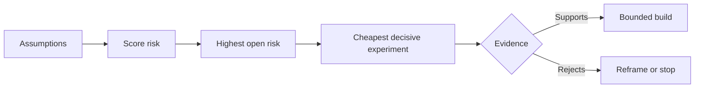

# 梳理假设并优先解决风险最高的一个

> 路线图把不确定性藏在功能背后。假设地图则揭示在那些功能值得存在之前，哪些条件必须成立。

**Type:** Learn + Build
**Languages:** Python (stdlib)
**Prerequisites:** Phase 14 lesson 48
**Time:** ~65 minutes

## 学习目标

- 把拟议的工作转化为明确的假设。
- 分别对影响、不确定性和不可逆性打分。
- 依据风险而非热情选择下一个实验。
- 用证据和决策替换已验证的假设。

## 每个构建都包含赌注

一个事故处理工具可能依赖以下所有条件成立：

- 告警上下文包含足以识别服务的信息；
- 工程师信任一个并非自己推导出的建议；
- 期望的响应时间在运维上确实重要；
- 所需数据可以在不使用不安全权限的情况下访问；
- 该工作流的发生频率足以证明其维护成本合理。

这些不是实现任务。它们是该构建在价值、可用性、可行性和安全性上成立的前提条件。

## 假设的分类

| 类别 | 问题 |
|---|---|
| 价值 | 结果是否足够重要？ |
| 可用性 | 用户能否理解并据此采取行动？ |
| 可行性 | 系统能否在现有数据和约束下产出它？ |
| 可存续性 | 组织能否承担成本、归属和运维？ |
| 安全性 | 失败时能否避免不可接受的后果？ |

把假设写成可证伪的陈述。“这个功能有用”无法被检验。“十名值班工程师中有八名借助只读结果更快地识别出正确的服务”则可以。

## 风险不是一个单一的数字

本实验使用三个从一到五的维度：

- **Impact(影响):** 假设为假时造成的损害。
- **Uncertainty(不确定性):** 当前证据的薄弱程度。
- **Irreversibility(不可逆性):** 做出承诺后再学习的代价。

示例评分将影响与不确定性相乘，再加上不可逆性。该公式并非通用。其目的在于迫使团队说明为什么某个未知项应当先于另一个被解决。



## 设计一个实验，而不是一场确认仪式

一个有用的测试应包含：

- 一个可能为假的断言；
- 一个总体或现实的样本；
- 一个可观察的结果；
- 一个在看到结果之前就确定的阈值；
- 针对通过、失败和证据模糊三种情况的下一步决策。

避免那些只能证明团队能把想法实现出来的测试。

## 可逆性改变顺序

后果严重且不可逆的选择需要更早获得证据。只读回放可以先于生产集成。临时适配器可以先于数据迁移。需人工批准的建议可以先于自动执行。

构建的形态应当跟随不确定性的形态。

## 动手构建

本实验对假设进行排序，区分已验证与未验证的断言，选出风险最高的未验证项，并撰写 `outputs/assumption-map.json`。

```bash
python3 code/main.py
python3 -m unittest discover code/tests -v
```

改变风险最高假设的证据，观察下一个实验如何随之变化。

## 练习

1. 为你想构建的一个功能写下五个假设。
2. 补充一个你的功能清单中遗漏的安全性假设。
3. 定义一个会让你停止构建的阈值。
4. 用一个更便宜但决定性的测试替换一个大型实验。
5. 比较风险排序与路线图优先级，并解释其中的不一致。

## 延伸阅读

- [Barry Boehm, A Spiral Model of Software Development and Enhancement](https://dl.acm.org/doi/10.1145/12944.12948),介绍了在深入投入之前先解决不确定性的风险驱动开发循环。
- [Dardenne, van Lamsweerde, and Fickas, Goal-Directed Requirements Acquisition](https://doi.org/10.1016/0167-6423(93)90021-G),介绍了在精化目标的同时暴露障碍与约束。

## 你的收获

保留 `outputs/assumption-map.json`。下一课将用它来选择能够产生决定性证据的最小切片。