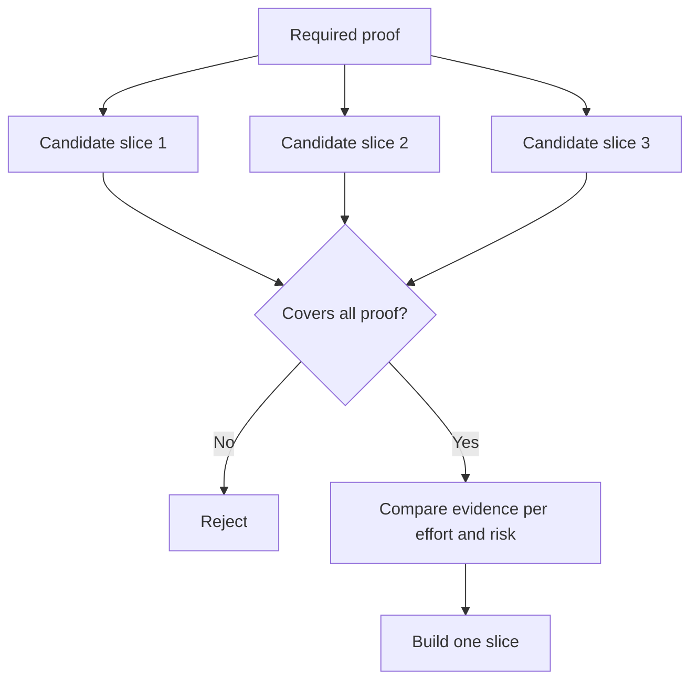

# 选择能改变决策的最小切片

> 小只有在证明重要事情时才有用。一个无法影响下一个决策的微小构建仅仅是不完整而已。

**Type:** Learn + Build
**Languages:** Python (stdlib)
**Prerequisites:** Phase 14 lesson 49
**Time:** ~65 minutes

## 学习目标

- 依据切片所验证的假设来定义切片。
- 平衡结果价值、不确定性降低、投入与后果。
- 优先选择可逆的证据，而非过早投入生产。
- 拒绝省略工作流中风险部分的切片。

## 垂直意味着端到端的证据

一个有用的切片穿过观察某个结果所需的最小真实工作流。它可以在用户、数据、时长和能力上收窄。它不应该通过移除你恰好需要测试的不确定性来收窄。

示例：

- 对十次真实事故进行只读重放，测试服务识别与操作员信任。
- 在合成数据上制作精美的仪表盘，或许能测试理解效果，但无法测试数据可行性。
- 生产环境自动修复器一次性测试所有内容，后果不可接受。

## 先定义所需证明

找出风险最高的未决假设，将其转化为所需的证明集合。候选切片只有覆盖该集合才算合格。

然后在合格的切片之间比较：

| 维度 | 方向 |
|---|---|
| 结果价值 | 越多越好 |
| 降低的不确定性 | 越多越好 |
| 投入 | 越少越好 |
| 后果 | 越少越好 |
| 可逆性 | 越多越好 |

实验的评分刻意保持简单。资格门槛比算术更重要。



## 常见的假最小化

- **仅 UI 的最小化：** 移除了数据和运营方面的不确定性。
- **仅基础设施的最小化：** 证明了技术可行性，却没有用户价值。
- **仅快乐路径的最小化：** 省略了造成大部分风险的异常情况。
- **仅演示的最小化：** 产出一个有说服力的成品，但没有可重复的度量。
- **仅平台的最小化：** 在一个工作流证明需要之前就构建可复用的机器。

## 添加停止规则

在实现之前，写下如果切片失败会发生什么：

- 放弃该结果；
- 更改目标用户或场景；
- 测试不同的机制；
- 收集更好的证据；
- 进一步收窄权限。

如果每种结果都导向“继续构建”，那么这个切片就不是一个实验。

## 动手构建

实验按所需证明过滤候选切片，给合格切片评分，并写入 `outputs/slice-decision.json`。

```bash
python3 code/main.py
python3 -m unittest discover code/tests -v
```

添加一个只验证单条所需假设的更廉价候选切片。即使其数值评分很高，它也应保持不合格。

## 练习

1. 为同一结果设计三个不同后果级别的切片。
2. 在评分之前陈述所需的证明集合。
3. 在保留决定性证据的前提下移除一项能力。
4. 为一次失败的试点添加停止规则。
5. 找出一个应等到切片之后再构建的可复用平台组件。

## 延伸阅读

- [Barry Boehm, A Spiral Model of Software Development and Enhancement](https://dl.acm.org/doi/10.1145/12944.12948)，关于将每个开发周期与其必须解决的风险相匹配。
- [Lenarduzzi and Taibi, MVP Explained: A Systematic Mapping Study on the Definitions of Minimal Viable Product](https://arxiv.org/abs/1609.07592)，关于软件产品实践中围绕“最小”和“可行”的模糊性。

## 你收获了什么

保留 `outputs/slice-decision.json`。它记录了为什么这个切片是能够改变决策的最小切片。