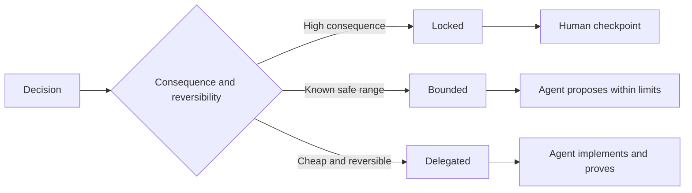

# 编写能保留判断空间的规格说明

> 一份有用的规格说明固定不变量与证据，同时将可逆的实现选择保持开放。它是一条决策边界，而不是剧本。

**Type:** Learn + Build
**Languages:** Python (stdlib)
**Prerequisites:** Phase 14 lesson 50
**Time:** ~75 分钟

## 学习目标

- 区分结果、不变量、示例、非目标和证明。
- 将决策标记为锁定、有界或委托。
- 在选择代价低且可逆的地方保留代理的判断空间。
- 在后果或公开行为发生变化的地方要求人工检查点。

## 两种糟糕的极端

规格不足的任务要求代理去猜测系统。规格过度的任务要求它誊写一份可能早已出错的设计。

有用的中间态是一份可执行的契约：

| 层面 | 目的 |
|---|---|
| 结果 | 可观察的结果 |
| 不变量 | 必须始终为真的条件 |
| 示例 | 揭示意图的具体用例 |
| 非目标 | 有意排除的相邻行为 |
| 决策策略 | 哪些选择是锁定、有界或委托的 |
| 证明 | 完成前所需的证据 |

## 三种决策模式

- **锁定：** 代理不得自行选择。用于公开兼容性、权限、安全性、不可逆成本或产品承诺。
- **有界：** 代理可以在明确的限制内选择。用于搜索预算、重试次数、允许的依赖或已知的接口族。
- **委托：** 代理拥有该选择权并必须解释它。用于局部结构、命名、可逆的重构和实现细节。



## 通过示例指定行为

示例比形容词更能压缩意图。“有用”、“健壮”和“可用于生产环境”都不是可执行的。一小组正常、边界、失败和禁止示例能给构建者和验证者提供具体的东西。

示例不能替代不变量。一个通过的用例无法证明一条普适的安全规则。

## 证明必须与主张匹配

- 单元测试证明局部函数契约。
- 线缆测试（wire test）证明序列化与传输行为。
- 浏览器旅程证明接口路径。
- 回放集证明在代表性用例上的行为。
- 审计日志证明权限边界未被突破。

不要接受用较低层次的证据来证明较高层次的主张。

## 有意识地保留未知

规格说明可以写“实现可以选择任何在时间预算内返回的只读数据源”。这不是模糊。这是一项有边界和证明的有意委托的决策。

当证据变化时，规格说明应当演进。保留锁定和有界选择背后的理由，以便后来的团队无需考古就能修订它们。

## 动手实践

实验会验证每个契约层面、检查决策模式，并写出 `outputs/executable-specification.json`。

```bash
python3 code/main.py
python3 -m unittest discover code/tests -v
```

将生产写入决策从锁定改为委托。解释为什么 schema 接受该值但产品风险不接受。

## 练习

1. 将一张待办工单转换为六个规格层面。
2. 用一个不变量和两个示例替换三条实现指令。
3. 标记每个决策，并为每个锁定或有界的选择给出理由。
4. 为每个不变量添加一张证明回执。
5. 移除一条既无证据也无风险理由的约束。

## 延伸阅读

- [Nuseibeh 和 Easterbrook，Requirements Engineering: A Roadmap](https://www.cs.toronto.edu/~sme/papers/2000/ICSE2000.pdf)，关于目标、精确规格、验证、共识与演进之间的关系。
- [Zave 和 Jackson，Four Dark Corners of Requirements Engineering](https://doi.org/10.1145/267895.267896)，关于区分环境假设、需求和规格。
- [Gotel 和 Finkelstein，An Analysis of the Requirements Traceability Problem](https://doi.org/10.1109/ICRE.1994.292398)，关于保留需求存在的原因及其来源。

## 你将获得

保留 `outputs/executable-specification.json`。它将成为编码代理与人工评审者共享的契约。