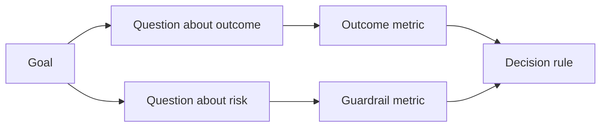

# 在结果存在之前设计成功指标

> 度量应当回答一个决策，而不是装饰仪表盘。从目标出发，推导问题，然后选择能回答这些问题的最小指标集合。

**Type:** Learn + Build
**Languages:** Python (标准库)
**Prerequisites:** Phase 14 第 47 和 51 课
**Time:** ~70 分钟

## 学习目标

- 从结果目标推导出问题和指标。
- 在观察结果之前定义阈值、时间窗口、数据来源和方向。
- 将结果指标与护栏指标和反向指标配对。
- 使评估证据与构建所必须支持的决策相匹配。

## 目标、问题、指标

从一个目标开始：

> 在不增加不安全操作的前提下，缩短识别受影响服务的时间。

推导问题：

- 正确服务被识别的速度有多快？
- 识别出的服务正确的频率有多高？
- 诊断过程是否保持只读？
- 该工作流是否增加了告警忽略率或操作员负担？

然后选择能将这些问题操作化的指标。



## 每个指标都需要一份契约

每个指标都需要：

| 字段 | 示例 |
|---|---|
| 名称 | `median_identification_seconds` |
| 方向 | 至多 |
| 阈值 | 120 |
| 时间窗口 | 十次事故回放 |
| 来源 | 回放事件日志 |
| 总体 | 参与试点的值班工程师 |
| 类型 | 结果或护栏 |

没有来源和时间窗口，数字就无法复现。没有阈值，它就无法驱动决策。

## 结果指标、护栏指标与反向指标

- **结果指标：** 期望状态是否得到改善？
- **护栏指标：** 固定约束是否保持成立？
- **反向指标：** 局部改善是否将成本或危害转移到了其他地方？

对于事故工作流而言，仅靠速度是不够的。正确性、生产环境写入、操作员负担和遗漏告警共同防止出现一个“快但不安全”的结果。

## 离线与在线证据

离线回放对于可重复性和边界覆盖很有用。有边界的试点对于真实行为、信任和工作流影响很有用。两者不能相互替代。

使用能够回答当前决策的最廉价证据。不要仅仅因为实现已经就绪，就把真实用户暴露在风险之中。

## 在度量之前先决定

在看到结果之前，先写好通过、失败和模糊三种路径。否则团队会为了保护这个构建而移动阈值。

示例：

- 通过：正确服务率至少 0.9 且中位时间至多 120 秒；
- 失败：出现任何生产环境写入，或正确率低于 0.75；
- 模糊：小幅改善但方差较大，需要更大的回放集合。

## 动手构建

实验环节会验证一个度量计划、评估包含性阈值、记录缺失值，并撰写 `outputs/measurement-report.json`。

```bash
python3 code/main.py
python3 -m unittest discover code/tests -v
```

移除护栏指标，观察为什么即使结果指标仍然成立，整个计划也会失效。

## 练习

1. 从一个结果目标推导出三个问题。
2. 添加一个能捕捉成本转移到其他角色的反向指标。
3. 为每个指标定义来源、总体和时间窗口。
4. 在生成数值之前，写好通过、失败和模糊的决策标准。
5. 找出一个易于收集但无法改变决策的指标，并将其移除。

## 延伸阅读

- [Basili, Software Modeling and Measurement: The Goal/Question/Metric Paradigm](https://drum.lib.umd.edu/items/8119803a-362b-42ec-b6ce-2311713e7236)，关于从明确目标推导操作性度量。
- [Basili, Caldiera, and Rombach, The Goal Question Metric Approach](https://www.cs.toronto.edu/~sme/CSC444F/handouts/GQM-paper.pdf)，关于将该方法作为反馈与改进体系来应用。

## 你将获得

保留 `outputs/measurement-report.json`。它为原型、试点或生产阶段定义了证据门槛。