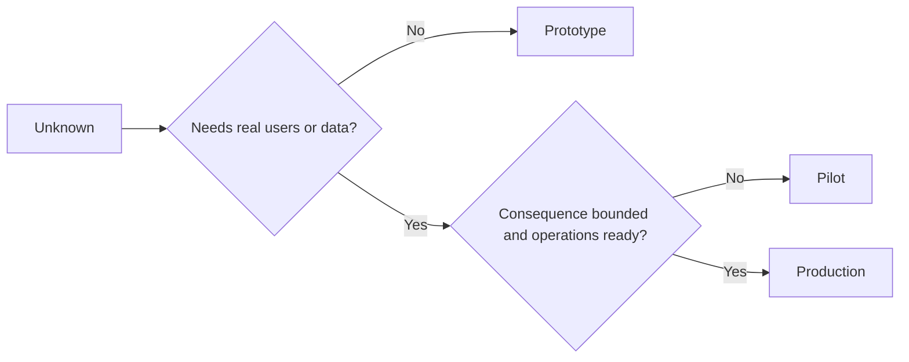

# 有意识地选择原型、试点或生产

> 这些是不同的学习环境,而不是打磨程度的层级。选择以最少的额外代价回答当前未知问题的阶段。

**Type:** Learn + Build
**Languages:** Python(标准库)
**Prerequisites:** Phase 14 lessons 50 to 52
**Time:** ~70 minutes

## 学习目标

- 根据未知问题、受众、数据、后果和准备程度选择构建阶段。
- 定义特定阶段的控制措施和退出标准。
- 防止原型悄然演变为生产系统。
- 在证据和运维证明合理之前,延迟授予真实权限。

## 三个不同的问题

| 阶段 | 核心问题 |
|---|---|
| 原型 | 这个机制究竟能否产生所需的证据? |
| 试点 | 它能否在有界真实受众和真实条件下安全运行? |
| 生产 | 我们能否以承诺的可靠性和风险水平持续运营它? |

原型在技术上可以是完整的,同时仍然是可丢弃的。试点可以使用生产数据,同时在受众和权限上保持受限。当组织接受持续责任时,生产才真正开始。

## 原型

当未知问题不需要真实用户或真实数据时,使用原型。保持它:

- 可丢弃;
- 隔离;
- 行为范围窄;
- 明确学习问题;
- 不附带虚假的运维保证。

在机制证明配得上下一个阶段之前,不要优化架构。

## 试点

当未知问题需要真实行为、真实数据或真实工作流,但后果或准备程度尚不能支持大范围发布时,使用试点。

试点需要:

- 指定的受众;
- 明确的人工负责人;
- 有界的时长和权限;
- 审计和回滚;
- 结果和护栏阈值;
- 扩展、修改或停止的退出标准。

## 生产

生产需要的不仅仅是部署:

- 服务级别目标;
- 值班和事故责任;
- 安全与隐私审查;
- 成本和容量控制;
- 回滚和恢复;
- 持续监控;
- 退役路径。



## 阶段漂移

当原型代码获得了用户、数据或权限,却没有获得相应责任归属时,它就变得危险。在配置、访问控制、遥测和文档中标记原型和试点的边界。仅靠警告横幅是不够的。

阶段应当能够从系统本身观察出来。

## 动手构建

实验脚本从决策上下文中选择一个阶段,返回所需控制措施,并写入 `outputs/stage-decisions.json`。

```bash
python3 code/main.py
python3 -m unittest discover code/tests -v
```

将试点示例改为低后果且运维就绪的情形。解释什么样的额外证据才足以支持进入生产阶段。

## 练习

1. 按学习阶段(而非部署状态)对三个当前项目进行分类。
2. 编写包含停止决策的试点退出标准。
3. 添加一项技术控制,防止原型接触到生产数据。
4. 找出使构建成为生产的第一项运维责任。
5. 为有界试点设计一份回滚回执。

## 延伸阅读

- [Barry Boehm, A Spiral Model of Software Development and Enhancement](https://dl.acm.org/doi/10.1145/12944.12948),用于将每次迭代的承诺与已解决的风险相匹配。
- [Fagerholm et al., Building Blocks for Continuous Experimentation](https://doi.org/10.1145/2601248.2601276),用于了解持续运行实验所需的组织和技术条件。

## 你的收获

保留 `outputs/stage-decisions.json`。它记录了每个阶段为何合理,以及进入下一阶段之前必须存在哪些控制措施。