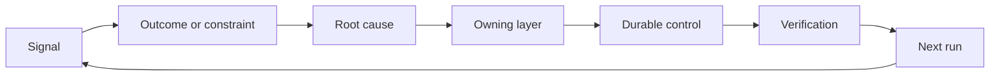

# 构建带所有权与退役机制的反馈棘轮

> 交付结束一个构建循环，同时开启学习循环。证据必须改变系统，否则它就变成无人负责的遥测数据。

**Type:** Learn + Build
**Languages:** Python (stdlib)
**Prerequisites:** 第 14 阶段第 46 课和第 53 课
**Time:** ~75 分钟

## 学习目标

- 将事故、评估、用户行为和纠错转化为有责任人的行动。
- 将每条信号路由到上下文、评估、策略、运行时或待办事项。
- 按严重程度和频率对复现问题排序优先级。
- 为每个控制措施设定退役条件。

## 反馈即基础设施

一个团队可以收集追踪记录、评估、支持工单和事故日志，却从其中任何一项都学不到东西。缺失的机制是提升：一条从观察通向持久变更的明确路径，变更要有责任人和证明。

该循环是：

1. 观察一个具体信号；
2. 将其与结果、约束或假设关联起来；
3. 找到拥有该原因的最早系统层；
4. 创建一个有边界的变更；
5. 验证复现的可能性降低；
6. 审查该控制措施是否应保留。

## 路由到负责的层

| 信号 | 去向 |
|---|---|
| 假阳性、回归、错误结果 | 评估或测试 |
| 缺失上下文、重复工作、过时事实 | 上下文来源或检索路由 |
| 不安全操作或权限缺口 | 策略或权限边界 |
| 超时、重试风暴、依赖不可用 | 运行时控制 |
| 新产品需求或未决权衡 | 经过整形的待办事项 |

在最早的有效层修复原因。当测试或权限可以使故障不可能发生时，不要再添加一段提示词。



## 所有权是控制措施的一部分

每个棘轮行动都需要：

- 一位责任人；
- 基于后果和复现情况的优先级；
- 要更改的工件；
- 证明变更的验证；
- 一个审查或到期窗口；
- 一个退役条件。

没有责任人的改进只是一条格式更好的观察记录。

## 退役过时的控制措施

反馈系统会累积策略。这些策略可能变得相互矛盾且代价高昂。在以下情况下审查控制措施：

- 架构或工作流发生变化；
- 一个更低层的不变量取代了更高层的指令；
- 所防护的故障在选定窗口内未出现；
- 该控制措施阻碍合法工作的次数多于其防止危害的次数。

退役同样需要证据。不要因为某个控制措施感觉陈旧就删除它。

## 连接构建与编码代理反馈

同一个棘轮服务于两条轨道：

- 产品证据改变结果框架、假设、切片或度量计划。
- 编码代理的纠错改变测试、上下文、范围、自动化或交接。
- 事故可以同时改变产品边界和代理工作台。

这就是为什么构建的整形不是一个在编码开始前就结束的阶段。它贯穿每一个被接受的变更持续进行。

## 动手构建

实验对信号进行分类，创建有责任人的棘轮行动，为它们排序优先级，并编写 `outputs/feedback-backlog.json`。

```bash
python3 code/main.py
python3 -m unittest discover code/tests -v
```

添加一个运行时超时信号，并确认它被路由到运行时而非一般待办事项。

## 练习

1. 将一个事故和一个用户投诉转化为棘轮行动。
2. 指出能防止每次复现的最早层。
3. 为实验输出添加验证命令或观察。
4. 为一条策略规则定义退役条件。
5. 将一个被接受的纠错回溯到下一个任务框架。

## 延伸阅读

- [Basili, Caldiera, and Rombach, The Goal Question Metric Approach](https://www.cs.toronto.edu/~sme/CSC444F/handouts/GQM-paper.pdf)，通过面向目标的度量实现组织学习。
- [Fagerholm et al., Building Blocks for Continuous Experimentation](https://doi.org/10.1145/2601248.2601276)，连接证据与持续产品开发的技术和组织循环。
- [Nuseibeh and Easterbrook, Requirements Engineering: A Roadmap](https://www.cs.toronto.edu/~sme/papers/2000/ICSE2000.pdf)，将需求视为在系统生命周期中不断演化。

## 你将保留的成果

保留 `outputs/feedback-backlog.json`。它是产品判断与交付路径的收官工件，也是下一个结果框架的输入。