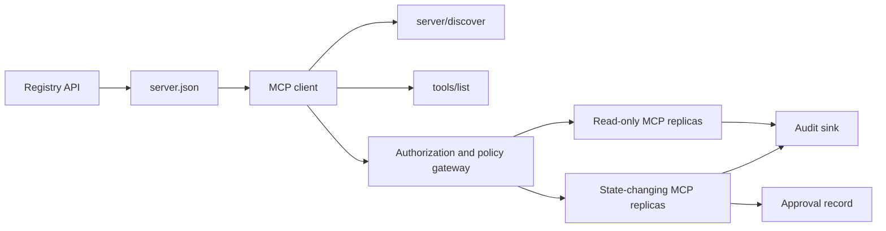

# 毕业项目 13：带注册表与治理的无状态 MCP 服务器

> 生产级 MCP 不是一个服务器进程。它是一条契约链：可发布的元数据、实时发现、无状态请求信封、授权、策略、审计以及部署证据。

**Type:** Capstone
**Languages:** Python 和 TypeScript 参考模型；任何生产语言
**Prerequisites:** Phase 11、Phase 13、Phase 14、Phase 17 和 Phase 18
**Required MCP deep dives:** [Lesson 28: Tool Contracts](../../../13-tools-and-protocols/28-mcp-tool-contracts-and-content/docs/en.md)、[Lesson 29: Reliability](../../../13-tools-and-protocols/29-mcp-reliability-cancellation-and-flow-control/docs/en.md)、[Lesson 30: Registry Supply Chain](../../../13-tools-and-protocols/30-mcp-registry-supply-chain-and-drift/docs/en.md) 和 [Lesson 31: Conformance Operations](../../../13-tools-and-protocols/31-mcp-conformance-versioning-and-operations/docs/en.md)
**Protocol target:** MCP `2026-07-28`
**Time:** ~25 小时

## 学习目标

- 实现无状态的 MCP 请求与结果信封。
- 将注册表元数据与实时协议发现分离。
- 构建确定性的、缓存感知的工具发现。
- 对每次工具调用强制执行签发者、受众、作用域和审批策略。
- 在无会话亲和性的情况下部署 Streamable HTTP。
- 在传输层、授权、策略、注册表和审计边界处证明行为。

## 必修 MCP 先修路径

在将本毕业项目视为生产就绪之前，请按顺序完成四个关联的 Phase 13 课程：

1. [Lesson 28](../../../13-tools-and-protocols/28-mcp-tool-contracts-and-content/docs/en.md) 定义了本服务器必须暴露的工具、模式、内容、分页、补全、路由和错误契约。
2. [Lesson 29](../../../13-tools-and-protocols/29-mcp-reliability-cancellation-and-flow-control/docs/en.md) 定义了取消竞争、截止时间、幂等性、背压、重试和重连行为。
3. [Lesson 30](../../../13-tools-and-protocols/30-mcp-registry-supply-chain-and-drift/docs/en.md) 定义了命名空间、来源、准入锁定、注册表状态、漂移、账本和回滚证据。
4. [Lesson 31](../../../13-tools-and-protocols/31-mcp-conformance-versioning-and-operations/docs/en.md) 定义了黄金与负面转写、严格的版本时代、SDK 差异检查、代理证明、脱敏、健康和发布门控。

毕业项目将这些产物整合在一起。它不会用一个“快乐路径”的 SDK 测试取代它们。

## 问题

一个内部平台需要只读数据工具和一小部分改变状态的工具。开发者必须能够发现该服务器、了解如何连接、检查其实时能力，并且只调用其被授权使用的操作。

难点不在于注册一个函数。难点在于让六种不同的事实保持一致：

1. `server.json` 说明服务器可以安装在哪里或如何访问。
2. `server/discover` 说明实时进程当前支持什么。
3. 每个请求都说明它使用哪个协议修订版和客户端能力。
4. 授权将调用方绑定到正确的签发者、资源和作用域。
5. 策略决定该特定操作是否可以运行。
6. 审计证据记录什么跨过了边界，且不泄露秘密或敏感载荷。

如果其中任何一项发生漂移，平台可能会列出一个无法访问的服务器、路由一个不兼容的客户端、接受为另一个资源铸造的令牌，或在缺少预期审查的情况下暴露一个破坏性操作。

## 两个发现层

注册表和实时 MCP 服务器回答不同的问题。

| 层 | 契约 | 它回答的问题 |
|---|---|---|
| 发布 | `server.json` 和注册表 API | 这个服务器是什么，它的包或远程端点在哪里，如何配置？ |
| 运行时 | `server/discover` | 该进程支持哪些协议版本、能力、扩展和服务器身份？ |

官方注册表使用带版本的 `server.json` 模式。远程条目可以命名一个 Streamable HTTP URL：

```json
{
  "$schema": "https://static.modelcontextprotocol.io/schemas/2025-12-11/server.schema.json",
  "name": "com.example/internal-readonly",
  "title": "Internal Read-Only Tools",
  "description": "Read-only incident and data lookup tools.",
  "version": "1.0.0",
  "remotes": [
    {
      "type": "streamable-http",
      "url": "https://mcp.internal.example.com/readonly"
    }
  ]
}
```

注册表模式版本与 MCP 协议修订版相互独立。不要改写其中一个日期去匹配另一个。对每份文档按其自身契约进行校验。

模式有效并不证明命名空间所有权。一个针对 `example.com` 完成验证的发布者使用反向 DNS 命名空间 `com.example/*` 或其子命名空间之一。注册表认证流程证明该所有权。将域名标签保留在其正常顺序中，否则会命名一个不同的命名空间。

标准库模型的 `validate_registry_document` 函数刻意只是一个部分远程配置校验器。它检查官方必需的 `name`、`description` 和 `version` 字段；可选的 `title`；已发布的名称和长度约束；具体版本的形状；以及每个 `streamable-http` 或 `sse` 远程的 HTTP(S) URL 形状。它额外要求一个非空的 `remotes` 列表，因为本毕业项目总是对远程进行实时探测。`validate_publisher_namespace` 单独根据已验证的发布者域名检查名称，而 `validate_runtime_alignment` 将发布名称和版本与实时 `serverInfo` 进行比较。官方模式还支持仅包含包的记录和更多远程字段。在发布之前，使用固定的官方 JSON Schema 或 `mcp-publisher` 校验整个文档；不要把这个无依赖的子集呈现为完整的模式校验。

服务器必须实现 `server/discover`；客户端可以在调用其他方法之前调用它。本毕业项目客户端在解析端点之后这样做，并接收当前协议修订版和实时能力：

```json
{
  "resultType": "complete",
  "supportedVersions": ["2026-07-28"],
  "capabilities": {
    "tools": {
      "listChanged": false
    }
  },
  "_meta": {
    "io.modelcontextprotocol/serverInfo": {
      "name": "com.example/internal-readonly",
      "version": "1.0.0"
    }
  },
  "ttlMs": 3600000,
  "cacheScope": "public"
}
```

私有目录可以索引额外的所有权、审查或生命周期数据，但不得将这些数据伪造为 MCP 传输字段或根 `server.json` 字段。将组织策略存储在已发布记录旁边。当需要公开的自定义元数据时，使用注册表的 `_meta.io.modelcontextprotocol.registry/publisher-provided` 扩展，并保持在其 4 KB 限制之内。

## 无状态 MCP 核心

MCP 修订版 `2026-07-28` 移除了协议会话以及 `initialize` / `notifications/initialized` 握手。它还移除了 `Mcp-Session-Id`。

每个请求在 `params._meta` 中携带协议上下文：

```json
{
  "io.modelcontextprotocol/protocolVersion": "2026-07-28",
  "io.modelcontextprotocol/clientCapabilities": {},
  "io.modelcontextprotocol/clientInfo": {
    "name": "internal-platform-client",
    "version": "1.0.0"
  }
}
```

版本和能力是请求事实，而不是连接事实。负载均衡器可以将连续的请求发送到不同的健康副本，因为任一副本都可以从消息本身验证该请求。

普通结果包含 `resultType: "complete"`。服务器应在每个结果的 `_meta.io.modelcontextprotocol/serverInfo` 中放置其身份。缺失或非字符串的协议版本是无效参数 `-32602`。错误 `-32022` 仅用于提供了不支持字符串的情况，且其 data 恰好为 `{"supported": ["2026-07-28"], "requested": "..."}`。

### 可缓存的发现

对于相同的有效工具集，`tools/list` 必须是确定性的。结果包括：

- `ttlMs`，面向客户端的新鲜度提示；
- `cacheScope`，为 `public` 或 `private`；
- 稳定的工具顺序，使相同列表可以复用提示缓存；
- `resultType: "complete"` 和服务器身份元数据。

按用户的授权通常应产生 `cacheScope: "private"`。不要将用户特定的工具可见性放在共享的公共缓存之后。

## Streamable HTTP

网络服务器暴露一个接受 POST 的 MCP 端点。每个 JSON-RPC 请求或通知都有各自的 POST。

对于请求，服务器返回一个 JSON 对象，或一个限定于该请求的 SSE 流。一个长生命周期的 `subscriptions/listen` 请求携带选择性加入的变更通知。当前传输中没有独立的 GET 流、会话 DELETE、会话头或 `Last-Event-ID` 重放。

每个请求包括：

- `MCP-Protocol-Version`，与正文元数据匹配；
- `Mcp-Method`，与 JSON-RPC 方法匹配；
- `Mcp-Name` 对应 `tools/call`、`resources/read` 和 `prompts/get`；
- `Accept: application/json, text/event-stream`。

用规定的 `-32020` 错误拒绝不匹配的镜像头。校验 `Origin`，将本地开发服务器绑定到环回地址，对远程客户端进行认证，并将关闭的请求作用域 SSE 响应视为取消。



```figure
cf-mcp-gate
```

## 授权与策略

传输元数据不是授权。每次调用都要校验授权。

对于远程服务器：

1. 发现受保护资源元数据。
2. 为该资源选择授权服务器。
3. 优先使用 Client ID Metadata Documents 进行客户端注册。将动态客户端注册视为兼容性支持。
4. 在授权期间发送资源指示符。
5. 针对为该流程记录的授权服务器校验返回的 `iss` 值。
6. 按签发者为客户端凭据建立键。绝不在不同签发者之间复用注册数据。
7. 在 MCP 服务器校验令牌签发者、受众或资源、过期时间和作用域。
8. 对具体工具和参数应用第二层策略决策。

诸如 `readOnlyHint` 和 `destructiveHint` 之类的工具注解帮助客户端呈现风险。它们不是可信任的授权控制。

### 审批是一条记录，而非魔法作用域

一个改变状态的调用需要一条绑定到执行者、工具、规范化参数或摘要、目标环境、过期时间以及一次性或重复使用策略的审批记录。仅有聊天消息不是审批的证明。

Python 模型对具有排序键的规范化 JSON 进行哈希，然后将该摘要与令牌主体、工具名称、服务器 URL 和过期时间绑定。在更改哪怕一个参数之后重放该记录会在处理程序运行之前失败。审批是独立的证据，不是添加到访问令牌上的作用域。

当能在实质上缩小影响范围时，将高风险工具保留在一个可单独审查的界面上。只有在凭据、策略、部署身份和审计控制也分离时，这种分离才有用。

## 构建它

### 1. 建模发布元数据

创建并按模式校验 `server.json`。包括一个位于发布者已认证命名空间内的稳定名称，以及版本、描述、适用时的官方 `repository` 或 `packages` 元数据，以及远程或 stdio 传输。将秘密保留为声明的环境变量输入，绝不使用字面值。

### 2. 实现实时发现

在任何功能 RPC 之前实现 `server/discover`。声明支持的协议版本、能力、扩展和服务器身份。使用 `-32022` 添加一个版本拒绝用例。

### 3. 实现无状态信封

在每个请求中要求协议版本和客户端能力。在每个结果中返回 `resultType` 和服务器身份。移除初始化状态、连接作用域能力缓存和会话标识符。

### 4. 构建工具界面

从两个只读工具和一个改变状态的工具开始。为每个工具提供有界的 JSON Schema、精确的描述、确定性的结果形状和诚实的注解。当客户端依赖结构化结果时添加输出模式。

### 5. 添加缓存感知的列表

以稳定顺序返回工具，附带 `ttlMs` 和 `cacheScope`。分别演练缓存过期和列表变更通知行为。

### 6. 添加授权和策略

校验签发者、受众、过期时间和作用域。对每次工具调用运行策略决策。将审批绑定到确切的高风险操作。在执行处理程序之前拒绝缺失或过期的审批。

### 7. 分离注册表与运行时校验

校验静态 `server.json` 记录，然后用 `server/discover` 探测远程端点。当已发布的远程、身份、版本或必需能力与实时进程不一致时报告漂移。

### 8. 添加审计证据

记录执行者、签发者、资源、工具、策略决策、请求标识符、追踪上下文、延迟和结果。在持久化之前对敏感参数和结果进行脱敏或摘要。将审计接收器保持在模型可见上下文之外。

### 9. 演练水平扩展

将两个无状态副本置于负载均衡器之后。发送至少 100 个并发请求。证明正确性不依赖于亲和性。如果某个工具需要跨调用状态，铸造一个显式的不透明句柄并将其存储在共享的持久系统中。

### 10. 跨越真实传输层

对实际的服务器二进制文件运行一致性检查。捕获请求头和 JSON 正文，而不仅是 SDK 对象。演练错误版本、头不匹配、缺失作用域、错误受众、格式错误的参数、处理程序失败、取消和缓存过期。

## 必需证据包

提交在包含全部五类证据之前是不完整的：

| 证据 | 最低证明 | 来源课程 |
|---|---|---|
| 传输层 | 黄金与负面用例的脱敏原始头和 JSON-RPC 正文，包括元数据类型失败、头不匹配、不支持的版本、缺失或未知的 `resultType`、通知无响应以及响应 ID 匹配 | [Lesson 31](../../../13-tools-and-protocols/31-mcp-conformance-versioning-and-operations/docs/en.md) |
| 代理 | 相同稳定用例直接运行和通过已部署中间件运行，包含入口、源和出口状态与正文摘要；证明协议错误不会被合并为通用的 500 响应，且流不被缓冲 | [Lessons 29](../../../13-tools-and-protocols/29-mcp-reliability-cancellation-and-flow-control/docs/en.md) 和 [31](../../../13-tools-and-protocols/31-mcp-conformance-versioning-and-operations/docs/en.md) |
| 准入 | 已验证的发布者命名空间、不可变的注册表记录摘要、工件或远程来源、实时 `server/discover` 身份和能力观察、描述符锁定、当前注册表状态以及准入账本事件 | [Lesson 30](../../../13-tools-and-protocols/30-mcp-registry-supply-chain-and-drift/docs/en.md) |
| 重试 | 取消与完成之间的竞争、显式超时、安全读取重试、变更幂等键、重连重新获取，以及请求取消不会静默变为持久任务取消的证明 | [Lesson 29](../../../13-tools-and-protocols/29-mcp-reliability-cancellation-and-flow-control/docs/en.md) |
| 回滚 | 确切的上一个版本、准入和工件摘要、描述符锁定、活动的注册表状态、当前健康窗口、路由恢复结果以及脱敏的决策证据 | [Lessons 30](../../../13-tools-and-protocols/30-mcp-registry-supply-chain-and-drift/docs/en.md) 和 [31](../../../13-tools-and-protocols/31-mcp-conformance-versioning-and-operations/docs/en.md) |

将脱敏包的摘要与发布版本一起存储。如果缺少任何一类，则扣留发布。不要从进程内调度器推断代理行为，从注册表存在推断准入，从新的 JSON-RPC id 推断重试安全性，或从“上一个部署”推断回滚就绪。

## 本地参考模型

Python 模型在不打开网络套接字的情况下演示了注册表元数据、反向 DNS 发布者命名空间校验、发布到运行时身份检查、实时发现、确定性工具列表、按请求元数据、可信签发者、受众、过期时间和作用域检查、动作绑定审批、一个有文档说明的部分注册表校验器、策略和审计：

```bash
cd phases/19-capstone-projects/13-mcp-server-with-registry
python3 code/main.py
python3 -m unittest discover -s code/tests -v
```

TypeScript 项目在不使用 MCP SDK 的情况下通过 stdio 暴露无状态的 JSON-RPC 形状。其 `tools/call` 路径强制执行 `tools/list` 声明的相同有界输入模式；已知工具的无效参数返回一个带有 `isError: true` 的完整结果，而不调用执行器：

```bash
cd phases/19-capstone-projects/13-mcp-server-with-registry/code/ts
npm install
npm run typecheck
npm test
npm run demo
```

这些模型证明本地契约逻辑。它们不证明 HTTP 头、OAuth 交换、注册表发布、OPA 集成、负载均衡或收集器接收。

## 传输示例

```http
POST /mcp HTTP/1.1
Host: mcp.internal.example.com
Content-Type: application/json
Accept: application/json, text/event-stream
MCP-Protocol-Version: 2026-07-28
Mcp-Method: tools/call
Mcp-Name: postgres.readonly
Authorization: Bearer REDACTED

{
  "jsonrpc": "2.0",
  "id": 42,
  "method": "tools/call",
  "params": {
    "name": "postgres.readonly",
    "arguments": {"sql": "SELECT 1"},
    "_meta": {
      "io.modelcontextprotocol/protocolVersion": "2026-07-28",
      "io.modelcontextprotocol/clientCapabilities": {},
      "io.modelcontextprotocol/clientInfo": {
        "name": "internal-platform-client",
        "version": "1.0.0"
      }
    }
  }
}
```

## 交付它

交付一个包含以下内容的代码仓库：

- 一个模式有效的 `server.json`；
- 只读和改变状态的服务器界面；
- `server/discover`、确定性的 `tools/list` 以及策略门控的 `tools/call`；
- 一个带两个可互换副本的 Streamable HTTP 部署；
- 授权与审批集成；
- 一个注册表发布者或私有注册表 API 适配器；
- 策略定义和动作绑定审批记录；
- 脱敏的审计输出和追踪传播；
- 传输层和代理失败证据；
- 带有脱敏包摘要的准入、重试、健康和回滚证据。

| 权重 | 标准 | 证据 |
|---:|---|---|
| 25 | 协议正确性 | 无状态请求元数据、发现、结果、头和负面用例 |
| 20 | 授权 | 签发者、受众、过期时间、作用域和动作绑定审批用例 |
| 15 | 注册表完整性 | 有效的 `server.json`、发布记录、实时发现探测和漂移报告 |
| 15 | 策略与安全 | 允许、拒绝、格式错误、过期审批和敏感数据用例 |
| 15 | 规模与可靠性 | 两个副本、无亲和性依赖、取消、超时和恢复 |
| 10 | 可审计性 | 脱敏的接收端审计和追踪证据 |

## 练习

1. 更改已发布的远程 URL，同时保持实时服务器不变。让注册表校验报告确切的漂移。
2. 用相同输入发送两次 `tools/list`，证明字节级稳定的工具顺序。然后使 `ttlMs` 过期并刷新。
3. 发送一个带有不同 `MCP-Protocol-Version` 头的有效正文。返回 `-32020`，并且不调用策略或工具。
4. 为只读服务器铸造一个令牌，并将其呈现给改变状态的服务器。证明受众校验在处理程序运行之前失败。
5. 将一个审批绑定到一个规范化参数摘要。更改一个字段并证明该审批无法重放。
6. 将连续的调用路由到交替的副本。在工作流需要持久性时，用显式的共享句柄替换隐藏的进程内存。
7. 断开一个请求作用域的 SSE 连接，并使用新的 JSON-RPC 请求 ID 重试。验证没有使用 `Last-Event-ID` 恢复路径。

## 关键术语

| 术语 | 人们怎么说 | 它的实际含义 |
|---|---|---|
| 无状态 MCP | “任何地方都没有状态” | 无协议会话；跨调用状态是显式的且由服务器管理 |
| `server.json` | “工具清单” | 用于命名、打包、配置和传输的注册表元数据 |
| `server/discover` | “握手” | 用于实时版本和能力的普通强制 RPC，不是会话初始化器 |
| 缓存作用域 | “我可以缓存它吗？” | 一个可缓存结果对于共享或私有复用是否安全 |
| 策略决策 | “令牌允许它” | 对执行者、工具、目标、参数和上下文的独立决策 |
| 审批记录 | “有人点击了是” | 绑定到一个执行者和一项后果性操作、并遵循过期策略的证据 |
| 显式句柄 | “一个会话 ID” | 用于命名服务器管理状态的普通应用数据，不是协议连接状态 |

## 延伸阅读

- [MCP 2026-07-28 key changes](https://modelcontextprotocol.io/specification/2026-07-28/changelog)
- [Streamable HTTP](https://modelcontextprotocol.io/specification/2026-07-28/basic/transports/streamable-http)
- [Server discovery](https://modelcontextprotocol.io/specification/2026-07-28/server/discover)
- [MCP authorization](https://modelcontextprotocol.io/specification/2026-07-28/basic/authorization)
- [Official Registry server.json requirements](https://github.com/modelcontextprotocol/registry/blob/main/docs/reference/server-json/official-registry-requirements.md)
- [Official Registry OpenAPI contract](https://registry.modelcontextprotocol.io/openapi.yaml)