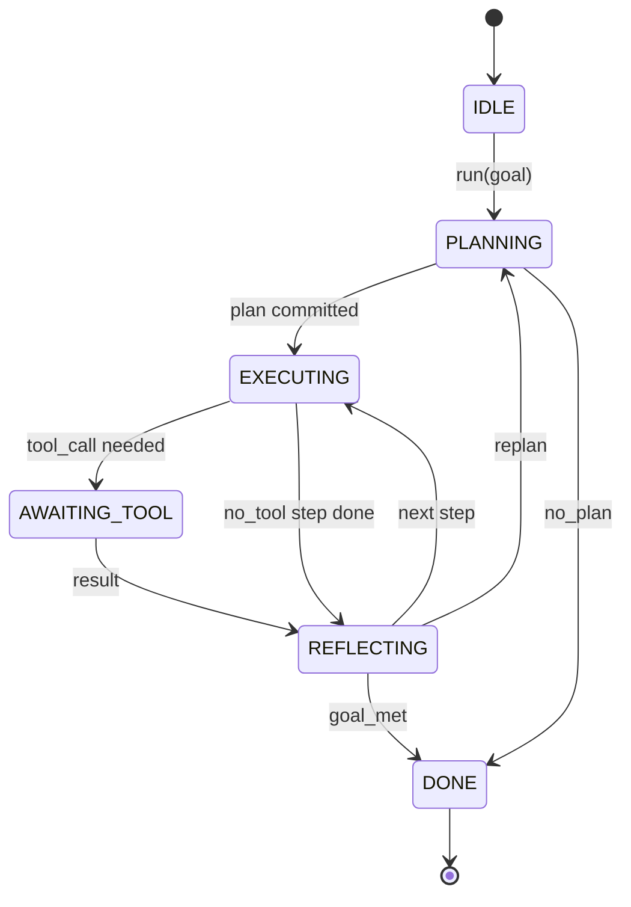

# Agent Harness 循环契约

> harness 就是 agent。模型只是一个协处理器。本课程固化这个循环契约，任何模型都可以接入其中。

**Type:** Build
**Languages:** Python
**Prerequisites:** Phase 13 课程 01-07，Phase 14 课程 01
**Time:** ~90 分钟

## 学习目标
- 将 agent harness 循环定义为一个具有显式转换的确定性状态机。
- 实现十个生命周期 hook 主题，运维人员将策略、遥测和护栏接入其中。
- 定义两个拉取点（pull point），循环在此交还控制权给调用方，并在新的输入到来时恢复执行。
- 强制执行每个会话的预算（轮数、工具调用数、墙钟时间），超出时不泄漏部分状态。
- 发出包含十一种事件类型的类型化事件流，使下游 UI 和追踪器可以订阅而无需直接检查循环。

```figure
cf-loop-contract
```

## 基本框架

一个无人值守运行四十轮的编码 agent 不是聊天循环。它是一个状态机，运维人员可以拦截其节点、审计其边。一旦你把契约写下来，替换模型、工具或策略就不再是重构，而只是一次注册调用。

本课程构建这个契约。我们命名六个状态、十个 hook 主题、两个拉取点、十一种事件类型，以及一个预算包络。harness 中的其余部分（工具注册表、JSON-RPC 传输、调度器、规划器）都接入这个结构。

## 状态

循环有六个状态。五个是活跃状态，一个是终止状态。



`IDLE` 是唯一合法的入口。`DONE` 是唯一合法的出口。`AWAITING_TOOL` 是唯一会触发拉取点的状态。其余所有转换都是内部的。

状态机是确定性的。给定相同的事件日志，harness 会重新进入相同的状态。正是这个性质让你可以在调试时回放会话，而无需重新调用模型。

## Hook 主题

Hook 是运维人员接入循环的接缝。harness 触发十个主题。每个主题接受任意数量的订阅者。订阅者按注册顺序触发。订阅者可以修改载荷（payload）、抛出异常以中止本轮，或返回哨兵值以跳过下一步。

```text
before_plan         after_plan
before_tool_call    after_tool_call
before_step         after_step
on_error
on_pause
on_budget_exceeded
on_complete
```

这个结构与 Claude Code、Cursor 和 OpenCode 在 2025 年年中都趋同的方案一致。名称是功能性的，不是品牌化的。阻止 `rm -rf` 的 hook 位于 `before_tool_call`。发送 OpenTelemetry span 的 hook 位于 `after_step`。恢复已暂停会话的 hook 位于 `on_pause`。

## 拉取点

循环会两次交还控制权。第一次在 `AWAITING_TOOL`，此时没有工具结果就无法继续推进。第二次在 `on_pause`，此时预算耗尽，或 hook 明确请求人工审核。

拉取点不是异常，而是返回。调用方检查 harness 状态，获取 harness 所需的内容，然后调用 `resume(payload)`。harness 从停止处继续执行。这与 Python 生成器的结构相同。拉取点之上的传输方式由你选择。在 TUI 中是按键。在 MCP 上是 `tools/call`。在队列上则是轮询任务。

## 事件流

循环在契约的特定位置向类型化事件流追加事件。该流是只追加的，订阅者可以从任意偏移量回放。实现的十一种事件类型是：

- `session.start` — 在调用 `run(goal)` 时发出一次
- `plan.draft` — 在规划器返回草稿计划时发出
- `plan.commit` — 在草稿被提交为活动计划后发出
- `step.start` — 在每个执行步骤开始时发出
- `step.end` — 在每个执行步骤结束时发出
- `tool.call` — 在需要工具的步骤将控制权交还给调用方时发出
- `tool.result` — 在携带工具结果恢复时发出
- `tool.error` — 在携带错误恢复时或 hook 中止调用时发出
- `budget.warn` — 在达到预算限制时发出
- `session.pause` — 在循环因暂停（预算或 hook）而交还控制权时发出
- `session.complete` — 在循环到达 `DONE` 时发出一次

事件不重复 hook 载荷。Hook 是命令式的（修改、中止）。事件是观察性的（记录、发送）。把二者视为正交。

## 预算包络

一个会话带有三个限制：轮数、工具调用数、墙钟秒数。每轮使轮数加一。每次工具调用使工具调用数加一。墙钟时间在每次状态转换时检查。当任一限制达到时，循环触发 `on_budget_exceeded`，发出 `budget.warn`，然后在下一个拉取点以预算超限原因转换到 `IDLE`。

预算不是终止开关，而是一次交还。由调用方决定是延长预算并恢复，还是关闭会话。

## 本课程不做的事

它不调用模型。它不注册真实工具。它不实现传输层。那些是接下来的四门课程。本课程敲定契约，使接下来的四门课程无需重写即可接入其中。

`main.py` 中的确定性规划器是一个占位。它返回一个硬编码的三步计划，其中两步需要工具结果。重点是循环，而不是计划。

## 如何阅读代码

`HarnessLoop` 是主类。它持有状态、触发 hook、发出事件。`Budget` 跟踪限制。`Event` 是事件流上的类型化包络。`HookRegistry` 是分发表。`_transition` 是唯一会改变状态的函数，因此状态机的不变性集中在一个地方。

从头到尾阅读 `main.py`。然后阅读 `code/tests/test_loop.py`。测试固定了每个转换和每个 hook 的触发顺序。

## 深入探索

在生产环境中构建 harness 最难的部分不是状态机，而是让契约可被强制执行。契约必须在规划器热重载后依然有效。它必须在某个工具返回畸形 JSON 后依然有效。它必须在某个 hook 在四十轮会话进行到三分之二时于 `before_tool_call` 中抛出异常后依然有效。本课程的测试覆盖了这些失败模式。运行它们。破坏它们。补充用例。

下一课程添加工具注册表。之后是 JSON-RPC 传输。再之后是调度器。到第二十四课，本文件中的循环将针对真实工具、在真实预算的强制下运行真实的计划。