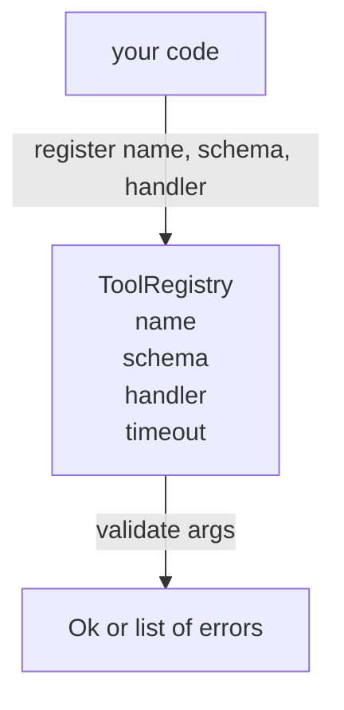

# 带模式校验的工具注册表

> 智能体无法校验的工具，就是它无法调用的工具。先构建注册表和模式检查器，再构建工具本身。

**Type:** Build
**Languages:** Python
**Prerequisites:** 第 13 阶段课程 01-07，第 14 阶段课程 01
**Time:** 约 90 分钟

## 学习目标
- 维护一个带类型的注册表，映射 工具名 → 模式 → 处理器，分发器只需查询一次即可信任。
- 实现一个 JSON Schema 2020-12 子集，覆盖工具调用实际用到的百分之九十的关键字。
- 返回精确的、json-pointer 形式的错误路径，使模型能在一次往返内自我纠正。
- 拒绝未显式指定覆盖的重注册，因为静默覆盖是生产环境工具目录漂移的根源。
- 保持校验器纯函数化（无 I/O、无时间依赖、无全局状态），以便可以在回放日志上重复运行。

```figure
cf-registry-validate
```

## 为什么注册表先于工具

2026 年的编码智能体注册的工具数量已超出模型单个上下文窗口所能容纳的范围。一个非平凡的框架会注册两百个工具，并在每一轮仅呈现十个到四十个。注册表是“存在哪些工具”、“它们的参数是什么形状”、“调用哪个处理器”这三个问题的唯一事实来源。一旦这三个答案被固定，框架的其余部分就无需再猜测。

我们要避免的错误是：发布处理器而不带模式，或者发布模式而不做校验。两者都很常见。两者都会把下一层（第二十三课的分发器）变成一场猜谜游戏，唯一的失败模式就是处理器抛出的堆栈跟踪。

## 工具记录的样子

```text
ToolRecord
  name        : str          (unique, lowercase alphanumeric and underscore segments separated by dots, e.g., snake_case.segment.case)
  description : str          (one line, shown to the model)
  schema      : dict         (JSON Schema 2020-12 subset)
  handler     : Callable     (async or sync, returns Any)
  idempotent  : bool         (dispatcher uses this for retry decisions)
  timeout_ms  : int          (override per-tool dispatcher default)
```

模式是校验器唯一接触的字段。处理器对它是不可见的。我们刻意把它们分开。模式是数据。处理器是代码。混在一起会诱使你把校验逻辑写进处理器，而那正是我们要杜绝的 bug。

## JSON Schema 2020-12 子集

完整的 2020-12 规范是一篇长文。我们只需要八个关键字。

```text
type           string / number / integer / boolean / object / array / null
properties     map of property name -> schema
required       list of property names
enum           list of allowed primitive values
minLength      integer, applies to strings
maxLength      integer, applies to strings
pattern        ECMA-262-compatible regex, applies to strings
items          schema applied to every array element
```

这足以覆盖工具 API 实际需要的内容。我们不加的关键字（oneOf、anyOf、allOf、$ref、条件式）在生产模式中是合法的，但会让校验器变成一个带循环的树遍历器。我们构建的是注册表，不是 JSON Schema 引擎。

## Json pointer 错误路径

当校验失败时，校验器返回一个错误列表。每个错误携带一个指向输入的 json-pointer 路径。指针是一个以斜杠为前缀的属性名和数组索引序列。

```text
{"a": {"b": [1, 2, "x"]}}
                    ^
                    /a/b/2
```

模型读错误路径比读自然语言句子更好。如果模式要求 `args.user.email` 而模型传入了一个整数，错误应该是 `/user/email` 并附带 `expected_type: string`。模型在下次调用中就能修正，无需再进行一轮自然语言交流。

## 注册与覆盖

`register(name, schema, handler, **opts)` 默认拒绝重注册。调用方必须传入 `override=True` 才能替换。这是运维层面的卫生习惯。代码库中两个部分静默注册同一个工具名，是在生产环境中要花一周才能找到的那类 bug。

注册表暴露三个读取方法。`get(name)` 返回记录或抛出异常。`validate(name, args)` 返回一个 `Ok` 或错误列表。`names()` 按注册顺序返回工具名。

## 校验器是什么、不是什么

它是对模式树的一次递归遍历。它是纯函数。它不调用处理器。它不做类型强转（字符串 `"42"` 无法通过数字模式）。它不会静默截断。

它不是安全边界。即使校验通过，恶意处理器仍可能行为不当。第二十三课的分发器会加上超时和沙箱层。注册表只负责形状。

## 形状



## 如何阅读代码

`code/main.py` 定义了 `ToolRegistry`、`ToolRecord`、`ValidationError` 以及八个校验器函数。校验器根据 `schema["type"]` 分派（或把带有 `enum` 的模式视为无类型的枚举检查）。每个类型校验器要么返回空列表，要么返回 `ValidationError` 列表。顶层遍历器拼接错误，并在下溯时在路径前添加路径段。

`code/tests/test_registry.py` 覆盖了注册、覆盖、校验成功、带路径的校验失败，以及子集中的每个关键字。

## 进一步延伸

本课完成后你会想要的两个扩展是：针对本地 definitions 块的 `$ref` 解析，以及用于严格形状的 `additionalProperties: false`。两者都很小。当工具目录增长到超过五十个工具时，两者都是常见的补充。我们故意把它们排除在本课之外，以保持文件篇幅可一次读完。

下一课（第二十二课）构建 JSON-RPC stdio 传输层，将此注册表暴露给模型客户端。再下一课（第二十三课）用带超时和重试的分发器把两者封装起来。