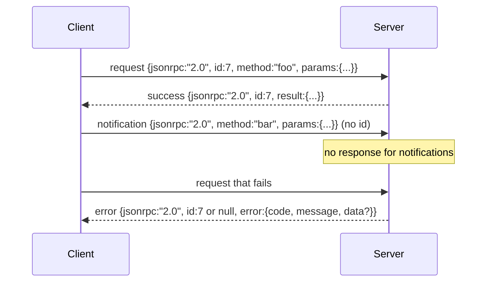

# 基于换行分隔 Stdio 的 JSON-RPC 2.0

> 模型客户端与工具服务器之间的传输是在 stdio 之上运行 JSON-RPC。亲手实现一次，你就能明白每一层帧封装到底在为什么付出代价。

**Type:** Build
**Languages:** Python
**Prerequisites:** Phase 13 课程 01-07,Phase 14 课程 01
**Time:** 约 90 分钟

## 学习目标
- 掌握以换行分隔 JSON 为帧格式、通过 stdin 和 stdout 传输的 JSON-RPC 2.0。
- 熟悉五个标准错误码（-32700, -32600, -32601, -32602, -32603），并以正确的语义呈现它们。
- 区分请求、响应、通知和批量调用，而不发明新的信封字段。
- 每行独立处理解析错误，不污染流的其余部分。
- 使用 io.BytesIO 构建一个自我终止的演示，使课程无需启动子进程即可运行。

```figure
cf-jsonrpc-frames
```

## 为什么 JSON-RPC 仍是通用语

2026 年的一个编程智能体在单个会话中可能与十几个工具服务器通信。每个服务器都是一个独立进程或远程端点。而线上格式自 2013 年以来从未改变。JSON-RPC 2.0 的规范只有两页。它得以延续，是因为替代方案（gRPC、每次调用一个 HTTP 请求、自定义二进制协议）都带来一种 JSON-RPC 不必承受的取舍：它们只能在流式、批量或传输耦合中选其一。JSON-RPC 在 stdio、socket、websocket 和 HTTP 上都是对称的，只要双方遵守规范，客户端就能驱动一个它从未见过的服务器。

本课程构建 stdio 变体。换行分隔的 JSON。每个请求一行。每个响应一行。传输边界是 `\n`。

## 线上格式

共有四种信封格式。两种由客户端发出，两种由服务器发出。



通知没有 `id`。服务器不得对其响应。如果服务器对通知返回了响应，客户端也无法将其关联到任何调用点。正是这一条规则让帧封装的逻辑保持简单。

批量调用是一个由请求或通知组成的 JSON 数组。服务器以响应数组回复，顺序任意，每个非通知条目对应一个响应。如果批量调用中的每个条目都是通知，服务器不回发任何内容。

## 五个错误码

```text
-32700  Parse error      JSON could not be parsed
-32600  Invalid Request  Envelope shape is wrong
-32601  Method not found
-32602  Invalid params
-32603  Internal error
```

-32000 到 -32099 之间的错误码保留给服务器自定义错误。其余均为应用层定义。本课程只使用这五个。如果处理器抛出异常，传输层会将其包装为 -32603，并把异常类名放入 `data.exception`。

解析错误有一条特殊规则。响应中的 `id` 为 `null`，因为请求根本未能解析出足够的结构来提取 id。

## 换行分帧与 BytesIO 演示

传输层每次读取一行。一行是指字节流中直到并包含 `\n` 的内容。如果某一行无法解析，传输层写入一个带 `id: null` 的 -32700 响应并继续。流不会被污染。下一行会重新解析。

课程中将一对 `io.BytesIO` 包装为 stdin 和 stdout。服务器读取请求直到 EOF，为每个请求写入响应，然后返回。客户端再读回响应。无需启动进程。无需超时。传输层行为与真实的子进程管道完全一致，因为 Python 的 `io` 接口提供了相同的 `.readline()` 和 `.write()` 契约。

## 方法分发

传输层并不知道存在哪些方法。它将请求交给由测试脚手架提供的可调用对象 `handler(method, params)`。处理器返回结果或抛出异常。有三个异常类对应特定的错误码。

```text
MethodNotFound -> -32601
InvalidParams  -> -32602
Anything else  -> -32603 with exception name in data
```

传输层从不接触工具注册表。注册表位于处理器之后。这正是我们想要的分层。传输层说的是 JSON-RPC。注册表说的是工具结构。分发器（第二十三课）将它们拼接在一起。

## 出错时的流行为

```text
client writes              server reads             server writes
---------------            -----------              -------------
{...valid request...}      parses ok                {...response, id matches...}
{...broken json...         parse fails              {id:null, error: -32700}
{...valid request...}      parses ok                {...response, id matches...}
{...missing method...}     invalid envelope         {id:X, error: -32600}
```

一行损坏的 JSON 不会中断循环。缺少 `method` 字段不会中断循环。处理器抛出异常也不会中断循环。传输层持续读取直到 EOF。

## 通知与非对称流

通知是即发即忘的。测试脚手架使用通知来传递进度事件、取消信号和日志行。通知让长时间运行的工具能够流式推送状态更新，而无需为每次更新往返一次。

课程实现了一个出站通知辅助函数 `write_notification`。服务器在请求处理期间使用它发送进度。演示展示了这一模式：一个请求进入，处理器发出两个进度通知，然后写入最终响应。

## 如何阅读代码

`code/main.py` 定义了 `StdioTransport`、解析辅助函数（`parse_request`）、三个写入辅助函数（`write_response`、`write_error`、`write_notification`）以及分发循环 `serve`。错误码常量位于模块作用域。

`code/tests/test_transport.py` 覆盖了五个错误码、通知（不写入响应）、批量调用（数组进、数组出、跳过通知）、损坏的 JSON（解析错误后继续），以及处理器在调用中途写入通知的非对称流。

## 深入方向

这个传输层对于后续课程已经足够。生产级传输会额外增加三样东西。一个在转发后依然保留的关联 id 字段（你的 `id` 已经是这个，但在网格中你还需要一个外层 trace id）。一个取消通道（一个形如 `$/cancelRequest` 的通知，携带进行中调用的 id）。以及一个内容类型协商握手，使同一个 socket 既能说 JSON-RPC 也能说 Streamable HTTP。这些都不改变线上格式，只是增加元数据。