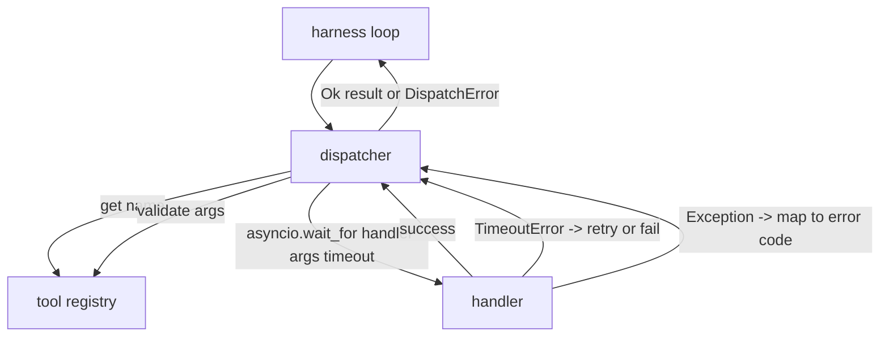
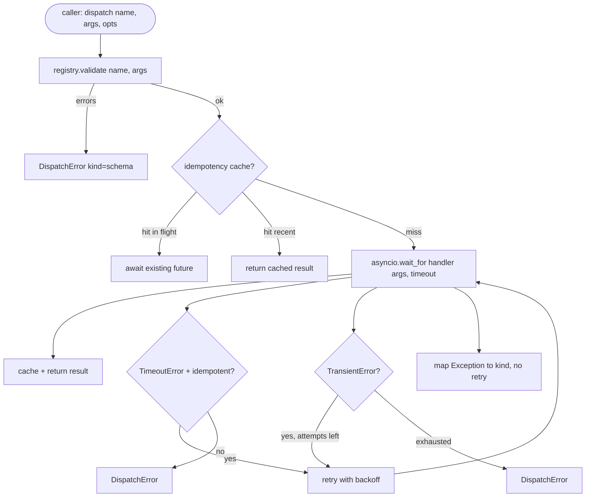

# 函数调用分发器

> 分发器是测试框架为 schema 承诺的每一项买单的地方。超时、重试、去重、错误映射，全部集中在这一条接缝上。

**Type:** Build
**Languages:** Python
**Prerequisites:** 第 13 阶段课程 01-07,第 14 阶段课程 01
**Time:** 约 90 分钟

## 学习目标
- 为工具处理器包装单次调用超时，返回类型化错误而不是让循环挂起。
- 应用带抖动和最大尝试次数的指数退避重试。
- 基于幂等键对重试去重，使得与慢速原始调用发生竞争的重试不会执行两次。
- 将处理器异常和传输故障映射到测试框架循环已能理解的统一错误信封。
- 用并发上限约束并行分发，使得四十个工具调用的扇出不会耗尽事件循环。

```figure
cf-dispatch-retry
```

## 分发器的位置

位于测试框架循环(第二十课)和工具注册表(第二十一课)之间。传输层(第二十二课)为循环提供输入。循环将一个工具调用交给分发器。分发器调用注册表、运行处理器，并返回结果或 JSON-RPC 形式的错误信封。



分发器是唯一了解定时器、重试和幂等性的层。循环不了解，注册表不了解，处理器也不了解。这种隔离正是重点所在。

## 超时

每个工具有一个默认超时。注册表记录中携带 `timeout_ms`。当测试框架传入每次调用的覆盖值时，分发器用它覆盖默认值。我们使用 `asyncio.wait_for`。超时发生时，处理器任务被取消，分发器返回 `DispatchError(kind="timeout")`。

对于非幂等工具，超时默认不是可重试错误。一个已超时的 `db.write` 可能已提交，也可能没有。重试会导致写入重复。分发器遵循注册表记录中的 `idempotent` 标志。幂等工具重试，非幂等工具不重试。

## 指数退避重试

重试策略是最多三次尝试。退避是带抖动的指数退避。

```text
attempt 1  -> delay 0
attempt 2  -> delay 0.1s * (1 + random[0..0.5])
attempt 3  -> delay 0.4s * (1 + random[0..0.5])
```

只有 `timeout` 和 `transient` 错误会重试。`schema` 错误、`not_found` 或 `internal` 错误不会重试。schema 错误是确定性的，重试不会改变结果，只会消耗预算。

重试循环遵循测试框架的预算。如果调用者的剩余工具调用次数为零，分发器在第一次尝试时就快速失败并返回 `kind="budget_exceeded"`。

## 幂等键去重

在原始调用仍在执行时触发的重试是一个真实的生产级 bug。第一次调用在 4.9 秒时挂起(刚好低于超时)。重试在 5 秒时触发。现在两个请求在同一后端上竞争。如果该工具是 `payments.charge`,你就会被重复扣费。

分发器接受一个可选的 `idempotency_key`。当一个调用到达时，如果相同的键正在执行中，分发器会等待该进行中的 future 并返回其结果。缓存在完成后保留键 60 秒，以吸收迟到的重试。

键由调用者负责。测试框架从规划器派生它：`f"{step_id}:{tool_name}:{hash(args)}"`。分发器不自行发明键，因为仅从参数派生键会使两个语义不同的调用看起来相同。

## 错误信封

失败的分发返回单一的形状。

```text
DispatchError
  kind        : "timeout" | "transient" | "schema" | "not_found" | "internal" | "budget_exceeded"
  message     : str
  attempts    : int
  jsonrpc_code: int   (one of -32601, -32602, -32603)
```

测试框架循环将 `kind` 映射到下一个状态。`schema` 和 `not_found` 进入 `on_error` 并触发重新规划。`timeout` 和 `transient` 进入 `on_error`,根据尝试次数可能重新规划也可能不重新规划。`budget_exceeded` 触发 `on_budget_exceeded`。

## 扇出上的并发限制

`gather(*calls)` 会同时运行所有协程。四十个工具调用意味着四十个打开的套接字或四十个子进程管道。大多数后端并不欢迎来自同一客户端的四十个并行连接。

分发器用信号量包装 `gather`。默认并发上限为 8。每次调用在分发前获取信号量，在完成时释放。调用者看到的是 `gather` 形式的输出，但实际的调度是有界的。

## 单次调用的流程



## 如何阅读代码

`code/main.py` 定义了 `Dispatcher`、`DispatchError` 和 `TransientError`。分发器在构造时接收一个注册表。异步的 `dispatch(name, args, ...)` 是唯一入口。每次尝试的超时通过 `asyncio.wait_for` 在 `_run_with_retries` 内部内联应用。`gather_bounded(calls)` 在并发上限下运行多次分发。

`code/tests/test_dispatcher.py` 覆盖了超时触发、瞬态错误重试、schema 错误不重试、幂等去重(两个使用相同键的并发调用折叠为一次处理器调用)以及并发限制(信号量的实际运作)。

测试使用 `asyncio.sleep(0)` 和确定性的基于 `Counter` 的处理器，因此它们在毫秒级完成，且不依赖真实时钟计时。

## 进一步探索

生产级分发器通常会添加两个扩展。第一，在每个转换点进行结构化日志记录(循环的事件流已经提供了这一点，但分发器也应发出 `dispatch.attempt` 和 `dispatch.retry` 事件)。第二，熔断器：在一个时间窗口内出现 N 次失败后，工具进入冷却期，期间分发调用立即返回 `kind="circuit_open"`,而不尝试调用处理器。两者都可以在此分发器之上实现，而无需更改契约。

第二十四课将分发器与规划-执行智能体连接起来，让你看到这四个部分协同运作。