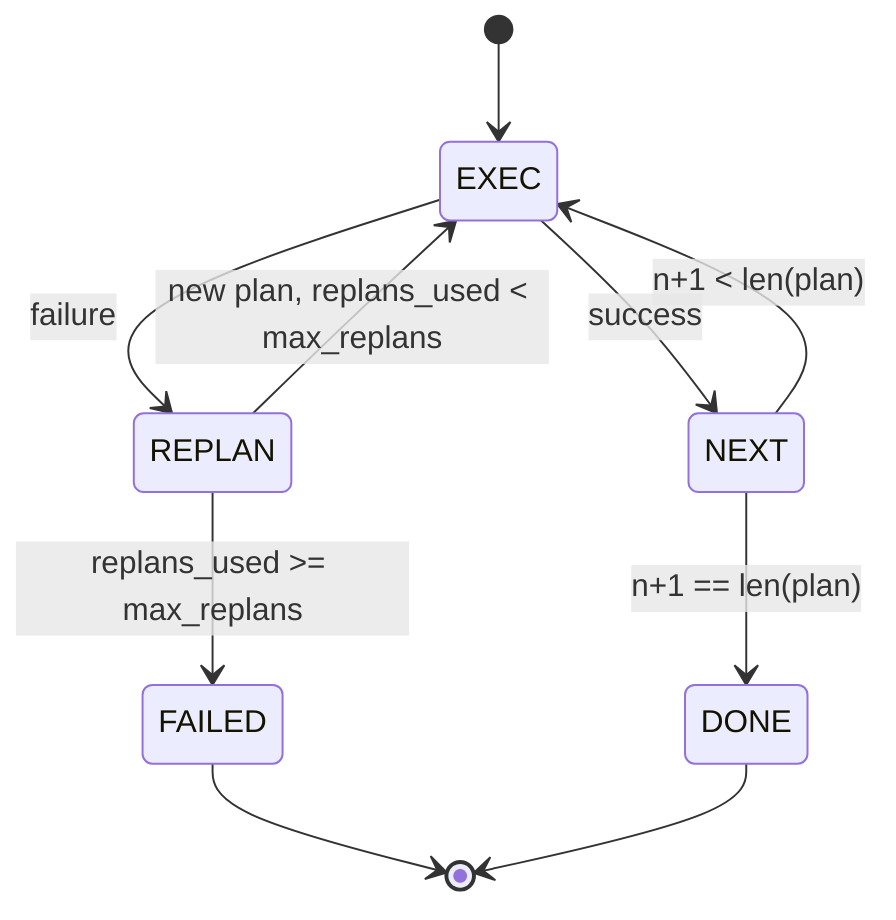

# 计划-执行控制流

> 一个无法在失败中幸存的计划只是一段脚本。一个能够重新规划的脚本才是智能体。先构建重规划器。

**Type:** Build
**Languages:** Python
**Prerequisites:** Phase 13 lessons 01-07, Phase 14 lesson 01
**Time:** ~90 minutes

## 学习目标
- 将计划表示为类型化步骤的有序列表，使执行器能够推理进度和结果。
- 顺序执行步骤，并以受控方式将失败交还给规划器。
- 从当前游标处重新规划，并将先前的错误置于上下文中，使下一个计划有据可依。
- 在每次修订时输出计划差异，使下游的追踪器或 UI 能够展示计划为何改变。
- 强制执行两个预算：硬性步骤上限和硬性重规划上限。

```figure
cg-plan-replan
```

## 计划与执行，而非思维链

思维链（chain-of-thought）智能体输出 token，并让循环去猜测工具调用在哪里结束。计划-执行智能体先输出一个结构化的计划，然后确定性地执行每个步骤。计划是 harness 可以内省的数据。执行则是 harness 通过分发器运行这些数据。

两个部分。一个生成计划的规划器。一个执行计划的执行器。有趣的工作在于执行器遇到失败时会发生什么。三个选项：

```text
1. Abort         (return failed, surface the error)
2. Skip          (mark step failed, continue with the rest)
3. Replan        (hand the error to the planner, get a new plan from the cursor)
```

重规划是将脚本变为智能体的关键。

## Step 的结构

```text
Step
  id              : int           (monotonic within a plan revision)
  tool_name       : str
  args            : dict
  expected_outcome: str           (planner's stated success condition)
  result          : Any | None
  error           : str | None
```

`expected_outcome` 是规划器随步骤一起输出的一句简短描述。执行器并不强制执行它。它有两个用途：重规划器在修订计划时会读取它；事件流会输出它，使追踪器能够显示“这一步本应做 X”。

## 规划器的结构

```python
def planner(goal: str, history: list[Step], last_error: str | None) -> list[Step]:
    ...
```

一个纯函数。`goal` 是用户目标。`history` 是已执行的步骤（已填入结果和错误）。`last_error` 在首次调用时为 None，在后续每次调用时为最近的失败消息。规划器返回从游标处开始的下一个计划。

规划器不知道执行器的存在。它不知道重试。它不知道超时。它只生成一个计划。仅此而已。

## 执行器

执行器是一个小型状态机。每个步骤都通过分发器运行。结果有三种：成功、可重规划的失败、致命失败。可重规划的失败交还给规划器。致命失败（超出预算、触及重规划上限）返回一个 `FAILED` 会话结果。



## 修订时的计划差异

当规划器在失败后返回新计划时，执行器会输出一个包含三个字段的 `plan.diff` 事件。

```text
removed: list of step ids that were in the old plan and are not in the new
added  : list of step ids in the new plan that were not in the old
revised: list of step ids whose tool_name or args changed
```

追踪器或 UI 可以将其渲染为：被移除的步骤加删除线，新增的步骤高亮显示。重点不在于差异格式本身。重点在于修订是一个可见的事件，而不是一次静默的重写。

## 两个预算，都是硬性限制

`max_steps` 限制整个会话中的总步骤执行次数，包括重规划在内。默认值为十二。一个五步的线性计划，如果重规划两次且每次新增三个步骤，将达到十六次执行，从而超出预算。执行器将拒绝该重规划并返回 FAILED。

`max_replans` 限制首个计划之后调用规划器的次数。默认值为五。这是更重要的限制。否则，一个连续五次返回同一个损坏计划的规划器会一直循环，直到步骤预算将其终止。限制重规划次数可以让失败更快发生，原因也更清晰。

## 本课中的确定性规划器

本课不调用模型。课程附带一个确定性规划器，它根据 `last_error` 选择计划。

```text
last_error is None    -> emit a four-step plan
last_error matches X  -> emit a three-step plan that routes around X
last_error matches Y  -> emit a two-step plan that gives up gracefully
otherwise             -> return [] (signals nothing to replan)
```

这足以测试执行器在每条转换路径上的行为：成功、重规划一次、重规划两次、重规划耗尽、以及步骤预算耗尽。

## 结果结构

```text
SessionResult
  status      : "completed" | "failed"
  reason      : str     ("goal_met" | "step_budget" | "replan_budget" | "no_plan")
  history     : list[Step]
  revisions   : list[PlanDiff]
  events      : list[Event]
```

第二十课的 harness 循环可以直接读取该结果。第二十三课的分发器负责执行每个步骤。第二十一课的注册表验证每个步骤的参数。第二十二课的传输层可以通过 JSON-RPC 将整个流程呈现给模型客户端。

## 如何阅读代码

`code/main.py` 定义了 `PlanExecuteAgent`、`Step`、`PlanDiff`、`SessionResult` 以及确定性规划器。执行器是一个单一的 `run(goal)` 方法，返回一个 `SessionResult`。计划差异通过比较步骤 id 和 `(tool_name, args)` 元组来计算。

`code/tests/test_agent.py` 覆盖以下场景：线性成功、计划中途失败并重规划一次、返回 `failed:replan_budget` 的重规划耗尽、步骤预算耗尽、以及计划差异事件格式。

## 深入探索

当你将其接入真实模型后，会需要两个扩展。第一，部分计划缓存：当一个计划在前六个步骤中的前三个成功执行后失败时，你不会想重新运行前三个步骤。执行器已经保留了历史记录；规划器只需读取它。第二，并行分支：当前执行器是严格串行的。一个输出独立分支（`gather_step` 而非 `next_step`）的规划器可以通过分发器并发运行两个工具调用。

两者都会增加实际的复杂度。两者在串行执行器固定下来之后都更容易添加。这正是本课所做的事情。