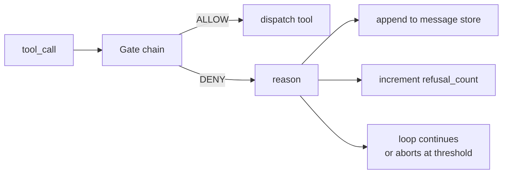
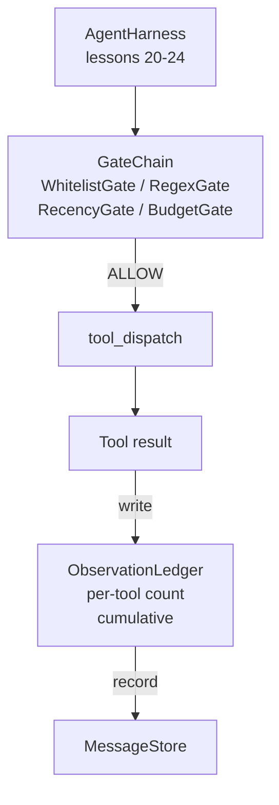

# 毕业课程 25:验证门与观察预算

> 没有验证层的 agent harness 只是一厢情愿的空想。本课程构建一条确定性的门链，它决定一次工具调用是否允许触发、agent 允许看到其输出的多少内容，以及当 agent 读取过多时循环何时必须停止。这条链是由若干小型、命名的门加上一本观察台账(observation ledger)组成的函数,该台账记录模型曾被展示过的每一个 token。

**Type:** Build
**Languages:** Python (标准库)
**Prerequisites:** Phase 19 · 20-24(Track A1:agent 循环、工具注册表、消息存储、提示词构建器、模型路由器),Phase 14 · 33(作为约束的指令),Phase 14 · 36(作用域契约),Phase 14 · 38(验证门)
**Time:** 约 90 分钟

## 学习目标

- 使用确定性的 `evaluate(call)` 方法构建 `VerificationGate` 协议。
- 将预算门、时效门、白名单门和正则门组合为一条具有短路语义的链。
- 通过以工具和轮次为键的 `ObservationLedger` 追踪每一次观察。
- 当累计观察预算将被超出时,拒绝该工具调用。
- 输出一条结构化的 `GateDecision` 记录,供下游可观测性系统摄取。

## 问题

当 agent harness 允许模型自由调用工具时,真实使用的第一小时内就会出现三类 bug。

第一类是无界的观察。对 20 万行代码仓库的一次 grep 会把 50 万 token 的输出倾倒进下一轮。模型每千字节才能看到一个匹配项,其余上下文全部浪费。token 账单巨大,而 agent 在任务上的表现反而更差了,而不是更好。

第二类是过时的时效性。一个长时间运行的任务累积了五十次工具调用。模型把第三轮的第一次 read_file 当作实时状态重新读取。第四十七轮所做的编辑从未出现,因为提示词构建器最先序列化的是最早的观察。

第三类是权限蔓延。一个研究任务从调用 `web_search` 开始,却不知怎么最终运行了 `shell`,因为模型编造了一个工具名称,而 harness 默认采取了宽松策略。等到有人阅读追踪记录时,/tmp 里已经多了一个垃圾文件,而且已经对一个私有 API 执行过一次 curl。

验证门是 harness 中说"不"的组件。它不是一个模型。它不是一个裁判。它是一个以 `(call, history, ledger)` 为输入的确定性函数,返回 ALLOW 或 DENY 并附带理由。理由会被记录。模型会被告知。循环继续或中止。

## 概念



门是任何具有 `evaluate(call, ctx) -> GateDecision` 方法的对象。链是一个有序列表。求值在遇到第一个拒绝时短路。顺序很重要:廉价的结构性门先于昂贵的 token 计数门运行。

本课程提供四个门:

- `WhitelistGate`。允许的工具名称是一个显式集合。集合之外的任何东西都会被拒绝。这是最廉价的门,最先运行。
- `RegexGate`。工具参数会与正则表达式匹配。可用于拒绝包含 `rm -rf` 的 shell 调用,或针对内部 IP 的 HTTP 调用。只作用于调用负载本身。
- `RecencyGate`。模型只能看到最近 N 轮的观察。更旧的观察会被遮蔽。当某次工具调用的结果会延长一个已经过期的观察窗口时,该门会拒绝这次调用。
- `BudgetGate`。模型在整个会话中读取的累计 token 有一个上限。当台账显示已达上限时,每一次后续工具调用都会被拒绝。

观察台账是记账机制。每一次成功的工具调用写入一行:工具名称、轮次、发出的 token 数、累计值。台账回答两个问题:模型总共看过多少,以及它看过多少来自工具 X 的内容。预算门读取第一个。按工具预算的门——你将在练习中编写它——读取第二个。

```figure
cg-gate-chain
```

## 架构



harness 询问这条链。链要么点头,要么拒绝。如果点头,工具运行,台账更新,结果被追加到消息存储中。如果拒绝,模型会收到一条作为系统消息的拒绝信息,循环决定是重试还是中止。

## 你将构建什么

实现是一个单独的 `main.py` 加上测试。

1. `Observation` 和 `ToolCall` dataclass 定义线上传输的数据结构。
2. `ObservationLedger` 记录 `(turn, tool, tokens)` 行并回答 `cumulative()` 与 `per_tool(name)`。
3. `GateDecision` 承载 `(allow, reason, gate_name)`。
4. `VerificationGate` 是协议。每个门实现 `evaluate(call, ctx)`。
5. `GateChain` 包装一个有序列表。它依次调用每个门,返回第一个拒绝,或在所有门都通过时返回允许。
6. 演示运行一个小型合成 agent 循环。共三轮。第三轮触发预算门,循环报告一次干净的拒绝并带有非零的拒绝计数。

token 计数器有意采用一个愚蠢的 `len(text) // 4` 启发式方法。本课程的重点是门的管道机制,而不是分词器。生产环境中请换成真正的分词器。

## 为什么链的顺序很重要

一次拒绝比一次允许更廉价。`WhitelistGate` 以 O(1) 哈希查找运行。`RegexGate` 以 O(pattern * argv) 运行。`RecencyGate` 读取消息存储的一小部分。`BudgetGate` 读取整个台账。你按成本升序排列它们,使被拒绝的调用在执行昂贵工作之前短路。

你还要按影响范围排列它们。白名单是最强的断言:这个工具不在契约中。正则门次之:这个参数不在契约中。时效门再次之:harness 仍然关心,但调用在结构上是合法的。预算门放在最后,因为按定义,它只在其他所有门都通过之后才会触发。

## 这如何与 Track A 的其余部分组合

之前的课程给了你循环、工具注册表、消息存储、提示词构建器和模型路由器。本课程在模型与工具之间增加一层。第 26 课提供沙箱,一旦门链说 ALLOW,调度器就把工具调用交给它。第 27 课提供评估 harness,将拒绝计数记录为质量信号。第 28 课把门决策接入 OpenTelemetry span。第 29 课把这一切整合成一个可运行的编码 agent。

## 运行它

```bash
cd phases/19-capstone-projects/25-verification-gates-observation-budget
python3 code/main.py
python3 -m pytest code/tests/ -v
```

演示程序打印逐轮追踪,包括每一次门的决策,并以零退出。测试覆盖台账、每个门的单独行为、链的短路机制,以及端到端的合成循环。