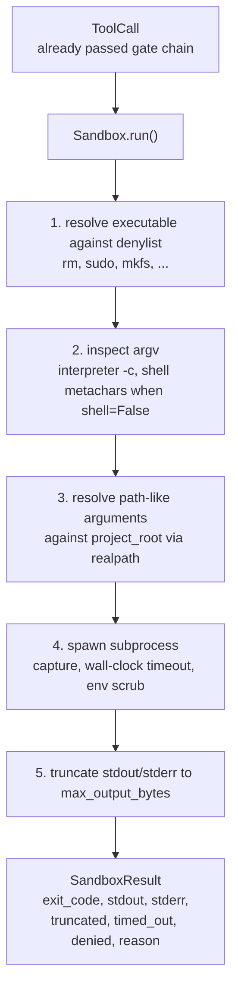
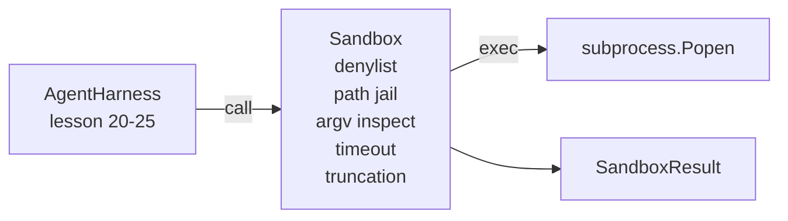

# 结业课第 26 课：带拒绝列表与路径监狱的沙箱执行器

> 验证关卡决定一个工具调用是否应该运行。沙箱决定它运行时会发生什么。本课实现一个子进程执行器：拒绝危险的可执行文件，拒绝危险的 argv 形态，将每个文件路径限制在项目根目录内，截断超长输出，并在墙上时钟超时时杀死失控进程。它是位于模型与操作系统之间的两层中的第二层。

**Type:** Build
**Languages:** Python (标准库)
**Prerequisites:** Phase 19 · 25 (verification gates and observation budget), Phase 14 · 33 (instructions as constraints), Phase 14 · 38 (verification gates)
**Time:** ~90 分钟

## 学习目标

- 构建一个 `Sandbox` 类，封装 `subprocess.run`，支持超时、捕获和截断。
- 按名称对照拒绝列表、按结构对照 argv 检查器来拒绝命令。
- 拒绝任何解析到声明的项目根目录之外的路径参数。
- 在 shell 模式关闭时拒绝 shell 元字符。
- 返回一个结构化的 `SandboxResult`，供下游可观测性和评估框架摄取。

## 问题

一个能够执行 shell 命令的编码代理可以安装后门、窃取密钥、弄坏开发者的笔记本电脑，并在一轮对话中烧掉一大笔云账单。成本最低的防御是不给它 shell。成本次低的是一个能对精确的模式清单说不的沙箱。

在代理运行轨迹中有三类反复出现的失败。

第一类是危险的可执行文件。一个急于修复路径问题的模型会尝试 `sudo`、`chmod -R 777`、`rm -rf`、`mkfs`、`dd`。这些都不应出现在代理运行中。拒绝列表按名称和别名捕获它们。

第二类是 argv 技巧。被告知不能用 shell 的模型会通过解释器来传递攻击：`python3 -c "import os; os.system('rm -rf /')"`、`bash -c '...'`、`node -e '...'`、`perl -e '...'`。沙箱需要知道：任何带着 `-c` 类标志运行的解释器，不过是多绕了几步的 shell 调用。

第三类是路径逃逸。模型被告知读取 `./src/main.py`，却去读取 `../../etc/passwd`。沙箱通过 `os.path.realpath` 解析每个路径参数并断言前缀，从而将其限制住。

沙箱并不是操作系统意义上的安全边界。一个拿到代码执行能力的坚定攻击者仍然可以突破它。沙箱是一个开发期护栏：它让常见的失败模式变得显眼，并阻止代理因自身笨拙而造成破坏。

## 概念



沙箱有四个拒绝轴：名称、argv、路径、结构。每个轴都是该调用的纯函数，此时还没有子进程。只有当所有轴都通过后，子进程才会启动。

`SandboxResult` 退出码采用惯例：0 表示成功，非零表示失败，外加三个哨兵码：denied 为 -100，timed_out 为 -101，truncated（退出码保留真实值，另设一个标志位）。下游课程读取这个结构化结果，而不是去解析 stderr。

```figure
cg-path-jail
```

## 架构



拒绝列表是一个由可执行文件 basename 组成的 frozenset。别名（`/bin/rm`、`/usr/bin/rm`）都解析到同一个 basename。argv 检查器认识解释器形态：任何 argv 中 argv[0] 是解释器、且后续任一参数以 `-c` 或 `-e` 开头的调用都会被拒绝。shell 元字符（`;`、`|`、`&`、`>`、`<`、反引号、`$()`）在调用未显式请求 shell 时会导致拒绝。

路径监狱是最精妙的部分。沙箱在构造时接受一个 `project_root`。任何看起来像路径的参数（包含 `/` 或匹配一个已存在的文件）都会经过 `os.path.realpath` 规范化，然后对照项目根目录的 realpath 进行检查。如果解析后的目标不在根目录之下，则拒绝。符号链接逃逸尝试（项目根目录中指向外部的符号链接）通过检查 realpath 而非字面路径来阻止。

## 你将构建什么

实现是 `main.py` 加上一个测试目录。

1. `SandboxResult` dataclass：exit_code、stdout、stderr、truncated、timed_out、denied、reason、duration_ms。
2. `SandboxConfig` dataclass：project_root、max_output_bytes、timeout_seconds、denylist、interpreter_block。
3. `Sandbox` 类：`run(argv, *, shell=False, cwd=None)` 返回一个 `SandboxResult`。
4. 内部拒绝辅助函数：`_check_executable_denylist`、`_check_argv_interpreter`、`_check_shell_metachars`、`_check_path_jail`。
5. 输出截断，带一个清晰的 `truncated` 标志和捕获流中的一行标记。
6. 底部的演示：一组合法调用与对抗性调用。每个调用都连同其结果一起展示。

沙箱默认使用 `subprocess.run` 配合 `shell=False` 以及 `capture_output=True`。墙上时钟超时使用 `timeout` 参数；在 `TimeoutExpired` 时，沙箱杀死整个进程组并合成一个 SandboxResult。

## 为什么这不是一个真正的沙箱

本课的沙箱不使用 namespaces、cgroups、seccomp、gVisor、Firecracker 或任何内核级隔离。子进程能做的事，沙箱也能做。这层保护是结构性的：最常见的危险调用被拒绝，而响亮的拒绝信息会进入可观测性系统，而不是被静默执行。

对于生产级代理，你需要在其上叠加更多层：在无特权的 Docker 容器内运行，在 microVM 内运行，丢弃 capabilities，将项目根目录以只读方式挂载并提供一个可读写的临时目录，对内存和 CPU 设置 ulimit，把环境变量清洗成一个已知安全的白名单。第 29 课会做其中一部分。操作系统级隔离不在本课范围内。

## 运行它

```bash
cd phases/19-capstone-projects/26-sandbox-runner-denylist
python3 code/main.py
python3 -m pytest code/tests/ -v
```

演示程序创建一个临时目录，放入一个干净的文件，然后运行一系列调用。合法调用成功。被拒绝的调用返回带 `denied=True` 和原因的 SandboxResult。超时返回 `timed_out=True`。截断会设置 `truncated=True`。演示程序打印一个 JSON 结果表并以零退出。

## 本课如何与 Track A 的其余部分组合

第 25 课构建了关卡链。第 26 课是在关卡 ALLOW 之后运行的执行器。第 27 课的评估框架将沙箱结果与每个任务的预期退出码进行比较。第 28 课围绕每次 `Sandbox.run` 调用发射一个 `gen_ai.tool.execution` span。第 29 课的端到端演示将一个真实的编码代理接入这两层。