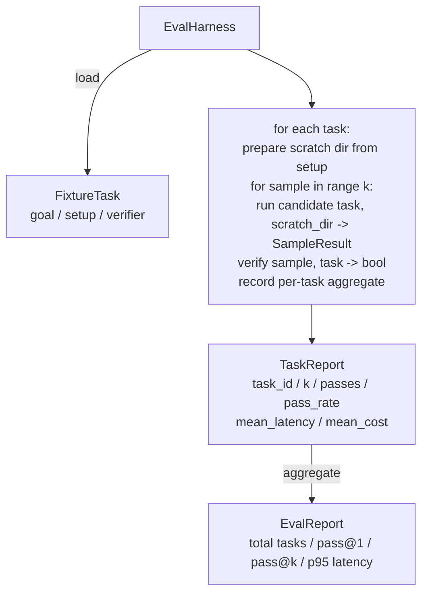

# 毕业课 27：基于固定任务集的评估框架

> 编码代理的质量取决于你用来衡量它的任务集。本课构建一个评估框架：读取一个固定任务文件夹，将每个任务交给候选代理运行，通过确定性验证器判定通过或失败，并将结果汇总为 pass@1、pass@k、平均延迟和平均成本。这个框架是判定回归与重构的最终依据。

**Type:** Build
**Languages:** Python (标准库)
**Prerequisites:** Phase 19 · 25（验证门）、Phase 19 · 26（沙箱运行器）、Phase 14 · 30（评估驱动的代理开发）、Phase 14 · 19（SWE-bench 与 GAIA 基准）
**Time:** 约 90 分钟

## 学习目标

- 将固定任务定义为目标、初始设置与验证器的三元组。
- 对每个任务进行多次采样运行并计算 pass@1 和 pass@k。
- 将延迟与成本汇总为均值和 95 分位数指标。
- 将确定性验证器（文件 diff、退出码、正则匹配）封装为可复用函数。
- 输出结构化 JSON 报告，供回归跟踪脚本读取。

## 问题所在

缺少评估框架的代理基准存在三种典型的失效模式。

第一种是未经核实就判为通过。代理声称修复了 bug，人类扫一眼 diff，测试套件被标绿，三周后回归测试又暴露出同一个 bug。代理只是给出了看似合理的推理，实际上什么都没修复。

第二种是未察觉的回归。对提示模板的一次改动让代理在“吵闹”任务上好 4%，却在“安静”任务上差了 14%。没有金标准集和逐任务评分，这个回归就会悄悄进入主分支，直到客户投诉才暴露。

第三种是逐任务漂移。评估周一运行时有 100 个任务，周五运行时只剩 95 个，因为有人重命名了五个固定任务文件。通过率看起来提升了 5%。其实并没有。

评估框架就是把这些失效变成事实的程序。它每次都以可复现的顺序运行每一个固定任务，并用一个基于确定性检查、只返回真或假的验证器来判定。

## 概念

```mermaid
flowchart LR
  F1[fixtures/task_001/<br/>task.json + expected/] --> Harness
  F2[fixtures/task_002/<br/>...] --> Harness
  Harness[Harness<br/>for each task:<br/>setup / run agent k samples /<br/>verify each sample /<br/>record latency, cost]
  Harness --> Report[EvalReport<br/>pass@1 / pass@k<br/>mean ms / p95 ms<br/>mean cost]
```

一个 `FixtureTask` 是一个小的 JSON 文件加上一个可选的 `expected/` 目录。JSON 声明一个 `id`、一个 `goal`（喂给代理的提示）、一个 `setup` 块（要放入临时目录的文件）和一个 `verifier` 块。验证器块指定框架验证器注册表中的一个函数并提供其参数。

三种验证器形态覆盖了大多数有用任务。

第一种是 `file_equals`。代理运行后，将某个指定文件与期望内容进行比较。适用于“以精确方式修复此 bug”类任务。

第二种是 `regex_match`。指定文件的内容用正则表达式匹配。适用于“函数必须存在并返回 X”这类存在多种可接受解法的任务。

第三种是 `shell_exit_zero`。框架运行一条 shell 命令（通过第 26 课的沙箱），仅当命令以零退出时任务才算通过。适用于“测试必须通过”类任务。

框架将每个任务运行 `k` 次。Pass@k 的公式是 `1 - (1 - p)^k`，其中 p 是经验通过率；框架同时报告原始计数，便于发现方差。延迟为每个采样的墙钟时间。成本由代理自行报告（token 数、美元，或两者皆有）；框架对所有采样求和，并给出逐任务和汇总数字。

```figure
pass-at-k
```

## 架构



候选者是一个可调用对象：`Callable[[FixtureTask, str], SampleResult]`。框架通过 `tempfile.mkdtemp()` 创建临时目录，并将其路径以普通字符串传入。框架不关心候选者如何工作。候选者可以是确定性补丁应用器（对框架自测有用）、真实的 LLM 代理或模糊测试器。契约就是 SampleResult。

## 你将构建的内容

`main.py` 包含：

1. `FixtureTask` dataclass。
2. `SampleResult` dataclass：success_self_reported、latency_ms、cost_units、edits。
3. `TaskReport`、`EvalReport` dataclass，含 `to_dict()`。
4. `VerifierRegistry`：验证器名称到函数的映射。内置验证器：file_equals、regex_match、shell_exit_zero。
5. `EvalHarness` 类。对一个任务目录与候选者进行运行评估，返回 EvalReport。
6. 五个捆绑于 `tasks/` 的固定任务：
   - `fizzbuzz` 中的差一错误
   - `factorial` 中缺失的 return
   - 错误信息中的拼写错误
   - 空函数体
   - 链表遍历中的差一错误
7. 一个确定性参考候选者（`apply_known_fixes`），框架用它演示 pass@1 为 1.0 的干净结果。
8. 演示打印 EvalReport JSON 并以零退出。

固定任务以 JSON 文件形式捆绑在 `tasks/` 中，配套的源文件在 `tasks/<id>/buggy/` 和 `tasks/<id>/expected/` 中。框架将含 bug 的文件复制到临时目录，交给候选者，并对照期望文件进行验证。

## 为什么是 pass@k 而不只是 pass@1

真实的 LLM 代理是随机的。0.6 的 pass@1 看起来像失败；而 0.95 的 pass@5 说明代理大多数时候能得到正确答案，只是早期采样经常选错。解决办法是采样与排序，而不总是更多训练。Pass@k 能让这一点显性化。

Pass@k 与 pass@1 一并报告，因为 pass@k 会掩盖真实的失败：如果模型二十次尝试中只有一次得到正确答案，你就没有一个可用的代理。框架两者都展示。

## 与 Track A 其余部分的组合

第 25 课产出了门控链。第 26 课产出了沙箱。框架在任何 `shell_exit_zero` 验证器中使用沙箱。第 28 课为每次框架运行包裹 OTel 追踪。第 29 课针对其中一个捆绑固定任务运行端到端演示，并断言参考候选者的 pass@1 = 1.0。

## 运行方式

```bash
cd phases/19-capstone-projects/27-eval-harness-fixture-tasks
python3 code/main.py
python3 -m pytest code/tests/ -v
```

演示以 JSON 打印 EvalReport，包括 pass@1、pass@5、平均延迟和逐任务明细。退出码为零。测试覆盖验证器函数、pass@k 计算、固定任务加载，以及框架对捆绑参考候选者的端到端运行。