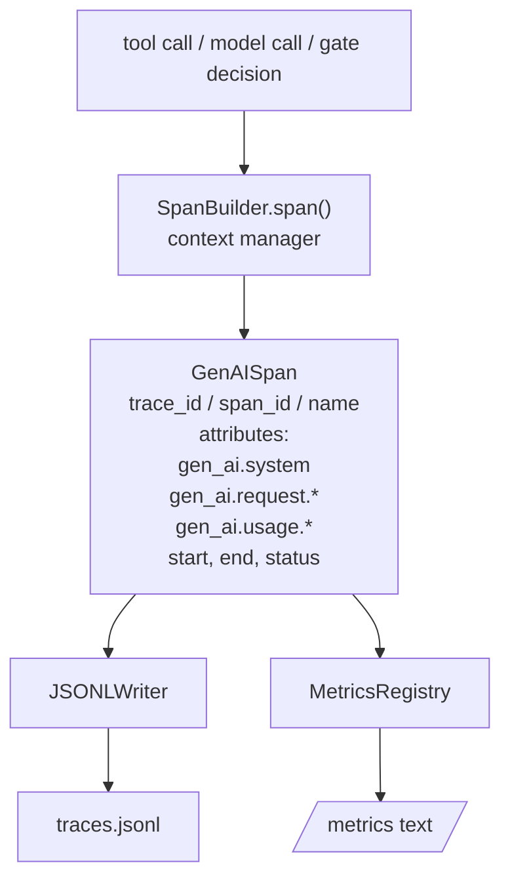
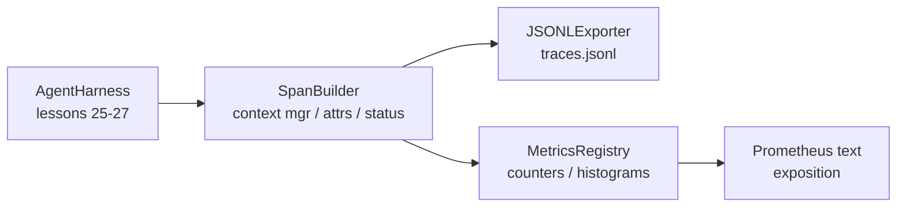

# 毕业课 28：使用 OTel GenAI Span 和 Prometheus 指标实现可观测性

> 没有可观测性的 agent harness 就是一台烧钱的黑箱。本课手工实现一个 span 构建器，生成符合 OpenTelemetry GenAI 语义约定的记录，将它们写入 JSON-Lines 文件（每行一个 span），并以 Prometheus 文本格式暴露计数器和直方图。整套代码仅使用 Python 标准库，可离线运行。

**Type:** Build
**Languages:** Python (stdlib)
**Prerequisites:** Phase 19 · 25 (verification gates)、Phase 19 · 26 (sandbox)、Phase 19 · 27 (eval harness)、Phase 13 · 20 (OpenTelemetry GenAI)、Phase 14 · 23 (OTel GenAI conventions)
**Time:** 约 90 分钟

## 学习目标

- 构建一个符合 OpenTelemetry GenAI 语义约定结构的 span 数据类。
- 实现一个 JSONL 导出器，每行写入一个自包含的 span。
- 构建带标签的计数器和直方图，并以 Prometheus 文本格式暴露。
- 用一个 span 上下文管理器包装任意可调用对象，记录时长、状态和异常。
- 验证生成的 span 可以通过 `json.loads` 完成往返解析，并符合规范的结构。

## 问题

生产环境中的编程 agent 每一轮都会产生三类产物：一次模型调用、一次工具执行、一个验证门控决策。没有结构化遥测数据，这些产物都毫无用处。

第一种故障模式是缺失的追踪。周二出了问题，但唯一的记录是一份 500 行的聊天日志。没有记录哪个工具运行了、运行了多久、提示词消耗了多少 token、门控是否拒绝了什么。agent 作者只能靠猜。

第二种故障模式是无法解析的追踪。harness 写了 span，但使用了自己临时起的字段名。Grafana、Honeycomb、Jaeger 或本地 CLI 都读不了它们。团队技术栈中现有的任何工具都被浪费了，因为这些 span 不符合标准。

第三种故障模式是未聚合的指标。你可以在追踪中看到一次缓慢的工具调用，但无法回答“read_file 调用过去一小时的 p95 延迟是多少”，因为没有指标，只有追踪。

OpenTelemetry GenAI 语义约定正是为此而生。它定义了一小组标准属性，供各个 LLM 框架的 span 生成器共享。只要你的 harness 写入这些属性，所有兼容 OTel 的后端都能读取它们。

## 概念



harness 中的每个操作都会产生一个 span。span 包含：trace id（整个 agent 调用）、span id（本次操作）、名称（例如 `gen_ai.chat`、`gen_ai.tool.execution`）、遵循 GenAI 约定的属性、开始和结束时间，以及状态。

GenAI 约定标准化了这些属性键：`gen_ai.system`（哪个提供商，例如 `anthropic`、`openai`）、`gen_ai.request.model`（模型 id）、`gen_ai.request.max_tokens`、`gen_ai.usage.input_tokens`、`gen_ai.usage.output_tokens`、`gen_ai.response.model`、`gen_ai.response.id`、`gen_ai.operation.name`，以及工具专用键 `gen_ai.tool.name` 和 `gen_ai.tool.call.id`。

导出器写入 JSONL，每行一个 JSON 对象。这是最简单的格式，下游工具可以流式读取、grep 和导入。真正的 OTel 导出器会使用 OTLP gRPC；本课的 JSONL 导出器是离线等价物，在任何工作站上都能正常退出（返回零）。

指标与追踪并存。计数器在每次工具调用时递增：`tools_called_total{tool="read_file"}`。直方图记录观测到的延迟：`tool_latency_ms{tool="read_file"}`。两者都序列化为 Prometheus 文本暴露格式，这是拉取式指标的事实标准。

```figure
trace-spans
```

## 架构



span 构建器是一个小类，其 `span(name, attrs)` 方法返回一个上下文管理器。该上下文管理器在进入时记录开始时间，在退出时记录结束时间，如果抛出异常则附加该异常，并将最终确定的 span 推送到导出器。

指标注册表是两个字典。计数器是 `{(name, frozen_labels): int}`。直方图将原始样本保存在列表中，在暴露时序列化为 Prometheus 直方图桶。

## 你将构建的内容

`main.py` 包含：

1. `GenAISpan` 数据类：trace_id、span_id、parent_span_id、name、attributes、start_unix_nano、end_unix_nano、status、status_message、events。
2. `SpanBuilder` 类，带 `span(name, attrs, parent=None)` 上下文管理器。
3. `JSONLExporter` 类，其 `export(span)` 方法追加一行。
4. `Counter` 和 `Histogram` 类，以及 `MetricsRegistry`。
5. `prometheus_exposition(registry)`，生成文本格式输出。
6. `wrap_tool_call(name)` 装饰器，生成 span 并更新指标。
7. 演示：合成一个完整的 agent 调用（gen_ai.chat span 包裹工具 span），写入 traces.jsonl，打印 Prometheus 暴露内容，正常退出。

span id 和 trace id 是 16 字节十六进制字符串，由 `os.urandom` 生成。这与 OTel 的 W3C trace context 一致。导出器从不抛出异常；IO 错误会被呈现，但 harness 继续运行。

直方图有一组固定的桶（OTel 默认的毫秒延迟桶：5, 10, 25, 50, 100, 250, 500, 1000, 2500, 5000, 10000, +Inf）。样本存储为列表；暴露时按需计算每个桶的计数。

## 为什么手工实现而不是用 opentelemetry-sdk

OTel Python SDK 是一个真实的依赖。它有数千行代码，OTLP 导出器涉及多个进程，其运行时开销远超一节课的预算。手工实现能让你学会线上格式。在生产环境中，你把同样的属性接入真正的 SDK，即可免费获得 OTLP 导出器、批处理和资源检测。

这些约定是稳定的。本课生成的线上格式到 2030 年仍能被解析，因为 OTel 从不更改 GenAI 属性名，只会新增。

## 本课如何与 Track A 其他课程组合

第 25 课构建了门控链。第 26 课构建了沙箱。第 27 课构建了评估 harness。第 28 课让这三者变得可观测。第 29 课将端到端演示的每一步都包进 span，并在最后打印 Prometheus 文本。

## 运行方式

```bash
cd phases/19-capstone-projects/28-observability-otel-traces
python3 code/main.py
python3 -m pytest code/tests/ -v
```

演示程序会在课程工作目录中生成一个 `traces.jsonl`（最后会被清理），然后打印三个 span 的示例，接着打印计数器和直方图的 Prometheus 暴露内容。测试会验证：span 能往返序列化、规范的 GenAI 属性都存在、计数器正确递增、直方图暴露中包含预期的桶计数。