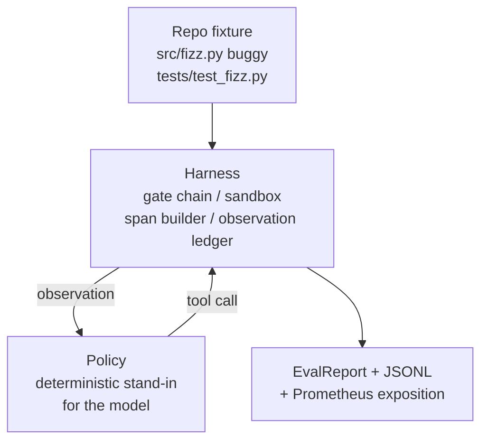
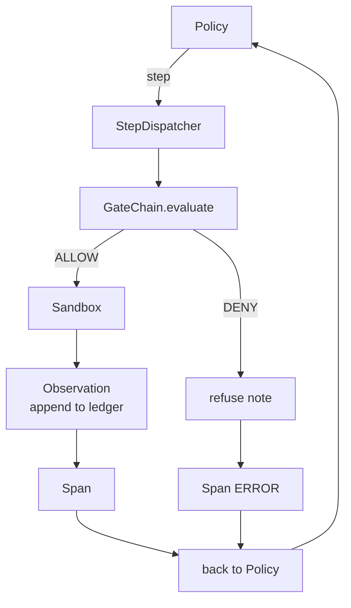

# 毕业课第 29 课：Harness 上的端到端编码代理

> Track A 的成果。本课将门控链、沙箱、评估 harness 和 OTel span 整合为一个可工作的编码代理，用于修复一个多文件 Python 项目中真实（小规模、fixture 级）的 bug。该代理是确定性策略，而非 LLM；这一替换使本课可复现，并表明 harness 才是一直以来真正有趣的部分。契约完全相同：真实模型可以在策略接缝处插入。

**Type:** Build
**Languages:** Python (stdlib)
**Prerequisites:** Phase 19 · 25 (验证门控)， Phase 19 · 26 (沙箱)， Phase 19 · 27 (评估 harness), Phase 19 · 28 (可观测性)， Phase 14 · 38 (验证门控)， Phase 14 · 41 (真实仓库工作台)， Phase 14 · 42 (代理工作台毕业课)
**Time:** ~90 分钟

## 学习目标

- 将门控链、沙箱、评估 harness 和 span 构建器组合成单一代理循环。
- 实现一个确定性策略，使用 read_file、run_tests 和 write_file 修复 fixture bug。
- 在端到端运行中强制执行全局步数预算加上观察 token 预算。
- 为完整运行发出完整的 OTel GenAI 追踪和 Prometheus 指标。
- 验证代理在少于 12 步内解决 fixture，且合法工具零门控触发。

## 问题

大多数代理演示各自孤立地工作：沙箱单独运行，评估 harness 单独运行，span 发射器单独运行。它们看起来没问题。组合起来，接缝问题就暴露了。

门控链说 ALLOW，但沙箱因门控链未预料到的原因而拒绝。评估 harness 记录了通过，但 OTel span 显示门控拒绝了代理声称使用过的工具。Prometheus 计数器被递增了两次，而本应只递增一次。观察预算被超出，但代理继续运行，因为预算在门控链中跟踪，而沙箱并不知情。

本课是整个 Track 的集成测试。代理必须按顺序做四件事：读取项目、运行测试、从测试失败中识别 bug、写入修复、重跑测试并停止。每个操作都经过门控链。每次工具执行都经过沙箱。每一步都被包裹在 span 中。评估 harness 在最后对整体评分。

## 概念



代理的策略是一个状态机。五个状态。

`SURVEY`：代理读取项目清单。下一个状态是 RUN_TESTS。

`RUN_TESTS`：代理运行测试命令。如果测试通过，状态机以成功终止。否则下一个状态是 INSPECT。

`INSPECT`：代理读取失败的源文件。下一个状态是 FIX。

`FIX`：代理写入修正后的文件。下一个状态是 VERIFY。

`VERIFY`：代理再次运行测试命令。如果测试通过，以成功终止。否则以失败终止。

每个状态对应一次工具调用。每次工具调用都经过门控链。如果工具调用被拒绝，代理在追踪中报告该拒绝并终止。

fixture bug 是 `fizz.py` 中的一个差一错误。确定性策略通过正则表达式从测试失败消息中检测该 bug，并发出修正后的文件。将策略替换为 LLM 不会改变 harness 契约。

```figure
cg-harness-weave
```

## 架构



本课是自包含的。每个前课原语都在 `main.py` 中以最小规模重新实现（门控、沙箱、账本、span），因此本课无需导入同级模块即可运行。名称与第 25-28 课完全一致，因此概念映射无歧义。

## 你将构建什么

`main.py` 包含：

1. 最小 harness 原语，以与第 25-28 课相同的名称复制：`GateChain`、`Sandbox`、`ObservationLedger`、`SpanBuilder`、`MetricsRegistry`。
2. `CodingAgentPolicy` 类：具有五个状态的状态机。
3. `Repo` 辅助函数：准备一个包含内置 bug fixture 的临时目录。
4. `AgentRun` 类：驱动策略，通过 harness 分发，返回 `AgentRunReport`。
5. 内置 fixture（`fixture_repo/`），包含 src/fizz.py、tests/test_fizz.py，以及供评估 harness 使用的 expected/ 目录树。
6. 演示：端到端运行策略，打印逐步追踪，断言通过，打印指标。

内置 fixture 与第 27 课任务结构形状相同：一个有 bug 的文件和一个测试文件。测试失败消息包含足够的信息，供确定性策略识别修复。真实 LLM 也能完成同样的工作，只是更慢且召回更广，但它不会改变 harness 的预期。

## 为什么策略不是 LLM

真实的 LLM 需要 API 密钥、网络调用和不可验证的随机性。harness 才是本课关心的部分。替换为确定性策略使本课能在任何开发者的笔记本上零外部依赖地运行，并使测试套件能够断言精确的步数。

本课的策略是 LLM 代理所做工作的严格子集。策略读取仓库、看到失败的测试、识别出该行并发出修复。LLM 在相同的 harness 契约下经历相同的循环；簿记完全一致。

## 演示断言什么

端到端演示在退出时断言五件事，测试套件以编程方式重新断言它们。

策略在少于 12 步内解决了 fixture。

观察预算从未被超出。

合法工具零门控拒绝。（代理从未捏造被拒绝的工具名称。）

每一步在 traces.jsonl 中都有对应的 span。

Prometheus 暴露中包含一个 `tools_called_total{tool="read_file"}` 条目和一个 `tool_latency_ms` 直方图。

## 本课如何与 Track A 其余部分组合

本课是集成。第 25 课编写了门控链。第 26 课编写了沙箱。第 27 课编写了评估 harness。第 28 课编写了可观测性。第 29 课证明它们作为一个系统可以工作。真实的代理 harness 从这里扩展：将确定性策略换成模型，将内置 fixture 换成真实仓库任务，将 JSONL 导出器换成 OTLP。

## 运行方式

```bash
cd phases/19-capstone-projects/29-end-to-end-coding-task-demo
python3 code/main.py
python3 -m pytest code/tests/ -v
```

演示打印逐步追踪、最终评估报告和 Prometheus 暴露。退出码为零。测试覆盖策略状态转换、对合成工具调用的门控拒绝、内置 fixture 上的端到端运行，以及步数预算不变量。