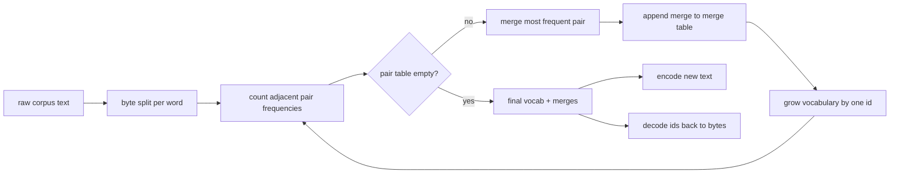
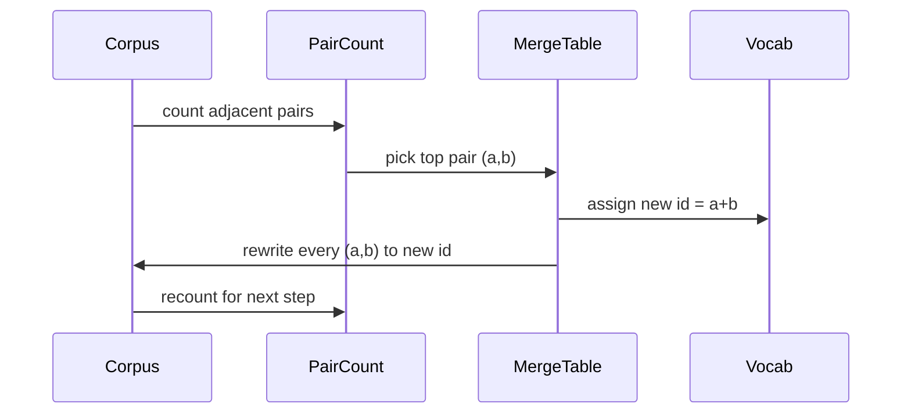

# 从零实现 BPE 分词器

> 字节进来，id 出去，再从 id 回到相同的字节。构建每个现代文本模型至今仍然起点相同的那个分词器。

**Type:** Build
**Languages:** Python
**Prerequisites:** Phase 04 课程，Phase 07 transformer 课程
**Time:** 约 90 分钟

## 学习目标
- 通过反复合并出现频率最高的相邻符号对，从原始文本语料训练一个 Byte-Pair Encoding 词表。
- 实现一个确定性的合并表，并将其应用于新文本以生成子词 id 流。
- 对任意 UTF-8 输入进行 id 与原文之间的往返转换而不丢失信息。
- 保留并保护特殊 token(`<|endoftext|>`、`<|pad|>`),使其在训练和解码过程中不被破坏。
- 理解为什么字节级字母表是通用分词器的正确基础。

```figure
cap-bpe-merge
```

## 总体框架

语言模型从不直接看到文本。它看到的是整数。从字符串到整数列表再返回的映射就是分词器。这一层做错了，训练过程中的每条损失曲线度量的都是错误的东西。

面向通用文本模型的主流子词分词器家族是 Byte-Pair Encoding。核心思想很小：从一个已知字母表开始。找出在训练语料中出现最频繁的相邻符号对。把它合并成一个新符号。重复这一过程直到词表达到目标大小。编码新文本时按相同顺序复用同一个合并列表。

我们将构建字节级变体。字母表是 256 个原始字节，而不是 Unicode 码点。正是这一选择让分词器能够处理任何 UTF-8 输入，而不必回退到未知 token。

## 流水线



训练端和推理端共享合并表。这种共享就是契约。如果你在推理时改变了合并顺序，解码出来的 id 流就会不同。

## 字节字母表

前 256 个 id 保留给从 0x00 到 0xFF 的原始字节。这保证了在任何合并发生之前，每个输入字符串都能用词表表示。在字节块之后，我们保留一个小范围给特殊 token。训练循环从不会把这些 id 作为合并目标，因为我们把它们完全排除在预分词流之外。

预分词器在训练之前按空白和标点边界切分语料。如果没有这个切分，BPE 合并步骤会很自然地学到跨越词边界的合并，词表会被常见的完整短语填满。有了切分，合并保持在单词内部，结果才具有泛化性。

## 训练循环

每个训练步骤中，循环做三件事。它遍历语料中的每个单词，统计当前符号的每对相邻符号出现的频率，权重为该单词本身出现的频率。它选出计数最高的那一对。它把该对的每次出现改写为一个新符号，其 id 是词表中下一个空闲槽位。然后记录这次合并。



每一步的代价与以符号序列列表形式表示的语料规模成线性关系。对于一百万个单词和一万个 id 的目标词表，循环在几秒内即可完成，因为随着合并落地，符号序列不断缩短。

## 编码新文本

推理不会调用合并计数器。它按合并表被学习时的相同顺序应用合并。对于一个新单词，编码器从字节切分开始。它扫描当前序列，寻找排名最低的合并(即最早可应用的那个)。执行该合并。然后再次扫描。当表中没有合并可应用于当前序列时，循环结束。

按排名排序这一性质使编码具有确定性，并与相同输入上的训练行为保持一致。最早学到的合并位于表的顶部，最先被应用。如果两个合并可以应用于同一位置，排名较低(更早)的那个获胜。

## 特殊 token

特殊 token 是字节流永远无法产生的 id。我们手动保留它们。本课只需两个。

- `<|endoftext|>` 在预训练期间分隔文档。它告诉模型“一个新文档从这里开始，不要让前一个文档的上下文泄漏进来。”
- `<|pad|>` 用于填充过短的序列，使一个批次能构成矩形张量。损失掩码会在训练期间隐藏它。

编码器接受一个标志，用于允许输入中出现特殊 token。当标志关闭时，字符串 `<|endoftext|>` 和 `<|pad|>` 会被分词为拼写它们的字节。当标志打开时，这些字面字符串会被映射到它们保留的 id,并且不受任何合并的影响。

## 往返保证

编码后再解码必须精确返回输入字节。解码器按顺序拼接每个 id 的字节展开。由于每个 id 要么是原始字节，要么是两个先前已知 id 的拼接，递归展开总会终止于原始字节。解码随后返回这些字节拼出的 UTF-8 字符串。

本课的测试套件在一个未见过的句子、一个包含 Unicode emoji 的句子，以及一个包含字面 `<|endoftext|>` token 的句子上验证这一性质。

## 本课不做的事

它不构建最大型生产分词器那种风格的正则驱动预分词器。这里的预分词器只是一个简单的空白和标点切分。这足以在小型训练语料上产生合理的合并，并且与本课链其余部分的契约保持不变。下一课将把分词器当作黑盒，并在其之上构建滑动窗口数据集。

它不并行化配对计数器。在几千个单词的语料上，Python 循环在一秒内即可完成。对于更大的语料，显而易见的做法是按单词并行统计配对，然后归约。

## 如何阅读代码

`main.py` 定义了四个对象。`BPETokenizer` 保存词表、合并表和特殊 token 表。`train` 是训练循环。`encode` 是推理路径。`decode` 是字节拼接。底部的演示在内置语料上训练一个小型分词器，编码一个留出的句子，把 id 解码回来，并打印两者。`code/tests/test_bpe.py` 中的测试固定了往返性质、特殊 token 保留以及合并顺序。

运行演示。然后把演示中的目标词表大小从 300 改为 600,观察留出句子的编码长度如何下降。那条曲线就是 BPE 压缩曲线。