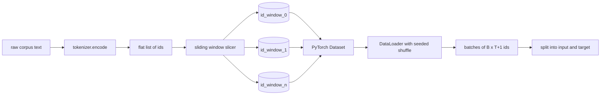
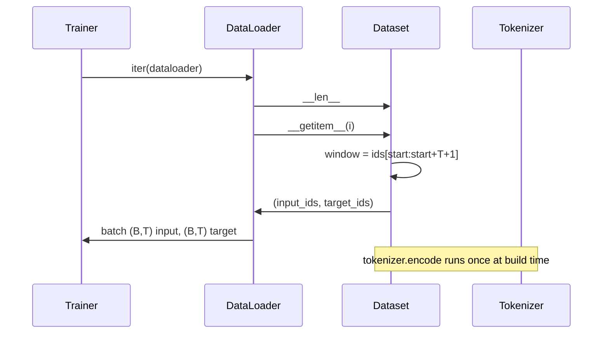

# 使用滑动窗口的分词数据集

> 一次预训练运行是一个从 token id 到梯度的函数。本课构建把 id 送入其中的传送带。

**Type:** Build
**Languages:** Python
**Prerequisites:** Phase 04 课程、Phase 07 Transformer 课程、本阶段的第 30 课
**Time:** ~90 分钟

## 学习目标
- 通过调用一次分词器，将原始语料转换为 token id 流。
- 将 id 流切分为固定长度的窗口，并使用可配置的重叠步幅。
- 构建一个 PyTorch Dataset，为下一 token 预测返回输入和目标张量。
- 将数据集包装在 DataLoader 中，使用每个 epoch 确定性的随机种子进行打乱。
- 分析步幅、冗余与有效数据集规模之间的权衡。

```figure
cap-sliding-window
```

## 框架

一次预训练运行每次读取一个批次的 token id 并更新模型。每个批次的形状由训练契约固定。对于因果语言模型，批次包含 `(B, T)` 个输入 id 和 `(B, T)` 个目标 id，其中目标是输入左移一位后的结果。数据管线的任务是以确定且可复现的方式，按需从可能达数 GB 的原始文本语料中产出该契约。

本课构建这条管线。上一课的分词器把文本转换为一个长而扁平的 id 列表。滑动窗口将该列表切分为训练样本。自定义 Dataset 将样本暴露为张量。DataLoader 对它们进行批处理，并使用已知种子进行打乱。

## 形状契约

因果语言模型消费形状为 `(B, T)` 的 id，其中 `B` 是批次大小，`T` 是上下文长度。位置 `t` 的目标是位置 `t+1` 的输入。这意味着每个训练样本覆盖 `T+1` 个原始 id。窗口步幅控制相邻样本之间的重叠程度。



切分器不会越过语料边界。如果最后一个窗口没有足够的 id 填满 `T+1` 个位置，切分器就将其丢弃。用 `<|pad|>` 填充尾部也是可行的选择，但会使损失掩码复杂化。本课选择丢弃。

## 为什么使用滑动窗口

预训练语料是一条长长的 id 流。如果模型只看到不重叠的窗口，每个训练样本都会教它相同的 `T` 边界。调整步幅可以移动这些边界，让模型看到更多样化的下一 token 预测任务。

步幅为 `T` 产生不重叠的窗口。步幅为 `T // 2` 产生百分之五十的重叠，并使有效数据集翻倍。步幅为 `1` 产生最大重叠，并使数据集增加 `T` 倍。代价是每个 epoch 需要更多计算。收益是更多的边界多样性。大多数预训练运行使用等于上下文长度的步幅，因为语料通常远大于模型在一个 epoch 内能处理完的规模，所以边界多样性的论证较弱。

## Dataset 类

PyTorch Dataset 有两个必需方法。`__len__` 返回样本数量。`__getitem__` 以一对张量的形式返回一个样本。我们的 Dataset 存储编码后的 id 流和步幅。对它进行索引时会即时计算窗口的起始位置，因此无论步幅产生多少样本，内存开销始终只是 id 流的一份拷贝。



移位一位的操作发生在 `__getitem__` 内部。Dataset 返回 `(input, target)`，其中 `input = window[:-1]` 且 `target = window[1:]`。两者都是 PyTorch 的 long 张量。训练循环将它们视为真实标签。

## 确定性打乱

设置 `shuffle=True` 的 DataLoader 从 PyTorch 随机生成器读取。通过传入一个按 epoch 设置种子的显式 `torch.Generator`，每次重启运行都会得到相同的打乱结果。当你想比较仅在单个超参数上不同的两次运行时，这一性质至关重要。没有种子时，两次运行会以不同顺序看到数据，损失曲线会因与该改动无关的原因而发散。

本课的种子契约很简单。`epoch_seed = base_seed + epoch_index`。基础种子在构造时传入。epoch 索引由训练器在每个 epoch 开始时递增。使用相同基础种子的重跑在每个 epoch 中总是看到相同的顺序。

## 批次采样器

PyTorch 的默认采样器在关闭放回抽样的情况下均匀随机选取索引。这正是预训练所需要的。在小数据集上做微调时契约也是一样的。DataLoader 通过调用 `__getitem__` `B` 次并堆叠结果来组装一个批次。由于每个样本在构造时长度相同，因此不需要任何填充逻辑。

本课为了简单起见保留 `num_workers=0`。在生产运行中，工作进程会并行化 `__getitem__` 调用。对于我们的管线来说这基本是个空操作，因为其工作只是对内存中张量的一次切片，但相同的 Dataset API 可以干净地支持多进程。

## 统计样本数

对于长度为 `N` 的 id 流、上下文长度 `T` 和步幅 `S`，样本数量为 `max(0, 1 + (N - (T + 1)) // S)`。本课将该计算作为 Dataset 上的静态方法暴露出来，使训练器无需迭代即可计算每个 epoch 的总步数。

## 本课不涉及的内容

它不从磁盘流式读取。语料被完整地编码在内存中并保存为单个张量。对于几百万个 id 的语料，这远低于一百兆字节，也是本课合适的形态。磁盘流式读取是另一个关注点，可以通过替换存储来实现，同时保持 Dataset 契约不变。

它不处理多个文档。语料被视为一条连续的 id 流。当语料由多个文档构成时，通过插入 `<|endoftext|>` id 来编码文档边界。模型会学习围绕边界进行预测。

## 如何阅读代码

`main.py` 定义了两个类和一个辅助函数。`SlidingWindowDataset` 是 PyTorch Dataset。`make_dataloader` 返回一个带有种子生成器的已配置 DataLoader。`_encode_corpus_to_ids` 是一次性分词器调用。底部的演示在进程内构建一个小分词器，编码内置语料，构建数据集和 DataLoader，打印一个批次，并断言形状契约。`code/tests/test_dataset.py` 中的测试固定了窗口数量公式、移位一位性质、确定性打乱以及步幅权衡。

运行演示。然后将上下文长度从 16 改为 32，观察每个 epoch 的样本数量如何下降。这个数字就是你的每 epoch 步数预算。